# Nimble Accordion (IxD)

## Overview
The accordion component is used to present a large amount of information in a small space via progressive disclosure. Accordions make information easier to parse when not all of the information may be relevant or important to the user at the same time.

> NOTE: THE VISUAL DESIGN IN THIS DOCUMENT MAY NOT BE ACCURATE

### Background
-   [IxD recommendation for Tree, Accordion, Disclosure, Table row details (#1150)](https://github.com/orgs/ni/projects/7/views/13?pane=issue&itemId=24667320)
-   [ViD Accordion Styles (Figma)](https://www.figma.com/file/PO9mFOu5BCl8aJvFchEeuN/Nimble_Components?type=design&node-id=1295-85131&mode=design)

## Usage
When to use:
-   For a single panel of content
-   To organize large amounts of information into related panels
-   To shorten scrolled views when not all information is equally important
-   In views with reduced horizontal or vertical space

When not to use:
-   For very brief content or content that does not take up a lot of vertical space
-   For a small number of content panels that don't require frequent showing and hiding
-   To organize unrelated information into panels
-   For selectable or navigable lists or trees

### Anatomy
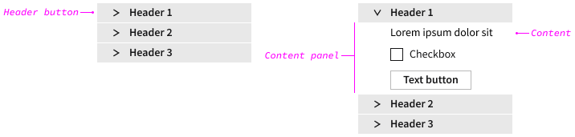

| Element | Description |
| ---------- | ---------- |
| Header button | Labeled button for showing and hiding an associated panel |
| Content panel | Section of content that shows and hides via an associated header |
| Content | Text and components laid out in a panel |

It is best practice to use one accordion with multiple sections over multiple accordions with one section.

Do this:  
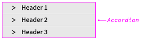

Avoid this:  
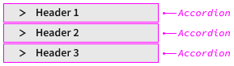

#### Header Button
Clicking the header button shows/hides the content panel. Keep the header text as concise as possible, limited to a single line of text. It should be a noun or a short description of the content. Use sentence casing.

#### Content Panel & Content
> NOTE: SHOULD/CAN WE LIMIT WHAT COMPONENTS CAN AND CANNOT BE USED INSIDE AN ACCORDION PANEL? FOR EXAMPLE, DON'T USE TABS. HOW DO WE DO THIS AND WHAT DOES IT LOOK LIKE?

The content panel can have almost any type of content and that content can be read-only and/or interactive. Use a consistent, straightforward arrangement. Accordions should be used as layout blocks; do not float other UI elements to the left or right of an accordion unless it is done via a different layout region such as a right rail.

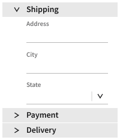

### Related Components
To display hierarchical relationships and allow selection on named items, use a [**tree view**](/packages/nimble-components/src/tree-view/specs/IxD.md). With the accordion, the heading button text is a label for a group of content, not content in-and-of itself. With the tree, the content is the tree items and all the tree items represent data.

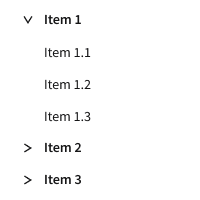

For switching views in high-level page layouts, use [**tabs**](/packages/nimble-components/src/tab/specs/IxD.md) and [**tab panels**](/packages/nimble-components/src/tab-panel/specs/IxD.md).

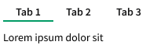

## Design
### Configuration
#### Default
The client-user should be able to specify which panel or panels are opened by default.

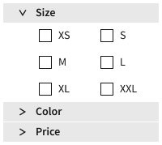

#### Show & Hide
The client-user should be able to specify whether only one content panel can be opened at a time. 

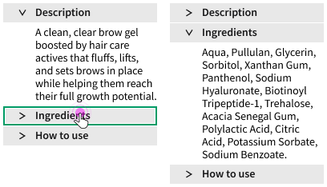

#### Additional Header Options
The client-user may need/want to have additional content in the header. For example, an expand button:  
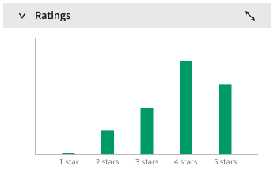

### Behavior
#### Minimum Width
Most accordions should fill 100% of the width of a parent container, and the parent container should have a reasonable minimum width that allows the accordion content to be usable (not pictured).

#### Minimum Height
When the accordion height exceeds that of the viewport, the whole accordion should vertically scroll (not pictured). Content should never scroll vertically or horizontally inside individual panels.

#### Nested Accordions
> NOTE: NEEDS VISUAL DESIGN & TECH WRITER?

Accordion panels can have one level of nested accordions. If the client-user attempts to nest an accordion more than one level deep, the accordion component should indicate that limitation. Nested acccordions are always ghost style; the client-user should not be able to specify a block or outline appearance.

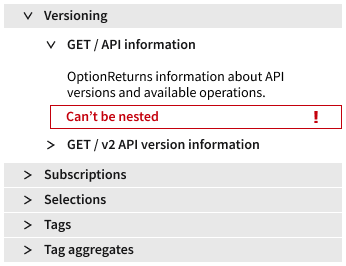

#### Error State
If a component in a panel is in an error state, the error state is visually indicated on the associated header button when closed (and may also be visually indicated when open).  

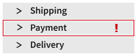

If a component in a nested panel is in an error state, the error state is visually indicated on the associated header button and the parent header button when closed (and may also be visually indicated when open).

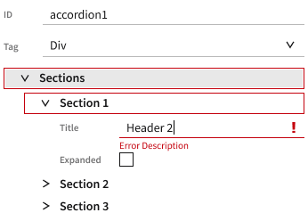

#### Touch-Screen Devices
There are no specific requirements for mobile and touch-screen devices.

### Mouse Interactions
Header buttons are used to show and hide associated content panels.

Hovering over a header button indicates interactivity.

Clicking anywhere on a header button opens (if closed) or closes (if opened) the associated panel of content.

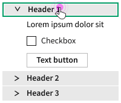

The client-user can specify whether one panel or more than one panel can be opened at a time. If the former, clicking to open a closed panel will close the open panel (if applicable).

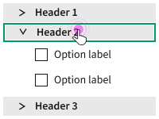

### Keyboard Interactions
> NOTE: Based on ARIA APG [accordion](https://www.w3.org/WAI/ARIA/apg/patterns/accordion/)

| Key                | Description                                           |
| ------------------ | ----------------------------------------------------- |
| `TAB`              | Moves focus to next focusable element                 |
| `SPACE` or `ENTER` | Opens/closes accordion section when header is focused |
| `DOWN ARROW` or `UP ARROW` | If focus is on a header, moves focus to the next or previous header |
| `HOME` or `END` | If focus is on a header, moves focus to the first or last header |

`TAB` to the accordion focuses the first header button (and maybe also visually indicate the entire accordion).  

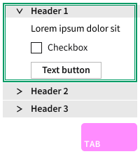

`TAB` focuses the next focusable element (and maybe also visually indicate the header button and/or the entire accordion) in each open panel. All focusable elements in the accordion are included in the `TAB` sequence.  

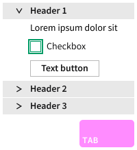

`ENTER` or `SPACE` on a focused header button for a closed panel opens the associated panel. If only one panel can be opened at a time and another panel is open, it collapses.  

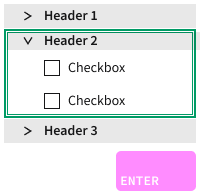

`ENTER` or `SPACE` on a focused header button for an open panel closes the associated panel.  

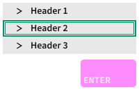

## Open Issues
See content marked "**QUESTION**" or "**NOTE**".