# Nimble Accordion (IxD)

## Overview
The accordion component is used to present a large amount of information in a small space via progressive disclosure. Accordions make information easier to parse when not all of the information may be relevant or important to the user at the same time.

## Background
-   [IxD recommendation for Tree, Accordion, Disclosure, Table row details (#1150)](https://github.com/orgs/ni/projects/7/views/13?pane=issue&itemId=24667320)
-   [ViD Accordion Styles (Figma)](https://www.figma.com/file/PO9mFOu5BCl8aJvFchEeuN/Nimble_Components?type=design&node-id=1295-85131&mode=design)

## Usage
### Accordions & Disclosures
Accordions are vertically stacked sets of disclosures. A disclosure is made up of a header button and a content panel. Clicking the button shows/hides the panel. The panel can have almost any type of content.

Use an accordion:
-   To organize large amounts of information into related panels
-   To shorten scrolled views when not all information is equally important
-   In views with reduced horizontal or vertical space

Do not use an accordion:
-   For a single panel of content
-   To organize unrelated information into panels
-   For selectable or navigable lists or trees

Best practice is to use multiple disclosures in one accordion and avoid one disclosure in multiple accordions.

Do this:  
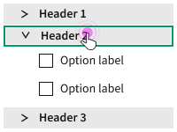

Don't do this:  
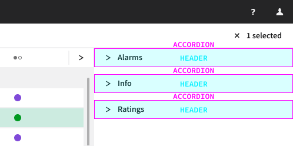

Multiple disclosures can be used in a row for panels of unrelated content, at the client user's discretion and in accordance with component guidelines and product consistency.

Avoid this:  
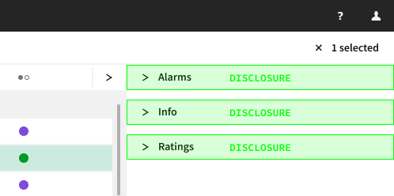

If only one section (relative to the content) is needed, use a disclosure component.  
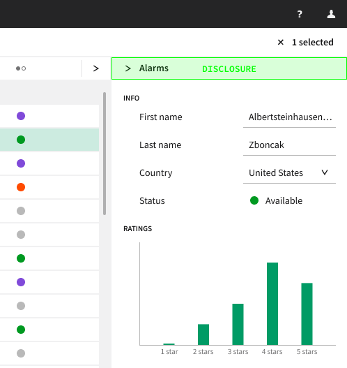

### Tree & Navigation
With a disclosure/accordion, the heading is a label for a group of content, not content in-and-of itself. With a tree, the content is the list items and all the list items represent data.

| Component  | Content    | Organization |
| ---------- | ---------- | ------------ |
| Disclosure | Any        | Group labels |
| Tree       | List items | Parent/child |

[ARIA](https://www.w3.org/WAI/ARIA/apg/patterns/treeview/examples/treeview-navigation/) recommends avoiding using a tree component for navigation because the `tree` role requires unecessary implementation of complex functionality that is not needed for navigation styled to look like a tree with expandable sections. However, the accordion is not necessarily the correct component to try and replace it with.

| Component  | Content    | Organization |
| ---------- | ---------- | ------------ |
| Disclosure | Any        | Group labels |
| Tree       | List items | Hierarchical |
| ???        | List items | Group labels |

[**QUESTION:** Maybe a new navigation-specific component?]

## Design
### Interactions & States
Header buttons are used to expand and collapse associated panels of content. The client user can specify which panels (if any) are open by default.

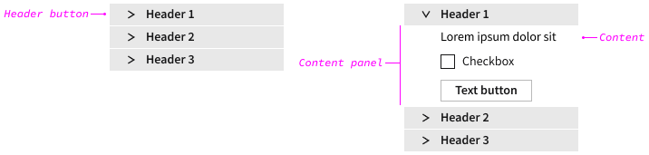

Hovering over a header button indicates interactivity:  
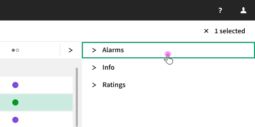

Clicking anywhere on a header button opens (if closed) or closes (if opened) the associated panel of content. [**QUESTION:** Do panels only display block content (one component per "line") or do they display flex content?]  
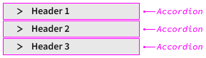

The client user can specify whether one panel or more than one panel can be opened at a time. If the former, clicking to open a closed panel will close the open panel (if applicable).  

If a component in a panel is in an error state, the error state is visually indicated on the associated header button when closed (and maybe also be visually indicated when open).  
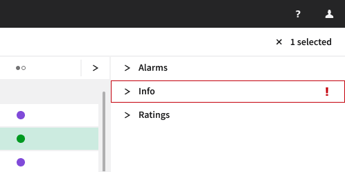

### Additional Options
Client users may need/want to have additional buttons and/or icons in the header. For example, an expand button:  
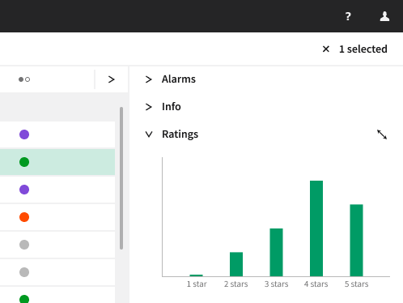

### Nested Accordions
Accordion panels can have one level of nested accordions. Nested accordions are always ghost style. [**QUESTION:** Can accordions be nested anywhere in the panel? Can there be multiple child accordions nested in an accordion?]  
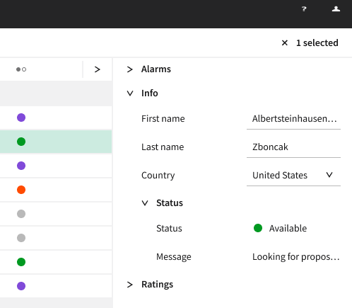

### Keyboard Interactions
| Key                | Description                                           |
| ------------------ | ----------------------------------------------------- |
| `TAB`              | Moves focus to next focusable element                 |
| `SPACE` or `ENTER` | Opens/closes accordion section when header is focused |

`TAB` to the accordion focuses the first header button (and maybe also visually indicate the entire accordion).  
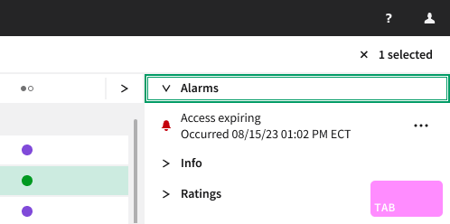

`TAB` focuses the next focusable element (and maybe also visually indicate the header button and/or the entire accordion) in each open panel. All focusable elements in the accordion are included in the `TAB` sequence.  
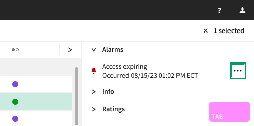

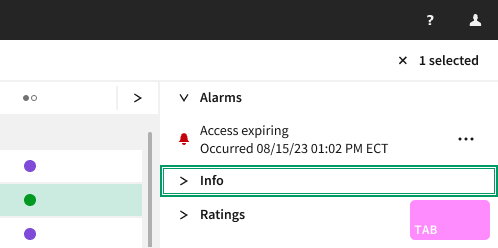

`ENTER` or `SPACE` on a focused header button for a closed panel opens the associated panel. If only one panel can be opened at a time and another panel is open, it collapses.  
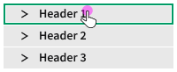

`ENTER` or `SPACE` on a focused header button for an open panel closes the associated panel.  
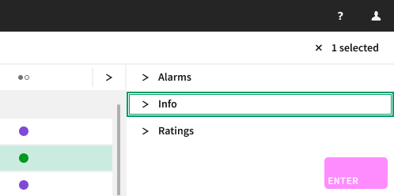

## Validation
TBD

## Open Issues
See content marked "**QUESTION**" or "**NOTE**".
