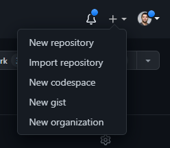

# Nimble Anchor Menu Item

## Overview

The `nimble-anchor-menu-item` is a link that can be used within a `nimble-menu` and is styled to look just like a `nimble-menu-item`.

### Background

[Visual Design spec (menu item)](https://xd.adobe.com/view/33ffad4a-eb2c-4241-b8c5-ebfff1faf6f6-66ac/screen/c098395e-30f8-4bd4-b8c5-394326b59919)
[GitHub issue](https://github.com/ni/nimble/issues/1020)

### Non-goals

-   Support for checked state (checkbox or radio button)
-   Support for nesting, expanding/collapsing

### Features

-   Supports icon
-   Disabled state
-   Follows menu item navigation pattern

### Risks and Challenges

None

### Prior Art/Examples

[Atlassian Link item](https://atlassian.design/components/menu/link-item/examples)

GitHub menu with links:



---

## Design

### API

_The key elements of the component's public API surface:_

-   _Component Name_: `nimble-anchor-menu-item`
-   _Props/Attrs_:
    -   `download` - see [HTML anchor doc](https://developer.mozilla.org/en-US/docs/Web/HTML/Element/a#attributes)
    -   `href` - see [HTML anchor doc](https://developer.mozilla.org/en-US/docs/Web/HTML/Element/a#attributes).
    -   `hreflang` - see [HTML anchor doc](https://developer.mozilla.org/en-US/docs/Web/HTML/Element/a#attributes)
    -   `ping` - see [HTML anchor doc](https://developer.mozilla.org/en-US/docs/Web/HTML/Element/a#attributes)
    -   `referrerpolicy` - see [HTML anchor doc](https://developer.mozilla.org/en-US/docs/Web/HTML/Element/a#attributes)
    -   `rel` - see [HTML anchor doc](https://developer.mozilla.org/en-US/docs/Web/HTML/Element/a#attributes)
    -   `target` - see [HTML anchor doc](https://developer.mozilla.org/en-US/docs/Web/HTML/Element/a#attributes)
    -   `type` - see [HTML anchor doc](https://developer.mozilla.org/en-US/docs/Web/HTML/Element/a#attributes)
    -   `disabled` - disables the item (this matches the API of `nimble-menu-item`). Setting it causes `aria-disabled` to be set as well.
-   _Methods_
-   _Events_
-   _CSS Classes and CSS Custom Properties that affect the component_
-   _Slots_:
    -   We will provide a `start` slot, just like is available on the `nimble-menu-item`. That component also has an `end` slot, but we do not document it, so we will not define an `end` slot on the anchor menu item.

### Anatomy

```html
<template role="menuitem" aria-disabled="${x => x.disabled}">
    <a
        download="${x => x.download}"
        href=${x => (x.disabled ? null : x.href)}
        hreflang="${x => x.hreflang}"
        ping="${x => x.ping}"
        referrerpolicy="${x => x.referrerpolicy}"
        rel="${x => x.rel}"
        target="${x => x.target}"
        type="${x => x.type}"
    >
        ${startSlotTemplate(options)}
        <slot></slot>
    </a>
</template>
```

### Angular integration

We will follow the same patterns as we've used for other anchor-based components, like the `nimble-anchor-button`. We will have a directive for the component, but no CVA. We will also have two directives, `NimbleAnchorMenuItemRouterLinkWithHref` and `NimbleAnchorMenuItemRouterLink`. The former will support use of a `nimbleRouterLink` attribute, and the latter will prevent the use of `routerLink`. There will be no support for `routerLinkActive`, which fortunately doesn't seem like a very useful thing for an anchor menu item.

### Blazor integration

We will create a Blazor wrapper for the anchor menu item. There are no special routing considerations/mechanisms for Blazor.

### Visual Appearance

The component will look just like a standard menu item. See the design doc linked at the top of this file for details.

---

## Implementation

-   We will use the FAST menu item implementation as a starting point, as it provides keyboard navigation logic.
-   We will try to share the CSS used to style the standard menu item.

### States

N/A

### Accessibility

-   _Keyboard Navigation and Focus_
    -   we will follow the [guidelines](https://developer.mozilla.org/en-US/docs/Web/Accessibility/ARIA/Roles/menuitem_role#keyboard_interactions) for navigation prescribed for the `menuitem` role
-   _Form Input_
    -   NA
-   _Use with Assistive Technology_
    -   a `menuitem`'s accessible name comes from the element's contents by default
    -   `aria-disabled` will be set whenever the `disabled` property is set
-   _Behavior with browser configurations like "Prefers reduced motion"_
    -   NA

### Globalization

N/A

### Security

N/A

### Performance

N/A

### Dependencies

None

### Test Plan

Unit tests will be written. Visual tests in Storybook will be created.

### Tooling

N/A

### Documentation

We will document the component in Storybook. We will update the `nimble-menu-item` documentation to mention the use cases for `nimble-anchor-menu-item`.

---

## Open Issues
