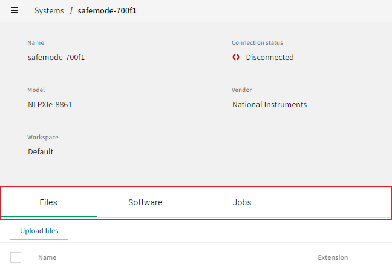
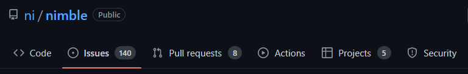

# Anchor Tabs

## Overview

Anchor tabs are a sequence of tabs that navigate to URLs when activated.

### Background

[Visual Design spec](https://xd.adobe.com/view/33ffad4a-eb2c-4241-b8c5-ebfff1faf6f6-66ac/screen/b2aa2c0c-03b7-4571-8e0d-de88baf0814b/specs/) (same visual design as non-anchor tabs)

[GitHub issue](https://github.com/ni/nimble/issues/479)

### Non-goals

-   Mixing regular tabs and anchor tabs together
-   Vertical tabs orientation

### Features

-   Functions like an anchor (i.e. navigates) upon activation
-   Supports keyboard navigation within group of tabs without automatically activating each focused tab
-   Disable individual tabs

### Risks and Challenges

None

### Prior Art/Examples

In SLE:



In GitHub:



---

## Design

Anchor tabs have the same appearance as a standard tabs control, i.e. a sequence of operable regions with labels, each of which corresponds to some target content to display. In the case of anchor tabs, they do not switch between pre-configured tab panels, but rather navigate to some URL. The tabs can be configured to load the URL in a specific target, like an `iframe`.

The design consists of an "Anchor tabs" container component which contains one or more "Anchor tab" components. This mirrors the existing design of the `nimble-tabs` and `nimble-tab` components, however there is no analog for the `nimble-tab-panel` component. Instead, the content loaded from the configured URL(s) loads into the containing page, an `iframe`, a new window, etc.

We cannot extend FAST's tabs control because it has baked into it the idea that tabs activate tab panels. However, we can take the FAST implementation as a starting point and remove the parts related to tab panels.

### API

#### Anchor Tabs

-   _Component Name_ - `nimble-anchor-tabs`
-   _Props/Attrs_
    -   `activeid` - id of active tab. Defaults to the first tab.
-   _Methods_ - None
-   _Events_
    -   `change` - fired when the active tab changes
-   _CSS Classes and CSS Custom Properties that affect the component_ - None
-   _Slots_
    -   `start` - content placed to the left of tab list
    -   `anchortab` - slot for anchor tab elements
    -   `end` - content placed to the right of tab list

#### Anchor Tab

-   _Component Name_ - `nimble-anchor-tab`
-   _Props/Attrs_
    -   `download` - see [HTML anchor doc](https://developer.mozilla.org/en-US/docs/Web/HTML/Element/a#attributes)
    -   `href` - see [HTML anchor doc](https://developer.mozilla.org/en-US/docs/Web/HTML/Element/a#attributes).
    -   `hreflang` - see [HTML anchor doc](https://developer.mozilla.org/en-US/docs/Web/HTML/Element/a#attributes)
    -   `ping` - see [HTML anchor doc](https://developer.mozilla.org/en-US/docs/Web/HTML/Element/a#attributes)
    -   `referrerpolicy` - see [HTML anchor doc](https://developer.mozilla.org/en-US/docs/Web/HTML/Element/a#attributes)
    -   `rel` - see [HTML anchor doc](https://developer.mozilla.org/en-US/docs/Web/HTML/Element/a#attributes)
    -   `target` - see [HTML anchor doc](https://developer.mozilla.org/en-US/docs/Web/HTML/Element/a#attributes)
    -   `type` - see [HTML anchor doc](https://developer.mozilla.org/en-US/docs/Web/HTML/Element/a#attributes)
    -   `disabled` - disables the tab (this matches the API of the existing `nimble-tab`). Setting it causes `aria-disabled` to be set as well.
-   _Methods_ - None
-   _Events_ - None
-   _CSS Classes and CSS Custom Properties that affect the component_ - None
-   _Slots_
    -   _default_

### Anatomy

#### Anchor Tabs

```html
<template>
    <slot name="start"></slot>
    <div role="tablist">
        <slot name="anchortab"></slot>
    </div>
    <slot name="end"></slot>
</template>
```

#### Anchor Tab

```html
<template slot="anchortab">
    <div role="tab">
        <a>
            <slot></slot>
        </a>
    </div>
</template>
```

### Angular integration

There will be Angular directives for both `nimble-anchor-tabs` and `nimble-anchor-tab`. The latter will derive from `NimbleAnchorBaseDirective` which has the standard HTML anchor attributes.

Tabs do not participate in forms, so there is no ControlValueAccessor.

**[routerLink] and [routerLinkActive] Support**

We will follow the same approach previously used for the BreadcrumbItem, Anchor, and AnchorButton:

-   We will create a directive that extends `RouterLinkWithHref`, and its selector will be `nimble-anchor-tab[nimbleRouterLink]`. The directive will define `@Input nimbleRouterLink` (which sets `routerLink`). This is a small change for clients which we will document (consistent with BreadcrumbItem, Anchor, and AnchorButton), and other routerLink attributes can still be used as-is:
    ```html
    <nimble-anchor-tab
        nimbleRouterLink="/customapp"
        [queryParams]="{debug: true}"
        [state]="{tracingId: 123}"
    >
        Custom App Page
    </nimble-anchor-tab>
    ```
-   A separate directive will be created to disable use of the `routerLink` attribute on `nimble-anchor-tab` elements.

### Blazor integration

Blazor wrappers will be created for both `nimble-anchor-tabs` and `nimble-anchor-tab`. There are no special routing considerations/mechanisms for Blazor.

### Visual Appearance

[XD Design](https://xd.adobe.com/view/33ffad4a-eb2c-4241-b8c5-ebfff1faf6f6-66ac/screen/b2aa2c0c-03b7-4571-8e0d-de88baf0814b/)

The design for navigation tabs will be the same as for standard tabs. The standard Nimble tabs do not (yet) have specific support for icons or alert indicators, so we will (initially) not implement those for navigation tabs either.

In addition to indicating which tab is active, navigation tabs must also separately indicate which tab has keyboard focus. I.e. you can arrow through tabs without activating those tabs, and there must be a visual indication of which tab has keyboard focus. We will indicate the focused tab with a double underline similar to what the existing tab control shows when keyboard focused, but it will be two thin lines when focusing a non-selected tab. When focusing the selected tab, the two thin underlines will overlap the thicker underline indicating selection, so we end up with a visual that is consistent with our existing tab control.

I expect we will be able to share most of the same CSS with the standard tab/tabs controls, but it is difficult to know for sure without actually attempting the implementation.

---

## Implementation

We will start with the [FAST tabs implementation](https://github.com/microsoft/fast/blob/master/packages/web-components/fast-foundation/src/tabs/tabs.ts) as a starting point.

We will modify the FAST implementation in the following ways:

-   Remove support for vertical orientation
-   Remove support for disabling the active indicator (`hide-active-indicator`)
-   Replace active indicator style/animation with our own version
-   Replace logic related to tab panel activation with URL navigation

### States

#### Keyboard focused state

When tabbing to the `nimble-navigation-tabs`, it gets keyboard focus. To indicate this, the active tab (which is already underlined) gets a second, thinner underline.

### Accessibility

We want the keyboard interactions to match those of the standard tabs control as much as possible. This means conforming to the keyboard interactions of the `tablist` and `tab` ARIA roles. Though we don't have any elements with the `tabpanel` role, we still follow the rest of the ARIA guidelines for the roles we do have. An alternative would be to use a `nav` container element (which has role `navigation`) and `link` roles on each of our tabs. However, this would imply a different keyboard navigation scheme (`tab` key moves to next tab), and that is not what we want.

-   _Keyboard Navigation and Focus_
    -   The tabs control will have a visual indication of which tab is active (green underline).
    -   Once focused, the tabs control will show a visual indication of which tab has focus, starting with the active tab.
    -   Arrowing left or right will change the focused tab. Arrowing left on the first tab will wrap around to the last, and vice versa.
    -   `Home` will move focus to the first (non-disabled) tab.
    -   `End` will move focus to the last (non-disabled) tab.
    -   The `Enter` or `Space` key will activate the focused tab, setting `aria-selected`, moving the active indicator, and loading the tab's associated URL.
-   _Form Input_
    -   N/A
-   _Use with Assistive Technology_
    -   We set the roles `tablist` and `tab` on divs we create.
    -   `aria-selected`'s value matches the selected state of the tab

### Globalization

N/A

### Security

N/A

### Performance

N/A

### Dependencies

None

### Test Plan

Unit tests will be created that exercise the API and Chromatic tests will be created that exercise styling.

### Tooling

N/A

### Documentation

We will create a new Storybook entry for navigation tabs that documents the API. Both the navigation tabs and the standard tabs Storybook entries will indicate when it is appropriate to use each.

---

## Open Issues
