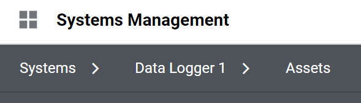
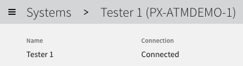
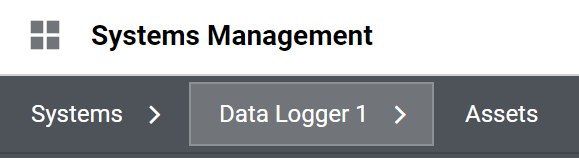

# Nimble Breadcrumb

## Overview

A breadcrumb component is used as a navigational aid, allowing users to maintain awareness of their locations within a program, app, or a website.

### Background

[FAST Component Demo - Breadcrumb](https://explore.fast.design/components/fast-breadcrumb)

### Use in SystemLink

[F1792531: [Design System] Components for sl-breadcrumb-bar](https://dev.azure.com/ni/DevCentral/_workitems/edit/1792531)  
Current SystemLink breadcrumb:  
  
Future planned SystemLink breadcrumb ([see discussion here](https://teams.microsoft.com/l/message/19:8e5f3e80de8146d5aaecdc2112e89191@thread.skype/1642192016552?tenantId=87ba1f9a-44cd-43a6-b008-6fdb45a5204e&groupId=41626d4a-3f1f-49e2-abdc-f590be4a329d&parentMessageId=1642192016552&teamName=ASW%20SystemLink&channelName=UX&createdTime=1642192016552)):  
The future/planned behavior of the SystemLink breadcrumb (where it's moved into the header, and won't include tab names) doesn't add any new requirements to this control.  


After uptaking the Nimble breadcrumb, SystemLink's breadcrumb will no longer include the `>` separator as part of the clickable link, which is a change from the current breadcrumb's behavior:  


## Design

### API

Example Usage:

```html
<nimble-breadcrumb>
    <nimble-breadcrumb-item href="#">Breadcrumb item 1</nimble-breadcrumb-item>
    <nimble-breadcrumb-item href="#">Breadcrumb item 2</nimble-breadcrumb-item>
    <nimble-breadcrumb-item>Breadcrumb item 3</nimble-breadcrumb-item>
</nimble-breadcrumb>
```

Note: href is optional, and the breadcrumb will render as regular text if href is not specified (which is common for the last breadcrumb item).

FAST API Documentation/ Specs

-   [breadcrumb and breadcrumb-item](https://github.com/microsoft/fast/blob/2cbba7d9ed4900ef2c69d0a9721cc98d742a583d/packages/web-components/fast-foundation/src/breadcrumb/breadcrumb.spec.md)
-   [anchor](https://github.com/microsoft/fast/blob/2cbba7d9ed4900ef2c69d0a9721cc98d742a583d/packages/web-components/fast-foundation/src/anchor/README.md) (FAST breadcrumb-item extends this) - API based on built-in [&lt;a&gt;](https://developer.mozilla.org/en-US/docs/Web/HTML/Element/a) element

Component Name: `nimble-breadcrumb` (extends fast-foundation Breadcrumb)

-   Template: Unchanged (FAST's)
-   Properties/Attributes: Unchanged
-   Methods: Unchanged
-   Events: Unchanged
-   CSS Classes and Custom Properties that affect the component: Unchanged/None
-   Slots: Unchanged

Component Name: `nimble-breadcrumb-item` (extends fast-foundation BreadcrumbItem)

-   FAST's default separator (between breadcrumb items) is `/`, however for Nimble, the default separator will be `>` (specifically the Nimble `controlsArrowExpanderRight16X16` icon)
-   Template: Unchanged (FAST's)
    -   Specifically this means nimble-breadcrumb-item will **not** directly use `nimble-anchor` in its template - rather, both nimble-breadcrumb-item and nimble-anchor, when href is set, will use the FAST Anchor template which contains an `<a>` element.
-   Properties/Attributes: Unchanged
    -   (If we want Nimble anchors/breadcrumbs to support button styles) New property **appearance** with possible values "hypertext","outline","ghost","block". Default is "hypertext".
    -   All FAST Anchor properties/attributes are unchanged and available
    -   Note: Most expected usages will only use `href`
-   Methods: Unchanged
-   Events: Unchanged
-   CSS Classes and Custom Properties that affect the component: Unchanged/None
-   Slots: Default for the "separator" slot is `>` as noted above; otherwise unchanged
    -   Clients can still change the separator if they wish, using the 'separator' slot provided by FAST. Example:
        ```html
        <nimble-breadcrumb-item>
            Breadcrumb text
            <span slot="separator">//</span>
        </nimble-breadcrumb-item>
        ```
-   Design Tokens and Styling
    -   With default/"hypertext" styling:
        -   contentFontColor (if no href set)
        -   hyperlinkFontColor (with href), hyperlinkFontColorHover (:hover), hyperlinkFontColorActive (:active), hyperlinkFontColorVisited (:visited)
        -   Link underlining: Pending visual design; if used, will just be styles (not design tokens, as it won't vary by theme)
    -   With button appearance styling, will use similar [appearanceBehaviors + styles as nimble-button](https://github.com/ni/nimble/blob/main/packages/nimble-components/src/button/styles.ts)

(These components do not require/use a `nimble-anchor` component, but once we have both, they'll share some styling/templates/design tokens.)

### Angular integration

**NimbleBreadcrumbDirective**: Directive for selector `nimble-breadcrumb`.  
No attribute/property bindings.

**NimbleBreadcrumbItemDirective**: Directive for selector `nimble-breadcrumb-item`.  
Attribute bindings for all `<a>` properties inherited from fast-breadcrumb-item: `download`, `href`, `hreflang`, `ping`, `referrerpolicy`, `rel`, `target`, `type`.

-   Nimble Anchor can share this directive once created - we'd probably name it `NimbleAnchorDirective` with selector `nimble-anchor,nimble-breadcrumb-item`.

**[routerLink] and [routerLinkActive] Support**

When used in an Angular app, frequently the `[routerLink]` directive will be used on the `nimble-breadcrumb-item`, instead of directly setting `href`. An example:

```html
<a
    routerLink="/customapp"
    [queryParams]="{debug: true}"
    [state]="{tracingId: 123}"
>
    Custom App Page
</a>
```

As shown above, clients using [routerLink] can also set queryParams dynamically, pass state when the router navigates, etc.  
[[routerLinkActive]](https://github.com/angular/angular/blob/0a2191f8e7e232087aab0a7a9eb9ee6871580267/packages/router/src/directives/router_link_active.ts) can also be used to add CSS classes on a link that points to the current page/ route.  
One use case for the Nimble breadcrumb is the [SystemLink sl-breadcrumb-bar, which already uses [routerLink]](https://ni.visualstudio.com/DevCentral/_git/Skyline?path=/Web/Workspaces/SystemLinkShared/projects/systemlink-lib-angular/src/sl-breadcrumb-bar/sl-breadcrumb-bar.component.html&version=GBmaster&line=4&lineEnd=5&lineStartColumn=1&lineEndColumn=1&lineStyle=plain&_a=contents).

Angular has 2 directives handling [routerLink]:

-   [RouterLink](https://github.com/angular/angular/blob/0a2191f8e7e232087aab0a7a9eb9ee6871580267/packages/router/src/directives/router_link.ts#L119): Selector `:not(a):not(area)[routerLink]`. Does a router navigation on left-click; handles Ctrl-Click the same way; does not compute an href (as it doesn't target `<a>` elements)
-   [RouterLinkWithHref](https://github.com/angular/angular/blob/0a2191f8e7e232087aab0a7a9eb9ee6871580267/packages/router/src/directives/router_link.ts#L257): Selector `a[routerLink],area[routerLink]`: Computes an href for the anchor element it targets; left-click does a router navigation; Ctrl-click and middle-mouse-button click defer to the browser (to open a new tab/window)

We want the behavior of RouterLinkWithHref, so we can subclass it and update the selector to target `nimble-breadcrumb-item`.
However, if we have clients use the existing `routerLink` attribute to opt into our directive, there'll still be a RouterLink directive active doing the wrong action too. In current Angular versions there's not a good way to disable RouterLink navigation ([see the comment on this Angular commit](https://github.com/angular/angular/commit/ccb09b4558a3864fb5b2fe2214d08f1c1fe2758f)).  
We have a few options:

-   **Current Plan**: Make our directive selector something like `nimble-breadcrumb-item[nimbleRouterLink]`, and add an `@Input nimbleRouterLink` to our subclass (which sets `routerLink`). This is a small change for clients which we can document, and other routerLink attributes can still be used as-is:
    ```html
    <nimble-breadcrumb-item
        nimbleRouterLink="/customapp"
        [queryParams]="{debug: true}"
        [state]="{tracingId: 123}"
    >
        Custom App Page
    </nimble-breadcrumb-item>
    ```
-   (Alternate/Fallback option) We can prevent the RouterLink onClick from being called (with a click listener on a child element, or with a listener with useCapture=true). For an example/ prototype implementation [see the directives here](https://github.com/ni/nimble/tree/nimble-breadcrumb-prototype/angular-workspace/projects/ni/nimble-angular/src/directives/breadcrumb-item). (This prototype has the correct behavior for left-click, Ctrl-click, and middle-mouse click of breadcrumb item links, and href gets set correctly.)

(Nimble Anchor can share those directives once created.)

### Additional requirements

-   User interaction: FAST Breadcrumb Item supports button style, plus a 'hypertext' style - we'll probably end up with something similar, in which case FAST's behaviors/interactions should be the same things we want.
-   Styling:
    -   FAST provides sufficient hooks (CSS Shadow Parts) for us to style all parts of a breadcrumb
    -   `breadcrumb-item` uses `anchor`'s template when the 'href' property is set, we should be able to do the same thing. We'll use similar (or shared) styles for the breadcrumb-item and the anchor. See [nimble issue 324](https://github.com/ni/nimble/issues/324) which captures the nimble-anchor work.
    -   The separator is a Shadow Part, which allow us (or Nimble clients) to offset the separator's position vertically, which may be needed to align icon-based separators with the breadcrumb item text.
-   Testing
    -   FAST's breadcrumb/breadcrumb-item component tests look reasonable + sufficient
    -   Angular directive tests need to cover our support for the [routerLink] / [routerLinkActive] directives
-   Documentation
    -   Mostly standard Storybook examples
    -   In example client app, include router example (multiple pages, with breadcrumbs using `[routerLink]` to navigate between them
    -   Update nimble-angular readme to document/ link to example for nimble-breadcrumb with RouterLink (due to us using a different attribute name)
    -   (Maybe) Showcase a non-default font, font size, and separator
-   Globalization:
    -   FAST breadcrumb handles reversing items in RTL mode
    -   Since we plan to use an icon for the separator, we can add styles to mirror/rotate it in RTL mode (using FAST's `DirectionalStyleSheetBehavior`). We can also swap the icon out entirely in RTL mode by specifying 2 icons in the template, and hide/show them based on the directionality.
    -   If needed, clients with custom separators can also hide/show them in RTL mode with styles using the `:dir()` pseudoclass.
-   Tooling: N/A
-   Security: No additional concerns/ requirements. Clients can use all the normal anchor properties if desired (i.e. `rel`).
-   Accessibility: Template uses `<a>` when href is set, giving us standard link behavior (can be tabbed to, link navigation if Enter/Space pressed)
-   Performance: No concerns

## Open Issues

None. (We plan to work with UI/UX for [link styling](https://github.com/ni/nimble/issues/324) as we develop this feature.)
