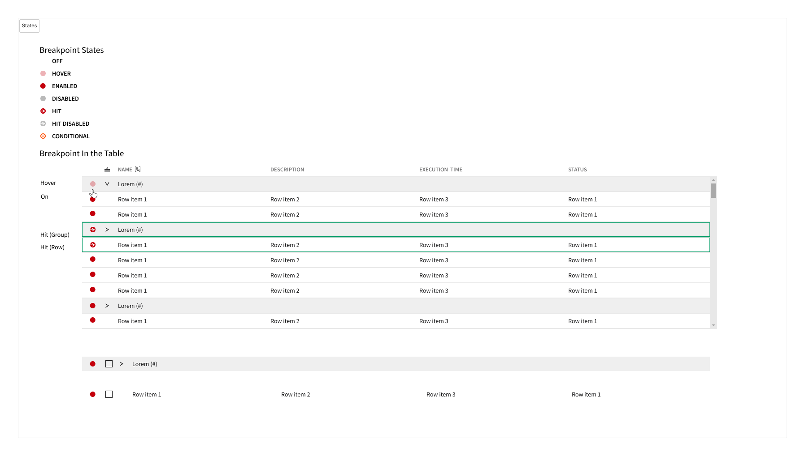

# Nimble Component (IxD): Breakpoint

## Overview

A breakpoint is a UI element that visually marks a line or section of code allowing developers to pause execution and inspect the application state during debugging. In a code table or editor, breakpoints help users quickly identify and interact with debugging points.

> NOTE: THE VISUAL DESIGN IN THIS DOCUMENT MAY NOT BE ACCURATE
### Background
Requested by teams wishing to support code inspection and debugging workflows in Nimble Table.
See internal rationale [here](https://emerson-my.sharepoint.com/:w:/p/alice_darrow/EUyUN2MwIVZKnzUm0MNHSw0BFfTMtxGMTpEupWpMPbD-og?e=z8UyoJ)
## Usage

Use with the Nimble Table when displaying code, especially in environments where debugging is required.

- **When should client-users not use this component?**
  - When displaying static code with no debugging functionality.
  - In tables not intended for code or debugging workflows.

### Anatomy

**Breakpoint states**

> Note: Not approved by visual design
Breakpoints should appear to the left of checkboxes for multiselect

**Breakpoints in a table**

### Related Components

- **Differs from:**
  - **Toggle buttons**  
    - Toggle buttons are used to switch between two states for a setting or feature, typically representing on/off or enabled/disabled.  
    - Breakpoints specifically mark a location in code for debugging purposes and are contextually tied to code execution, not general UI state changes.

- **Decision guidance:**
  - Use breakpoints for debugging; use toggle buttons for general UI state changes.

## Design

### Configuration
*What types of options need to be available on the component to support client-user use cases?*

### Behavior

- **Built-in behaviors:**
  - Toggle breakpoint on click/tap
  - Show tooltip on hover/focus
  - Visually indicate active/inactive state
  - Optionally highlight code line when active
  - Ability to set breakpoints from a context menu
  - Ability to upload a file containing breakpoints

### Mouse Interactions

- Click on the breakpoint indicator toggles its state (set/remove). The breakpoint itself will likely be a 12x12 vector in a 16x16 icon. The hit target should be a minimum of 24x24 pixels for web use. Mobile use is not a current requirement but this should expand to 48x48 for touch if it ever becomes one.

#### Hover behavior
- When removed: Hovering shows a tooltip and outline of breakpoint
- When set: hovering shows a tooltip.

In both cases, hovering changes the cursor from default to pointer.

### Non-Mouse Interactions

- **ARIA Guidelines:** 
- Keyboard navigation:
  - Tab to breakpoint indicator
  - Space/Enter toggles breakpoint
  - Tooltip & breakpoint outline appears on focus
- **Keyboard Shortcuts:**

    **Navigating the table with breakpoints**

    The breakpoint cell will be within the table so navigation should be the same as existing table navigation.

  - **Add/Remove breakpoint:**  
    By default, The breakpoint can be added to any row in the table. Implementers of the table should decide if certain rows should not have breakpoints.
    When the user is focused on the breakpoint cell Space/Eneter adds the breakpoint in addition to the beyboard shortcuts below

    When the user is focused on table row or group header only the keyboard shortcuts add the breakpoint.

    - On Mac: <kbd>Cmd</kbd> + <kbd>B</kbd>  
    - On Windows/Linux: <kbd>Ctrl</kbd> + <kbd>B</kbd>
    - Alternatively, pressing <kbd>F9</kbd> when focused on a table row toggles the breakpoint

## Open Issues
- Should I also be updating the table spec?
- Should we consider full nimble debugging guidelines? (Run, pause, step over, etc)

## Future Considerations
- Should breakpoints support conditional logic (e.g., only break when a condition is met)?
