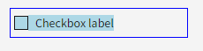
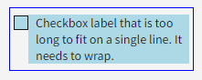
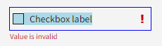
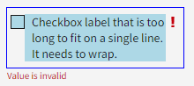
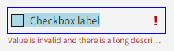

# Error State on Checkbox

## Overview

The `nimble-checkbox` needs to have an error state associated with it. Following the existing patterns within nimble, this error state will be a red exclamation mark icon next to the component and red error text below the component.

### Background

-   [Visual design spec](https://www.figma.com/design/PO9mFOu5BCl8aJvFchEeuN/Nimble_Components?node-id=1295-63148&node-type=canvas&t=sJ2Fhm1vLoZ4zpsK-0)
-   [Nimble issue 2018: Error state for nimble-checkbox](https://github.com/ni/nimble/issues/2018)

The following issue associated with the checkbox will also be addressed as part of the work to add an error state on the checkbox:

-   [Nimble issue 2091: nimble-checkbox has incorrect height](https://github.com/ni/nimble/issues/2091)

## Design

The `nimble-checkbox` will be updated to be able to show an error associated with it.

At a high-level, the design of the component will be:

-   Red error text below the component
    -   The error text does not wrap
    -   It has an ellipsis if the text is longer than the control
    -   The `title` of the text is the full error string
-   Red error icon (`nimble-icon-exclamation-mark`) on the right side of the label with a 4px margin between the icon and the right edge of the control
-   Control indicator (checkbox square) and error icon will both be center-aligned with the first line of label text, both when the label text wraps and when it fits on a single line.
-   Control indicator and label will both be interactable -- hovering over them will put the component in the "mouseover" state and clicking them will activate the control
-   The error icon along with the space between the label and the error icon will not be interactable

Below are some examples of how the checkbox will look and behave with different configurations. The blue outline shows the bounds of the control, and the blue background indicates the interactable regions of the control.

### API

The `nimble-checkbox` will be updated to implement the `ErrorPattern` interface. This means it will have two new attributes:

-   `error-text` - string
-   `error-visible` - boolean

The `error-visible` boolean will control whether or not a red exclamation icon will be visible next to the checkbox label and whether or not the `error-text` is displayed below the checkbox label.

#### Framework Support

The Angular and Blazor wrappers for the `nimble-checkbox` will be updated to include `error-text` and `error-visible`.

### Additional Work

#### Checkbox Styling Updates

The `nimble-checkbox` needs styling updates to align it with the current visual design.

The styling changes include (but may not be limited to):

-   Updating the control height to respect the `controlHeight` token rather than being sized to the text and/or checked/selected indicator
-   Correct the layout of the control when the label wraps. This includes:
    -   Verifying the label wraps when the label is longer than the allocated space for the control
    -   Ensuring the checked/selected indicator is center aligned with the first line of text

## Open Issues

_None_
