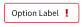

# Nimble Chip

## Overview

The `nimble-chip` is a component that presents text, an optional "remove" button, optional slotted content to the left of the text, and an optional error icon.

### Background

- [Nimble Chip component issue](https://github.com/ni/nimble/issues/413)
- [Chip design](https://www.figma.com/design/PO9mFOu5BCl8aJvFchEeuN/Nimble_Components?node-id=9269-229459&m=dev)
- [Spright chat feature backlog](https://github.com/ni/nimble/issues/2610) (component for attachment chips)

### Containing Library

The intent is for this to be put in Nimble, as 1) this seems to be a fairly constrained component, and thus easily ported to any needed UI platform, and 2) it seems to have broad use possibilities.

### Non-goals

- Arbitrary HTML content
- Implementing a "chip container" component that would be responsible for laying out the chips in a particular fashion, as well as possibly managing their removal if the "remove" button on a chip is pressed. While this may be useful at some point it is not necessary for the `Chip` component to have value.

### Features

- Optionally removable
    - Note that the `Chip` won't remove itself, and it will be up to the client to remove it from the DOM.
- Allows slotted content to be placed to left of text content
- Error icon (no error text)
- Maxiumum width (text content will show ellipsis as needed and a tooltip on hover)

### Risks and Challenges

None

### Prior Art/Examples

SLE keywords display:


SLE axis selection:


Nigel chat attachment chip:


---

## Design

### API

_The key elements of the component's public API surface:_

- _Component Name_: `nimble-chip`
- _Props/Attrs_:
    - `prevent-remove` - set to hide the remove button
    - `appearance` - supports `outline` and `block` appearances
    - `error-visible`
- _Methods_
- _Events_
    - `remove` - fired when the chip remove button is pressed (or \<Del\> or \<Backspace\> is pressed), and `prevent-remove` hasn't been set.
- _Slots_
    - `start` - content placed to the left of the chip text
    - (default) - for the primary message text
- _CSS Classes and CSS Custom Properties that affect the component_

### Examples

```html
<nimble-chip> "Option Label" </nimble-chip>
```


```html
<nimble-chip prevent-remove error-visible> "Option Label" </nimble-chip>
```



```html
<nimble-chip>
    <nimble-icon-check slot="start"> </nimble-icon-check>
    "Option Label"
</nimble-chip>
```


### Anatomy

```html
<template aria-disabled="${x => x.disabled}">
    <div class="control" part="control">
        ${startSlotTemplate(context, definition)}
        <span class="content" part="content">
            <slot></slot>
        </span>
        ${endSlotTemplate(context, definition)}
        ${when(x => !x.preventRemove, html<Chip>`
            <nimble-button content-hidden @click="${x => x.handleRemoveClick()}">
                <nimble-icon-times>
                </nimble-icon-times>
            </nimble-button>
        `)}
    </div>
</template>
```

While the template will have a named `end` slot, this will not be documented, and only be populated with the error icon as needed, following existing Nimble patterns.

### Angular integration

An Angular wrapper will be created for `nimble-chip`. No `ControlValueAccessor` is needed.

### Blazor integration

Blazor integration for the `nimble-chip` will be provided.

### Visual Appearance

See Figma document link at the top of this document.

---

## Implementation

### States

N/A

### Accessibility

_Consider the accessibility of the component, including:_

- _Keyboard Navigation and Focus_
    - the chip component is focusable, but the remove button is not. If the chip has focus and the \<Del\> or \<Backspace\> key is pressed, then the `remove` event will be emitted. If `prevent-remove` attribute is set, the `remove` event will not be emitted when pressing \<Del\> or \<Backspace\>.
- _Form Input_
    - N/A
- _Use with Assistive Technology_
    - a `chip`'s accessible name comes from the element's contents by default
    - `aria-disabled` will be set whenever the `disabled` attribute is set
- _Behavior with browser configurations like "Prefers reduced motion"_
    - N/A

### Future work

- Create a chip container component that manages chip layout, and removal
- Displaying auxiliary text to indicate secondary state.
- While there are visual designs for a `selected` state there are currently no known usages that require a chip to be selectable.

### Globalization

N/A

### Security

N/A

### Performance

N/A

### Dependencies

N/A

### Test Plan

Unit tests and visual comparison tests will be created that exercise all features.

### Tooling

N/A

### Documentation

Storybook stories will be created.

---

## Open Issues
