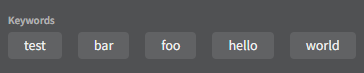
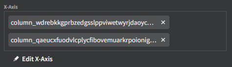
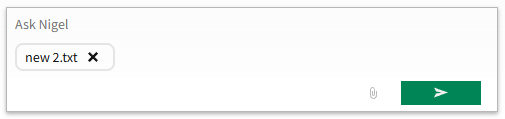
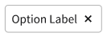
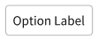
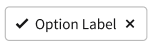

# Nimble Chip

## Overview

The `nimble-chip` is a component that presents text, an optional "remove" button, and optional slotted content to the left of the text.

### Background

- [Nimble Chip component issue](https://github.com/ni/nimble/issues/413)
- [Chip design](https://www.figma.com/design/PO9mFOu5BCl8aJvFchEeuN/Nimble_Components?node-id=9269-229459&m=dev)
- [Spright chat feature backlog](https://github.com/ni/nimble/issues/2610) (component for attachment chips)

### Containing Library

The intent is for this to be put in Nimble, for the following reasons:

- This is a fairly constrained component, and thus easily ported to either Angular or Blazor.
- It has broad use possibilities.
- Designs for the component have been completed (see above link)
- While the remove button introduces a new interactive pattern for our controls from an accessibility perspective, the described plan seems in-line with ARIA expectations.

### Non-goals

- Arbitrary HTML content
- Implementing a "chip container" component that would be responsible for laying out the chips in a particular fashion, as well as possibly managing their removal if the "remove" button on a chip is pressed. While this may be useful at some point it is not necessary for the `Chip` component to have value.

### Features

- Optionally removable
    - Note that the `Chip` won't remove itself, and it will be up to the client to remove it from the DOM.
- Allows icons to be slotted left of text content. Slotted content will be styled automatically to be appropriately sized for the chip
- If a width is set and the label content is larger than the bounds of its container it will present with an ellipsis, and a tooltip will show the entire contents.

### Risks and Challenges

None

### Prior Art/Examples

SLE keywords display:



SLE axis selection:



Nigel chat attachment chip:



[Infragistics Chip component](https://www.infragistics.com/products/ignite-ui-web-components/web-components/components/inputs/chip)

---

## Design

### API

_The key elements of the component's public API surface:_

- _Component Name_: `nimble-chip`
- _Props/Attrs_:
    - `removable` - set to show the remove button
    - `appearance` - supports `outline` and `block` appearances
    - `disabled` - styles the chip in the typical Nimble manner, including any user-slotted content (text and icon), and additionally hides the remove button.
- _Methods_
    - _None_
- _Events_
    - `remove` - fired when the chip remove button is pressed.
- _Slots_
    - `start` - icon placed to the left of the chip text
    - (default) - for the primary label text
- _CSS Classes and CSS Custom Properties that affect the component_
    - not supported

### Examples

```html
<nimble-chip> "Option Label" </nimble-chip>
```



```html
<nimble-chip prevent-remove> "Option Label" </nimble-chip>
```



```html
<nimble-chip>
    <nimble-icon-check slot="start"> </nimble-icon-check>
    "Option Label"
</nimble-chip>
```



### Anatomy

```html
<template aria-disabled="${x => x.disabled}">
    <div class="control" part="control">
        ${startSlotTemplate(context, definition)}
        <span class="content" part="content">
            <slot></slot>
        </span>
        ${endSlotTemplate(context, definition)}
        ${when(x => x.removable && !x.disabled, html<Chip>`
            <nimble-button content-hidden @click="${x => x.handleRemoveClick()}">
                <nimble-icon-times slot="start">
                </nimble-icon-times>
                Remove
            </nimble-button>
        `)}
    </div>
</template>
```

While the template will have a named `end` slot, this will not be documented following existing Nimble patterns. We may consider using the `end` slot if/when we add an error state to the chip.

### Angular integration

An Angular wrapper will be created for `nimble-chip`. No `ControlValueAccessor` is needed.

### Blazor integration

Blazor integration for the `nimble-chip` will be provided.

### Visual Appearance

See Figma document link at the top of this document.

---

## Implementation

### States

We will provide styling for the `disabled` attribute state.

### Accessibility

_Consider the accessibility of the component, including:_

- _Keyboard Navigation and Focus_
    - when the chip component is removable, the remove button will be focusable, otherwise it will not receive focus (following the `nimble-banner` pattern).
- _Form Input_
    - N/A
- _Use with Assistive Technology_
    - a `chip`'s accessible name comes from the element's contents by default
    - no ARIA `role` seems necessary to define for the chip, as it isn't interactive itself (only the remove button is which has a `role`). The only valid role seemed to be [`status`](https://developer.mozilla.org/en-US/docs/Web/Accessibility/ARIA/Reference/Roles/status_role), but that also didn't seem helpful from an accessibility perspective, particularly since it mainly relates to providing helpful information when the content changes (which we don't expect).
    - the remove button will have it's content set to provide a label provider token for the "remove" portion, plus the contents of the chip itself (thus a screen reader will annouce "Remove <Chip>").
- _Behavior with browser configurations like "Prefers reduced motion"_
    - N/A

### Future work

- Make chip selectable (there are already UX designs)
    - Currently there are no use-cases for chips requiring them to be selectable, but there are many use-cases in the wild where this is needed.
- Provide error state for the chip (there are already UX designs)
    - Again, there are no current use-cases requiring a chip to present with error information, but it is not unreasonable to expect we may have such a use-case in the future.
- Create a chip container component that manages chip layout, and removal
- Displaying auxiliary text to indicate secondary state (there are UX mockups of this).

### Globalization

Clients will be responsible for localizing any slotted content. A label provider API will be provided to allow users to localize the label for the remove button, which, while it is never visualized, will be announced with screen readers.

### Security

N/A

### Performance

N/A

### Dependencies

N/A

### Test Plan

Unit tests and visual comparison tests will be created that exercise all features.

### Tooling

N/A

### Documentation

Storybook stories will be created.

---

## Open Issues

Designs call for there to be a max width of 284 pixels for the text portion of the chip. Do we need to create a token for this?
