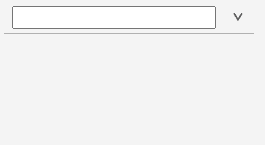

# Nimble Combobox

## Overview

A combobox is a dropdown selector that allows a user to type in the field (with optional auto-complete) to select a value.

### Background

[Visual Design](https://xd.adobe.com/view/33ffad4a-eb2c-4241-b8c5-ebfff1faf6f6-66ac/screen/bd6755d9-8fd2-4b97-9709-939ea20680ae/specs/)
[FAST Combobox](https://explore.fast.design/components/fast-combobox)

---

## Design

### API

[FAST API](https://github.com/microsoft/fast/blob/f81516a3209c20ffa285bc6f8b1854b8304eba57/packages/web-components/fast-foundation/src/combobox/combobox.spec.md)

_Component Name_ - `nimble-combobox`

_Properties/Attributes_ - To achieve the UX descibed in the below 'User interaction' section, we will likely need to provide a new property that allows a user to enable that behavior. This might take the form of a boolean property called something like `addInputOption` (or `dynamicOptions`?), which would default to `false`. Alternatively, there might be room for this API to offer other options, so this could be presented as an `enum` instead.

**Currently the spec specifically states that the combobox should _not_ filter items if a user is allowed to enter freeform text. It is unclear why we would need this restriction.**

Additionally, the UX for this new behavior calls for the inclusion of explicit "`Add`" text that precedes the user input value in the dropdown. This suggests the need for one of two possible features: 1) Nimble-supported localization or 2) a property allowing a user to specify the text used in the "Add" location for purposes of supporting other languages (could default to "Add"). While it's conceivable that a user might want some other text there than a language appropriate version of "Add", this seems like a highly specific API for what is likely a corner use-case. Between the two, a localization enabled Nimble seems preferable. However, this seems like it has a very high cost associated with it, as we don't even have a roadmap for what that will look like.

**Proposal**:
We can move forward with a base implementation of the Combobox that essentially just exposes what is currently in FAST now. This will allow for a user to input arbitrary values, but not offer the new UX of adding an option to the dropdown. Note that consumer applications would still be able to able to update the set of options in the dropdown _after_ the user-input value was committed.

_Events_ - To support the new UX of adding dynamic options, instead of relying on the FAST API for property observation (requiring a consumer to explicitly observe the `options` property), we could instead expose a typical event (i.e. `options-changed`).

### Angular integration

The combobox will have an Angular directive in nimble-angular which allows binding to the combobox's properties and events. The combobox will inherit `FormAssociatedCombobox` from its parent, providing its forms functionality.

### Blazor integration

The Nimble Blazor Combobox component should be able to follow closely to the implementation pattern laid out by the [Nimble Blazor Select component](https://github.com/ni/nimble/blob/427a364ab4aef337247433f25d0bda0583987f6d/packages/nimble-blazor/NimbleBlazor.Components/Components/NimbleSelect.razor.cs#L60).

### Additional requirements

#### User interaction:

As laid out in the [design spec](https://xd.adobe.com/view/33ffad4a-eb2c-4241-b8c5-ebfff1faf6f6-66ac/screen/bd6755d9-8fd2-4b97-9709-939ea20680ae/specs/), a new behavior being requested is that the combobox support the scenario where a user can enter a value that does not exist yet in the set of options, and have that option appear in the dropdown with specific styling indicating that it is a new option yet to be added.

Something like the following:

Note that the option being typed _must_ be committed either through pressing `<Enter>` or through clicking on the option in the dropdown. Clicking away from the `Combobox` without doing either action should result in its value reverting to what it was before the user began typing.

#### Styling considerations:

Should we introduce the UX-desired behavior we will need to provide appropriate styling for the `list-option` while in a "temporary" state, where it also will host an icon, to ensure that everything is properly aligned.

#### Testing:

We should be able to write unit tests for the new UX behavior if/when we implement it.

#### Accessibility considerations:

If we dynamically introduce a `ListOption` into the set for `Combobox`, we should be sure that it has the expected ARIA attributes applied to it. Note that the ARIA attributes applied to options can have ordering information, so we may need to manage them directly.

#### Localization considerations:

As mentioned above, if we introduce user-visible text, like "`Add`" to the `list-option`, it should likely be localizable.

## Open Issues

1. Should we create the initial `NimbleCombobox` without the new feature UX is requesting? **Proposal: YES. The proposed new feature should be additive and not disruptive of any existing behavior FAST provides out-of-the-box.**
2. If/when we add the new UX feature of dynamically updating the dropdown options, how should we handle providing a means of a language appropriate version of "`Add`"?
    - Nimble localization (preferred?)?
    - A new property for specifying that text?
    - Provide new slots allowing clients to add text in a specified location (and thus use whatever localization mechanisms provided by their environment/platform). **Proposal: We go with this option over the others. It avoids Nimble having to design its own localization system, and provides a more flexible configuration mechanism.**
3. If/when we add said UX feature, should having it enabled prohibit the filtering of items? **Proposal: NO. Users can already enter arbitrary values even with filtering/autocomplete turned on, as the FAST `Combobox` provides this. Having the arbitrary value show up in the dropdown does not seem like it should change this behavior.**
