# Nimble Combobox (IxD)

## Overview

The combobox component is used to present a pre-defined list of options that end-users can choose from or type to create a custom value. Comboboxes combine the flexibility of text input with the efficiency of selection for more user-friendly interactions.

> THE VISUAL DESIGN IN THIS DOCUMENT MAY NOT BE ACCURATE

### Background

-   [Select and Combobox Refresh HLD (#1303)](https://github.com/ni/nimble/issues/1303)
-   [ViD Combobox Styles (Figma)](https://www.figma.com/file/PO9mFOu5BCl8aJvFchEeuN/Nimble_Components?type=design&node-id=1529-41777&mode=design)

## Usage

When to use:

-   To provide an input for text entry coupled with a popup for quick selection and filtering
-   To allow end-users to enter custom values
-   For entering settings or preference values that don't (yet) exist
-   For single selection

When not to use:

-   When text entry is not needed for selection
-   When there are fewer than three options
-   For complex and/or hierarchical data
-   For multi selection

### Anatomy

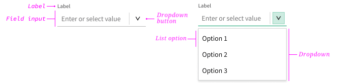

| Element     | Description                                                             |
| ----------- | ----------------------------------------------------------------------- |
| Label       | Text that tells the end-user what to expect in the component            |
| Field input | Input that displays the current selected or entered option              |
| Menu button | Click area that opens the menu                                          |
| Menu        | A list of options to choose from displayed as an _open_ state           |
| Menu item   | A selection the end-user can make, shown with other options in the menu |

#### Label

Comboboxes should always have a label, unless approved by an interaction designer or user researcher (usually in toolbar use cases). _See [Select](/packages/nimble-components/src/select/specs/IxD.md) for more information._

#### Field Input

Comboboxes can be empty by default or have a default selection from the menu. Empty comboboxes should include placeholder text that propts the end-user to enter a custom value or select an option from the menu. Placeholder text should always follow the pattern "Enter or select [thing(s)]", for example "Enter or select address". Ellipses are not needed. Use sentence casing.

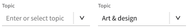

#### Menu & Menu Items

A list of options to select, displayed as an open state._See [Select](/packages/nimble-components/src/select/specs/IxD.md) for more information._

### Related Components

To allow end-users to select a menu item but not enter a custom value, use a [**select**](/packages/nimble-components/src/select/specs/IxD.md).

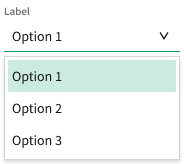

To allow end-users to multi-select menu items, use a [**tag picker**](/packages/nimble-components/src/tag-picker/specs/IxD.md).

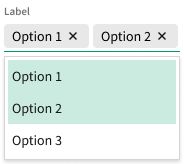

## Design

### Configuration

#### Label

The client-user should be able to specify where they want the label to be positioned. _See [Select](/packages/nimble-components/src/select/specs/IxD.md) for more information._

#### Icons

The client-user should be able to specify whether they want left icons on menu items or not. _See [Select](/packages/nimble-components/src/select/specs/IxD.md) for more information._

#### Groups

The client-user should be able to create groups for menu items. _See [Select](/packages/nimble-components/src/select/specs/IxD.md) for more information._

#### Secondary Text

The client-user should be able to specify whether they want secondary text on menu items or not. _See [Select](/packages/nimble-components/src/select/specs/IxD.md) for more information._

#### Prefix & Suffix

> NOTE: NEEDS VISUAL DESIGN

The client-user should be able to specify a prefix and/or suffix that appears in the field.

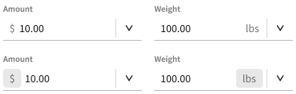

#### Autocomplete

The client-user should be able to specify autocomplete behavior (inline, list, both, none). Autocomplete is accessed via the field input (not pictured). _See [current implementation](https://nimble.ni.dev/storybook/?path=/docs/components-combobox--docs) for more information._

#### Add New

> NOTE: NEEDS DEV REVIEW, VISUAL DESIGNER FOR STATES, & TECH WRITER

The client-user should be able to specify whether custom entries can be added as a menu item in the menu or not. In the former, the menu should display a menu item that new items can be added indicate that a new item can be added. In the later, the menu does not show up at all.

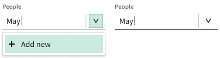

### Behavior

#### Minimum Width

The comobox component minimum width is three times the component height. _See [Select](/packages/nimble-components/src/select/specs/IxD.md) for more information._

#### Menu Height

The menu height should be enough to display five to seven menu items before overflowing with a vertical scrollbar (not pictured).

#### Overflow Text

All text should truncate, not wrap. _See [Select](/packages/nimble-components/src/select/specs/IxD.md) for more information._

#### Progress & Loading

When displaying menu items in the menu lags or is expected to take longer than normal, the menu should indicate that it's loading. _See [Select](/packages/nimble-components/src/select/specs/IxD.md) for more information._

#### Touch-Screen Devices

On touch-screen devices, the combobox field input should bring up the native keyboard.

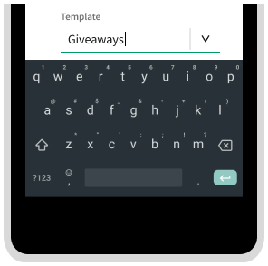

The combobox menu button should bring up the menu in a Nimble or native popover. _See [Select](/packages/nimble-components/src/select/specs/IxD.md) for more information._

### Mouse Interactions

Field inputs are used to type and menu buttons are used to open the menu.

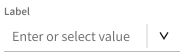

Hovering over the field input indicates interactivity. Hovering over the menu button indicates interactivity.

Clicking on the field input focuses the input and inserts a caret. If there is no current value in the field input or the user clicks at the beginning of the text string, the caret will be inserted to the far left. If there is a current value, the caret will be inserted into wherever in the text string was clicked. Clicking on the field input, regardless of whether there is a current value or not, should open the menu.

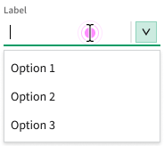

Clicking on the menu button opens (if closed) the menu. If the field input contains a value associated with a menu item, selection is indicated on the menu item (not pictured).

Hovering over a menu item in the menu indicates interactivity.

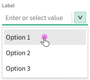

Clicking anywhere on a menu item selects the item, sets the value, displays the value in field input, and closes the menu.

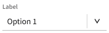

When the menu is open, clicking anywhere outside of a menu item and the text input closes the menu with no changes.

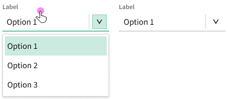

If the combobox allows autocomplete, typing in the field input will show menu items matching the typed value in the field and/or in the menu. The input field autocompletes the first matching menu item. The menu indicates selection on the first matching menu item.

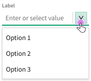

Typing text that does not match any existing menu items either allows the end-user to add a new menu item to the menu or not (see options).

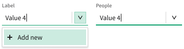

### Keyboard Interactions

> NOTE: Based on ARIA APG [editable combobox w/ autocomplete](https://www.w3.org/WAI/ARIA/apg/patterns/combobox/examples/combobox-autocomplete-both/)

#### Field Input

| Key                        | Description                                                                                              |
| -------------------------- | -------------------------------------------------------------------------------------------------------- |
| `ENTER`                    | Commits a custom or autocompleted value                                                                  |
| `DOWN ARROW` or `UP ARROW` | Opens the menu and moves visual focus to the first or last menu item (DOM focus remains on the combobox) |
| `ALT` + `DOWN ARROW`       | Opens the menu without moving focus or changing selection                                                |
| `ESC`                      | Clears the field input value                                                                             |
| _Text editing keys_        | Behave as expected                                                                                       |

`TAB` focuses the combobox component from the previous or next focusable element on the page.

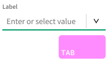

`DOWN ARROW` or `UP ARROW` on the focused field input opens the menu and focuses (but does not select) the first or last menu item. If the component has inline autocomplete, the value of the focused menu item is populated in the input field. Otherwise, the field input does not change until commit (not pictured).

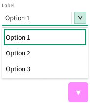

`ALT` + `DOWN ARROW` on the focused field input opens the menu but does not move visual focus or change selection.

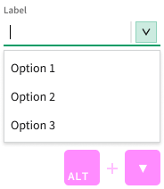

`ENTER` on the focused input field commits the typed, autocompleted, or selected value and closes the menu (if open). The caret remains visible after commit.

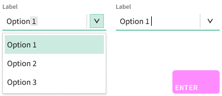

`ESC` clears any text in the field input.

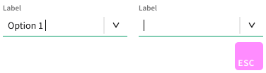

Standard single line text editing keys, for example `DELETE` and `ALT` + `RIGHT ARROW`, should work when focus is in the field input (not pictured).

#### Menu

| Key                           | Description                                                                                                                                    |
| ----------------------------- | ---------------------------------------------------------------------------------------------------------------------------------------------- |
| `ENTER`                       | Sets the value of the field input to the focused menu item, closes the menu, and moves focus to the field input                                |
| `DOWN ARROW` or `UP ARROW`    | Moves visual focus to the next or previous menu item                                                                                           |
| `RIGHT ARROW` or `LEFT ARROW` | Moves visual focus to the field input and inserts the caret one character to the right or left                                                 |
| `ESC`                         | Closes the menu and moves visual focus to the field input                                                                                      |
| `HOME` or `END`               | Moves visual focus to the field input and inserts the caret at the beginning or end of the string                                              |
| _Printable characters_        | Moves visual focus to the field input, types the character(s), opens the autocomplete menu and/or displays inline autocomplete (if applicable) |

From a focused menu item, `DOWN ARROW` or `UP ARROW` moves focus and selects the next or previous menu item. If the focused/selected menu item is the first or last in the menu, `DOWN ARROW` or `UP ARROW` wraps to last or first menu item (not pictured).

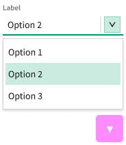

`ENTER` on a focused/selected menu item commits the value, updates the field input, and closes the menu.

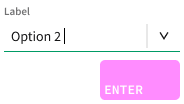

`ESC` on a focused/selected menu item cancels the value, closes the menu, and moves visual focus to the field input.

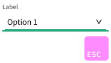

`RIGHT ARROW` or `LEFT ARROW` moves visual focus to the field input without closing the menu and moves the caret one character to the right or left.

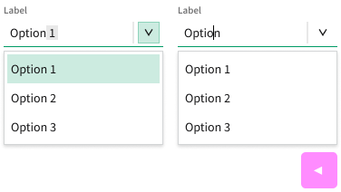

## Future Considerations

-   Helper text for input components (where it should be located, how it should be accessed).
