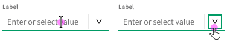

# Nimble Combobox (IxD)

## Overview

The combobox component is used to present a pre-defined list of options that end-users can choose from or type to enter a custom value. Comboboxes combine the flexibility of text input with the efficiency of selection for more user-friendly interactions.

> THE VISUAL DESIGN IN THIS DOCUMENT MAY NOT BE ACCURATE

### Background

-   [Select and Combobox Refresh HLD (#1303)](https://github.com/ni/nimble/issues/1303)
-   [ViD Combobox Styles (Figma)](https://www.figma.com/file/PO9mFOu5BCl8aJvFchEeuN/Nimble_Components?type=design&node-id=1529-41777&mode=design)

## Usage

When to use:

-   To provide an input for text entry coupled with a popup for quick selection and filtering
-   To allow end-users to enter custom values
-   For entering settings or preference values that don't (yet) exist
-   For single selection

When not to use:

-   When all the allowed values can be included in the list of options
-   When there are fewer than three options
-   For complex and/or hierarchical data
-   For multi selection

### Anatomy

| Element         | Description                                                                 |
| --------------- | --------------------------------------------------------------------------- |
| Label           | Text that tells the end-user what to expect in the component                |
| Field input     | Input that displays the current selected or entered option                  |
| Dropdown button | Click area that opens the dropdown                                          |
| Dropdown        | A list of options to choose from displayed as an _open_ state               |
| List option     | A selection the end-user can make, shown with other options in the dropdown |

#### Label

Comboboxes should always have a label, unless approved by an interaction designer or user researcher (usually in toolbar use cases). _See [Select](/packages/nimble-components/src/select/specs/IxD.md) for more information._

#### Field Input

Comboboxes can be empty by default or have a default selection from the dropdown. Empty comboboxes should include placeholder text that prompts the end-user to enter a custom value or select an option from the dropdown. Placeholder text should always follow the pattern "Enter or select [thing(s)]", for example "Enter or select address". Ellipses are not needed for the placeholder. Use sentence casing for the placeholder.

#### Dropdown & list options

A list of options to select, displayed as an open state. _See [Select](/packages/nimble-components/src/select/specs/IxD.md) for more information._

### Related Components

To allow end-users to select a list option but not enter a custom value, use a [**select**](/packages/nimble-components/src/select/specs/IxD.md).

To allow end-users to multi-select list options, use a [**tag picker**](/packages/nimble-components/src/tag-picker/specs/IxD.md).

To allow end-users to select less than three options, use a [**radio group**](/packages/nimble-components/src/radio-group/specs/IxD.md).

## Design

### Configuration

#### Label

The client-user should be able to specify where they want the label to be positioned. _See [Select](/packages/nimble-components/src/select/specs/IxD.md) for more information._

#### Icons

The client-user should be able to specify whether they want left icons on list options or not. _See [Select](/packages/nimble-components/src/select/specs/IxD.md) for more information._

#### Groups

The client-user should be able to create groups for list options. _See [Select](/packages/nimble-components/src/select/specs/IxD.md) for more information._

#### Secondary Text

The client-user should be able to specify whether they want secondary text on list options or not. _See [Select](/packages/nimble-components/src/select/specs/IxD.md) for more information._

#### Autocomplete

The client-user should be able to specify autocomplete behavior (`none` or `list`). Autocomplete is accessed via the field input (not pictured). _See [current implementation](https://nimble.ni.dev/storybook/?path=/docs/components-combobox--docs) for more information._

> NOTE: WE SHOULD PROVIDE DOCUMENTED GUIDANCE THIS FOR CLIENTS

When autocomplete is set to "list", it should filter dropdown options based on matching any text.

#### Error State

The client-user should be able to put the select component into an error state. _See [Select](/packages/nimble-components/src/select/specs/IxD.md) for more information._

### Behavior

#### Minimum Width

The comobox component minimum width is three times the component height. _See [Select](/packages/nimble-components/src/select/specs/IxD.md) for more information._

#### Dropdown Height

The dropdown height should be enough to display five to seven list options before overflowing with a vertical scrollbar (not pictured).

#### Overflow Text

All text should truncate, not wrap. _See [Select](/packages/nimble-components/src/select/specs/IxD.md) for more information._

#### Progress & Loading

When displaying list options in the dropdown lags or is expected to take longer than normal, the dropdown should indicate that it's loading. _See [Select](/packages/nimble-components/src/select/specs/IxD.md) for more information._

#### Touch-Screen Devices

On touch-screen devices, the combobox field input should bring up the native keyboard.

The combobox dropdown button should bring up the dropdown in a Nimble or native popover. _See [Select](/packages/nimble-components/src/select/specs/IxD.md) for more information._

### Mouse Interactions

Field inputs are used to type and dropdown buttons are used to open the dropdown.

Hovering over the field input indicates interactivity. Hovering over the dropdown button indicates interactivity.

Clicking on the field input focuses the input and inserts a caret. If there is no current value in the field input or the user clicks at the beginning of the text string, the caret will be inserted to the far left. If there is a current value, the caret will be inserted into wherever in the text string was clicked. Clicking on the field input, regardless of whether there is a current value or not, should open the dropdown.

Clicking on the dropdown button opens (if closed) the dropdown. If the field input contains a value associated with a list option, selection is indicated on the list option (not pictured).

Hovering over a list option in the dropdown indicates interactivity.

Clicking anywhere on a list option selects the item, sets the value, displays the value in field input, and closes the dropdown.

When the dropdown is open, clicking anywhere outside of a list option and the text input closes the dropdown with no changes.

If the combobox allows autocomplete, typing in the field input will show list options matching the typed value in the field and/or in the dropdown. The input field autocompletes the first matching list option. The dropdown indicates selection on the first matching list option.

### Keyboard Interactions

> NOTE: Based on ARIA APG [editable combobox w/ autocomplete](https://www.w3.org/WAI/ARIA/apg/patterns/combobox/examples/combobox-autocomplete-both/)

#### Field Input

| Key                        | Description                                                                                                    |
| -------------------------- | -------------------------------------------------------------------------------------------------------------- |
| `ENTER`                    | Commits a custom or autocompleted value                                                                        |
| `DOWN ARROW` or `UP ARROW` | Opens the dropdown and moves visual focus to the first or last list option (DOM focus remains on the combobox) |
| `ALT` + `DOWN ARROW`       | Opens the dropdown without moving focus or changing selection                                                  |
| `ESC`                      | Clears the field input value                                                                                   |
| _Text editing keys_        | Behave as expected                                                                                             |

`TAB` focuses the combobox component from the previous or next focusable element on the page.

`DOWN ARROW` or `UP ARROW` on the focused field input opens the dropdown and focuses (but does not select) the first or last list option. If the component has inline autocomplete, the value of the focused list option is populated in the input field. Otherwise, the field input does not change until commit (not pictured).

`ALT` + `DOWN ARROW` on the focused field input opens the dropdown but does not move visual focus or change selection.

`ENTER` on the focused input field commits the typed, autocompleted, or selected value and closes the dropdown (if open). The caret remains visible after commit.

`ESC` clears any text in the field input.

Standard single line text editing keys, for example `DELETE` and `SHIFT` + `RIGHT ARROW`, should work when focus is in the field input (not pictured).

#### Dropdown

| Key                           | Description                                                                                                                                        |
| ----------------------------- | -------------------------------------------------------------------------------------------------------------------------------------------------- |
| `ENTER`                       | Sets the value of the field input to the focused list option, closes the dropdown, and moves focus to the field input                              |
| `DOWN ARROW` or `UP ARROW`    | Moves visual focus to the next or previous list option                                                                                             |
| `RIGHT ARROW` or `LEFT ARROW` | Moves visual focus to the field input and inserts the caret one character to the right or left                                                     |
| `ESC`                         | Closes the dropdown and moves visual focus to the field input                                                                                      |
| `HOME` or `END`               | Moves visual focus to the field input and inserts the caret at the beginning or end of the string                                                  |
| _Printable characters_        | Moves visual focus to the field input, types the character(s), opens the autocomplete dropdown and/or displays inline autocomplete (if applicable) |

From a focused list option, `DOWN ARROW` or `UP ARROW` moves focus and selects the next or previous list option. If the focused/selected list option is the first or last in the dropdown, `DOWN ARROW` or `UP ARROW` wraps to last or first list option (not pictured).

`ENTER` on a focused/selected list option commits the value, updates the field input, and closes the dropdown.

`ESC` on a focused/selected list option cancels the value, closes the dropdown, and moves visual focus to the field input.

`RIGHT ARROW` or `LEFT ARROW` moves visual focus to the field input without closing the dropdown and moves the caret one character to the right or left.

## Future Considerations

-   Helper text for input components (where it should be located, how it should be accessed).
-   Do clients want an "Add new" list option option? Do we want to document how clients might show an "Add new" list option indicator in the dropdown?
-   Does the client-user need to be able to specify a prefix and/or suffix that appears in the field?
