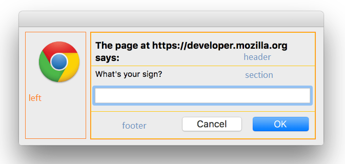
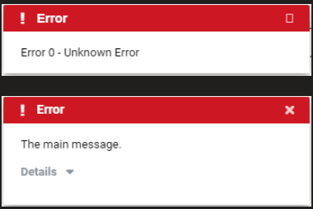

# Nimble Dialog

## Overview

The Nimble dialog component provides clients with a way to open a focused panel on top of their app or another dialog. It should support use cases like propmting users for confirmation or input, or just displaying a message.

### Background

See request in [GitHub issue #378](https://github.com/ni/nimble/issues/378).

Also tracked by [AzDO User Story 2042565](https://ni.visualstudio.com/DevCentral/_workitems/edit/2042565).

No visual design spec exists yet.

### Non-goals

N/A

### Features

- Modal or non-modal
- Easy to create common dialog types e.g. message popups, confirmation/input prompts
- Consistent styling (position, font, colors, border, shadow)

### Risks and Challenges

N/A

### Prior Art/Examples

[Material Dialog](https://material.angular.io/components/dialog/overview)

[FAST Foundation Dialog](https://github.com/microsoft/fast/tree/1e4a383fada3a4895623e6b54088f9f2a07c7a78/packages/web-components/fast-foundation/src/dialog) -- does little other than managing focus and interaction based on the `modal` state

[HTML `<dialog>` element](https://developer.mozilla.org/en-US/docs/Web/HTML/Element/dialog)

---
## Design

### API

We will re-expose the native `dialog` element's API.

- *Component Name*
    - `nimble-dialog`
- *Props/Attrs*
    - `modal`
    - `open` - shows dialog when set, closes when unset
    - `returnValue` - see [Dialog doc](https://developer.mozilla.org/en-US/docs/Web/API/HTMLDialogElement/returnValue). Upon dialog close, takes value of form control that dismissed the dialog.
- *Methods*
    - `open()`
    - `openModal()`
    - `close()`
- *Events*
    - `close` - fires when dialog closed
    - `cancel` - fires when the _browser_ cancels the dialog (e.g. ESC pressed, or browser UI used to close dialog)
- *CSS Classes and CSS Custom Properties that affect the component*
    - (none)

### Anatomy

For consistency with the Drawer, we will apply special styling to `header`, `section`, and `footer` elements that are slotted in the default slot. We will also have a `left` slot intended for an optional image/icon.

Shadow DOM:
```
<dialog>
    <slot name="left">
    <slot>
</dialog>
```

- *Slot Names*
    - `left`: intended mainly for an icon/image, e.g. info/warning/error glyph
    - `(default)`: header, section, and/or footer

    

    The image is just to demonstrate layout, not the actual look of the dialog.
- *Host Classes*
    - (none)
- *Slotted Content/Slotted Classes*
    - `header` - styled large and bold
    - `section` - styled with vertical scrollbar for overflow
    - `footer` - items right justified
- *CSS Parts*
    - (none)

### Angular integration

An Angular wrapper will be provided, following the same patterns as used for existing Nimble components. The dialog does not need a value accessor for form integration support.

### Blazor integration

Blazor support will be provided, following the same patterns as used for existing Nimble components.

### Visual Appearance

TODO

Defaults:

- `border: ${borderWidth} solid ${popupBorderColor}`
- `box-shadow: 0px 5px 15px ${popupBoxShadowColor}`
- `background-color: ${applicationBackgroundColor}`
- `font: ${bodyFont}`
- `color: ${bodyFontColor}`
- `top: 50%`
- `left: 50%`
- `transform: translate(-50%, -50%)`
- `max-width: TODO`

---

## Implementation

We will utilize the html `<dialog>` element. This element provides support on par with the FAST component, including `show()` and `showModal()` functions, a stylable `::backdrop` pseudo-element (for modal), and `close` and `cancel` events.

### Alternative: FAST
The FAST dialog provides very little (e.g. `trapFocus` attr) that the html dialog doesn't. It is preferable to use the more standard option.

### States

Hidden/visible
- The dialog begins hidden and becomes visible when `open` attribute is set or either of the `show()/showModal()` functions is called (also sets `open`).
- When `open` is removed or `close()` is called, the dialog is hidden.

### Accessibility

By using the native `dialog` element, we get good a11y behavior without having to explicitly do anything.

- When modal, the dialog will restrict focus to the elements on the dialog.
- Upon closing a modal dialog, focus will return to the element that had focus before the dialog was opened.
- ESC key closes the dialog

The one missing part is that `aria-labelledby` should be set to point to an element that is the title for the dialog, or else `aria-label` should provide the title directly.

### Globalization

There will be no globalization considerations.

Because Nimble is not localized, we cannot provide OK and Cancel buttons by default; they must be part of the content provided by the user.

### Security

No issues anticipated

### Performance

No issues anticipated

### Dependencies

None

### Test Plan

Because we will not be based on a FAST component, we will create a full range of tests to exercise supported behaviors.

### Tooling

N/A

### Documentation

We will have standard documentation i.e. Storybook.

---
## Dialog Service

Separate from the Nimble dialog itself, there will be a `DialogService` in `systemlink-lib-angular` to easily create and display common dialogs:
- `showErrorPopup(message: string): void`
    - TODO: NEEDS DESIGN
- `showMessagePopup(title: string, message: string): void`
    - TODO: NEEDS DESIGN
- `showConfirmationPrompt(title: string, message: string, confirmLabel: string, rejectLabel: string): boolean`
    - returns `true` if confirmed, `false` if rejected/canceled
    - `confirmLabel` defaults to "Yes" and `rejectLabel` defaults to "No"

Each function will construct and show the respective modal dialog and not return until the dialog is dismissed by the user.

This may be implemented separately, after the Nimble dialog itself is implemented.

---

## Open Issues

- Movable dialogs? How?
- Sizeable dialogs? How?
- How to support buttons and other inputs in the same form? If the user puts `section` and `footer` inside a `<form method='dialog'>` element (to have a footer button automatically close the dialog and submit the form data), then `section` and `footer` will not get default styling.
- Snackbar mode - a snackbar popup:
    - is non-modal
    - appears at the bottom of the window
    - is limited to one at a time - how?

    This is ideally supported fully by the Nimble dialog (vs being managed by a service) so that it can be reused in both Angular and Blazor apps.

    


