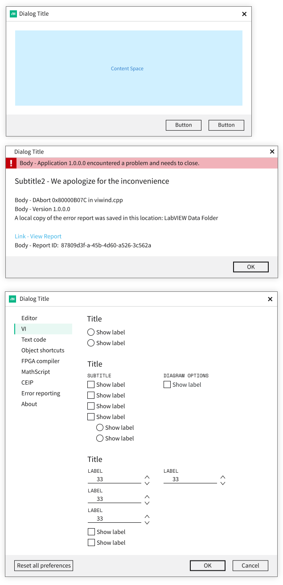

# Nimble Dialog

## Overview

The Nimble dialog component provides clients with a way to open a focused panel on top of their app or another dialog. It should support use cases like prompting users for confirmation or input, or just displaying a message.

### Background

See request in [GitHub issue #378](https://github.com/ni/nimble/issues/378).

Also tracked by [AzDO User Story 2042565](https://ni.visualstudio.com/DevCentral/_workitems/edit/2042565).

No final visual design spec exists yet.

### Non-goals

-   We are not creating a component that will provide "snackbar" functionality, as that has distinct enough requirements that it should be a separate component and/or service. It could be built on top of the (non-modal) native `dialog` element, but there isn't much to be gained by building it on top of nimble-dialog (based on the proposals in this spec).
-   We are not defining a dialog service that would provide a fully programmatic way to create and display simple dialogs. The proposed API allows clients to define their own service. We plan to update the existing `systemlink-lib-angular` confirm-dialog service to use `nimble-dialog`.

### Features

-   Modal dialogs that properly capture focus and restore focus upon closing
-   Consistent styling (position, font, colors, border, shadow)
-   Proper accessibility

### Risks and Challenges

-   The latest version of TypeScript does not have the `dialog` element's full API, which will leads to dev-time errors in the editor (however everything is fine at run-time): https://github.com/microsoft/TypeScript/issues/48267. The TypeScript-DOM-lib-generator source has been updated to have the missing members, so this may be easily fixed through a dependency update and release from the TypeScript repo.

### Prior Art/Examples

[Material Dialog](https://material.angular.io/components/dialog/overview)

[FAST Foundation Dialog](https://github.com/microsoft/fast/tree/1e4a383fada3a4895623e6b54088f9f2a07c7a78/packages/web-components/fast-foundation/src/dialog) -- does little other than managing focus and interaction based on the `modal` state

[HTML `<dialog>` element](https://developer.mozilla.org/en-US/docs/Web/HTML/Element/dialog)

Most of the dialogs currently in SLE look like this:


Another example has both a title and description:


An example from SLS's assets page called out by TJ as something that might need to be supported:


Some [early designs](https://xd.adobe.com/view/00ff3aa4-594f-48eb-6e29-84104374952f-76ce/screen/1085a774-78a1-44a4-8975-2f98286a78e5) from Brandon:



---

## Design

### API

-   _Component Name_
    -   `nimble-dialog`
-   _Props/Attrs_
    -   `open` - read-only attribute that is set while the dialog is open. The native dialog supports setting this attribute, but it opens the dialog non-modally, uncentered, and without focus management. For that reason our API only supports `show()` as the way to open a dialog.
    -   `prevent-dismiss` - prevent dismissal by pressing ESC (this attribute also exists on the Nimble drawer)
-   _Methods_
    -   `show()` - opens the dialog and returns a `Promise` that is resolved when the dialog is closed. The value of the resolved `Promise` indicates why/how the dialog was closed.
    -   `close(reason)` - closes the dialog (returning focus to the control that had it before opening), optionally specifying the reason/method (a value of any type). When no reason is specified, a `USER_DISMISSED` Symbol is given as the reason.
-   _Events_
    -   (none)
-   _CSS Classes and CSS Custom Properties that affect the component_
    -   (none)

Leslie informed us that modal dialogs should not be dismissable by clicking outside. This is something the drawer currently supports but apparently should be treated as a bug to fix.

Multiple dialogs may be opened at the same time. The latest dialog opened will always be on top, forming a stack of open dialogs. Only the top dialog is interactive. The dialog uses the [top layer context](https://developer.chrome.com/blog/top-layer-devtools/#what-are-the-top-layer-and-top-layer-elements), which is above all other elements using the z-index to control stacking position.

We will not make any special effort to provide forms support (i.e. form `type="dialog"`). Specifically, we will not provide access to the `returnValue` attribute of the native `dialog` that is set upon form submission. Angular and Blazor frameworks have their own way of handling forms.

### Anatomy

Because we do not have concrete designs for Nimble dialogs, we will initially have a single, default slot and leave layout and styling of contents completely up to the client. One unfortunate consequence of this is that the component will not be able to enforce design coherence, like position, style, label casing, etc. of dialog buttons. This can be mitigated by implementation of a higher-level service that creates consistently-styled, common dialogs. When we have designs for the dialog, we can revisit this and try to apply some common styling and layout.

Shadow DOM:

```
<dialog>
    <slot>
</dialog>
```

-   _Slot Names_
    -   `(default)`
-   _Host Classes_
    -   (none)
-   _Slotted Content/Slotted Classes_
    -   (none)
-   _CSS Parts_
    -   (none)

#### ALTERNATIVE

One alternative is to follow the precedent of the Drawer and apply special styling to `header`, `section`, and `footer` elements that are slotted in the default slot. However, we can only style the top-level slotted elements (i.e. `header`, `section`, and `footer`), not any nested elements. This may still be enough, as the Drawer has the same limitation. However, since we don't have designs for the dialog at this point, we will not do any such special element styling.

### Form-based dialogs

Native dialogs have form support via setting `method="dialog"` on the `form` element. This allows form elements to close the dialog and pass their values back to the caller via the `returnValue` property on the dialog. We won't expose a `returnValue` property or otherwise support forms in our implementation.

A potential complication arrises if we also want to style certain elements like `header`, `section`, and `footer`. If a client wants to host a form on their dialog and have it submit via buttons in the footer, they would have to wrap `section` and `footer` in their `form` element. This would prevent our styling for `section` and `footer` from working.

### Angular integration

An Angular wrapper will be provided, following the same patterns as used for existing Nimble components. The dialog does not need a value accessor for form integration support.

### Blazor integration

Blazor support will be provided, following the same patterns as used for existing Nimble components.

### Visual Appearance

We will apply styling to give dialogs a consistent border, shadow, background. We will also set font/font color, but slotted content will often override aspects of the font, and the native dialog's user agent stylesheet may override the color with a non-theme-conforming value (this is the case in Chrome). To ensure proper theme-conforming styling, it is up to clients to properly style their content with theme-aware tokens (e.g. for font/font color, etc).

Dialogs will not have a title bar and close control ("X") by default. It will be up to the client to provide that if needed.

Dialogs will always be opened in the center of the screen, sized to fit the contents. Scrolling the page while a dialog is open will not move the dialog, i.e. it will stay visible in the same, fixed location rather than scrolling with the page. This is the default behavior of the native `dialog`.

Dialogs will not be movable or sizeable.

The page behind an open dialog will be slightly dimmed to indicate that it cannot be interacted with.

We will not support any animation of the dialog when opening/closing.

---

## Implementation

We will utilize the html `<dialog>` element. This element provides support on par with the FAST component, including `show()` and `showModal()` functions, a stylable `::backdrop` pseudo-element (for modal), and `close` and `cancel` events.

As of March 2022, the `dialog` element has support in all the browsers we care about. A polyfill is available for users on older versions of those browsers, but we won't need to include it, because our primary client, SystemLink, only supports the latest + 6 months of browser versions. By the time we ship anything using the Nimble dialog, it should have been 6 months since all major browsers have supported the `dialog` element.

### ALTERNATIVE: FAST

The FAST dialog provides very little that the html dialog doesn't. It does have the ability to _not_ trap focus, but we are not interested in that. It is implemented via a `div` rather than `dialog`, presumably because the `dialog` did not have support in all browsers at the time it was developed. We prefer to use the more standard option.

### States

Hidden/visible

-   The dialog begins hidden and becomes visible when ~~`open` attribute is set or~~ the `showModal()` function is called.
-   When ~~`open` is removed or~~ `close()` is called, the dialog is hidden.

### Accessibility

By using the native `dialog` element, we get good a11y behavior without having to explicitly do anything. Until recently, it was recommended to use other dialog implementations (e.g. [a11y-dialog](https://github.com/KittyGiraudel/a11y-dialog)), but with wider browser support for the native `dialog` element, it has become a viable option.

-   When modal, the dialog will restrict focus to the elements on the dialog.
-   Upon closing a modal dialog, focus will return to the element that had focus before the dialog was opened.
-   ESC key closes the dialog
-   The native dialog defaults to the a11y role `dialog` (but we will override this, as discussed below)

The role `alertdialog` should be used for most modal dialogs (since they demand the user's attention), so we will set it by default. When role is `alertdialog`, `aria-describedby` is also supposed to be set to reference the element containing the alert message (which would be part of the user-provided content). Unfortunately, because the `dialog` and the alert message element are on different sides of the shadow DOM boundary, we can't reference the element ID. Similarly, `aria-labelledby` is supposed to point to an element that is the title for the dialog, but it has the same problem with referencing IDs. Instead, `aria-label` should provide the title directly. It is up to the client to set `aria-label` appropriately, and we will synchronize it between `nimble-dialog` and the `dialog` element in the shadow root.

The WAI-ARIA guidelines also state that a dialog should always have at least one focusable element, which typically is satisfied by a Close/OK/Cancel button.

### Globalization

There will be no globalization considerations.

### Security

No issues anticipated

### Performance

No issues anticipated

### Dependencies

None

### Test Plan

Because we will not be based on a FAST component, we will create a full range of tests to exercise supported behaviors.

### Tooling

N/A

### Documentation

We will have standard documentation i.e. Storybook.

---

## Dialog Service

Currently there is [`SlConfirmDialogService`](https://ni.visualstudio.com/DevCentral/_git/Skyline?path=/Web/Workspaces/SystemLinkShared/projects/systemlink-lib-angular/src/sl-confirm-dialog) in `systemlink-lib-angular` which uses the `MatDialog` service to create a configurable confirmation dialog. Trevor developed [an example](https://stackblitz.com/edit/angular-ivy-lmsgz8) of a service that could replace `MatDialog` and be leveraged by `SlConfirmDialogService`. This service creates a dialog element, attaches a `DomPortalOutlet` to it, then creates a `ComponentPortal` to project a given custom component into the dialog via the `DomPortalOutlet`. This pattern should work with `SlConfirmDialogService` since there already exists a `SlConfirmDialogComponent` to be hosted in the displayed dialog.

One question is how this service would find the right place in the DOM tree to attach the created `nimble-dialog` element. We need it to be a descendant of a `nimble-theme-provider` element. We can document that clients should mark the `nimble-theme-provider` that should be parent of created dialogs with the class `dialog-host`. We will first query using the selector `nimble-theme-provider.dialog-host` and use that element if we find it. Failing that, we can fallback on a naive approach where we can simply query the document root element for the first `nimble-theme-provider` and append the dialog as a child.

There is also the `SlNotificationService`, but this currently operates using `MatSnackBar`. This initial implementation of the Nimble dialog is not designed to provide snackbar-like behavior, so it will not be able to be leveraged by `SlNotificationService`.

---

## Loading Spinner Component

There have been requests for Nimble to provide a [loading spinner component](https://github.com/ni/nimble/issues/346), which has some aspects in common with a modal dialog. For example, it prevents interaction with a portion of the UI, and displays some custom content (i.e. the animated spinner and an optional message) in the center of the target area. A question might be whether the nimble-dialog ought to have a spinner mode/appearance, or if a separate spinner component should be built on top of nimble-dialog.

I suggest that it is not intuitive that a loading spinner is a mode/appearance of a nimble-dialog, and that a separate nimble-spinner component is more discoverable and less likely to pollute the nimble-dialog's API with spinner-specific configuration (e.g. spinner size).

It is probably as easy, or easier, to build a nimble-spinner on top of the native `dialog` than to build it on top of nimble-dialog. The latter has a more limited API and provides styling that probably isn't wanted, e.g. border, shadow, and background.

Still, the decision of how we implement a spinner is not final and would best be addressed in a separate spec/HLD. We will not be doing anything to preclude that possibility in the future.

---

## Nimble Drawer Component

The nimble-drawer component shares some similarities with a dialog. We might consider updating the drawer's implementation to use a nimble-dialog. The benefits (automatic focus behavior, a11y support) would come primarily from the underlying `dialog` element, so it might be a better idea to build on top of that instead. We have [an issue](https://github.com/ni/nimble/issues/592) regarding exactly that. One potential hurdle would be to support the drawer's slide-in/out animation.

---

## Open Issues

-   The `dialog` API uses mismatched terminology i.e. "show"/"close". Should we use the same (mismatched) names or switch to `open()`/`close()`?
