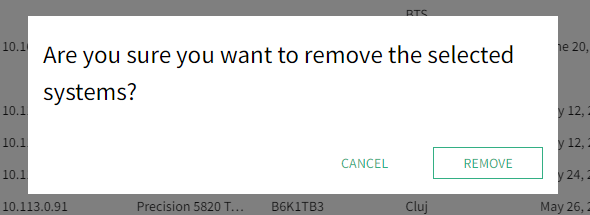
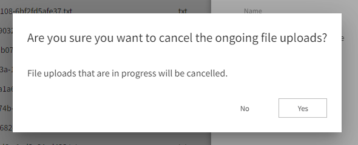

# Nimble Dialog

## Overview

The Nimble dialog component provides clients with a way to open a focused panel on top of their app or another dialog. It should support use cases like prompting users for confirmation or input, or just displaying a message.

### Background

See request in [GitHub issue #378](https://github.com/ni/nimble/issues/378).

Also tracked by [AzDO User Story 2042565](https://ni.visualstudio.com/DevCentral/_workitems/edit/2042565).

No visual design spec exists yet.

### Non-goals

-   We are not creating a component that will provide "snackbar" functionality, as that has distinct enough requirements that it should be a separate component and/or service. It could be built on top of the (non-modal) native `dialog` element, but there isn't much to be gained by building it on top of nimble-dialog (based on the proposals in this spec).
-   We are not defining a dialog service that would provide a fully programmatic way to create and display simple dialogs. That can still be explored at a later time, but it is not currently a high priority.

### Features

-   Modal dialogs that properly capture focus and restore focus upon closing
-   Consistent styling (position, font, colors, border, shadow)
-   Proper accessibility

### Risks and Challenges

N/A

### Prior Art/Examples

[Material Dialog](https://material.angular.io/components/dialog/overview)

[FAST Foundation Dialog](https://github.com/microsoft/fast/tree/1e4a383fada3a4895623e6b54088f9f2a07c7a78/packages/web-components/fast-foundation/src/dialog) -- does little other than managing focus and interaction based on the `modal` state

[HTML `<dialog>` element](https://developer.mozilla.org/en-US/docs/Web/HTML/Element/dialog)

Most of the dialogs currently in SLE look like this:


Another example has both a title and description:


An example from SLS's assets page called out by TJ as something that might need to be supported:


---

## Design

### API

-   _Component Name_
    -   `nimble-dialog`
-   _Props/Attrs_
    -   `open` - shows dialog when set, closes when cleared
-   _Methods_
    -   `showModal()` - sets `open`, returns a `Promise` that is resolved when the dialog is closed
    -   `close()` - clears `open`
-   _Events_
    -   `close` - fires when dialog closed
    -   `cancel` - fires when the _browser_ cancels the dialog (e.g. ESC pressed, or browser UI used to close dialog)
-   _CSS Classes and CSS Custom Properties that affect the component_
    -   (none)

We will not make any special effort to provide forms support (i.e. form `type="dialog"`). Specifically, we will not provide access to the `returnValue` attribute of the native `dialog` that is set upon form submission.

Multiple dialogs may be opened at the same time. The latest dialog opened will always be on top, forming a stack of open dialogs. Only the top dialog is interactive.

### Anatomy

We will have a single, default slot and leave layout and styling of contents completely up to the user.

Shadow DOM:

```
<dialog>
    <slot>
</dialog>
```

-   _Slot Names_
    -   `(default)`
-   _Host Classes_
    -   (none)
-   _Slotted Content/Slotted Classes_
    -   (none)
-   _CSS Parts_
    -   (none)

#### ALTERNATIVE

One alternative is to follow the precedent of the Drawer and apply special styling to `header`, `section`, and `footer` elements that are slotted in the default slot. However, we can only style the top-level slotted elements (i.e. `header`, `section`, and `footer`), not any nested elements. This may still be enough, as the Drawer has the same limitation.

Another potential obstacle is that if a client wants to host a form on their dialog and have it submit via buttons in the footer, they would have to wrap `section` and `footer` in their `form` element. This would prevent our styling for `section` and `footer` from working.

Ultimately, we will not bother styling these special elements because:

-   we cannot style the buttons _within_ the `footer`
-   there is very little useful styling that we could apply to the `header` and `section`

### Angular integration

An Angular wrapper will be provided, following the same patterns as used for existing Nimble components. The dialog does not need a value accessor for form integration support.

### Blazor integration

Blazor support will be provided, following the same patterns as used for existing Nimble components.

### Visual Appearance

We will apply styling to give dialogs a consistent border, shadow, background, and font/font color.

Dialogs will always be opened in the center of the screen, sized to fit the contents. Scrolling the page while a dialog is open will not move the dialog, i.e. it will stay centered.

Dialogs will not be movable or sizeable.

The page behind an open dialog will be slightly dimmed to indicate that it cannot be interacted with.

We will not support any animation of the dialog when opening/closing.

---

## Implementation

We will utilize the html `<dialog>` element. This element provides support on par with the FAST component, including `show()` and `showModal()` functions, a stylable `::backdrop` pseudo-element (for modal), and `close` and `cancel` events.

As of March 2022, the `dialog` element has support in all the browsers we care about. A polyfill is available for users on older versions of those browsers, but we won't need to include it, because our primary client, SystemLink, only supports the latest + 6 months of browser versions. By the time we ship anything using the Nimble dialog, it should have been 6 months since all major browsers have supported the `dialog` element.

### ALTERNATIVE: FAST

The FAST dialog provides very little that the html dialog doesn't. It does have the ability to _not_ trap focus, but we are not interested in that. It is implemented via a `div` rather than `dialog`, presumably because the `dialog` did not have support in all browsers at the time it was developed. We prefer to use the more standard option.

### States

Hidden/visible

-   The dialog begins hidden and becomes visible when `open` attribute is set or the `showModal()` function is called (also sets `open`).
-   When `open` is removed or `close()` is called, the dialog is hidden.

### Accessibility

By using the native `dialog` element, we get good a11y behavior without having to explicitly do anything. Until recently, it was recommended to use other dialog implementations (e.g. [a11y-dialog](https://github.com/KittyGiraudel/a11y-dialog)), but with wider browser support for the native `dialog` element, it has become a viable option.

-   When modal, the dialog will restrict focus to the elements on the dialog.
-   Upon closing a modal dialog, focus will return to the element that had focus before the dialog was opened.
-   ESC key closes the dialog
-   The dialog has the a11y role `dialog`

A related role is `alertdialog`, which is supposed to be set on "the node containing both the alert message and the rest of the dialog" when the dialog contains an alert message. It will be up to the user to set the role of the nimble-dialog to `alertdialog` when appropriate.

Another task for the user is to set `aria-labelledby` to point to an element that is the title for the dialog, or else `aria-label` should provide the title directly.

### Globalization

There will be no globalization considerations.

Because Nimble is not localized, we cannot provide OK and Cancel buttons by default; they must be part of the content provided by the user.

### Security

No issues anticipated

### Performance

No issues anticipated

### Dependencies

None

### Test Plan

Because we will not be based on a FAST component, we will create a full range of tests to exercise supported behaviors.

### Tooling

N/A

### Documentation

We will have standard documentation i.e. Storybook.

---

## Loading Spinner Component

There have been requests for Nimble to provide a [loading spinner component](https://github.com/ni/nimble/issues/346), which has some aspects in common with a modal dialog. For example, it prevents interaction with a portion of the UI, and displays some custom content (i.e. the animated spinner and an optional message) in the center of the target area. A question might be whether the nimble-dialog ought to have a spinner mode, or if a separate spinner component should be built on top of nimble-dialog.

I suggest that it is not intuitive that a loading spinner is a mode of a nimble-dialog, and that a separate nimble-spinner component is more discoverable and less likely to pollute the nimble-dialog's API with spinner-specific configuration (e.g. spinner size). There are some differences between the behavior of a dialog and a spinner, e.g. the ESC key dismisses the former, which it's not clear that we can change.

It is probably as easy, or easier, to build a nimble-spinner on top of the native `dialog` than to build it on top of nimble-dialog. The latter has a more limited API and provides styling that probably isn't wanted, e.g. border, shadow, and background.

## Nimble Drawer Component

The nimble-drawer component shares some similarities with a dialog. We might consider updating the drawer's implementation to use a nimble-dialog. The benefits (automatic focus behavior, a11y support) would come primarily from the underlying `dialog` element, so it might be a better idea to build on top of that instead. The nimble-dialog, as proposed, is missing the ability to dismiss upon clicking outside of it -- something the drawer needs to support. The drawer is also animated, which the dialog is not.

---

## Open Issues
