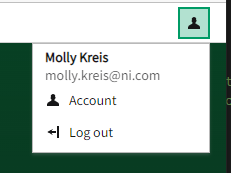
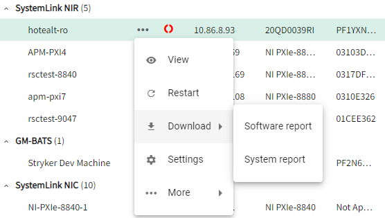

# Nimble Menu Button

## Overview

The `nimble-menu-button` is a button and a menu, where the menu is hidden until the button is clicked.

### Background

[Nimble issue #300](https://github.com/ni/nimble/issues/300)

[Visual design spec](https://xd.adobe.com/view/33ffad4a-eb2c-4241-b8c5-ebfff1faf6f6-66ac/screen/d022d8af-22f4-4bf2-981c-1dc0c61afece/)

### Non-goals

- We are specifically not supporting a client being able to provide any button for opening the menu. The `nimble-menu-button` will contain a button (specifically a `nimble-toggle-button`) within its template to enforce visual design consistency.
  
### Features

- The button will support the same appearance modes as the `nimble-button` and `nimble-toggle-button` -- outline, block, and ghost
- The button will support the same content as the `nimble-button` and `nimble-toggle-button`. For example, it can contain text-only, icon-only, text + icon, etc.
- When the menu is open, the button will have a distinct visual state to represent this
- The user will provide a menu to be disabled when the button is clicked. The expected common use-case is for a `nimble-menu` to be provided, but any element with `[role=menu]` will be supported.

### Risks and Challenges

- FAST does not currently have a menu button or a toggle button. If they add support for either of these components, we will likely want to adopt their components as a base class of ours. Depending on the differences between our API and FAST's API, adopoting their components will likely cause a breaking change within nimble.

### Prior Art/Examples

The user menu in SLE currently has a menu button that was implemented within the SystemLink code base using a `nimble-toggle-button` and a `nimble-menu`. The `nimble-menu-button` will be replace this and simply the code within SystemLink.



SLE also has menus nested within the grids. These menus will be replaced with the `nimble-menu-button`.


---

## Design

The `nimble-menu-button` will consist of two high-level elements -- a `nimble-toggle-button` that is explicitly added to the menu button's template and a menu that is provided by the client. It is likely that the client will provide a `nimble-menu`, but any element with a `role="menu"` will be supported.

The client can provide the same configuration for the `nimble-menu-button` as they can for the `nimble-toggle-button`. The menu button will proxy the configuration to the underlying toggle button.

An example usage of the menu button is as follows:
```html
<nimble-menu-button content-hidden appearance="ghost">
    <nimble-user-icon slot="start"></nimble-user-icon>
    User account

    <nimble-menu slot="menu">
        <nimble-menu-item>
            <nimble-user-icon slot="start"></nimble-user-icon>
            Account
        </nimble-menu-item>
        <nimble-menu-item>
            <nimble-arrow-left-from-line-icon slot="start"></nimble-arrow-left-from-line-icon>
            Log out
        </nimble-menu-item>
    </nimble-menu>
</nimble-menu-button>
```

### API

*The key elements of the component's public API surface:*

*Component Name*
  - `nimble-menu-button`

*Props/Attrs*
  - `open`: boolean
  - `disabled`: boolean
  - `appearance`: string
  - `content-hidden`: boolean
  - `position`: string

*Methods*
  - none

*Events*
  - `open-change` (event) - event for when the opened state has changed

*CSS Classes and CSS Custom Properties that affect the component*
  - none

### Anatomy 

*Outline the component structure with a diagram of its visual tree (shadow dom). Enumerate key areas of visual customization, such as:*

*Slot Names*
  - `start`: content that will get slotted into the `start` slot of the underlying `nimble-toggle-button`
  - `default`: content that will get slotted into the default slot of the underlying `nimble-toggle-button`
  - `end`: content that will get slotted into the `end` slot of the underlying `nimble-toggle-button`
  - `menu`: the menu that will show/hidden based on the `open` attribute of the component

*Host Classes*
  - none

*Slotted Content/Slotted Classes*
  - none

*CSS Parts*
  - `menu`

### Angular integration 

An Angular directive will be created for the component. The component will not have form association, so a `ControlValueAccessor` will not be created.

### Visual Appearance

Visual appearance will match that of the existing `nimble-toggle-button` and the menu provided by the client (likely a `nimble-menu`).

---

## Implementation

The majority of the implementation will be in the `nimble-toggle-button` and the slotted menu. The `nimble-menu-button` will provide the implementation for when the menu is show/hidden and keyboard interactions.

### States

The menu will indicate that it is open by having the underlying toggle button in the 'checked' state.

### Accessibility

*Consider the accessibility of the component, including:*

[W3C docs](https://www.w3.org/TR/wai-aria-practices/examples/menu-button/menu-button-links.html)

*Focus*
  - Focus state of the button will be the same as the `nimble-toggle-button`
  - Focus state of the menu and menu items will be defined by the slotted menu
  - Clicking the toggle button will open/close the menu. When the menu transitions to the open state, the menu will become focused, which should focus the first `[role=menuitem]` within it.

*Keyboard navigation with button focused*

| Key | Behavior|
| --- | --- |
| Down Arrow, Space, Enter | Opens the menu and focuses the menu, which should focus the first `[role=menuitem]` in the menu |
| Up Arrow | Opens the menu and focuses the last `[role=menuitem]` |

*Keyboard navigation with menu focused*

| Key | Behavior | Can be enforced by menu button? |
| --- | --- | --- |
| Space, Enter | Activates the focused menu item | No |
| Escape | Closes the menu and focuses the button | Yes |
| Up Arrow | Moves focus to the previous menu item, wrapping to the last menu item if at the top | No |
| Down Arrow | Move focus to the next menu item, wrapping to the first menu item if at the bottom | No |
| Home | Moves focus to the first menu item | No |
| End | Moves focus to the last menu item | No |
| A-Z, a-z | Move focus to the next menu item whose label starts with typed character. If no such item exists, focus does not move | No |

*Form Input*
  - none

*Use with Assistive Technology*
  - menu button will set `aria-haspopup="true"`
  - when the menu is open, the menu button will set `aria-expanded="true"`
  - menu button will set `aria-controls` to the ID of the menu
    - Open issue: What is the best way to achieve this? The menu is a slotted element.
  - menu will have `aria-labelledby` that points to the label of the button
    - Open issue: Is this required? What is the best way to achieve this?

### Globalization

*Consider whether the component has any special globalization needs such as:*

- *Special RTL handling*
- *Swapping of internal icons/visuals*
- *Localization*

### Security

*Are there any security implications surrounding the component?*

### Performance

*Are there any performance pitfalls or challenges with implementing the component?*

### Dependencies

Dependent on the `nimble-toggle-button`.

### Test Plan

Unit tests will be written to test the component. These will include things such as appropriate ARIA attributes are set on the component, keyboard interactions, mouse interactions, etc.

Matrix tests will be added to test the various states of the component. These will include the appearance modes, disabled/enabled states, open/close state of the menu, etc.

### Tooling

*Are there any special considerations for tooling? Will tooling changes need to be made? Is there a special way to light up this component in our tooling that would be compelling for developers/designers?*

### Documentation

As with other nimble components, a story will be added in storybook for the new component. Relevant documentation will be added there.

*What additions or changes are needed for user documentation and demos? Are there any architectural/engineering docs we should create as well, perhaps due to some interesting technical challenge or design decisions related to this component?*

---
## Open Issues

- What is appropriate way to set the ARIA attributes that are IDs of other attributes? Specifically, having the button point to the menu and menu point to the button's label.