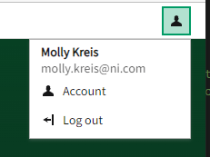
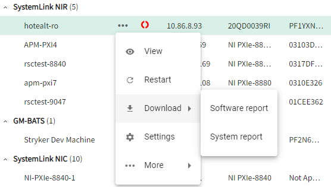

# Nimble Menu Button

## Overview

The `nimble-menu-button` is a button and a menu, where the menu is hidden until the button is clicked.

### Background

[Nimble issue #300](https://github.com/ni/nimble/issues/300)

[Visual design spec](https://xd.adobe.com/view/33ffad4a-eb2c-4241-b8c5-ebfff1faf6f6-66ac/screen/d022d8af-22f4-4bf2-981c-1dc0c61afece/)

### Non-goals

-   We are specifically not supporting a client being able to provide any button for opening the menu. The `nimble-menu-button` will contain a button (specifically a `nimble-toggle-button`) within its template to enforce visual design consistency.

### Features

-   The button will support the same appearance modes as the `nimble-button` and `nimble-toggle-button` -- outline, block, and ghost
-   The button will support the same content as the `nimble-button` and `nimble-toggle-button`. For example, it can contain text-only, icon-only, text + icon, etc.
-   When the menu is open, that state will be reflected in the styling of the button
-   The user will provide a menu to be displayed when the button is clicked. In most cases, it is expected that a `nimble-menu` will be provided, but any element with `[role=menu]` will be supported.

### Risks and Challenges

-   FAST does not currently have a menu button or a toggle button. If they add support for either of these components, we will likely want update our component to leverage theirs. Depending on the differences between our API and FAST's API, adopoting their components will likely cause a breaking change within nimble.

### Prior Art/Examples

The user menu in SLE currently has a menu button that was implemented within the SystemLink code base using a `nimble-toggle-button` and a `nimble-menu`. The `nimble-menu-button` will be replace this and simplify the code within SystemLink.



SLE also has menus nested within the grids. These menus will be replaced with the `nimble-menu-button`.


---

## Design

The `nimble-menu-button` will consist of two high-level elements -- a `nimble-toggle-button` that is explicitly added to the menu button's template and a menu that is provided by the client. It is likely that the client will provide a `nimble-menu`, but any element with a `role="menu"` will be supported.

The client can provide the same configuration for the `nimble-menu-button` as they can for the `nimble-toggle-button`. The menu button will proxy the configuration to the underlying toggle button.

An example usage of the menu button is as follows:

```html
<nimble-menu-button content-hidden appearance="ghost">
    <nimble-icon-user slot="start"></nimble-icon-user>
    User account

    <nimble-menu slot="menu">
        <nimble-menu-item>
            <nimble-icon-user slot="start"></nimble-icon-user>
            Account
        </nimble-menu-item>
        <nimble-menu-item>
            <nimble-icon-arrow-left-from-line
                slot="start"
            ></nimble-icon-arrow-left-from-line>
            Log out
        </nimble-menu-item>
    </nimble-menu>
</nimble-menu-button>
```

### API

_Component Name_

-   `nimble-menu-button`

_Props/Attrs_

-   `open`: boolean
-   `disabled`: boolean
-   `appearance`: string
-   `content-hidden`: boolean
-   `position`: string

_Methods_

-   none

_Events_

-   `beforetoggle` (event) - event fired before the opened state has changed. The event detail contains:
    -   `newState` - boolean - The value of `open` on the menu button that the element is transitioning in to.
    -   `oldState` - boolean - The value of `open` on the menu button that the element is transitioning out of.
-   `open-change` (event) - event for when the opened state has changed

_CSS Classes and CSS Custom Properties that affect the component_

-   none

### Anatomy

_Slot Names_

-   `start`: content that will get slotted into the `start` slot of the underlying `nimble-toggle-button`
-   _default slot (unnamed)_: content that will get slotted into the default slot of the underlying `nimble-toggle-button`
-   `end`: content that will get slotted into the `end` slot of the underlying `nimble-toggle-button`
-   `menu`: the menu that will be shown/hidden based on the `open` attribute of the component

_Host Classes_

-   none

_Slotted Content/Slotted Classes_

-   none

_CSS Parts_

-   `menu`

### Angular integration

An Angular directive will be created for the component. The component will not have form association, so a `ControlValueAccessor` will not be created.

### Blazor integration

A Blazor wrapper will be created for the component.

### Visual Appearance

Visual appearance will match that of the existing `nimble-toggle-button` and the menu provided by the client (likely a `nimble-menu`).

---

## Implementation

The majority of the implementation will be in the `nimble-toggle-button` and the slotted menu. The `nimble-menu-button` will provide the logic for when the menu is show/hidden and keyboard interactions.

### States

The menu will indicate that it is open by having the underlying toggle button in the 'checked' state.

### Accessibility

[W3C docs](https://www.w3.org/TR/wai-aria-practices-1.2/#menubutton)

_Focus_

-   Focus state of the button will be the same as the `nimble-toggle-button`
-   Focus state of the menu and menu items will be defined by the slotted menu
-   Clicking the toggle button will open/close the menu. When the menu transitions to the open state, the menu will become focused, which should focus the first `[role=menuitem]` within it.

_Keyboard navigation with button focused_

| Key                      | Behavior                                                                                        |
| ------------------------ | ----------------------------------------------------------------------------------------------- |
| Down Arrow, Space, Enter | Opens the menu and focuses the menu, which should focus the first `[role=menuitem]` in the menu |
| Up Arrow                 | Opens the menu and focuses the last `[role=menuitem]`                                           |

_Keyboard navigation with menu focused_

| Key    | Behavior                               |
| ------ | -------------------------------------- |
| Escape | Closes the menu and focuses the button |

Note: All other keyboard interaction is determined by the slotted menu and will not be defined in this document.

Note: When an item in the menu is selected, regardless of whether through keyboard or mouse interaction, the menu will be closed.

_Form Input_

-   none

_Use with Assistive Technology_

-   The inner toggle-button will have `aria-haspopup="true"`.
-   When the menu is open, the inner toggle-button will have `aria-expanded="true"`.
-   [Optional] The inner toggle-button will have `aria-controls` set to the ID of the menu.
    -   As this is optional, this will not be configured in order to reduce the amount of manipulation required on the slotted menu element.
-   The menu should have an `aria-label` configured on it.
    -   Open question: Is this the responsibility of the client?

### Globalization

_Consider whether the component has any special globalization needs such as:_

-   _Special RTL handling_
-   _Swapping of internal icons/visuals_
-   _Localization_

### Security

_Are there any security implications surrounding the component?_

### Performance

_Are there any performance pitfalls or challenges with implementing the component?_

### Dependencies

Dependent on the `nimble-toggle-button`.

### Test Plan

Unit tests will be written to test the component. These will include things such as appropriate ARIA attributes are set on the component, keyboard interactions, mouse interactions, etc. A unit test will be written to ensure that the inner toggle-button does not interact with forms (similar but opposite to [this FAST test](https://github.com/microsoft/fast/blob/e92a16b95e8410d59b46978bce1b02d5b80fc004/packages/web-components/fast-foundation/src/form-associated/form-associated.spec.ts#L169)).

Matrix tests will be added to test the various states of the component. These will include the appearance modes, disabled/enabled states, open/close state of the menu, etc.

### Tooling

_Are there any special considerations for tooling? Will tooling changes need to be made? Is there a special way to light up this component in our tooling that would be compelling for developers/designers?_

### Documentation

As with other nimble components, a story will be added in storybook for the new component. Relevant documentation will be added there.

---

## Open Issues

-   Should nimble try to enforce that an aria-label is configured on the slotted menu?
