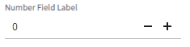
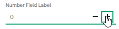

# Blazor Number Field

## Problem Statement

Numeric-based components in a C# world can carry expectations that the component support various numeric types. However, the `nimble-number-field` web component obvioulsy has no concept of varying numeric types.

Ultimately, we expect clients to have various requirements for number inputs, specifically related to the formatting of the number. This can be addressed in the future, by offering an API that allows a client to format the number, and doesn't require that the value represented by the `NumberField` be of a specific numeric type.

## Links To Relevant Work Items and Reference Material

[Blazor NumberField prototype](https://github.com/ni/nimble/tree/blazor-number-field)

[Microsoft FluentNumberField](https://github.com/microsoft/fast-blazor/blob/main/src/Microsoft.Fast.Components.FluentUI/Components/FluentNumberField.razor.cs)

## Implementation / Design

I propose we create a non-generic `NimbleNumberField`, using a base type of `NimbleInputBase<double?>`. The nullable type will allow the number field to be empty and display placeholder text. Additionally, the `Min`, `Max`, and `Step` parameters will all share the same type of `double`.

The behavior, then, will match what we see in other frameworks like Angular.

Integer-like `NumberField`:

Double `NumberField`:

Clients that ultimately want a numeric value represented by some other type than `double` will have to simply cast/convert to the appropriate type.

### Input Validation

## Alternative Implementations / Designs

The other approach would have been to offer an API similar to that of the Microsoft `FluentNumberField` (linked above), where a client could provide a generic argument to `NimbleNumberField` (ala `NimbleNumberField<int>`).

## Open Issues

*Describe any open issues with the design that you need feedback on before proceeding.*
*It is expected that these issues will be resolved during the review process and this section will be removed when this documented in pulled into source.*
