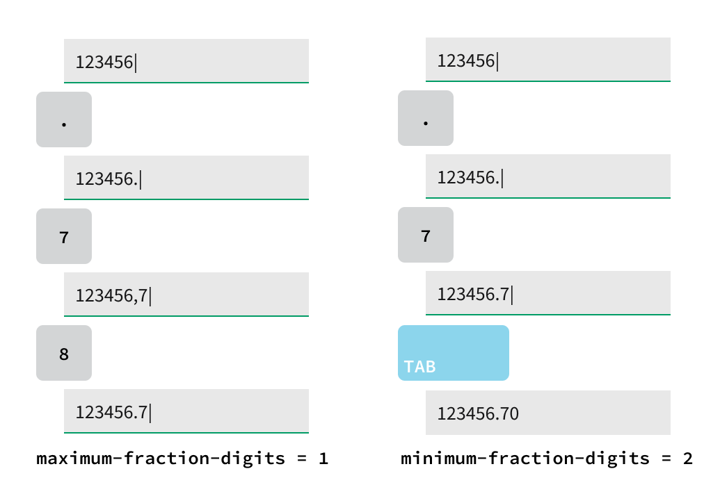

# Number Field Updates (IxD)

## Overview

### Background

- [Bring number-column formatting options to nimble-number-field](https://github.com/ni/nimble/issues/1855)
- [Number IxD (Figma)](https://www.figma.com/design/r2yGNQNVFdE7cBO9CyHmQx/Nimble---IxD?node-id=1603-3464)

The `nimble-number-field` leverages
[fast-foundation](https://github.com/ni/fast/blob/archives/fast-element-1/packages/web-components/fast-foundation/src/number-field/number-field.ts)
for its behavior, so we've inherited much of the behavior, including max/min
validation and localization.

For supported languages (English, French, German, Japanese, Chinese), the
_decimal separator_ does not align with user expectations in German. For
example, `1000000.01`
[should](https://randombits.dev/articles/number-localization/locale-list) render
as `1000000,01` in German but currently renders as `1000000.01` across all
locales.

Additionally, clients have requested the ability to define max/min values for
the `nimble-number-field` to support form validation without automatically
coercing user-entered values to fit within the specified range.

In comparison, the HTML `<input type="number">` natively supports locale-aware
_decimal separators_ and does not coerce values to the min/max limit.

This IxD specifies requirements for a numeric control that will natively support
localization, coercion, decimal precision, and other formatting options.

## Usage

Number fields are used in three distinct ways:

1. **With Increment/Decrement Buttons (Steppers)**

    - Suitable for small, controlled ranges of values where users adjust numbers
      incrementally (e.g., specifying a slot number).
    - Discrete integers with a predictable range.
    - Step size is typically 1 but can vary (e.g., 5, 10).
    - Max/min constraints are enforced, and values are coerced to stay within
      range.
    - _`nimble-number-field` supports this use case today._

2. **Integer Input (Without Steppers)**

    - Used when users need to input whole numbers without a constrained range.
    - Validates input to ensure only integers are accepted (e.g., rejects 3.5 or
      “abc”).
    - May include min/max constraints (e.g., age between 0 and 150).

3. **Decimal Values**
    - Used for precise, fractional numbers (e.g., measurements or scientific
      data).
    - Defines decimal precision (e.g., 2 places for currency, 3 for scientific
      data) and coerces values to enforce it.
    - Does not use increment/decrement buttons.
    - Supports locale-specific formatting (e.g., 1.23 vs. 1,23).

## Requirements

1. Support locale-specific formatting for decimal values (e.g., 10212,456 in
   German).
2. Allow specifying decimal precision (e.g., 2 places → 123.45).
3. Provide validation-only mode for max/min, supporting both coercion and
   non-coercion on blur.

### Anatomy

| Element             | Description                                                                                      |
| ------------------- | ------------------------------------------------------------------------------------------------ |
| Label               | Name for the field.                                                                              |
| Required            | Indicates whether the field is required or optional.                                             |
| Placeholder         | Shows an example of the data required in the field or a description of the purpose of the field. |
| Numeric value       | Current control value.                                                                           |
| Increment/Decrement | Changes numeric value by the step size.                                                          |
| Error status icon   | Appears when a user has entered invalid data in a field.                                         |
| Error text          | Appears when a user has entered invalid data in a field.                                         |

### Related Components

- [Number Field](https://nimble.ni.dev/storybook/index.html?path=/docs/components-number-field--docs)

## Design

### Configuration

Proposed attributes:

| Attribute               | Description                                                                                                               |
| ----------------------- | ------------------------------------------------------------------------------------------------------------------------- |
| maximum-fraction-digits | Maximum number of digits after the decimal separator.                                                                     |
| minimum-fraction-digits | Minimum number of fraction digits. Values with fewer digits will be right-padded with zeros to meet the specified length. |
| min                     | The lowest permitted value.                                                                                               |
| max                     | The greatest permitted value.                                                                                             |

### Behavior

#### Mouse Interactions

Hovering over the field input indicates interactivity.

Clicking on the field input focuses the input and places a caret. If no value
exists, the caret is placed at the far left. Otherwise, it is placed where
clicked.

Double-clicking within the field input selects the closest contiguous
characters.

Triple-clicking within the field input selects all characters.

#### Keyboard Interactions

| Key                       | Description                                                                                                                                      |
| ------------------------- | ------------------------------------------------------------------------------------------------------------------------------------------------ |
| `ENTER`/`ESC`             | No action.                                                                                                                                       |
| `UP ARROW`                | (If `hide-step = false`) Increment the number by the step value. (If `hide-step = true`) Moves the caret to the beginning of the entered number. |
| `HOME`/`CMD + LEFT ARROW` | Moves the caret to the beginning of the entered number.                                                                                          |
| `DOWN ARROW`              | (If `hide-step = false`) Decrement the number by the step value. (If `hide-step = true`) Moves the caret to the end of the entered number.       |
| `END`/`CMD + RIGHT ARROW` | Moves the caret to the end of the entered number.                                                                                                |
| _Numbers_                 | Adds number at cursor.                                                                                                                           |
| `SPACE`                   | No action.                                                                                                                                       |
| _Alphabetic_              | No action.                                                                                                                                       |
| `e`/`E`                   | No action. This does not need to support scientific notation.                                                                                    |
| `COMMA`                   | (As thousands separator) No action. (As decimal separator) Adds comma at cursor. No action if decimal separator is already present.              |
| `PERIOD`                  | (As thousands separator) No action. (As decimal separator) Adds period at cursor. No action if decimal separator is already present.             |
| `-`                       | (If cursor at beginning of field) Add once at cursor.                                                                                            |
| `+`                       | No action.                                                                                                                                       |

Users can type valid numbers and up to one decimal separator into the number
field.

Users can type values outside the maximum range of allowed values.

Users can type more or fewer fractional digits than required.

## Future Considerations

- Mobile support, including specifying `inputmode=decimal` to show a numeric
  keyboard when `min >= 0` and `inputmode=url` when `min < 0`.
- Support for a unit suffix.
- Support for localized `thousand separators`.

## References

- [ARIA – Forms](https://usability.yale.edu/web-accessibility/articles/forms)
- [Maskito](https://maskito.dev/kit/number)
- [Input Steppers](https://usability.yale.edu/web-accessibility/articles/forms)
- [CMS - Masked Field](https://design.cms.gov/components/text-field/masked-field/?theme=core)
