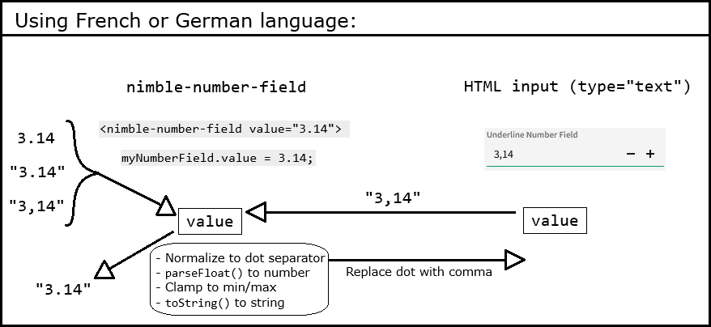
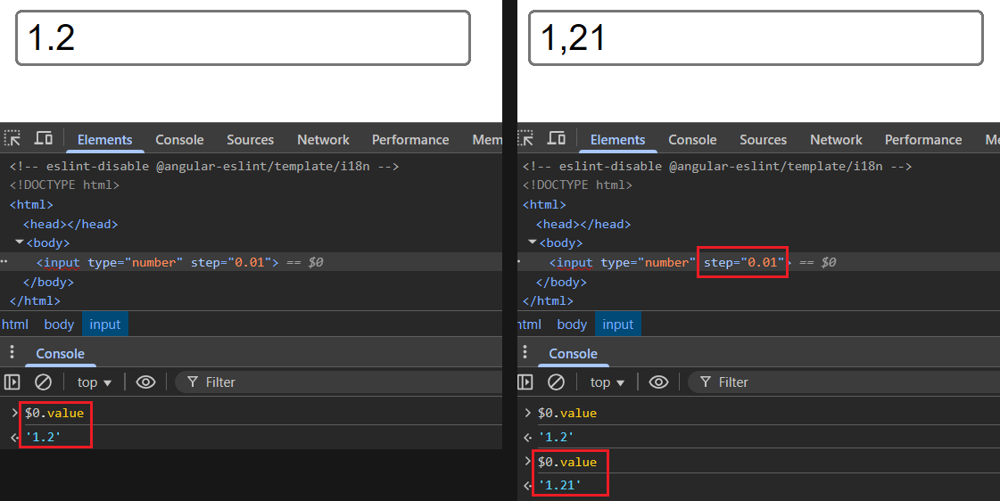

# Localized Decimal Separator

## Problem Statement

For supported languages (English, French, German, Japanese, Chinese), the
_decimal separator_ does not align with user expectations in French and German. For
example, `1000000.01`
[should](https://randombits.dev/articles/number-localization/locale-list) render
as `1000000,01` in German but currently renders as `1000000.01` across all
locales.

## Links To Relevant Work Items and Reference Material

N/A

## Implementation / Design

This feature boils down to the following:

### 1. Input allows either `.` or `,`, based on the language

This is currently accomplished by the [handler](https://github.com/ni/fast/blob/53628f75d9ca8057483b1872223f72e7c74baa8a/packages/web-components/fast-foundation/src/number-field/number-field.ts#L342) for the [`input` event of the native `input` element](https://github.com/ni/nimble/blob/f662ebca86d7ece6972b3129f0bc091d9e3ccbe1/packages/nimble-components/src/number-field/template.ts#L38). It uses a regex to filter out disallowed characters. Typing, pasting, drag-dropping text all behave the same way, as they all trigger an `input` event.

In order to control which separator character gets filtered, we have to override `handleTextInput` (since the FAST implementation just hardcodes the regex pattern to filter out `,`). We could modify the function directly in `@ni/fast-foundation`, but I think we prefer to minimize divergence from the original FAST files.

#### Determining the separator character for the language

I surveyed a handful of other design systems to see what kind of localized separator behaviors they support and how they implement separator choice. Essentially, they all fell into one of two categories:

- No specific localized number support, other than what is provided by the wrapped HTML `input` when the user sets the `type` attribute to `"number"`. See [Alternatives section](#html-input-with-number-type) for why we're not going that route.

- Relies on `Intl.NumberFormat` for localization support

The following table lists the design systems surveyed and links to relevant references.

| Name                                                     | Localized numeric input implementation                                                                                                                                                                                                                                                                                                                                                                                                                              |
| -------------------------------------------------------- | ------------------------------------------------------------------------------------------------------------------------------------------------------------------------------------------------------------------------------------------------------------------------------------------------------------------------------------------------------------------------------------------------------------------------------------------------------------------- |
| [Calcite](https://github.com/Esri/calcite-design-system) | [Uses `Intl.NumberFormat().formatToParts()` to get the separator for the given locale](https://github.com/Esri/calcite-design-system/blob/46bb953e0482dccf53e96a04cb2bc2e55976ea98/packages/calcite-components/src/utils/locale.ts#L276)                                                                                                                                                                                                                            |
| Spectrum (Adobe)                                         | `NumberParser` from [`@internationalized/number` library](https://github.com/adobe/react-spectrum/tree/main/packages/%40internationalized/number#numberparser) provides locale-aware parsing of full and partial input strings, with support for currencies and units. Internally, [uses `Intl.NumberFormat`](https://github.com/adobe/react-spectrum/blob/2c29e2d1d5d25fc548cfcc7da91d8793f1696441/packages/%40internationalized/number/src/NumberParser.ts#L124). |
| [Carbon](https://carbondesignsystem.com/)                | [Number input](https://carbondesignsystem.com/components/number-input/usage/) is thin wrapper around [native `input` with `type="number"`](https://github.com/carbon-design-system/carbon/blob/0f19e6a9b75d36931da476b6ccf33380fe5fc525/packages/web-components/src/components/number-input/number-input.ts#L295)                                                                                                                                                   |
| [Material](https://m3.material.io/components)            | No input specifically for numbers (only general text field)                                                                                                                                                                                                                                                                                                                                                                                                         |
| [Base](https://baseweb.design/components/input/) (Uber)  | No input specifically for numbers (only general text field)                                                                                                                                                                                                                                                                                                                                                                                                         |
| Atlassian                                                | No input specifically for numbers. `Textfield` is a [thin wrapper around native HTML `input`](https://bitbucket.org/atlassian/atlassian-frontend-mirror/src/26f65cec1c4261aa99e319a5dd4adb17e99747cc/design-system/textfield/src/text-field.tsx#lines-460).                                                                                                                                                                                                         |

StackOverflow also seems to recommend either `Intl.NumberFormat().formatToParts()` or `toLocaleString()` ([here](https://stackoverflow.com/questions/1074660/with-a-browser-how-do-i-know-which-decimal-separator-the-operating-system-uses) and [here](https://stackoverflow.com/questions/33159354/how-do-i-find-the-decimal-separator-for-current-locale-in-javascript)). We will use the recommended `Intl.NumberFormat` approach:

```ts
function getDecimalSeparator(locale: string): string {
    return Intl.NumberFormat(locale)
        .formatToParts(1.1)
        .find((x) => x.type === 'decimal').value;
}
```

### 2. Language is based on `lang` design token value for the `nimble-number-field` element

We just need to call `lang.getValueFor(<number-field element>)`, which gives us the effective locale identifier (e.g. "en-US", "fr", "de") for the element, whether it comes from the `lang` attribute of the document element, or from a containing `nimble-theme-provider`. We must evaluate this at connection time, as well as whenever the `lang` design token value changes.

### 3. Separator in UI updates when design token value changes

We will follow the same pattern established by the locale-sensitive table columns (e.g. `number-text`). Specifically, we will [create a `DesignTokenSubscriber` for the `lang` design token](https://github.com/ni/nimble/blob/f662ebca86d7ece6972b3129f0bc091d9e3ccbe1/packages/nimble-components/src/table-column/number-text/index.ts#L73), and [subscribe/unsubscribe the `nimble-number-field` to it upon connect/disconnect](https://github.com/ni/nimble/blob/f662ebca86d7ece6972b3129f0bc091d9e3ccbe1/packages/nimble-components/src/table-column/number-text/index.ts#L87). The handler will update the regex pattern used for filtering input, and it will update the inner `input`'s value by replacing `,` with `.` (or vice versa).

### 4. Value handling

The number-field and the inner `input` each have a `value` property. The number-field's `value` corresponds to the data value of the control, while the `input`'s `value` determines what is displayed in the UI. Until now, those two values have been the same, but that won't always be the case anymore. The number-field's `value` will always be a string that can be parsed by `parseFloat()`, i.e. will exclusively use a dot as the decimal separator. However, the inner `input`'s `value` is what is displayed to the user, so when the locale dictates a comma separator, it will use a comma. Therefore, some conversions must be made when propagating values between the two `value` properties:



We can achieve this by overriding the FAST `NumberField`'s `handleTextInput()` method (which we already need to override to modify the regex character filter) and `valueChanged()` method. Because we will maintain the current invariant that the `nimble-text-field`'s `value` property always uses the dot separator, no other existing `NumberField` code needs to change.

Note that we will be diverging from the native HTML numeric `input`'s behavior for locales that use a comma separator. Specifically, it allows the input or assignment of a string value with _either_ a comma or dot separator. There doesn't seem to be much value in this, so for the sake of a simpler, more consistent API, we will expect all values assigned to the `value` attribute/property to be implicitly convertable to a `number` without locale-aware parsing.

### Other considerations

Storybook documentation for the number-field will be updated to include a sentence about localization similar to what we have for the numeric table column, i.e. "Numbers are formatted in a locale-specific way based on the value of the lang token, which can be set via the `nimble-theme-provider`." We will also update the `value` property/attribute documentation to clarify that the value will have a dot separator regardless of what the display shows.

Because this will result in a behavior change for clients whose users are using French or German (i.e. they will need to enter comma as their separator rather than dot), we will mark this a breaking change in Nimble. It could break client tests, for example. SLE, specifically, will include a note about the behavior change in the release notes.

As there are no API changes, there will be no changes to the Angular or Blazor packages.

The changes should have no impact on accessibility/ARIA, performance, or security.

### Testing

New unit test cases will be added that validate the above requirements. Specifically, we will have a test for each supported language (English, French, German, Japanese, and Chinese) that ensures only the expected separator can be used.

## Alternative Implementations / Designs

### HTML `input` with `number` type

The `nimble-number-field` internally uses an HTML `input` element with `type="text"` and makes it behave as a numeric input (e.g. input restrictions and range limit enforcement) via custom logic (in `@ni/fast-foundation`). An `input` with `type="number"` natively supports locale-aware decimal separators (to an extent), but there are significant quirks and inconsistencies across browsers that make it unsuitable for our purposes.

According to the [specification](<https://html.spec.whatwg.org/multipage/input.html#number-state-(type=number)>), the `input`'s `value` must be a _valid floating-point number_, which exclusively allows dot as the separator, but [it merely "encourages" browsers to handle the presentation (and input) of those values based on the locale of _either_ the page/element language or the "user's preferred locale,"](https://html.spec.whatwg.org/multipage/input.html#input-impl-notes) which could mean the system locale, browser language, or something else.

The table in this [blog post](https://www.ctrl.blog/entry/html5-input-number-localization.html), while outdated, gives an idea of the range of inconsistent behaviors exhibited by various browsers on various platforms. This [Gist](https://gist.github.com/georgiee/3dad946733779d0b30c58f7d24270319) documents another developer's exploration of these inconsistencies.

From my local testing, I found that:

- Chrome (v137.0.7151.104) ignores the `lang` set on an element in the HTML, but follows the language set in the browser settings. Firefox (v139.0.1), on the other hand, honors the `lang` of the page/element.

- In both Chrome and Firefox, when the language is determined to be French, numeric `input`s accept _either_ a dot or comma as the decimal separator (even though, in French, a dot in a number represents a thousands separator). A typed-in dot remains even after the control loses focus. Upon incrementing the value, though, the dot is replaced with a comma:

    

- Regardless of language/locale, Firefox allows the input of _any_ characters. If the entered character sequence can't be parsed to a number, the `value` is an empty string.

A number of other issues are discussed [here](https://technology.blog.gov.uk/2020/02/24/why-the-gov-uk-design-system-team-changed-the-input-type-for-numbers/) as the reasons the GOV.UK Design System team switched to using `type="text"` from `type="number"` for their numeric control.

### Overhaul number-field

While out of scope for this minor feature, we would like to revisit the choice of implementation for our number-field. There are a number of behaviors that aren't ideal (e.g. pasting unsupported characters just removes them, so pasting nonsense like "Me+U 4-eva" results in "e+4-e") and other desired features that are missing (see IxD spec linked at top). Adopting another implementation could be a good alternative to cooking up our own solutions. One candidate to explore is the [Lit-based version of the Adobe Spectrum `NumberField`](https://github.com/adobe/spectrum-web-components/blob/5f9b64a79c4312f038889cb2991453aa2105b5c9/packages/number-field/src/NumberField.ts#L102).

## Open Issues

None
