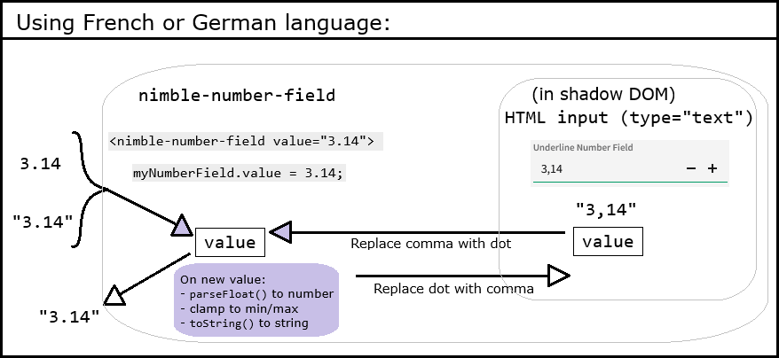

# Localized Decimal Separator

## Problem Statement

For supported languages (English, French, German, Japanese, Chinese), the
_decimal separator_ does not align with user expectations in French and German. For
example, `1000000.01`
[should](https://randombits.dev/articles/number-localization/locale-list) render
as `1000000,01` in German but currently renders as `1000000.01` across all
locales.

## Links To Relevant Work Items and Reference Material

[IxD Design/Requirements Document](IxD.md)

## Implementation / Design

This feature boils down to the following:

### 1. Input allows either `.` or `,`, based on the language

This is currently accomplished by the [handler](https://github.com/ni/fast/blob/53628f75d9ca8057483b1872223f72e7c74baa8a/packages/web-components/fast-foundation/src/number-field/number-field.ts#L342) for the [`input` event of the native `input` element](https://github.com/ni/nimble/blob/f662ebca86d7ece6972b3129f0bc091d9e3ccbe1/packages/nimble-components/src/number-field/template.ts#L38). It uses a regex to filter out disallowed characters. Typing, pasting, drag-dropping text all behave the same way, as they all trigger an `input` event.

In order to control which separator character gets filtered, we have to override `handleTextInput` (since the FAST implementation just hardcodes the regex pattern to filter out `,`). We could modify the function directly in `@ni/fast-foundation`, but I think we prefer to minimize divergence from the original FAST files.

To know which separator character to use, we will simply parse the primary language subtag out of the [BCP 47 language tag](https://developer.mozilla.org/en-US/docs/Glossary/BCP_47_language_tag) that dictates the number-field's language, and use `,` if it is `fr` or `de`, otherwise `.`. There are more robust ways to determine a separator character for a given language tag, but this simple approach is fast, easy, and sufficient.

### 2. Language is based on `lang` design token value for the `nimble-number-field` element

We just need to call `lang.getValueFor(<number-field element>)`, which gives us the effective locale identifier (e.g. "en-US", "fr", "de") for the element, whether it comes from the `lang` attribute of the document element, or from a containing `nimble-theme-provider`. We must evaluate this at connection time, as well as whenever the `lang` design token value changes.

### 3. Separator in UI updates when design token value changes

We will follow the same pattern established by the locale-sensitive table columns (e.g. `number-text`). Specifically, we will [create a `DesignTokenSubscriber` for the `lang` design token](https://github.com/ni/nimble/blob/f662ebca86d7ece6972b3129f0bc091d9e3ccbe1/packages/nimble-components/src/table-column/number-text/index.ts#L73), and [subscribe/unsubscribe the `nimble-number-field` to it upon connect/disconnect](https://github.com/ni/nimble/blob/f662ebca86d7ece6972b3129f0bc091d9e3ccbe1/packages/nimble-components/src/table-column/number-text/index.ts#L87). The handler will update the regex pattern used for filtering input, and it will update the inner `input`'s value by replacing `,` with `.` (or vice versa).

### 4. Value handling

The number-field and the inner `input` each have a `value` property. The number-field's `value` corresponds to the data value of the control, while the `input`'s `value` determines what is displayed in the UI. Until now, those two values have been the same, but that won't always be the case anymore. When the current language uses a comma separator, the number-field's value may be assigned a `number` or a string with _either_ a comma or dot separator. When the value is read back out, it will always be a string with a dot separator. This is consistent with the behavior of the HTML `input` with `type="number"`. The inner `input`'s `value` must always use a comma separator, since this is what is displayed to the user. Therefore, some conversions must be made when propagating values between the two `value` properties:

We can achieve this by overriding the FAST `NumberField`'s `handleTextInput()` method (which we already need to override to modify the regex character filter) and `valueChanged()` method. Because we will maintain the current invariant that the `nimble-text-field`'s `value` property always uses the dot separator, no other existing `NumberField` code needs to change.

### Other considerations

No documentation changes are needed.

As there are no API changes, there will be no changes to the Angular or Blazor packages.

The changes should have no impact on accessibility/ARIA, performance, or security.

### Testing

New unit test cases will be added that validate the above requirements. Specifically, we will have a test for each supported language (English, French, German, Japanese, and Chinese) that ensures only the expected separator can be used.

## Alternative Implementations / Designs

### HTML `input` with `number` type

The `nimble-number-field` internally uses an HTML `input` element with `type="text"` and makes it behave as a numeric input (e.g. input restrictions and range limit enforcement) via custom logic (in `@ni/fast-foundation`). An `input` with `type="number"` natively supports locale-aware decimal separators (to an extent), but there are significant limitations and quirks that make it unsuitable for our purposes:

- Inconsistent behavior across browsers:
    - In Chrome, the choice of decimal separator is based on the language of the _browser_, not the `lang` of the page, whereas in Firefox, it honors the `lang` of the page.
    - In Firefox, allows input of any characters (vs. limiting to only digits, `e`/`E`, `.`, `,`, `+`, and `-`)
- Even with French language/locale, for example, accepts user input of a dot (`.`) and treats it as a decimal separator (rather than a thousands separator). The dot remains even after the control loses focus. Upon incrementing the value, the dot is replaced with a comma.

    

- A number of other issues, listed [here](https://technology.blog.gov.uk/2020/02/24/why-the-gov-uk-design-system-team-changed-the-input-type-for-numbers/) as the reasons the GOV.UK Design System team switched to `type="text"` from `type="number"`

## Open Issues

None
