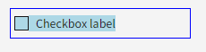
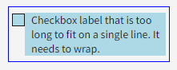
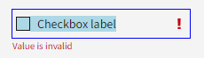
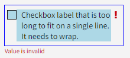
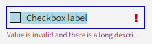
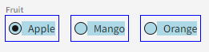
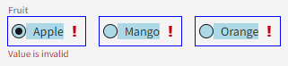
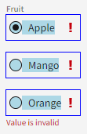
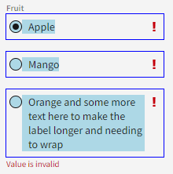
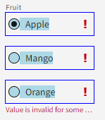

# Error State on Checkbox and Radio Group

## Overview

The `nimble-checkbox` and the `nimble-radio-group` need to have error states associated with them. Following the existing patterns within nimble, this error state will be a red exclamation mark icon next to the component and red error text below the component.

### Background

-   [Visual design spec](https://www.figma.com/design/PO9mFOu5BCl8aJvFchEeuN/Nimble_Components?node-id=1295-63148&node-type=canvas&t=sJ2Fhm1vLoZ4zpsK-0)
-   [Nimble issue 2018: Error state for nimble-checkbox](https://github.com/ni/nimble/issues/2018)
-   [Nimble issue 2019: Error state for nimble-radio-group](https://github.com/ni/nimble/issues/2019)

Related issues that can and/or should be resolved as part of this effort:

-   [Nimble issue 2091: nimble-checkbox has incorrect height](https://github.com/ni/nimble/issues/2091)
-   [Nimble issue 2090: Error icon is incorrectly spaced in nimble-text-field](https://github.com/ni/nimble/issues/2090)

## Design

Both the `nimble-checkbox` and the `nimble-radio-group` will be updated to be able to show an error associated with them.

At a high-level, the design of these components will be:

-   Red error text below the component
    -   The error text does not wrap
    -   It has an ellipsis if the text is longer than the control
    -   The `title` of the text is the full error string
-   Red error icon (`nimble-icon-exclamation-mark`) on the right side of the label with a 4px margin between the icon and the right edge of the control
-   Control indicator (checkbox square or radio circle) and error icon will both be center-aligned with the first line of label text, both when the label text wraps and when it fits on a single line.
-   Control indicator and label will both be interactable -- hovering over them will put the component in the "mouseover" state and clicking them will activate the control
-   The error icon along with the space between the label and the error icon will not be interactable

Below are some examples of how the components will look and behave with different configurations. The blue outline shows the bounds of the control, and the blue background indicates the interactable regions of the control.

### API

#### Checkbox

The `nimble-checkbox` will be updated to implement the `ErrorPattern` interface. This means it will have two new attributes:

-   `error-text` - string
-   `error-visible` - boolean

The `error-visible` boolean will control whether or not a red exclamation icon will be visible next to the checkbox label and whether or not the `error-text` is displayed below the checkbox label.

#### Radio Group

The `nimble-radio-group` will be updated to implement the `ErrorPattern` interface. This means it will have two new attributes:

-   `error-text` - string
-   `error-visible` - boolean

The `error-visible` boolean will control whether or not a red exclamation icon will be visible next to each radio label and whether or not the `error-text` is displayed below all the radio controls.

While `error-visible` will be a new public attribute on the `nimble-radio-group`, it will also be added as an internal attribute on the `nimble-radio`, which will be responsible for displaying the error icon next to its label when that attribute is set. The `nimble-radio-group` will be responsible for keeping the `error-visible` state of each child `nimble-radio` instance synchronized with its own `error-visible` state. It will do this by updating `error-visible` on each `nimble-radio` any time its own `error-visible` state changes or any time its slotted radios changes.

In order to accomplish these changes, the `nimble-radio-group` template and the `nimble-radio` template will both need to be forked from the FAST templates.

#### Framework Support

The Angular and Blazor wrappers for the `nimble-checkbox` and `nimble-radio-group` will be updated to include `error-text` and `error-visible`. The `nimble-radio` API will not be updated in Angular or Blazor to include `error-visible` since that is an internal attribute on the component.

### Additional Work

#### Checkbox and Radio styling updates

Both the `nimble-checkbox` and `nimble-radio` need styling updates to align them with the current visual designs. These components have very similar styling needs, so there is likely opportunity to move much of the styles into a shared pattern. This will be considered during implementation.

The styling changes include (but may not be limited to):

-   Updating the control height to respect the `controlHeight` token rather than being sized to the text and/or checked/selected indicator
-   Correct the layout of the control when the label wraps. This includes:
    -   Verifying the label wraps when the label is longer than the allocated space for the control
    -   Ensuring the checked/selected indicator is center aligned with the first line of text
-   Update `nimble-radio` when in a `nimble-radio-group` configured with `orientation = vertical` so that each `nimble-radio` element's width matches the configured `nimble-radio-group` width

#### Text field updates

The visual design of the `nimble-text-field` has been updated such that the error icon is 4px from the right edge of the control rather than 8px. There is already [a nimble issue](https://github.com/ni/nimble/issues/2090) for the spacing being incorrect on this control, so the work is already tracked. Ideally, this work would be done as part of the effort to add error states to the `nimble-checkbox` and `nimble-radio-group` so that the error icons are aligned across the controls when they are stacked.

## Open Issues

-   Does the spacing between the edge of the `nimble-text-area` and the error icon need to be updated?
