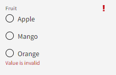
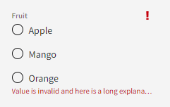
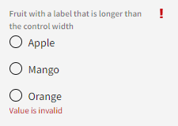
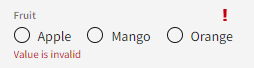

# Error State on Radio Group

## Overview

The `nimble-radio-group` needs to have an error state associated with it. The error state will be represented as an error icon in the label of the group and red error text below the group.

### Background

-   [Visual design spec](https://www.figma.com/design/PO9mFOu5BCl8aJvFchEeuN/Nimble_Components?node-id=1295-63148&node-type=canvas&t=sJ2Fhm1vLoZ4zpsK-0)
-   [Nimble issue 2019: Error state for nimble-radio-group](https://github.com/ni/nimble/issues/2019)

## Design

The `nimble-radio-group` will be updated to be able to show an error associated with it.

At a high-level, the design of the component will be:

-   Red error text below the component
    -   The error text does not wrap
    -   It has an ellipsis if the text is longer than the control
    -   The `title` of the text is the full error string
-   Red error icon (`nimble-icon-exclamation-mark`) on the right side of the group's control label with a 4px margin between the icon and the right edge of the control

Below are some examples of how the radio group will look with different configurations.

### API

The `nimble-radio-group` will be updated to implement the `ErrorPattern` interface. This means it will have two new attributes:

-   `error-text` - string
-   `error-visible` - boolean

The `error-visible` boolean will control whether or not a red exclamation icon will be visible and whether or not the `error-text` is displayed below the control.

#### Framework Support

The Angular and Blazor wrappers for the `nimble-radio-group` will be updated to include `error-text` and `error-visible`.

### Additional Work

#### Radio Group Styling Updates

The label of the `nimble-radio-group` needs minor styling updates as part of this update.

The styling changes include (but may not be limited to):

-   Updating the styling of the label to ensure it is respecting the line height of nimble's label font.
-   Adding a 4px margin between the label and the first radio option.

## Open Issues

_None_
