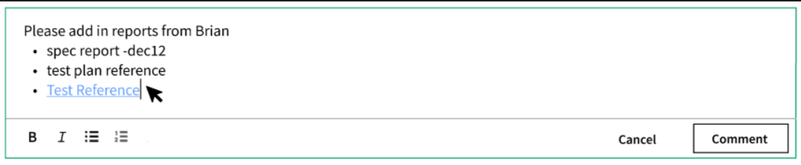
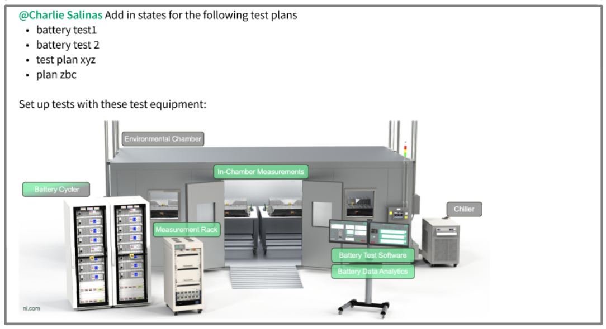
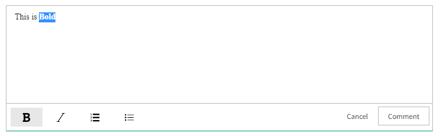

# Nimble Rich Text Editor and Nimble Rich Text Viewer

## Overview

-   The `nimble-rich-text-editor` component is a text editing tool that offers a comprehensive range of functionalities for
    incorporating rich text content. It provides users with the ability to apply different text styles and formats to their content.
-   The `nimble-rich-text-viewer` component is way to view all the rich text content.

### Background

Collaboration is a key requirement in order for users to adopt a tool at scale and would help improve overall customer satisfaction with the product.
The Comment Feature, designed for adding and viewing comments with rich text content, should be generic enough to be reused in several workflows.
Therefore, it is essential to develop web components that allow users to view and create rich text content, enabling their use in various scenarios,
including Comments and other instances that necessitate rich text capabilities.

[Nimble issue #1288](https://github.com/ni/nimble/issues/1288)

[Comments UI mockup](https://www.figma.com/file/Q5SU1OwrnD08keon3zObRX/SystemLink?type=design&node-id=6280-94045)

### Non-goals

-   The visual design and interaction design for these components are out of scope for the initial release. However we have an
    [IxD workflow](https://www.figma.com/file/Q5SU1OwrnD08keon3zObRX/SystemLink?type=design&node-id=6280-94045) for SLE application that we will rely
    on.
-   Blazor integration will be out of scope for this component as we have less or no experience in Blazor component development or other
    related technology. Blazor example app addition will also be not covered in this spec.
-   Adding an example Angular client application for this component may not be included in the initial releases. However, the integration
    of the rich-text-editor with Angular applications, achieved through a directive, will be developed following the completion of this
    component.

### Features

The `nimble-rich-text-editor` supports the basic text formatting options that includes:

1. Bold
2. Italics
3. Numbered List
4. Bulleted List

This component will also offer APIs and interactive methods to format texts in the following ways:

1. Using the buttons located below the editor to modify the text formatting for the selected texts.
2. Using the keyboard shortcuts to modify the text formatting in the editor.
3. Support to get markdown output from the editor.
4. Support to convert the markdown to HTML to render it back in the `nimble-rich-text-viewer` component.

#### _Additional features out of scope of this spec_

-   Allowing the user to tag or mention by entering `@` in the editor and selecting the user name from the drop-down list.
-   Support for adding images to the editor either by uploading or by pasting it.
-   Support for adding hyperlinks to the existing words in the editor. However, adding raw links by pasting to the editor is supported.
-   Support for striking out and underlining text. The reason for including these features in future scope that we utilize the
    [prosemirror-markdown](https://github.com/ProseMirror/prosemirror-markdown) serializer and parser to convert the text into markdown format and vice
    versa. However, the supported functionality of prosemirror-markdown, as mentioned in their
    [documentation](https://github.com/ProseMirror/prosemirror-markdown#documentation), does not include support for strikeout and underline. To
    address this limitation, we need to extend the class and add the necessary nodes to both the serializer and parser which will be added in the
    subsequent releases.
-   Provide APIs to configure visibility/disabled state of toolbar buttons for rich text editor.

### Risks and Challenges

-   Visual design and interaction design for both the components are out of scope for the initial release. We will start with the existing
    [mockup screens](https://www.figma.com/file/Q5SU1OwrnD08keon3zObRX/SystemLink?type=design&node-id=6280-94045) which is designed for
    comments feature considering customer requirements and deadlines. At this moment, we cannot afford to cover all the corner cases of visual design
    specs. However we are organically referring to existing nimble components like `button`, `text-area` to provide a consistent visual design.
-   Due to immediate requirements for comments feature from a business customer, any additional enhancements or requirements apart from whatever is mentioned
    in this spec are deferred to future scope.
-   The mobile view of the component has not been designed yet, and we are actively collaborating with the design team to create basic mockup screens. We will
    update this spec accordingly based on the progress.

### Prior Art/Examples

Sample Mockup Screenshots

_`nimble-rich-text-editor`_



_`nimble-rich-text-viewer`_



## Design

_nimble-rich-text-editor_

The `nimble-rich-text-editor` will be divided into two sections namely an `editor` section and a `footer` section.

1. `editor` section is the actual text area to add or update rich text contents.
2. `footer` section consists of `nimble-button` to control each text formatting functionalities like bold, italic etc,. and a
   `footer-actions` slot element which is typically used to add action buttons to the right bottom of the component.

Here is the shadow DOM template used in `nimble-rich-text-editor` component:

```html
<template>
    <section id="editor"></section>
    <footer>
        <section id="toolbar">
            <nimble-button></nimble-button>
        </section>
        <section id="actions">
            <slot name="footer-actions"></slot>
        </section>
    </footer>
</template>
```

An example usage of the `nimble-rich-text-editor` in the application layer is as follows:

```html
<nimble-rich-text-editor>
    <div slot="footer-actions">
        <nimble-button>Cancel</nimble-button>
        <nimble-button>Add Comment</nimble-button>
    </div>
</nimble-rich-text-editor>
```

_nimble-rich-text-viewer_

The `nimble-rich-text-viewer` is used for viewing rich text content when markdown string is passed to it. It performs the post-processing
tasks to convert the markdown string to corresponding HTML nodes for each text formatting.

### `nimble-rich-text-editor`

### API

_Props/Attrs_

-   none

_Methods_

-   `setMarkdown()` - sets the markdown input from the consumer component which can be used for preloading the content.
-   `getMarkdown()` - gets the processed markdown output from the component.

_Events_

-   `change` - event emitted when there is a change in the the editor. This can be achieved through tiptap's
    [update event](https://tiptap.dev/api/events#update). Below is a scenarios of event triggers for the update event, indicating when they do and do not
    occur:
    1.  Event triggered when there is a change in the content of the editor like adding, deleting, updating or formatting the text.
    2.  Event will not triggered when there are no change made to the content of the editor. For example, all mouse events, selecting the texts, state changes etc,.

_CSS Classes and CSS Custom Properties that affect the component_

-   none

### Anatomy

_Slot Names_

-   `footer-actions`:
    1. It is a container that allows a client to easily place buttons at the right bottom of the component to interact with the editor.
    2. If no content is slotted in the footer-actions, the element will be emptied and shrunk to accommodate buttons from the
       toolbar.
    3. If content is slotted in the footer-actions, it will occupy a maximum of thirty percent of the entire horizontal footer. If
       there are additional elements beyond this limit, they will be positioned below within the same footer-actions container.

_Note_: The positioning of these slot elements in the mobile view of the component has not yet been confirmed.

_Host Classes_

-   none

_Slotted Content/Slotted Classes_

-   none

_CSS Parts_

-   none

### `nimble-rich-text-viewer`

### API

_Props/Attrs_

-   `markdown-value`: string - markdown input to the component to render it in the text viewer.

_Methods_

-   none

_Events_

-   none

_CSS Classes and CSS Custom Properties that affect the component_

-   none

### Anatomy

_Slot Names_

-   none

_Host Classes_

-   none

_Slotted Content/Slotted Classes_

-   none

_CSS Parts_

-   none

### Angular integration

An Angular directive will be created for both components. The components will not have form association, so a `ControlValueAccessor` will
not be created.

### Blazor integration

A Blazor wrapper will not be created for these components.

### Visual Appearance

NA

## Implementation

We have chosen to utilize the [Tiptap](https://tiptap.dev/) rich text editor as the underlying third-party library for developing the
`nimble-rich-text-editor`. This decision was made due to its extensive range of customization options compared to other third-party libraries for rich text editing, making it the ideal choice for meeting our specific use cases. Some of the mentioned use cases are outlined below:

1. Includes all [basic functionalities](https://tiptap.dev/) like bold, italics, numbered and bulleted lists etc.
2. Includes support to work seamlessly inside the `shadow root`.
3. [Tiptap](https://tiptap.dev/introduction) is built on top of ProseMirror and so have access to all the powerful APIs provided by
   ProseMirror through [`@tiptap/pm`](https://tiptap.dev/guide/prosemirror).
4. Includes support to render the content of the editor with markdown input.
5. Includes support to retrieve the content of the editor as HTML and Markdown output (using
   [prosemirror-markdown](https://github.com/ProseMirror/prosemirror-markdown)).
6. Includes extensions to support [@mention](https://tiptap.dev/api/nodes/mention) functionality (Future scope).

The `nimble-rich-text-editor` is initialized by creating an instance of the [Editor](https://tiptap.dev/api/editor#introduction) class from
the Tiptap's core library. With that we have access to all the APIs exposed, by utilizing some of their extensions like
[StarterKit](https://tiptap.dev/api/extensions/starter-kit) which is a collection of most popular Tiptap extensions includes bold, italics
and all other basic rich text formatting options. All these formatting options can also be accessed individually through tiptap's
[marks](https://tiptap.dev/api/marks) and [nodes](https://tiptap.dev/api/nodes).

-   The term `Marks` in the tiptap are formatting styles applied to specific portions of text, such as bold, italic, or underlined.
-   `Nodes` in the tiptap editor are the building blocks of the document structure, representing different types of content elements like paragraphs,
    headings, lists, images, and more.

The rich text content entered in the editor is converted to markdown output using
[prosemirror-markdown](https://github.com/ProseMirror/prosemirror-markdown) serializer. Here is the reference for the supported formatting schema in the
markdown based on [CommonMark](http://commonmark.org/) format:

-   Bold - `**Bold**`
-   Italics - `*Italics*`
-   Numbered list - `1. Numbered list`
-   Bulleted list - `* Bulleted list`

The `nimble-rich-text-viewer` will be responsible for converting the input markdown string to HTML Fragments with the help of
`prosemirror-markdown` parser, which is then converted to HTML string and rendered into the component to view all rich text content.

### Prototype

[`Tiptap prototype in Stackblitz`](https://stackblitz.com/edit/typescript-g3yfmo?file=index.ts)

The prototype includes the below functionalities,

1. Basic formatting support.
2. Image support. - The prototype includes [`Tiptap Extension`](https://tiptap.dev/api/nodes/image) to support images.
3. `@mention` support. - The prototype includes default user list that gets triggered using `@` character.
4. Markdown support. - The prototype includes support to render/retrieve content in markdown format.
5. `Shadow root` support - The prototype uses [Microsoft Fast](https://github.com/microsoft/fast) to create the rich text editor as a
   custom component that renders in the shadow root.
6. `Top layer` support - Hyperlink using `nimble-dialog` which renders the popup in top layer.

**_Note_**: This prototype is not made in a responsive fashion for smaller screens and is intended only for testing the specific functionalities listed
above.

### States

_Button State_

The buttons in the toolbar will indicate the formatting status of the selected text in the editor. For example, if the text in the editor
is bold and the cursor is placed on the text, the bold button will be indicated as a active state. The active state is indicated as `block`
appearance of the [`nimble-button`](https://nimble.ni.dev/storybook/?path=/docs/button--docs) and inactive state is in `ghost`
appearance. Refer the below sample screenshot with active bold state.



### Accessibility

[Tiptap Accessibility](https://tiptap.dev/guide/accessibility)

_Focus_

-   Focus state of the editor will be the same as the `nimble-text-area`.
-   Focus state of the buttons will be the same as the `nimble-button`.

_Keyboard accessibility and shortcuts for text formatting_

All the basic keyboard accessibility for the tiptap rich text editor is mentioned in their
[keyboard shortcut](https://tiptap.dev/api/keyboard-shortcuts#predefined-keyboard-shortcuts) page. To facilitate easy access, listed down
the supported text formatting keyboard shortcuts in the tiptap editor.

| Key                     | Behavior                                                 |
| ----------------------- | -------------------------------------------------------- |
| Tab                     | To reach the editor                                      |
| Shift + Arrow keys      | To select the group of texts in the editor               |
| Ctrl + B                | To make the selected text bold                           |
| Ctrl + I                | To make the selected text italic                         |
| Ctrl + Shift + 7        | To enable the focused paragraph a numbered list          |
| Ctrl + Shift + 8        | To enable the focused paragraph a bulleted list          |
| Tab (For lists)         | To create a sub point within a bulleted or numbered list |
| Shift + Tab (For lists) | To remove a sub point from a bulleted or numbered lists  |

_Keyboard navigation with toolbar buttons focused_

| Key          | Behavior                                                                       |
| ------------ | ------------------------------------------------------------------------------ |
| Space, Enter | Enable the selected text formatting feature and return the focus to the editor |
| Shift + Tab  | To reach the editor back to focus                                              |

_Note_: All other keyboard interaction determined by the slotted element will not be defined in this document.

### Globalization

Currently, this component does not have any string data to be localized. In the footer menu for text formatting, only icons will be displayed. However,
strings may be used for tooltips to enable localization, which will be managed through the `nimble-tooltip` component.

### Security

-   Prose mirror uses markdown-it for converting markdown to HTML and HTML to markdown. We will follow the
    [security guidelines of markdown-it](https://github.com/markdown-it/markdown-it/blob/master/docs/security.md#security) to turn
    off HTML at source as given in the [API docs](https://markdown-it.github.io/markdown-it/#MarkdownIt.new). Prosemirror-markdown follows the same as shown in this
    [specific line of code](https://github.com/ProseMirror/prosemirror-markdown/blob/26e58302399b7d9a9b3bc8fc3bf5807627ca29e5/src/from_markdown.ts#L245).
-   For additional safety, using [sanitize-html](https://www.npmjs.com/package/sanitize-html) package to whitelist only specific html
    tags on need basis or completely disallow any html tags.

### Performance

Performance of tiptap explained in an example of having [long texts](https://tiptap.dev/examples/book).

### Dependencies

This component is dependent on the [`tiptap`](https://tiptap.dev/) third party library. As mentioned,
[tiptap](https://tiptap.dev/introduction#why-should-i-use-tiptap) is built on top of prosemirror, we might also use some of the prosemirror's
library. For the currently supported features, we will include the following libraries that will be added to the packages.json

-   @tiptap/core
-   @tiptap/pm
-   @tiptap/starter-kit

**_Note_**: For markdown parser and serializer, [prosemirror-markdown](https://github.com/ProseMirror/prosemirror-markdown) internal dependencies will be installed along with this.

### Test Plan

The current testing plan involves writing unit tests to verify the core functionality of the component. All tests for this component will
follow the standards set by the nimble repository, which include unit tests to assess component logic and Chromatic tests to cover all
visual states of the component.

### Tooling

NA

### Documentation

As with other nimble components, a story will be added in storybook for the new component. Relevant documentation will be added there.

---

## Open Issues

-   none
