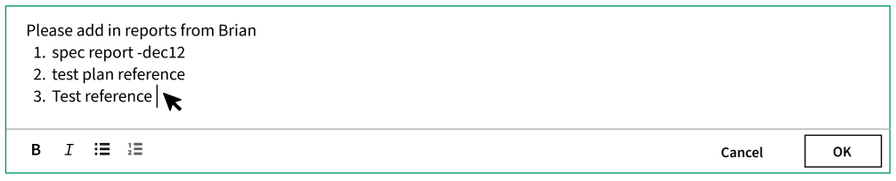
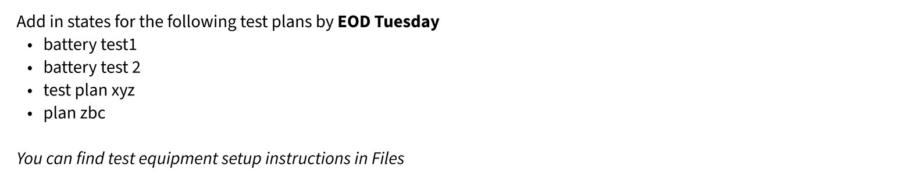
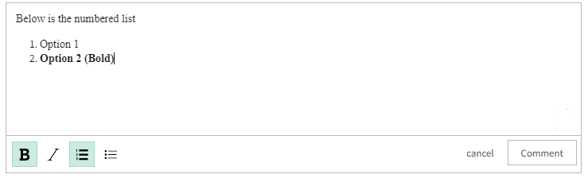
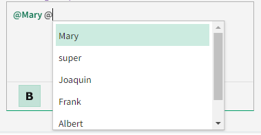

# Nimble Rich Text Editor and Nimble Rich Text Viewer

## Overview

-   The `nimble-rich-text-editor` component is a text editing tool that offers a comprehensive range of functionalities for
    incorporating rich text content. It provides users with the ability to apply different text styles and formats to their content.
-   The `nimble-rich-text-viewer` component is a way to view all the rich text content.

### Background

Collaboration is a key requirement in order for users to adopt a tool at scale and would help improve overall customer satisfaction with the product.
The Comment Feature, designed for adding and viewing comments with rich text content, should be generic enough to be reused in several workflows.
Therefore, it is essential to develop web components that allow users to view and create rich text content, enabling their use in various scenarios,
including Comments and other instances that necessitate rich text capabilities.

_Rich Text Components_:

1. [Nimble issue #1288](https://github.com/ni/nimble/issues/1288)
2. [Rich Text Editor FE Library Decision](https://dev.azure.com/ni/DevCentral/_git/Skyline?path=/docs/design-documents/Platform/Comments/Comments-FE-Library-Decision.md&version=GBmaster&_a=preview)

_Comments Feature in SLE_:

1. [Comments Feature](https://dev.azure.com/ni/DevCentral/_backlogs/backlog/ASW%20SystemLink%20Platform/Initiatives/?workitem=2205215)
2. Comments UI mockups - [Desktop view](https://www.figma.com/file/Q5SU1OwrnD08keon3zObRX/SystemLink?type=design&node-id=6280-94045&mode=design&t=aC5VQw42BYcOesm2-0) and [Mobile view](https://www.figma.com/file/Q5SU1OwrnD08keon3zObRX/SystemLink?type=design&node-id=7258-115224&mode=design&t=aC5VQw42BYcOesm2-0)
3. [Comments `@mention` mockup](https://www.figma.com/file/Q5SU1OwrnD08keon3zObRX/SystemLink-orig?type=design&node-id=7248-114254&mode=design&t=y3JtM3aT77Aw0xjK-0)
4. [Mention users in comments - Requirement doc](https://dev.azure.com/ni/DevCentral/_git/Skyline?path=/docs/design-documents/Platform/Requirements/Mention-users-in-comments.md&_a=preview)

### Non-goals

-   Blazor integration will be initially out of scope for this component as we have no experience in Blazor component development or other
    related technology. Blazor example app addition will also be not covered in this spec.

### Features

Both components provide support for the following basic text formatting options:

1. Bold
2. Italics
3. Numbered List
4. Bulleted List
5. Absolute URL links
    1. Supports only [absolute URI as per common mark spec](https://spec.commonmark.org/0.30/#absolute-uri) with valid [schemes](https://spec.commonmark.org/0.30/#scheme).
    2. In the initial release, we will provide support for `HTTP` and `HTTPS` schemes only. Depending on future requirements, we may extend support to include other schemes as well. To summarize:
        1. Supports `<https://www.ni.com>` as a valid markdown syntax for an absolute link
        2. Any other syntaxes like `https://www.ni.com` and `[NI Homepage](https://www.ni.com)` will not be supported for initial release
    3. [Tiptap's link extension](https://tiptap.dev/api/marks/link) provides various configurations to
       [add/remove HTML attributes](https://tiptap.dev/api/marks/link#removing-and-overriding-existing-html-attributes) for links,
       [validate](https://tiptap.dev/api/marks/link#validate) URLs entered or pasted into the editor and more.
6. Allow the user to tag or mention someone by entering **"@"** in the editor and selecting the user's name from the drop-down list.

The `nimble-rich-text-editor` component will also offer APIs and interactive methods to format text in the following ways:

1. Using the buttons located below the editor to modify the text formatting for the selected texts.
2. Using the keyboard shortcuts to modify the text formatting in the editor.
3. The underlying representation of the editor is a markdown value in the flavor of [CommonMark](http://commonmark.org/).
4. Support to get and set markdown value through an API.

The `nimble-rich-text-viewer` provides support for converting the input markdown value to HTML in order to render it in the viewer component.

#### _Additional features out of scope of this spec_

-   Support for adding images to the editor either by uploading or by pasting it.
-   Support for adding hyperlinks to the existing text in the editor. This allows users to add links to existing text in the editor. When the
    link button in the formatting options is clicked, a dialog opens, providing a space to enter the hyperlink for the selected text.
-   Support for [striking out](https://tiptap.dev/api/marks/strike) and [underlining](https://tiptap.dev/api/marks/underline) text. We use the
    [prosemirror-markdown](https://github.com/ProseMirror/prosemirror-markdown) serializer and parser to convert the text into markdown format and vice
    versa. However, the supported functionality of prosemirror-markdown, as mentioned in their
    [documentation](https://github.com/ProseMirror/prosemirror-markdown#documentation), does not include support for a strikeout and underline. To
    address this limitation, we need to extend the class and add the necessary nodes to both the serializer and parser which will be added in the
    subsequent releases.
-   Provide APIs to configure visibility/disabled state of toolbar buttons for a rich text editor.

### Risks and Challenges

-   Due to immediate requirements for comments feature from a business customer, any additional enhancements or requirements apart from whatever is
    mentioned in this spec are deferred to future scope.
-   Currently, we will begin by referring to the existing
    [Interaction design workflow](https://www.figma.com/file/Q5SU1OwrnD08keon3zObRX/SystemLink?type=design&node-id=6280-94045&mode=design&t=aC5VQw42BYcOesm2-0)
    of the comments feature. Once the visual design for these components is complete, we will then be implementing those specific changes within the defined
    scope of development. However, we will still make use of existing nimble components such as `nimble-toggle-button` and `nimble-text-area` to maintain a
    consistent design for the initial release.

### Prior Art/Examples

Sample Mockup Screenshots

_`nimble-rich-text-editor`_



_`nimble-rich-text-viewer`_



## Design

### `nimble-rich-text-editor`

The `nimble-rich-text-editor` will be divided into two sections namely an `editor` section and a `footer` section.

1. The `editor` section is the actual text area to add or update rich text content. It also utilizes the default slot element, which contains the
   list of options in `nimble-list-option`, for displaying the drop-down list for `@mention` in the editor.
2. The `footer` section consists of `nimble-toggle-button` to control each text formatting functionalities like bold, italic, etc, and a
   `footer-actions` slot element which is typically used to add action buttons to the right bottom of the component.

Example usage of the `nimble-rich-text-editor` in the application layer is as follows:

```html
<nimble-rich-text-editor>
    <nimble-button slot="footer-actions">Cancel</nimble-button>
    <nimble-button slot="footer-actions">Add Comment</nimble-button>

    <!-- Options to be displayed in the editor when "@" symbol is added -->
    <nimble-list-option value="mary">Mary</nimble-list-option>
    <nimble-list-option value="sue">Sue</nimble-list-option>
    <nimble-list-option value="frank">Frank</nimble-list-option>
    <nimble-list-option value="albert">Albert</nimble-list-option>
</nimble-rich-text-editor>
```

### API

_Props/Attrs_

-   `empty` - is a read-only property that indicates whether the editor is empty or not. This will be achieved by retrieving the current text
    content from the editor and calculating its length. The component and the Angular directive will have a getter method
    that can be used to bind it in the Angular application.
-   `fit-to-content` - is a boolean attribute allows the text area to expand vertically to fit the content.
-   `placeholder` - is a string attribute to include a placeholder text for the editor when it is empty. This text is passed as plain text (not markdown)
    to a component. This can be achieved through Tiptap's [Placeholder extension](https://tiptap.dev/api/extensions/placeholder).
    We can customize the styling of placeholder text with our own styles using Prosemirror's class as given in the provided link.
-   `footer-hidden` - is a boolean attribute that, when enabled, hides the footer section, which includes all formatting options and the `footer-actions` slot.
-   `disabled` - is a boolean attribute to disable the editor by preventing all user interactions within the component. When the component is
    disabled, the editor's border and font color will resemble that of the disabled state of `nimble-text-area`, and the `nimble-toolbar` and `nimble-toggle-button`
    will have their disabled attribute set to true. However, the behavior of the `footer-actions` slotted content will be handled
    by the client according to their specific requirements and will not be affected by this attribute.
-   `error-visible` - is a boolean attribute used to visually change the component's border color with the error exclamation at the top right, indicating that an error has occurred, as per the current
    [visual design](https://www.figma.com/file/PO9mFOu5BCl8aJvFchEeuN/Nimble_Components?type=design&node-id=2482-82389&mode=design&t=KwADu9QRoL7QAuIW-0)
-   `error-text` - is a string attribute that displays the error text at the bottom of the component when the `error-visible` is enabled.

_Methods_

-   `getMarkdown()` - this will serialize the content by extracting the Node from the editor and return the converted markdown string
    [prosemirror-markdown serializer](https://github.com/ProseMirror/prosemirror-markdown/blob/9049cd1ec20540d70352f8a3e8736fb0d1f9ce1b/src/to_markdown.ts#L30).
-   `setMarkdown(value)` - this will parse the input markdown string into a Node and load it back into the editor using
    [prosemirror-markdown parser](https://github.com/ProseMirror/prosemirror-markdown/blob/9049cd1ec20540d70352f8a3e8736fb0d1f9ce1b/src/from_markdown.ts#L199).

_Alternatives_

_maxlength_

The purpose of exposing the `maxlength` attribute for the editor is to restrict user input characters (visible characters, not considering markdown output) to a specific limit, similar to the `nimble-text-area`. Our specific use case is in the comments feature, where we aim to limit users to adding only 10K characters for a single comment. By implementing the `maxlength` attribute, we can enforce this restriction in the UI, preventing users from exceeding the character limit. However, we won't be directly checking the visible characters in the backend, instead we will validate the markdown string. This approach may potentially conflict with the general nimble component. To handle this, we plan to validate at the application layer. Once we receive the markdown output from the editor, we will check its length and ensure it stays within the supported limit. If it exceeds the maximum characters allowed, we will display an error message using the `error-label` and `error-text` attributes.

Another reason for considering the `maxlength` attribute is to prevent any potential performance issues, such as UI freezing, when a large number of characters are added to the editor. According to Tiptap, the editor's performance remains acceptable with more than [200K visible characters](https://tiptap.dev/examples/book). However, we recognize that simply restricting characters may not be the most effective approach to improve the rich-text-editor's performance. As an alternative solution, we are evaluating the possibility of pre-processing large insertions in a web worker. This would prevent blocking the main thread and make it a cancellable operation, potentially improving overall performance.

Due to these considerations, we have decided to defer the implementation of the `maxlength` attribute for now, focus on exploring other performance-enhancing options in the future.

_Decision on choosing `markdown` as methods_:

We thought of choosing either `markdown` as `accessor` or `methods` because converting the rich text content entered in the editor to a markdown string is an expensive
operation and not wanted to trigger it as an event for every change in the editor or as a property to enable two-way data binding for the client application.

Accessor provides a property-like syntax for clients, enabling one-way data binding and simplifying the syntax.
This allows clients to retrieve the `markdown` representation only when necessary, rather than for every single change. For a example use case, when the user
completes entering the entire content in the editor and clicks a button, the client can access the `markdown` output only once. This way the
application's performance is enhanced as the operation is performed only once, thus eliminating unnecessary reading of an accessor.

However, in frameworks like Angular, using `markdown` as a data binding may lead to a situation where the `setter` is not called if the value remains unchanged. This can become
problematic when attempting to clear the editor's content by setting the markdown value to an empty string, as it won't trigger the desired behavior if the markdown value is already
empty and hasn't undergone processing. To overcome this issue, utilizing `methods` could offer a potential solution, allowing the content to be set regardless of whether it has
changed from its previous value.

_empty_

We considered utilizing Tiptap's [isEmpty](https://tiptap.dev/api/editor#is-empty) API to determine whether the editor is empty. However, this API
does not return true if the editor only consists of whitespace. In the context of the comments feature, this property is exposed to find out the
editor's empty state, even when it contains only whitespace. This is necessary because the Backend service for comments does not permit the
creation of comments comprised of just whitespace. Consequently, by using this property, we should disable the `OK` button when the editor is
empty. To achieve this, we retrieve the current text content value, trim the string, and return true if its length is zero.

_Events_

-   `input` - event emitted when there is a change in the editor. This can be achieved through Tiptap's [update event](https://tiptap.dev/api/events#update).
    Below are a few scenarios to understand when this event will fire:

    1. This event will fired for every input in the content of the editor, including text inputs, text formatting changes, and text removals.
    2. This event will not fire when there are no changes made to the content of the editor. For example, all mouse events, selecting the texts, state
       changes, etc,

_CSS Classes and CSS Custom Properties that affect the component_

-   The minimum height of the component will be set to show at least one line in the text area along with a footer section. If the content exceeds
    the current height (set by the client), a vertical scrollbar will appear, allowing users to view the hidden content.
-   The minimum width of the component will be determined based on ensuring all buttons in the footer are visible. We have arrived to this decision
    to align with the minimal requirement for the initial release. However, adjustments will be made later based on the visual design for mobile view is complete.
-   The content in the text area will adjust its layout based on the width, potentially increasing the height of the editor. But in case of having
    a long nested lists that is beyond the current width (set by the client), a horizontal scrollbar will appear within the text area to view the content.
    If the `fitToContent` enabled, the text area will grow to fit the entered content in the editor section.
-   The client will determine the maximum height and width of the component. When the client does not override sizing, the component will have a default height and width.
-   The `formatting toolbar` in the footer section will occupy space based on the number of formatting buttons used. For the initial scope of this
    component, four formatting buttons will be included, following standard size and spacing guidelines. The `footer-actions` section will occupy the remaining
    space in the footer.
-   The footer section, which includes the formatting options, can be hidden by utilizing the `footer-hidden` attribute. When this attribute is
    enabled, the footer's visibility will be set to hidden, leaving an empty space in its place. We came to this decision to ensure that the
    component does not cause layout height shifts when the `footer-hidden` attribute changes dynamically based on conditions in the consumer
    component.
-   An example use case for the `footer-hidden` functionality is:
    The client can initially set `footer-hidden` to true. Upon focusing the editor using the element's `focus` event, the client can then set
    `footer-hidden` to false, thereby displaying the footer section. Conversely, when the editor loses focus using the element's `blur` or any
    click event occurs (`cancel` button click), the client can reset `footer-hidden` to true, consequently hiding the footer section once again.

_Note_: This initial component design serves as a starting point for implementation, and it may undergo changes once the visual design is completed.

### Anatomy

_Shadow DOM template_

```html
<template>
    <section id="editor"></section>
    <footer>
        <section id="toolbar">
            <nimble-toolbar>
                <nimble-toggle-button></nimble-toggle-button>
            </nimble-toolbar>
            <slot name="footer-actions"></slot>
        </section>
    </footer>
    <nimble-anchored-region>
        <div>
            <slot></slot>
        </div>
    </nimble-anchored-region>
</template>
```

_Slot Names_

-   _default_:

    1. The list of options within `nimble-list-option` will be used for `@mentions` in the editor.
    2. The `nimble-anchored-region` will be used to populate the list of options below at the position where the
       **"@"** symbol entered into the editor.

-   `footer-actions`:
    1. It is a container that allows a client to easily place buttons at the right bottom of the component to interact with the editor.
    2. If no content is slotted in the `footer-actions`, the element will be emptied and shrunk to accommodate buttons from the
       toolbar.
    3. If the content is slotted in the footer-actions, it will occupy a maximum of thirty percent of the entire horizontal footer. If
       there are additional elements beyond this limit, they will be positioned below within the same footer-actions container.

_Note_: The positioning of these slot elements in the mobile view of the component has not yet been confirmed.

_Alternative Slot Elements for `@mention`_:

-   `mention-menu`:
    1. The `nimble-menu` will be used to display the list of options when the user enters **"@"** into the editor.
    2. The users list to be displayed in the `@mention` dropdown menu will be in the `nimble-menu-item` with the user name in the
       actual `text content` and user ID in the `id` of each menu item. If the `id` is not provided by the client application,
       then the `text content` of the item is considered as an `id`.
    3. The same `nimble-anchored-region` will be used to populate the list of options below at the position where the
       **"@"** symbol entered into the editor.

Example usage of the `nimble-menu` slot element in the client application:

```html
<nimble-rich-text-editor>
    <!-- Options to be displayed in the editor when "@" symbol is added -->
    <nimble-menu slot="mention-menu">
        <nimble-menu-item value="mary">Mary</nimble-menu-item>
        <nimble-menu-item value="sue">Sue</nimble-menu-item>
        <nimble-menu-item value="frank">Frank</nimble-menu-item>
        <nimble-menu-item value="albert">Albert</nimble-menu-item>
    </nimble-menu>
</nimble-rich-text-editor>
```

_Note_: The method described above has not been prototyped yet, and not sure of its working advantages and disadvantages in comparison
to the current implementation.

_Host Classes_

-   none

_Slotted Content/Slotted Classes_

-   none

_CSS Parts_

-   none

### `nimble-rich-text-viewer`

The `nimble-rich-text-viewer` is used for viewing rich text content when a markdown string is passed to it. It performs the post-processing
tasks to convert the markdown string to corresponding HTML nodes for each text formatting.

### API

_Props/Attrs_

-   `markdown` - for retrieving and modifying the markdown value. If the client modifies the markdown value, it will be parsed into a Node using the
    [prosemirror-markdown parser](https://github.com/ProseMirror/prosemirror-markdown/blob/9049cd1ec20540d70352f8a3e8736fb0d1f9ce1b/src/from_markdown.ts#L199).
    The parsed node will then be rendered in the viewer component as rich text.

_Methods_

-   none

_Events_

-   none

_CSS Classes and CSS Custom Properties that affect the component_

-   The sizing behavior of the component will remain same as the editor component. The height of the component will grow to fit the content if
    there is no height restrictions from the consumer. If there is any height set by the consumer, the vertical scrollbar will be
    enabled when there is overflow of content in the component.
-   The width of the component will be determined by the client. Reducing the width will cause the content to reflow, resulting in an increased height
    of the component or will enable the vertical scrollbar.

### Anatomy

_Slot Names_

-   _default_: The list of options that is in `nimble-list-option` will be considered for the `@mention` in the viewer.

_Host Classes_

-   none

_Slotted Content/Slotted Classes_

-   none

_CSS Parts_

-   none

### Angular integration

An Angular directive will be created for both components. Input and accessor APIs will be created for the attributes and properties and output event
emitters will be created for the events, similar to how it's done in other directives. The components will not have form
association, so a `ControlValueAccessor` will not be created.

_Future enhancements:_

1. Support for intelligent behavior of links which includes configurations for opening in the same tab, new tab, indications for external links, etc. based on [Accessibility Guidelines](#accessibility)
2. An Angular router integration will be implemented for the same domain internal `links` in the viewer. This integration will help avoid loading a whole page when the linked page is also part of the same application.
   Instead of a full page reload, the Angular router integration is expected to enable the rendering of components only on the activated route relative to the existing route, making the user experience smoother while keeping the background work on the lower side.

### Blazor integration

A Blazor wrapper is initially out of scope for these components.

### Visual Appearance

Visual design has been requested is currently still pending.

## Implementation

We have chosen to utilize the [Tiptap](https://tiptap.dev/) rich text editor as the underlying third-party library for developing the
`nimble-rich-text-editor`. This decision was made due to its extensive range of customization options compared to other third-party libraries for rich
text editing, making it the ideal choice for meeting our specific use cases. For more details, refer
[Comments FE Library Decision](https://dev.azure.com/ni/DevCentral/_git/Skyline?path=/docs/design-documents/Platform/Comments/Comments-FE-Library-Decision.md&version=GBmaster&_a=preview)
document. Some of the highlighted points are mentioned below:

1. Includes all [basic functionalities](https://tiptap.dev/) like bold, italics, numbered and bulleted lists, etc.
2. Includes support to work seamlessly inside the `shadow root`.
3. [Tiptap](https://tiptap.dev/introduction) is built on top of ProseMirror and so has access to all the powerful APIs provided by
   ProseMirror through [`@tiptap/pm`](https://tiptap.dev/guide/prosemirror).
4. Includes support to render the content of the editor with markdown input.
5. Includes support to retrieve the content of the editor as HTML and Markdown output (using
   [prosemirror-markdown](https://github.com/ProseMirror/prosemirror-markdown)).
6. Includes extensions to support [@mention](https://tiptap.dev/api/nodes/mention) functionality.

The `nimble-rich-text-editor` is initialized by creating an instance of the [Editor](https://tiptap.dev/api/editor#introduction) class from Tiptap's core
library. With that, we have access to all the APIs exposed, by utilizing some of their extensions like
[StarterKit](https://tiptap.dev/api/extensions/starter-kit) which is a collection of the most popular Tiptap extensions including bold, italics, and all
other basic rich text formatting options. All these formatting options can also be accessed individually through Tiptap's
[marks](https://tiptap.dev/api/marks) and [nodes](https://tiptap.dev/api/nodes).

-   The term `Marks` in the Tiptap are formatting styles applied to specific portions of text, such as bold, italic, or underlined.
-   `Nodes` in the Tiptap editor are the building blocks of the document structure, representing different types of content elements like paragraphs,
    headings, lists, images, and more.

The rich text content entered in the editor is converted to markdown output using
[prosemirror-markdown](https://github.com/ProseMirror/prosemirror-markdown) serializer. Here is the reference for the supported formatting schema in the
markdown based on [CommonMark](http://commonmark.org/) flavor:

-   Bold - `**Bold**`
-   Italics - `*Italics*`
-   Numbered list - `1. Numbered list`
-   Bulleted list - `* Bulleted list`
-   Absolute URL links - `<Absolute URI link>` (For more details on the markdown syntax for absolute URL links, see [Autolinks in CommonMark](https://spec.commonmark.org/0.30/#autolink))
-   Hard line break - a backslash before the line ending `line1\\nline2` (For more details on the markdown syntax for Hard line breaks, see [Hard line breaks in CommanMark](https://spec.commonmark.org/0.30/#hard-line-breaks))
-   `@mention` - a custom markdown format `@<user-id>`. Since there is no built-in syntax for mentioning or tagging users or individuals
    using the **"@"** symbol in the [CommonMark](https://spec.commonmark.org/0.30/) flavor, we have decided to create a custom markdown format.
    Here are the justifications for incorporating `@<user-id>` syntax for `@mention`,
    1. This markdown syntax is distinctive and does not interfere with other formatting options in the
       [CommonMark](https://spec.commonmark.org/0.30/) flavor.
    2. This syntax ensures the easy identification of a `mention` node using the **"@"** and **"<"** symbols when parsing the entire markdown string.
    3. The use of opening and closing **"<"** and **">"** symbols specifies the boundaries of the mention node's value within the markdown string,
       allowing for the clear identification of where it starts and ends. This is especially important when the value contains whitespace,
       as in the example `"@<Sue Ann>`, as without the **"<>"** symbols, it would be challenging to determine the precise end index of the value.

### _Implementation details for supporting `@mention`_:

After passing the names through the slot using either `nimble-list-option` or an element with `role="option"` they will appear in a
dropdown list when the **"@"** character is added to the editor. It's important to note that styling the slot elements for the list option is not
handled within the editor, and it's the client application's responsibility. It's generally advisable to use `nimble-list-option`
for a consistent theme with the editor and taking advantage of the keyboard accessibility features outlined in the [Accessibility Section](#accessibility).

The Tiptap [mention extension](https://tiptap.dev/api/nodes/mention) will render all the `@mention` nodes as a `<span>` element with custom data
attribute values. These values serve a dual purpose: they determine what is displayed in the UI and represent the content stored in markdown format.
For example, `@mention` is used primarily for tagging users, these values will typically include user-related information such as the username and userID.

1. `data-id` - employed to store the value that is sent in the [value attribute](https://developer.mozilla.org/en-US/docs/Web/HTML/Element/option#:~:text=the%20selected%20attribute.-,value,-The%20content%20of)
   of the option element. For example, the user ID is placed in the `value` attribute, while the user's name is included in the actual text content
   for mentioning users. In situations where the value attribute is left out in the option element, this value is automatically derived from the text content.
2. `data-label` - used to store the actual text content of the selected option element.
3. `data-type` - defaults as `mention`.
4. `contentEditable` - defaults as `false`. The `@mention` node is only enabled in the editor after selecting from the list of options. It is not possible
   to edit the names within the node; either can delete the entire name or add a new one from the list of selections.

#### 1. _Configurations on Tiptap_:

Install the [mention extension](https://tiptap.dev/api/nodes/mention) from Tiptap and configure the extension's functionalities as
follows to enable the desired `@mention` interactions,

1. [`renderLabel`](https://tiptap.dev/api/nodes/mention#render-label) - to define how the `@mention` appears in the editor. In this case
   `@label`(typically `label` represents the user name or text content of the option). If a label is not available, the ID is displayed instead.
2. [`suggestion`](https://tiptap.dev/api/utilities/suggestion) - to handle the interactions and implementation settings by setting the
   key configurations as below,
    1. `char` - a character that the user to trigger the dropdown list. The default value is **"@"**.
    2. `render` - a function responsible for handling all the interactions within the dropdown. It returns an object with the following methods
       to achieve the desired outcome,
        1. `onStart` - to trigger the opening of the dropdown, displaying a list of names. It is also responsible for opening the dropdown
           whenever the cursor is placed after the **"@"** symbol. This also adjusts the position of the anchored region by updating the
           [`anchorElement`](https://github.com/microsoft/fast/blob/master/packages/web-components/fast-foundation/src/anchored-region/README.md#fields:~:text=to%20revaluate%20positioning-,anchorElement,-public)
           from FAST with the `decorationNode` from the `SuggestionProps` in Tiptap.
        2. `onUpdate` - to update and filter the list in the dropdown based on the characters entered after **"@"** (similar to autocomplete
           with `list` configuration in `nimble-combobox`).
        3. `onKeydown` - to add the necessary keyboard interactions to the dropdown, such as the `Enter` key to select the current option, pressing `Escape`
           to close the dropdown, and using `Arrow Up` and `Arrow Down` to move the focus up and down the list of names in the dropdown.
        4. `onExit` to close the dropdown when focused away from the **"@"** character in the editor.

#### 2. _Defining schema and adding tokenizer rule in markdown parser_:

As `@mention` is a custom markdown format uniquely created to support in the nimble rich text components, it is necessary to
define the schema in `markdown-parser` to identify the markdown string in the format of `@<user-id>` as the `@mention` node.
The below schema is added to the end of other nodes using ProseMirror's
[addToEnd](https://prosemirror.net/docs/ref/#model.Fragment.addToEnd) method.

`@mention` custom schema:

```js
mention: {
    attrs: {
        datatype: { default: 'mention' },
        dataid: { default: '' },
        datalabel: { default: '' },
    },
    group: 'inline',
    inline: true,
    content: 'inline*',
    toDOM(node) {
        const { dataid, datalabel } = node.attrs;
        return [
            'span',
            {
                'data-type': 'mention',
                'data-id': dataid as string,
                'data-label': datalabel as string,
            },
            0
        ];
    },
}
```

Additionally, a custom tokenizer rule needs to be added to the `markdown-it` rules to handle the parser logic.
This can be achieved by loading the customized `mention` plugin into the supported tokenizer rules using the
[`use`](https://markdown-it.github.io/markdown-it/#MarkdownIt.use) method and identifying the value of the
`option` that matches the text content. The `id` and `name` will then be generated as an object from the
`nimble-list-option` slot elements, taking the `value` and `text content`, respectively.

_Note_: If the `value` is not passed in the slotted options, the `value`(known here as `id`) will be same as `text content`.

#### 3. _Defining node in markdown serializer_:

The rendered `@mention` node will be constructed into a markdown string by extracting the `data-id` from
the `span` element in the editor when the `getMarkdown()` method is called.

The example markdown string constructed for the below DOM element rendered in the editor is `@<1234-5678>`.

```html
<span
    data-type="mention"
    data-id="1234-5678"
    data-label="Mary"
    contenteditable="false"
    >@Mary</span
>
```

_Note_: If the `value` is not passed in the slotted options, the `data-id` will be same as the `text-content`.

### _Implementation details for supporting absolute link:_

#### _Configurations on Tiptap to support only absolute links_:

Install the [link extension](https://tiptap.dev/api/marks/link) mark from Tiptap and initialize the `Links` with the following configurations:

1.  Set regular expression in [validate](https://tiptap.dev/api/marks/link#validate) field to support only `HTTP` and `HTTPS` absolute links in the editor.
2.  Set [openOnClick](https://tiptap.dev/api/marks/link#open-on-click) to `false` for the editor, to restrict the user from opening a link from the editor by clicking. Users can open the link only by
    `Right-click >> Open link in new tab` from the editor.
3.  Set [autoLink](https://tiptap.dev/api/marks/link#autolink) to `true`, to add the valid link automatically when typing.
4.  Set [linkOnPaste](https://tiptap.dev/api/marks/link#link-on-paste) to `false` which will attach the URL to current selected text in the editor, converting it into a hyperlink. If it is `true`,
    pasting a link to the selection will add the link behind the word which is not supported for the initial pass.

The `nimble-rich-text-viewer` will be responsible for converting the input markdown string to HTML Fragments with the help of
`prosemirror-markdown` parser, which is then converted to HTML string and rendered into the component to view all rich text content.

For the `nimble-rich-text-viewer` component, we will set up the `link` mark in the Prosemirror schema as below, allowing links in the component to open with default behavior (same tab).

Only links with schema HTTP and HTTPS will be treated as links within `nimble-rich-text-editor` and `nimble-rich-text-viewer` and rest of the links with any other schemas will be rendered as plain text. Note that APIs `setMarkdown()` of editor and `markdown` of viewer will have necessary validation mechanisms to ensure this schema restriction.

Here is the default [link configuration](https://github.com/ProseMirror/prosemirror-markdown/blob/b7c1fd2fb74c7564bfe5428c7c8141ded7ebdd9f/src/schema.ts#L138C5-L148C6)
from the `prosemirror-markdown` package for comparison with the newly updated configuration.

```js
link: {
    attrs: {
        href: {},
        rel: { default: 'noopener noreferrer' }
    },
    inclusive: false,
    toDOM(node) {
        return [
            anchorTag, // nimble-anchor here
            {
                href: node.attrs.href as Attr,
                rel: node.attrs.rel as Attr
            }
        ];
    }
}
```

1.  We will set the `rel` attribute value to `noopener noreferrer` to enhance security and ensure responsible linking practices.
2.  In the `toDOM` function, we have incorporated the `anchorTag` to render all links within the viewer component as `nimble-anchor` elements.

_Future Enhancements:_

We have observed that issues such as [#1412](https://github.com/ni/nimble/issues/1412) and [#1331](https://github.com/ni/nimble/issues/1331) were created for the guidelines on
opening anchor elements in a new tab. Once the visual design is finalized and integrated the implementation into the `nimble-anchor`, we will update the above `link` mark schema,
in case we are required to update any attributes for the `nimble-anchor` component.

### Prototype

[`Tiptap prototype in Stackblitz`](https://stackblitz.com/edit/typescript-g3yfmo?file=index.ts)

The prototype includes the below functionalities,

1. Basic formatting support
2. Image support - The prototype includes [`Tiptap Extension`](https://tiptap.dev/api/nodes/image) to support images.
3. `@mention` support - The prototype includes a default user list that gets triggered using `@` character.
4. Markdown support - The prototype includes support to render/retrieve content in markdown format.
5. `Shadow root` support - The prototype uses [Microsoft Fast](https://github.com/microsoft/fast) to create the rich text editor as a
   custom component that renders in the shadow root.
6. `Top layer` support - Hyperlink using `nimble-dialog` which renders the popup in the top layer.

**_Note_**: This prototype is not made in a responsive fashion for smaller screens and is intended only for testing the specific functionalities listed
above.

### States

_Button State_

The buttons in the toolbar will indicate the formatting status of the selected text in the editor. We use the
[nimble-toggle-button](https://nimble.ni.dev/storybook/?path=/docs/toggle-button--docs) to determine whether it's in an active or inactive state.
Below is the sample screenshot which shows the active state of the `nimble-toggle-button` when the cursor is focused on the `Bold` and `Numbered` List`
text in the editor.



_`@mention` State_

When you add **"@"** into the editor, a dropdown will open with the first value as the selected option, indicated by a green overlay to the option
if `nimble-list-option` is passed into the default slot element. Upon selecting an option from the list, it will be rendered as prominent green text
in all themes. Below is a basic representation of `@mention` texts and dropdown lists in the default theme. If an option is disabled, it will be
indicated as such, and it will not be selectable either by clicking or using keyboard interactions.



An **"@"** icon will be added to the formatting toolbar to insert the **"@"** character, and clicking the button will open a dropdown list of options.
This button will not be highlighted like other buttons when the cursor is placed on the @mentions within the editor.

### Accessibility

[Tiptap Accessibility](https://tiptap.dev/guide/accessibility)

[Toolbar Accessibility](https://www.w3.org/WAI/ARIA/apg/patterns/toolbar/)

[Button Accessibility](https://www.w3.org/WAI/ARIA/apg/patterns/button/)

Accessibility for links in the component:

-   Accessibility guidelines to open link only in a new tab when required: <https://www.w3.org/TR/WCAG20-TECHS/G200.html>
-   Accessibility guidelines on opening a link in a new tab: <https://www.w3.org/TR/WCAG20-TECHS/G201.html>

_Focus_

-   Focus state of the editor will be the same as the `nimble-text-area`.
-   Focus state of the buttons will be the same as the `nimble-toggle-button`.
-   Focus state of the list options for `@mention` will be the same as the `nimble-list-option`.

_Keyboard accessibility and shortcuts for text formatting_

All the basic keyboard accessibility for the tiptap rich text editor is mentioned in their
[keyboard shortcut](https://tiptap.dev/api/keyboard-shortcuts#predefined-keyboard-shortcuts) page. To facilitate easy access, listed down
the supported text formatting keyboard shortcuts in the tiptap editor. All instances of the `Ctrl` key mentioned below will be substituted with the `Cmd` key
in macOS.

| Key                     | Behavior                                                 |
| ----------------------- | -------------------------------------------------------- |
| Tab                     | To reach the editor                                      |
| Shift + Arrow keys      | To select the group of texts in the editor               |
| Ctrl + B                | To make the selected text bold                           |
| Ctrl + I                | To make the selected text italic                         |
| Ctrl + Shift + 7        | To enable the focused paragraph a numbered list          |
| Ctrl + Shift + 8        | To enable the focused paragraph a bulleted list          |
| Tab (For lists)         | To create a sub point within a bulleted or numbered list |
| Shift + Tab (For lists) | To remove a sub point from a bulleted or numbered lists  |
| Shift/Ctrl + Enter      | To enter new line by forces a line break                 |

_Keyboard navigation with toolbar buttons focused_

| Key             | Behavior                                                                       |
| --------------- | ------------------------------------------------------------------------------ |
| Space, Enter    | Enable the selected text formatting feature and return the focus to the editor |
| Right/Left keys | To move the focus forward/backward in the formatting options toolbar menu      |
| Tab             | To move the focus towards the footer action buttons                            |
| Shift + Tab     | To move the focus back to the editor                                           |

_Keyboard interactions when `@mention` popup is opened_

| Key          | Behavior                                                 |
| ------------ | -------------------------------------------------------- |
| Enter, Tab   | To select the currently focused option from the list     |
| Up/Down keys | To move the focus upward/downward in the list of options |
| Escape       | To close the dropdown if it is opened                    |

_Note_: All other keyboard interaction determined by the slotted element will not be defined in this document.

### Globalization

Localization: The `nimble-rich-text-editor` will use the `bold`, `italics`, `numberedList`, and `bulletedList` labels from `nimble-label-provider-rich-text` for the icons displayed in
the formatting toolbar located in the footer section. The text in this toolbar will be visually hidden, but it will be present for accessibility.
Therefore, a new label provider will be created for rich text component.

### Security

-   Prose mirror uses markdown-it for converting markdown to HTML and HTML to markdown. We will follow the
    [security guidelines of markdown-it](https://github.com/markdown-it/markdown-it/blob/master/docs/security.md#security) to turn
    off HTML at source as given in the [API docs](https://markdown-it.github.io/markdown-it/#MarkdownIt.new). Prosemirror-markdown follows the same as
    shown in this
    [specific line of code](https://github.com/ProseMirror/prosemirror-markdown/blob/26e58302399b7d9a9b3bc8fc3bf5807627ca29e5/src/from_markdown.ts#L245).
-   For additional safety, we may use [sanitize-html](https://www.npmjs.com/package/sanitize-html) package on a need basis if HTML is turned on. This will
    whitelist only specific HTML tags needed for rich text markdown.

### Performance

Performance of tiptap explained in an example of having [long texts](https://tiptap.dev/examples/book).

### Dependencies

This component is dependent on the [`tiptap`](https://tiptap.dev/) third party library. As mentioned,
[tiptap](https://tiptap.dev/introduction#why-should-i-use-tiptap) is built on top of prosemirror, we might also use some of the prosemirror's
library. For the currently supported features, we will include the following libraries that will be added to the package.json

-   [@tiptap/core](https://www.npmjs.com/package/@tiptap/core)
-   [@tiptap/extension-bold](https://www.npmjs.com/package/@tiptap/extension-bold)
-   [@tiptap/extension-bullet-list](https://www.npmjs.com/package/@tiptap/extension-bullet-list)
-   [@tiptap/extension-document](https://www.npmjs.com/package/@tiptap/extension-document)
-   [@tiptap/extension-hard-break](https://www.npmjs.com/package/@tiptap/extension-hard-break)
-   [@tiptap/extension-history](https://www.npmjs.com/package/@tiptap/extension-history)
-   [@tiptap/extension-italic](https://www.npmjs.com/package/@tiptap/extension-italic)
-   [@tiptap/extension-list-item](https://www.npmjs.com/package/@tiptap/extension-list-item)
-   [@tiptap/extension-ordered-list](https://www.npmjs.com/package/@tiptap/extension-ordered-list)
-   [@tiptap/extension-paragraph](https://www.npmjs.com/package/@tiptap/extension-paragraph)
-   [@tiptap/extension-text](https://www.npmjs.com/package/@tiptap/extension-text)
-   [@tiptap/extension-placeholder](https://www.npmjs.com/package/@tiptap/extension-placeholder)
-   [prosemirror-markdown](https://www.npmjs.com/package/prosemirror-markdown)
-   [prosemirror-model](https://www.npmjs.com/package/prosemirror-model)
-   [@tiptap/extension-link](https://www.npmjs.com/package/@tiptap/extension-link)
-   [@tiptap/extension-mention](https://www.npmjs.com/package/@tiptap/extension-mention)

These packages will add up to a total space of approximately 900 KB in the components bundle. For more info see
[this discussion on Teams](https://teams.microsoft.com/l/message/19:b6a61b8a7ffd451696e0cbbb8976c03b@thread.skype/1686833093592?tenantId=87ba1f9a-44cd-43a6-b008-6fdb45a5204e&groupId=41626d4a-3f1f-49e2-abdc-f590be4a329d&parentMessageId=1686833093592&teamName=ASW%20SystemLink&channelName=LIMS&createdTime=1686833093592).

**_Note_**: For markdown parser and serializer, [prosemirror-markdown](https://github.com/ProseMirror/prosemirror-markdown) internal dependencies will be
installed along with this.

### Test Plan

The current testing plan involves writing unit tests to verify the core functionality of the component. All tests for this component will
follow the standards set by the nimble repository, which include unit tests to assess component logic and Chromatic tests to cover all
visual states of the component.

### Tooling

NA

### Documentation

As with other nimble components, a story will be added in storybook for the new component. Relevant documentation will be added there.

---

## Open Issues

-   none
