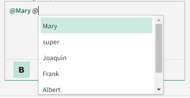

# Rich Text Component Mention Support HLD

## Problem Statement

There is a requirement to `@mention` a user in `nimble-rich-text-editor` and notify them through an email in the comments feature. Once the user is
mentioned in the editor, it should be loaded back to the viewer with the special formatting text in the `nimble-rich-text-viewer`.

### Out of Scope of this Spec

1.  Notifying the mentioned users through an email in the comments feature is part of the backend services
2.  Adding a "Load More" or "Search Server" button to dynamically load more data in the `@mention` dropdown
    in the editor.
3.  Show a tooltip having more details of the user like email, and profile information on clicking the mentioned users in the viewer.

## Links To Relevant Work Items and Reference Material

-   [Rich Text Editor and Viewer README](./README.md)
-   [Comments `@mention` mockup](https://www.figma.com/file/Q5SU1OwrnD08keon3zObRX/SystemLink-orig?type=design&node-id=7248-114254&mode=design&t=y3JtM3aT77Aw0xjK-0)
-   [Mention users in comments - Requirement doc](https://dev.azure.com/ni/DevCentral/_git/Skyline?path=/docs/design-documents/Platform/Requirements/Mention-users-in-comments.md&_a=preview)
-   [Work Item for @mention in comments in AzDo](https://dev.azure.com/ni/DevCentral/_workitems/edit/2464517)

## Design

### `nimble-rich-text-editor`

The rich text editor includes this feature for tagging or mentioning a user by inserting the **"@"** symbol within the editor.
This action triggers a dropdown list, allowing users to select a user. To provide the rich text editor component with the
necessary user information for populating this dropdown, clients can pass the user details through the configuration elements outlined below:

```HTML
<nimble-rich-text-editor>
    <nimble-rich-text-mention-users pattern="http://users/.*">
        <nimble-mapping-mention-user
            mention-href="http://users/user-id-1"
            display-name="John Doe"
        ></nimble-mapping-mention-user>
        <nimble-mapping-mention-user
            mention-href="http://users/user-id-2"
            display-name="Alice Smith"
        ></nimble-mapping-mention-user>
        <nimble-mapping-mention-user
            mention-href="http://users/user-id-3"
            display-name="Bob Jones"
        ></nimble-mapping-mention-user>
    </nimble-rich-text-mention-users>
</nimble-rich-text-editor>
```

The configuration element, `nimble-rich-text-mention-users`, consists of mapping elements that specify both the content to display
in the dropdown list (i.e., the `display-name`) and the data to store in the markdown when extracting content from the editor (i.e., the `mention-href`).
These details are subsequently transformed into a map or an object, which is used to populate the options within the shadow root
for the dropdown list of items. This component uses the [`pattern`](https://developer.mozilla.org/en-US/docs/Web/HTML/Attributes/pattern)
attribute to acquire the regular expression pattern that corresponds to the URL of users within the specific domain of the client application.

The `nimble-mapping-mention-user` element contains individual user information within its elements. Typically, the `mention-href` attribute
includes either the user ID or a value stored in the backend database. It's important that the `mention-href` adheres to a valid
[Autolink](https://spec.commonmark.org/0.30/#autolink) format, often used to link the user ID with the hosting domain. In cases where there's
no specific Href for each user within the domain, they can alternatively insert the user ID in a valid
[Autolink](https://spec.commonmark.org/0.30/#autolink) format in CommonMark flavor such as `user:user-id` and provide the appropriate
pattern for it. The Href provided in the `mention-href` is not restricted to `HTTPS/HTTP` links as they are intended to map a unique
value with the `display-name`.

#### Future Scope

1.  The `nimble-mapping-mention-user` can be used to get other user details like email, profile information, etc., to display in the
    dropdown list options.
2.  If there is a requirement to mention an issue (using **"#"**) or a pull request (using **"!"**),
    a new configuration component can be created and added as a child to the rich text editor. Below is an example of how
    these elements would be used:

    ````HTML
    <nimble-rich-text-editor>
        <nimble-rich-text-mention-users pattern="http://users/.*">
            <nimble-mapping-mention-user
                mention-href="http://users/user-id-1"
                display-name="John Doe"
            ></nimble-mapping-mention-user>
            <nimble-mapping-mention-user
                mention-href="http://users/user-id-1"
                display-name="Alice Smith"
            ></nimble-mapping-mention-user>
            <nimble-mapping-mention-user
                mention-href="http://users/user-id-1"
                display-name="Bob Jones"
            ></nimble-mapping-mention-user>
        </nimble-rich-text-mention-users>

        <nimble-rich-text-mention-issues pattern="http://issues/.*">
            <nimble-mapping-mention-issue
                mention-href="http://issue/issue-id-1"
                display-name="Spec for rich text editor"
            ></nimble-mapping-mention-issue>
            <nimble-mapping-mention-issue
                mention-href="http://issue/issue-id-2"
                display-name="Mention support in rich text components"
            ></nimble-mapping-mention-issue>
            <nimble-mapping-mention-issue
                mention-href="http://issue/issue-id-3"
                display-name="Issue in pasting a link"
            ></nimble-mapping-mention-issue>
        </nimble-rich-text-mention-issues>
    </nimble-rich-text-editor>
    ```
    ````

3.  As the Href are stored as absolute links within the markdown string, mentions of issues or systems, as described above,
    initially appear as links. However, once we introduce support for mentioning issues or systems by matching the specified
    pattern in the configuration element, even the absolute links will transform into `mention` nodes.

#### Alternatives

Slot-based approach: All user information will be communicated through `nimble-list-option` elements. These elements will
contain the user's ID in their `value` attribute and the user's name in their text content. When the **"@"** symbol is
inserted into the editor, these elements will be presented as a dropdown list.

Pros:

1. When the client does not specify a `value` attribute, the options are sent without a user's ID, and in such cases,
   the value attribute is derived from the content of the option.

Cons:

1. It is impossible to have multiple types of mentions when `nimble-list-option` is used in the default slot. If we use
   slot names to differentiate between various types of mentions, the rich text editor needs to be aware of all the type
   of mentions like user slot name, issue slot name, etc, through an attribute value.
2. The slot-based approach is not configurable, meaning that if a user wishes to customize the entire user mention with
   some arbitrary value, the only viable option is to include it within the options. In contrast, the configuration-based
   approach readily allows for the inclusion of arbitrary values in the parent container element, making customization more
   straightforward. For example, in the future if we are configuring the `character` to trigger the user mention from the client,
   it is simple to add it like below,
    ```HTML
    <nimble-rich-text-mention-user character="@">
        <nimble-mapping-mention-user
            key="user-id-1"
            text="username-1"
        ></nimble-mapping-mention-user>
        <nimble-mapping-mention-user
            key="user-id-2"
            text="username-2"
        ></nimble-mapping-mention-user>
        <nimble-mapping-mention-user
            key="user-id-3"
            text="username-3"
        ></nimble-mapping-mention-user>
    </nimble-rich-text-mention-user>
    ```
    If it is a slot-based approach and without a configuration element, it is required to provide the information to every option as we don't know that it is a user-mention
    or other mention
    ```HTML
    <nimble-list-option
        key="user-id-1"
        text="username-1"
        character="@"
    ></nimble-list-option>
    <nimble-list-option
        key="user-id-2"
        text="username-2"
        character="@"
    ></nimble-list-option>
    <nimble-list-option
        key="user-id-3"
        text="username-3"
        character="@"
    ></nimble-list-option>
    ```
3. The UI of the list option is completely dependent on the client application.
4. All the keyboard and mouse interactions within the dropdown list should be handled internally within the editor as `nimble-list-option`
   does not support any.

#### Client Usage Guidance on Filtered Users:

Initially, the client application need not provide any user mapping elements within the children of `nimble-rich-text-mention-users`.
It can be empty. However, if the editor loads with an initial markdown string that contains user mentions, then the client should load those
user mapping elements. This is to map the user IDs in the markdown string converted to a readable user name in the editor. Therefore,
it is advisable to keep two lists, `filteredOptions` for dynamic filtering of users to populate in the `@mention` popup and `mentionedUsers`
for storing the already mentioned users which should be loaded initially by the client to represent the user names that are stored in markdown.
Later, the `mentionedUsers` will be filtered internally within the Nimble editor or by the client to show the names in the popup whenever texts
added after `@` in the editor.

The `nimble-rich-text-mention-users` component will emit an event whenever the `@` character is entered into the editor. The client can listen to
the `mention-update` event and provide the other initial user lists that are not mentioned already.

It is recommended to `sort` the usernames in alphabetical order and send at most 20 users list at a time to reduce the number of elements
in the DOM for a single page. This dynamic loading of the user's list will help specifically in the comments feature when there are a lot of `@mention`
happens on a single page and if the users list is huge, it may cause the page to load slower as the mapping mention element is overflowed
in the DOM when there are multiple editors in a single page or a huge number of users in the client organization.

The `mention-update` event will also be triggered when the user types any character after `@`, containing that text along with the `@` character
in the event data. For example, if a user types `@` and then adds `a` the event will be emitted with data that includes the value `@a`.
The client can listen to this event, filter the list of users that includes the names containing the letter `a`, and then dynamically
update the `nimble-mapping-mention-user` element based on the filter data. Subsequently, a maximum of 20 filtered options should be
transmitted to the editor.

Since the above event triggers for every key down event like adding/removing texts, move the text cursors after the `@` character which is quite an
expensive operation to perform for every keystroke so it is advisable to `debounce` the events if you're using network requests to perform the
filtering operations. Like, allow at most one request per second to filter the list for each second instead of for each keystrokes.

_Note_: The editor will also perform the same filtering once again to ensure the filtered options are proper and update the dropdown list in the UI.
This helps to filter the list, regardless of whether the client is loading the list dynamically by listening to the event as mentioned above
or statically providing user details at the start via `nimble-mapping-mention`.

### API

To support the `@mention`, the creation of the following configuration elements and UI elements is required for rich text components:

#### User mention element (Non-visible configuration element):

This element serves as a container for the mapping elements and additionally functions as a configuration element. It allows the transmission of
arbitrary values that are specific to the `@mention` users within the rich text components. Currently, this component has the below
configuration properties/attributes for user mentions and plays the role of containing the user mapping elements.

This component can be used as a feature flag to enable the support for `@mention` in the rich text editor and viewer.
If this component is not present at the children of the rich text editor or viewer, the component will function the same without the support
for `@mention` in any place like editor, viewer, markdown parser and serializer and the toolbar button to add **"@"** in the editor
will be hidden.

_Component Name_

-   `nimble-rich-text-mention-users`

_Content_

-   Zero or more `nimble-mapping-mention-user` elements

_Props/Attrs_

-   `pattern` - is a string attribute that gets the regex pattern to match the `mention-href` in the mapping element. Exactly similar to
    HTML attribute: [pattern](https://developer.mozilla.org/en-US/docs/Web/HTML/Attributes/pattern).
-   `mentioned-hrefs` - is a read-only property that returns an array of strings representing the mentioned user URL (`mention-href` property value of
    the user mapping element) in the current state of the editor.
-   `validity` - is a read-only object of boolean values that represents the validity state that the `@mention` configuration can be. The object type
    is `RichTextMentionValidity`. The validation is especially for mapping the user details that are provided via the
    `nimble-mapping-mention-user`. For example, if the client application provides the duplicate `mention-href` values that store the user ID, it will be an
    issue in scenarios when parsing the mentioned user from just a user ID to a username. Similar to
    [ValidityState](https://developer.mozilla.org/en-US/docs/Web/API/ValidityState)

_Events_

-   `mention-update` - This event fires when the `@` character is added to the editor and for every character input after `@`.
    This fires with the `eventData` containing the current text that is added after the `@` character and before the current position of the
    text cursor.

    This can be achieved through Tiptap's `onUpdate()` and `onStart()` methods in `render` function in
    [suggestion](https://tiptap.dev/api/utilities/suggestion#render) configurations.

    This event will be triggered in the following scenarios to perform filtering in the client application. The below scenarios will also fire
    when there is a configuration element `nimble-rich-text-mention-users` even without the mapping elements:

    1. When a user inserts the character (e.g., `@`) into the editor, which activates the mention popup.
    2. When a user adds or removes text after inserting the mention character into the editor.
    3. When a user repositions the cursor between the text segments added after the mention character.

    Refer the [accessibility](#accessibility) section to know more details about when it is required to emit the event for performing the filtering in the client application.

    Conversely, this event will not be fired when:

    1. A user moves the cursor away either using the mouse or any key down events that move the cursor from the current position to outside of `@`
       and characters after a minimum of two white spaces while the popup is open.
    2. A user selects an option from the dropdown list either using mouse click/pressing Enter or Tab.
    3. A user adds two or more spaces after triggering the mention popup as the dropdown will be dismissed, see [Accessibility](#accessibility).
    4. In the absence of `nimble-rich-text-mention-users` and no mapping elements.

_Methods_

-   `checkValidity()` - this returns `true` if the configuration of the `@mention` mapping data is valid and `false` otherwise.

#### User mapping element (Non-visible configuration element):

This mapping element is employed to establish a connection between the value displayed in the mapping view and the corresponding value stored within
the markdown string. For instance, the username for an `@mention` is contained in the `display-name` attribute, which is used for display in the
mention view, while the user Href contained in the `mention-href` attribute is used to store within the markdown string.

_Component Name_

-   `nimble-mapping-mention-user`

_Props/Attrs_

-   `mention-href`: string
-   `display-name`: string

#### User mention view (Visible UI element):

This is a UI component used to render the `@mention` node in a rich text editor and rich text viewer when parsed or added into the components.
This holds the styling for the `@mention` nodes.

Different copying and pasting behaviors of the user mention view node:

1.  Copying an `@mention` name from the viewer and pasting it into the editor should result in the appearance of the same mention node.
2.  When copying an `@mention` name from the editor and pasting it into the editor should result in the appearance of the same mention node.
3.  If a portion of an `@mention` name from the viewer is copied and pasted into the editor, it should still render as a complete mention node with the entire name.
4.  Copying only a portion of an `@mention` name from the editor is not possible, as the entire name will always be selected. The copy-and-paste behavior will be the same as point 2.

_Component Name_

-   `nimble-rich-text-mention-users-view`

_Props/Attrs_

-   `mention-href`: string - the unique user URL containing a user ID of the mentioned user
-   `mention-label`: string - the user name of the mentioned user or the user ID extracted from the above Href if mapping element is not
    present for the particular user

_Content_

-   `@` + mentioned user name or user ID (if mapping element is not present for the particular user)

#### Mention popup (Visible UI element):

This container element is responsible for holding the `nimble-list-box` and `nimble-list-option` elements generated from the map. These elements are used to exhibit the
mention options in a dropdown list when the mention character is introduced into the editor (e.g., **"@"**). Additionally, this container element
manages all the key down and mouse interactions within the dropdown, such as selecting options and navigating using the up and down arrow keys, that are associated with the list
options.

_Component Name_

-   `nimble-rich-text-mention-list-box`

_Content_

-   One or more `nimble-list-option` elements

_Events_

-   `change` - this event is fired whenever a change happens within the dropdown either by clicking the options via mouse or selecting the options through key down events.
    This is used by the `nimble-rich-text-editor` to make the Tiptap editor select the option and render as a mention node using a command from the `Mention` extension in Tiptap.

### Anatomy

#### `nimble-rich-text-mention-users`

```HTML
<template>
    <slot name="mapping"></slot>
</template>
```

#### `nimble-mapping-mention-user`

```HTML
<template slot="mapping"></template>
```

#### `nimble-rich-text-mention-users-view`

```HTML
<template>
    <span>
        <slot></slot>
    </span>
</template>
```

#### `nimble-rich-text-mention-list-box`

```HTML
<template>
    <nimble-list-box>
        <slot></slot>
    </nimble-list-box>
</template>
```

### `nimble-rich-text-viewer`

The rich text viewer also supports showing the mentioned users in the emphasized text with a prominent color like in the
interaction design linked in the [Background](./README.md#background) section above. So the markdown string that contains a `@mention` syntax should be
identified by the viewer for mapping the user URL with the user name to display within a `nimble-rich-text-mention-users-view`.

Below is an example of how the client application can be used to provide the `nimble-rich-text-viewer` with necessary user information:

```HTML
<nimble-rich-text-viewer>
    <nimble-rich-text-mention-users pattern="http://users/.*">
        <nimble-mapping-mention-user
            mention-href="http://users/user-id-1"
            display-name="John Doe"
        ></nimble-mapping-mention-user>
        <nimble-mapping-mention-user
            mention-href="http://users/user-id-2"
            display-name="Alice Smith"
        ></nimble-mapping-mention-user>
        <nimble-mapping-mention-user
            mention-href="http://users/user-id-3"
            display-name="Bob Jones"
        ></nimble-mapping-mention-user>
    </nimble-rich-text-mention-users>
</nimble-rich-text-viewer>
```

#### Client Usage Guidance on Filtered Users:

The client application should either parse the markdown string and get the user Href that match the [markdown string of `@mention`](#2-markdown-format)
to identify what are all the mentioned users or utilize the `mentioned-hrefs` read-only property in `nimble-rich-text-mention-users` that
stores the Href of the mentioned users in an array while creating a comment or adding a description in the editor to identify the mentioned users
in the markdown string. Once all the user IDs are identified, it is enough to provide the user details only for the identified users
through the `nimble-mapping-mention-user`. For example, if the markdown string contains only two `@mention` users namely 'Bob Jones'
and 'Alice Smith', it is enough to include only `nimble-mapping-mention-user` for 'Bob Jones' and 'Alice Smith' within
`nimble-rich-text-mention-users`.

### API

The following configuration and UI elements are employed to associate user URLs with names, and then present the corresponding mention nodes within
the `nimble-rich-text-viewer`. The viewer similarly makes use of the shared components, thus linking it to the above sections for the details.

1. [User mention element (Non-visible configuration element)](#user-mention-element-non-visible-configuration-element)
1. [User mapping element (Non-visible configuration element)](#user-mapping-element-non-visible-configuration-element)
1. [User mention view (Visible UI element)](#user-mention-view-visible-ui-element)

### Anatomy

Shadow root template for the components that are used in the `nimble-rich-text-viewer`.

1. [`nimble-rich-text-mention-users`](#nimble-rich-text-mention-users)
2. [`nimble-mapping-mention-user`](#nimble-mapping-mention-user)
3. [`nimble-rich-text-mention-users-view`](#nimble-rich-text-mention-users-view)

## Implementation

The Tiptap [mention extension](https://tiptap.dev/api/nodes/mention) will transform all the `@mention` nodes into `<nimble-rich-text-mention-users-view>`
elements, each with custom attribute values. These attributes play a dual role: they dictate the content displayed in the user interface and
correspond to the information stored in markdown format. For instance, when `@mention` is primarily employed for user tagging, these attribute values
typically encompass user-related data, such as the username and user URL.

1. `mention-href` - employed to store the value that is sent in the `mention-href` attribute of `nimble-mapping-mention-user`.
2. `mention-label` - used to store the actual `display-name` of the selected option.
3. `contentEditable` - defaults as `false`. The `@mention` node is only enabled in the editor after selecting from the list of options. It is not possible
   to edit the names within the node; either can delete the entire name or select a new one from the list of options after deleting the entire name.

#### 1. _Configurations on Tiptap_:

Install the [mention extension](https://tiptap.dev/api/nodes/mention) from Tiptap and configure the extension's functionalities as
follows to enable the desired `@mention` interactions,

1. [`renderLabel`](https://tiptap.dev/api/nodes/mention#render-label) - to define how the `@mention` appears in the editor. In this case
   `@username`(typically `username` represents the text content of the option). If a label is not available, the user ID from the Href is displayed
   instead of an absolute link.
2. [`suggestion`](https://tiptap.dev/api/utilities/suggestion) - to handle the interactions and implementation settings as below,
    1. `char` - a character that the user to trigger the dropdown list. The default value is **"@"**.
    2. `render` - a function responsible for handling all the interactions within the dropdown. It returns an object with the following methods
       to achieve the desired outcome,
        1. `onStart` - to trigger the opening of the dropdown, displaying a list of names. It is also responsible for opening the dropdown
           whenever the cursor is placed after the **"@"** symbol. This also adjusts the position of the anchored region by updating the
           [`anchorElement`](https://github.com/microsoft/fast/blob/master/packages/web-components/fast-foundation/src/anchored-region/README.md#fields:~:text=to%20revaluate%20positioning-,anchorElement,-public)
           from FAST with the `decorationNode` from the `SuggestionProps` in Tiptap.
        2. `onUpdate` - to trigger the opening of the dropdown whenever the text after the **"@"** is updated.
        3. `onKeydown` - to handle key-down events when the dropdown list is opened. The `props`, a parameter of this method, containing
           the keyboard event passed to the `nimble-rich-text-mention-list-box` component which has the `keyDownHandler()` method. This
           method handles the necessary key down handlers for the dropdown list and for the other unused keys for the dropdown it returns
           `false` to retain the editor's default behaviors.
        4. `onExit` - to close the dropdown when focused away from the **"@"** character and their substring in the editor.

#### 2. _Markdown Format_:

`@mention` - `<mention-href>`. Since there is no built-in syntax for mentioning or tagging users or individuals in the
[CommonMark](https://spec.commonmark.org/0.30/) flavor, we have decided to utilize the [Autolinks](https://spec.commonmark.org/0.30/#autolink)
format in the `CommonMark` flavor with user Href containing a user ID as a unique value of `@mention` users.

_Pros_

1.  This markdown string offers the advantage of serving a dual purpose. Depending on the `pattern` specified in the configuration element,
    it can be rendered as a `mention` node. In the absence of a specified `pattern`, it remains a valid markdown format and is displayed as an absolute link.
2.  If we intend to enable interaction by clicking, passing a Href can be leveraged to navigate users to their intended destination. For instance,
    when referencing an issue, clicking on it should direct the user to the issue page, and this functionality can be facilitated through the Href value.
3.  Furthermore, this will not disrupt the operation of the `AutoLink` format since the `mention` node is evaluated before the `autolink` mark.

_Alternatives_:

1.  `@mention` - a custom scheme (`user`) in the Autolink format of CommonMark flavor `<user:user-id>`.

    Pros:

    1.  This markdown syntax does not interfere with the current `AutoLink` formats as the scheme we support for absolute links is `http` and `https`,
        whereas this is a unique scheme and yet follows the standard `CommonMark` markdown flavor
    2.  This syntax ensures the easy identification of a `mention` node using the `user` in place of `scheme` in Autolink when parsing the
        entire markdown string
    3.  The same syntax can be used when other mentions like issue mention by having a different `scheme` in the string like `<issue:issue-id>`

    Cons:

    Creating a custom scheme allows the component to independently manage various scenarios. When parsing markdown, the tokenizer looks for the closing `>` tag,
    recognizes the user ID, and saves it. However, if the user ID itself contains a `>`, it may mistakenly identify the wrong user ID. In valid absolute link URLs,
    special characters like `>` are encoded and preserved, ensuring a unique absolute URL for retrieving data, storing it in markdown, and returning it.

2.  `@mention` - a custom markdown format `@<user-id>`.

    Pros:

    1. This syntax ensures the easy identification of a `mention` node using the **"@"** and **"<"** symbols when parsing the entire markdown string.
    2. The use of opening and closing **"<"** and **">"** symbols specifies the boundaries of the mention node's value within the markdown string,
       allowing for the clear identification of where it starts and ends. This is especially important when the value contains whitespace,
       as in the example `"@<Sue Ann>`, as without the **"<>"** symbols, it would be challenging to determine the precise end index of the value.

    Cons:

    1. It does not follow [CommonMark](https://spec.commonmark.org/0.30/) flavor or any other standard markdown flavors.

#### 3. _Defining schema and adding tokenizer rule in markdown parser_:

As `@mention` is a custom markdown format uniquely created to support the nimble rich text components, it is necessary to
define the schema in `markdown-parser` to identify the markdown string in the format of `<mention-href>` as the `@mention` node.
The below schema is added to the end of other nodes using ProseMirror's
[addToEnd](https://prosemirror.net/docs/ref/#model.Fragment.addToEnd) method.

`@mention` custom schema:

```JS
mention: {
    attrs: {
        mentionHref: { default: '' },
        mentionLabel: { default: '' },
    },
    group: 'inline',
    inline: true,
    content: 'inline*',
    toDOM(node) {
        const { mentionHref, mentionLabel } = node.attrs;
        return [
            'nimble-rich-text-mention-users-view',
            {
                'mention-href': mentionHref as string,
                'mention-label': mentionLabel as string,
            },
            0
        ];
    },
}
```

Additionally, a custom tokenizer rule needs to be added to the `markdown-it` rules to handle the parser logic.
This can be achieved by loading the customized `mention` plugin into the supported tokenizer rules using the
[`use`](https://markdown-it.github.io/markdown-it/#MarkdownIt.use) method and identifying the value of the
`mention-href` that matches the `display-name`. The `mention-href` and `name` will then be generated as an object from the
`nimble-mapping-mention-user` elements. This custom node will be added `before` the `autolink` mark to give
the highest precedence to the `mention` node.

If the user is no longer a valid user or the mapping elements were not yet updated but the markdown string stores a valid
user Href that matches the pattern, then the `@mention` node will parse as a user ID, instead of a user name as they are not
mapped with any mapping elements.

#### 4. _Defining node in markdown serializer_:

The rendered `@mention` node will be constructed into a markdown string by extracting the `mention-href` from
the `span` element in the editor when the `getMarkdown()` method is called.

The example markdown string constructed for the below DOM element rendered in the editor is `<https://users/1234-5678>`.

```HTML
<nimble-rich-text-mention-users-view
    mention-href="https://users/1234-5678"
    mention-label="Mary"
    contenteditable="false"
    >@Mary</nimble-rich-text-mention-users-view
>
```

The `mentioned-hrefs` read-only property, as described in the [API section of the editor](./README.md#api), will undergo an update within the
mentionNode. This update involves extracting the hrefs that matches the pattern specified in the configuration element and
then pushing them to an array.

#### 5. _nimble-rich-text-mention-users_:

An abstract base class, `RichTextMention`, is defined as the parent for all elements that contain mentions, and it will possess the following properties:

1. `character`: string - is a specific symbol to trigger the mention popup. For user mention, it is **"@"**.
2. `icon`: string - element name of the icon for the corresponding toolbar button.

The base class should also contain the `mentioned-hrefs` read-only property to get the mentioned users list in the current state of the editor.

The `nimble-rich-text-mention-users` is a subclass derived from the base class and provides the essential values for the properties mentioned above,
specifically tailored for user mentions. These values are kept as part of the `MentionInternals` and will be utilized by various components
that require access to these specific values.

Validation will be integrated into the internal workings through a `validConfiguration` flag. There is a base class called `RichTextMentionValidator`
responsible for handling validation, with methods for setting and retrieving the validation configuration. This approach ensures that the state of
valid and invalid values passed within the mapping element is effectively managed. The class obtains the name of the validity flag to communicate this
information via a public API called `validity`.

By deriving from the base, the mention options can validate the following conditions for the `display-name` values in user mapping element:

1. `validateMappingTypes(mappings)`
2. `validateNoMissingDisplayName(mappings)`

A common validation, such as `mention-href` validation, can be carried out within a base class shared among all types of mentions
(like user mention, issue mention). Some of them includes:

1. `validateUniqueHref(href, hrefType)`
2. `validateNoMissingHref(mappings)`
3. `validateHref(mappings)`
4. `validatePattern(pattern)`

_Note_: These are subject to change based on the property changes in the `nimble-mapping-mention-user` element.

If any of the mentioned options is invalid as per the above validation, that particular option will be rendered as an empty
option in the list. This indicates to the client that some of the options are wrongly configured and identify the
validation details using the public API `validity`.

The public API to determine the validity of the mention options are `checkValidity()` and `validity`.
See the [API section](#user-mention-element-non-visible-configuration-element) for more details.

#### 6. _nimble-rich-text-mention-users-view_:

The foundation for configuring the rendering of mention nodes in the UI is provided by a base class known as `nimble-rich-text-mention-view`. This base class is an extension of
`FoundationElement`.

The `nimble-rich-text-mention-users-view` is a view class that is derived from the above base class, and its template contains a `span` element with the required CSS styling.
They are equipped with attributes such as `mention-href` and `mention-label` to render the node as a `Mention` node in the Tiptap editor.
It uses the default slot to render the same text content from the editor to the view element's shadow root.

The Mention node from Tiptap is extended, and the [`renderHTML`](https://tiptap.dev/guide/custom-extensions/#render-html) method is overridden to render
the element as a `nimble-rich-text-mention-users-view` instead of the default `span` element as shown in the
[Tiptap code](https://github.com/ueberdosis/tiptap/blob/42039c05f0894a2730a7b8f1b943ddb22d52a824/packages/extension-mention/src/mention.ts#L112).
The attributes will be retained and included in the rendered mention nodes. The [`parseHTML`](https://tiptap.dev/guide/custom-extensions/#parse-html)
will also hold the `nimble-rich-text-mention-users-view` tag and `span` with the type attribute mention to load the specified tags as mention node
in the editor.

#### 7. _nimble-rich-text-mention-list-box_:

This component has FAST's `list-box` in its template to inherit the essential mouse and keyboard interactions required within the dropdown list.
To use the list box, a component named `nimble-list-box` will be created with just the styling changed from
[FAST List Box](https://github.com/microsoft/fast/tree/master/packages/web-components/fast-foundation/src/listbox) to match the nimble theme.
Within its default slot, it gets `nimble-list-option` elements which are used to populate the list with the provided options.

This component is responsible for updating the options property by filtering the list of options provided by the parent component, which in this context is the
`nimble-rich-text-editor`. When the options are updated, the component internally handles setting the selected index values within the list-box.

To facilitate keyboard interactions, a public method called `keyDownHandler()` is provided in `nimble-rich-text-mention-list-box`. This method is invoked in the
`onKeyDown()` function in the Tiptap configuration, as described in the [configuration on Tiptap](#1-configurations-on-tiptap) section. The `keyDownHandler()`
method takes the keyboard event as input and performs necessary operations, such as responding to up and down arrow key presses to decrement or increment the
selected index value for each option, handling the `Enter` key presses for option selection, and so on.

A click handler is attached to the `nimble-list-box`, and it emits the selected option data to the parent component through a `change` event.

Both the click and key down handlers will emit a `change` event which is to be listened by the parent element to render the mention node based on selection in the editor.
This is done in the parent component by invoking the `mention.command` from Tiptap to render the mention node based on the selected option data.

### Angular integration

An Angular directive will be created for `nimble-rich-text-mention-users` and `nimble-mapping-mention-user` components. Input and accessor APIs will be created for the attributes
and properties and output event emitters will be created for the events, similar to how it's done in other directives. The components will not have form
association, so a `ControlValueAccessor` will not be created.

### States

When you add **"@"** into the editor, a dropdown will open with the first value as the selected option, indicated by a green overlay to the option
if `nimble-list-option` is passed into the default slot element. Upon selecting an option from the list, it will be rendered as prominent green text
with bold formatted by default in all themes. Below is a basic representation of `@mention` texts and dropdown lists in the default theme.



An **"@"** icon will be added to the formatting toolbar to insert the **"@"** character, and clicking the button will open a dropdown list of options.
This button will not be highlighted like other buttons when the cursor is placed on the @mentions within the text area of the editor.

### Accessibility

_Focus_

-   Focus state of the list options for `@mention` will be the same as the `nimble-list-option`.
-   Focusing out from the editor will close the `@mention` popup if it is already open.
-   The `@mention` popup will open at the position where the **"@"** character is added into the editor. If the editor has the scrollbar enabled,
    scrolling the editor up and down will not move the popup to the **"@"** position; it will remain at the same position where it was originally opened.
    However, if an option is selected from the list, the focus will return to the position where the text cursor is located, next to the mentioned
    user view node, in the editor.
-   If the `@mention` popup is opened, it will move along with the editor as you scroll the entire webpage, and it will hide when the
    editor hides.

_Keyboard interactions for `@mention`_

| Key                                         | Behavior                                                                                                                         |
| ------------------------------------------- | -------------------------------------------------------------------------------------------------------------------------------- |
| `@` (At least single whitespace before `@`) | Open the list of options with the users list                                                                                     |
| `@` (At the start of the paragraph)         | Open the list of options with the users list even without a preceding white space                                                |
|                                             | ----Below are the keyboard interactions when popup is opened----                                                                 |
| Enter, Tab                                  | Select the currently focused option from the list                                                                                |
| Up/Down Arrow keys                          | Move the focus upward/downward in the list of options                                                                            |
| Left/Right Arrow keys                       | Move the cursor in the editor towards left/right and filters the list for the characters from `@` to the current cursor position |
| Left/Right Arrow keys (moves away from `@`) | Close the dropdown list popup                                                                                                    |
| Escape                                      | Close the dropdown if it is opened                                                                                               |
| Any character                               | Show the filtered list of users starts with the entered character                                                                |
| Space(One time between names)               | Show the filtered list of users that contains a single whitespace in their name                                                  |
| Space(Two or more trailing white spaces)    | Close the dropdown list popup                                                                                                    |
| Group of characters                         | Show the filtered list of users starts with the entered group characters                                                         |
| Group of characters (Not in the list)       | Close the dropdown list popup                                                                                                    |
|                                             | ----Below are the keyboard interactions when user is selected from the list----                                                  |
| Backspace                                   | Remove the entire selected name and cursor in the `@` position                                                                   |
| Shift + Arrow keys                          | Select the mention node                                                                                                          |

_Note_: The `@mention` node is immutable. For instance, if the user is selected and the mentioned node(`nimble-rich-text-mention-users-view`) is added to the DOM,
the only option is to either remove the entire name or add a new name after removing the entire name. It is not possible to edit the name, like removing just
the last name and keeping the first name.

_Mouse interactions for `@mention`_

1. Hovering over each option in the `@mention` dropdown lists will show an indication that the option is selectable.
2. Left-clicking the option will select the hovered option from the list of users.
3. Clicking outside the editor/Focusing out from the editor will close the popup if it is already open.

_ARIA Roles/Properties for `@mention` components_

_`nimble-rich-text-mention-list-box`_

The `nimble-rich-text-mention-list-box` will have the role of `listbox` and the `nimble-list-option` will have the role of `option` as in the other
list option components like `nimble-select` and `nimble-combobox`. Both the components will respect the `aria-disabled` based on the parent element
`nimble-rich-text-editor`.

The `nimble-list-option` (leverage the existing property functionalities) will have the following `aria-*` attributes value set based on the state of the option,

1. `aria-selected` - set to `true` if the option is selected/focused from the list of options. Anyone from the list will have the `true` value.
2. `aria-posinset` - determines the current position of the list items.
3. `aria-setsize` - determines the actual length of the current list options.

_`nimble-rich-text-mention-users-view`_

The `nimble-rich-text-mention-users-view` will not have any specific `roles` or `aria-*` attributes to differentiate the `@mention` node from other
texts in the editor or viewer.

_Future Scope_:

If the `nimble-rich-text-mention-users-view` has the ability to show more information about the user by showing a tooltip by clicking on the node,
then it should probably use a `button` or `link` role to specify its difference from other nodes. Also, having ARIA attributes like `aria-labelledby`
to mention the user detail which is not displayed in the UI when the feature to show a tooltip is enabled.

## Open Issues

-   none
