# Nimble Select (IxD)

## Overview

The select component is used to present a pre-defined list of options that end-users can choose from. Selects simplify choice-making, reduce errors, and conserve screen space for more efficient and user-friendly interactions.

> NOTE: THE VISUAL DESIGN IN THIS DOCUMENT MAY NOT BE ACCURATE

### Background

-   [Select and Combobox Refresh HLD (#1303)](https://github.com/ni/nimble/issues/1303)
-   [ViD Select Styles (Figma)](https://www.figma.com/file/PO9mFOu5BCl8aJvFchEeuN/Nimble_Components?type=design&node-id=2597-83231&mode=design)

## Usage

When to use:

-   To present a pre-defined list of options
-   For filtering or sorting data in tables or lists
-   For selecting settings or preferences
-   For single selection

When not to use:

-   To allow end-users to add custom options
-   When there are fewer than three options
-   For complex and/or hierarchical data
-   For multi selection

### Anatomy

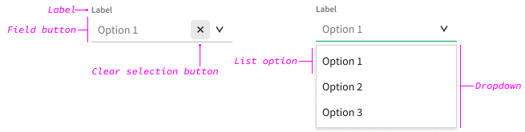

| Element      | Description                                                                 |
| ------------ | --------------------------------------------------------------------------- |
| Label        | Text that tells the end-user what to expect in the list of options          |
| Field button | Click area that opens the dropdown and displays the current selected option |
| Dropdown     | A list of options to choose from displayed as an _open_ state               |
| List option  | A selection the end-user can make, shown with other options in the dropdown |

#### Label

Selects should always have a label, unless approved by an interaction designer or user researcher (usually in toolbar use cases).

Keep the label text as concise as possible, limited to a single line of text. Use sentence casing.

In a form, use the label to indicate whether the select is optional or required for the end-user to interact with. If most of the components in the form are required, indicate which components are optional. If most of the components in the form are optional, indicate which components are required. Required or optional indication in the label text should always follow the pattern "[Label] (optional)" or "[Label] (required)".

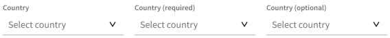

#### Field Button

Selects can be empty by default or have a default selection from the menu. Empty selects should include placeholder text that propts the end-user to select an option from the menu. Placeholder text should always follow the pattern "Select [thing(s)]", for example "Select country". Ellipses are not needed. Use sentence casing.

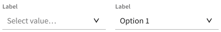

Once the end-user has made a selection, they cannot clear the field button and get back to the empty state. Only use an empty state default in a select where there is no obvious default list option.

#### Dropdown & List Options

A list of options to select, displayed as an open state. Order list options alphabetically by default, unless another ordering will provide value to the end-user. Keep the list option text concise as possible, limited to a single line of text. Use sentence casing.

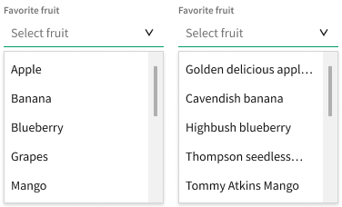

> NOTE: NEED VISUAL DESIGN GUIDANCE FOR ICON SIZES, WHAT CAN BE USED AS AN ICON, ETC.

In addition to text, list options can include an icon to the left of the text, which also appears in the field button when selected. Icons should only be used when they provide more immediate communication to the user than the text. Do not include icons unless all list options have an icon.

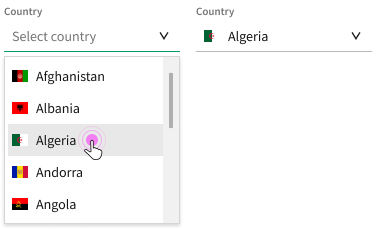

### Related Components

To allow end-users to enter a custom value, use a [**combobox**](/packages/nimble-components/src/combobox/specs/IxD.md).

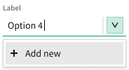

> NOTE: SEE FUTURE CONSIDERATIONS FOR MULTI-SELECTION

To allow end-users to multi-select list options, use a [**tag picker**](/packages/nimble-components/src/tag-picker/specs/IxD.md).

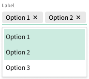

To allow end-users to select from fewer than three options, use a [**radio group**](/packages/nimble-components/src/radio-group/specs/IxD.md).

To allow end-users to trigger an action instead of make a selection, use a [**menu button**](/packages/nimble-components/src/menu-button/specs/IxD.md).

## Design

### Configuration

#### Label

> NOTE: NEEDS VISUAL DESIGN FOR PLACEMENT

The client-user should be able to specify whether they want the label to be positioned at the top or to the left of the select or not at all. Selects that don't have a label should still have an ARIA label.

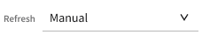

#### Icons

The client-user should be able to specify whether they want left icons on list options or not. Icons show up in list options to the left of text and are displayed as part of the value in the field button.

#### Groups

The client-user should be able to create groups for list options in the dropdown. Groups are not interactable. Filtering by group name should show all the options under that group, whether or not it is included in the option text.

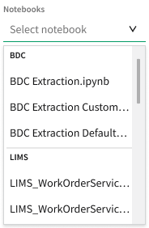

#### Secondary Text

> NOTE: NEEDS VISUAL DESIGN

The client-user should be able to specify whether they want secondary text on list options or not. Filtering by secondary text should show all the options with that text.

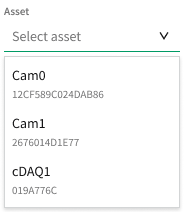

The client-user should be able to specify whether they want other information (including groups) displayed as secondary text in the field input.

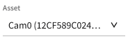

#### Selection

> NOTE: NOT SURE THIS IS A REAL USE CASE FOR SELECT COMPONENT, SEE FUTURE CONSIDERATIONS FOR MULTI-SELECTION

The client-user should be able to specify whether they want to display selection with or without a check mark.

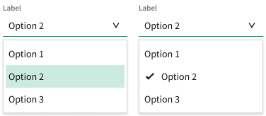

#### Filter

The client-user should be able to specify whether they want filtering available in the select component. The filter field appears in the dropdown. The filter applies to all list options, even ones that are on the server and aren't currently visible in the component.

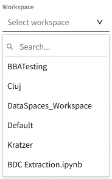

### Behavior

#### Minimum Width

> NOTE: NEEDS DEV REVIEW

The field button minimum width is three times the height of the component (to make components targetable on touch screens). The dropdown width is the same as the field button until reaching the minimum width (without truncating) of the longest string in the list options.

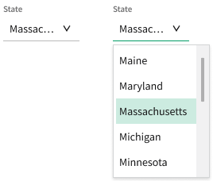

#### Dropdown Height

The dropdown height should be enough to display five to seven list options before overflowing with a vertical scrollbar (not pictured).

#### Overflow Text

> NOTE: NEEDS DEV & VISUAL DESIGN REVIEW

All text in the select component should truncate, not wrap.

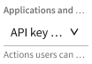

#### Progress & Loading

> NOTE: HOW THIS (AND ANY) FEATURE IS INCLUDED IN IMPLEMENTATION IS UP TO DEVELOPERS

When displaying list options and the dropdown lags or is expected to take longer than normal, the client-user should be able to indicate loading via a slot.

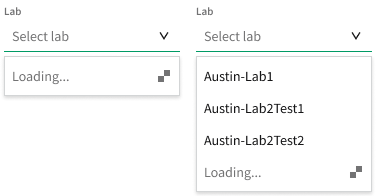

> NOTE: IS THIS NEEDED? IF YES, NEEDS VISUAL DESIGN & TECH WRITER

Dropdowns with dynamically loading list options may have a "Load more" button. Clicking the "Load more" button should resolve into the "Loading…" indication, then load more list options and scroll the dropdown as needed.

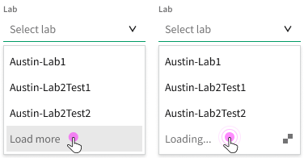

#### Touch-Screen Devices

On touch-screen devices, the select component should bring up the dropdown in a Nimble or native popover.

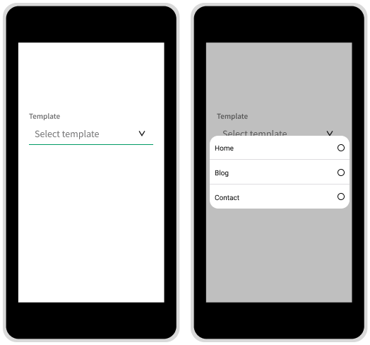

### Mouse Interactions

Field buttons are used to open the dropdown.

Hovering over a field button indicates interactivity.

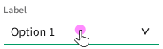

Clicking anywhere on a field button opens (if closed) the dropdown. If the field button contains a valid value, selection is indicated on the associated list option.

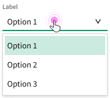

Hovering over a list option in the dropdown indicates interactivity.

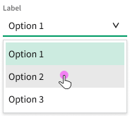

Clicking anywhere on a list option selects the option, displays the value in field button value, and closes the dropdown.

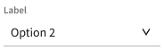

When the dropdown is open, clicking anywhere outside of a list option (including the field button) closes the dropdown with no changes.

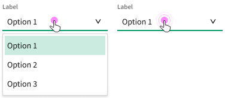

> NOTE: NEEDS VISUAL DESIGN FOR MULTIPLE FOCUS STATES?

If the select component allows filtering, the filter bar has keyboard focus when the dropdown is opened.

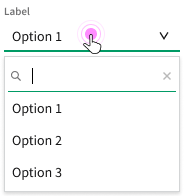

> NOTE: NEEDS TECH WRITER FOR TEXT

Typing into the filter bar filters the list options in the dropdown (not pictured). The filter string can match anywhere in the text for each option. The dropdown should indicate when there are no matches found. The "No matches" indicator is not interactive. The value in the filter bar does not persist when the dropdown is re-opened.

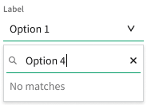

### Keyboard Interactions

> NOTE: Based on ARIA APG [select-only combobox](https://www.w3.org/WAI/ARIA/apg/patterns/combobox/examples/combobox-select-only/)

#### Field Button

| Key                    | Description                                                                                                                                                                             |
| ---------------------- | --------------------------------------------------------------------------------------------------------------------------------------------------------------------------------------- |
| `ENTER` or `SPACE`     | Opens the dropdown without moving focus or changing selection                                                                                                                           |
| `DOWN ARROW`           | Opens the dropdown without moving focus or changing selection (DOM focus remains on the select)                                                                                         |
| `ALT` + `DOWN ARROW`   | Opens the dropdown without moving focus or changing selection                                                                                                                           |
| `UP ARROW`             | Opens the dropdown and moves visual focus to the first list option (DOM focus remains on the select)                                                                                    |
| `HOME`                 | Opens the dropdown and moves visual focus to the first list option                                                                                                                      |
| `END`                  | Opens the dropdown and moves visual focus to the last list option                                                                                                                       |
| _Printable characters_ | Opens the dropdown (if closed), moves visual focus to the filter input (if filterable) with the characters typed or to the first list option that matches the typed character or string |

`TAB` focuses the select component from the previous or next focusable element on the page.

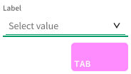

`ENTER` or `SPACE` on the focused component opens the dropdown and maintains current focus and (if applicable) list option selection.

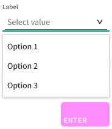

`DOWN ARROW` on the focused component opens the dropdown and maintains current focus and (if applicable) list option selection.

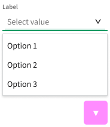

> NOTE: NEEDS DEV REVIEW & VISUAL DESIGN?

`UP ARROW` on the focused component opens the dropdown and focuses (but does not select) the first or last list option.

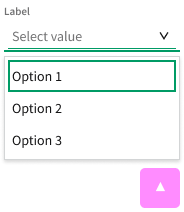

#### Dropdown

> QUESTION: WHAT KEYBOARD SHORTCUT SHOULD BE USED TO FOCUS THE FIRST LIST OPTION AFTER THE FILTER BAR?

| Key                        | Description                                                                                                                                                                 |
| -------------------------- | --------------------------------------------------------------------------------------------------------------------------------------------------------------------------- |
| `ENTER` or `SPACE`         | Sets the value of the field button to the focused list option, closes the dropdown, and moves focus to the select                                                           |
| `DOWN ARROW` or `UP ARROW` | Moves visual focus to the next or previous list option                                                                                                                      |
| `ESC`                      | Closes the dropdown and moves visual focus to the select                                                                                                                    |
| `HOME` or `END`            | Moves visual focus to the first or last list option                                                                                                                         |
| `PAGEUP` or `PAGEDOWN`     | Jumps visual focus up or down ten list options (or to first or last list option)                                                                                            |
| _Printable characters_     | Moves visual focus to the filter input (if filterable) with the characters typed or to the first list option (if not filterable) that matches the typed character or string |

> NOTE: NEED VISUAL DESIGN TO DETERMINE WHETHER BOTH FOCUS AND SELECTION ARE VISUALLY INDICATED ON LIST OPTIONS

From a focused list option, `DOWN ARROW` moves focus and selects the next list option. If the focused/selected list option is the last in the dropdown, `DOWN ARROW` does nothing (not pictured).

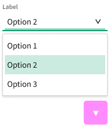

From a focused list option, `UP ARROW` moves focus and selects the previous list option. If the focused/selected list option is the first in the dropdown, `UP ARROW` does nothing (not pictured).

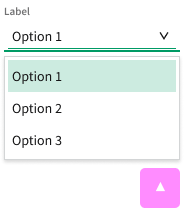

`ENTER` on a focused/selected list option commits the value, updates the field button, and closes the dropdown.

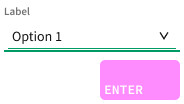

`ESC` on a focused/selected list option cancels the value and closes the dropdown.

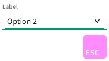

## Future Considerations

-   Helper text for input components (where it should be located, how it should be accessed)
-   Mega-menus (combining static information, selectable options, action-based commands, etc.)
-   Capturing usage guidelines/UI patterns for a "load more" experience in the dropdown
