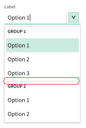

# Select and Combobox option groups

## Problem Statement

It is a common request to categorize the options that are present in the dropdown for a `Select`/`Combobox` component. By supporting categories, developers are able to logically group options, and help end-users to quickly find the relevant option. This will also support use cases that need the same display values under separate categories.

## Links To Relevant Work Items and Reference Material

-   [Interaction Design](./IxD.md#groups)
-   [Sectioned Combobox (issue 791)](https://github.com/ni/nimble/issues/791)
-   [Prototype branch Storybook](https://60e89457a987cf003efc0a5b-cvmxlqwglb.chromatic.com/?path=/docs/components-select--docs) ([code](https://github.com/ni/nimble/tree/groupable-select))

## Implementation / Design

The HTML native `select` supports option groups with the native `optgroup` element. Configuring the `select` to use the `optgroup` takes the following form:

```html
<select name="cars">
    <optgroup label="Swedish Cars">
        <option value="volvo">Volvo</option>
        <option value="saab">Saab</option>
    </optgroup>
    <optgroup label="German Cars">
        <option value="mercedes">Mercedes</option>
        <option value="audi">Audi</option>
    </optgroup>
</select>
```

The Nimble `Select` (and `Combobox`) will follow the same approach, and provide a new custom element, `nimble-list-option-group`, that mirrors the `optgroup` behavior/API:

```html
<nimble-select name="cars">
    <nimble-list-option-group label="Swedish Cars">
        <nimble-list-option value="volvo">Volvo</option>
        <nimble-list-option value="saab">Saab</option>
    </nimble-list-option-group>
    <nimble-list-option-group label="German Cars">
        <nimble-list-option value="mercedes">Mercedes</option>
        <nimble-list-option value="audi">Audi</option>
    </nimble-list-option-group>
</nimble-select>
```

#### Visual separators

The visual design calls for option groups to have a visual separator between them:



To accomplish this, a client will be required to insert an `<hr>` element between each group. This mirrors the API for the `Menu`.

#### Top-level Options

While not a common use-case, clients can provide `nimble-list-option`s as siblings to `nimble-list-option-group`s. In such cases, the client will be expected to insert the appropriate `<hr>` element between a `nimble-list-option-group` and set of `nimble-list-option`s that immediately follow it.

### API

The `ListOptionGroup` class API should be fairly lightweight:

```ts
public class ListOptionGroup {
    @attr
    public label?: string;
}
```

In addition to the `label` attribute, the `ListOptionGroup` will also support slotted labels. This will result in a configuration that looks like the following:

```html
<nimble-list-option-group>
    Swedish Cars
    <nimble-list-option value="volvo">Volvo</option>
    <nimble-list-option value="saab">Saab</option>
</nimble-list-option-group>
```

If a client configures both the `label` attribute _and_ supplies slotted content, we will honor the slotted content.

### Filtering

As [mentioned in the IxD](https://github.com/ni/nimble/blob/main/packages/nimble-components/src/select/specs/IxD.md#groups), when a user has filtering enabled, typing into the filter input will match both individual options (as normal), as well as _all_ options that are under a group that matches the filter text.

When all options under a group are filtered out, the group will also be hidden in the dropdown.

#### Combobox Guidance

It should be noted that when using groups with a `Combobox`, it is advised that each option still be unique (for both its display and value). This is predicated on the [decision](https://github.com/ni/nimble/issues/1168#issuecomment-1568733159) that the `Combobox` will change its behavior for platforms like Angular, where the model value will _always_ be the text that is in the display. This will make it impossible to disambiguate between options that have the same display value under separate groups.

### Accessibility

- The `ListOptionGroup` element will have a [role of "group"](https://developer.mozilla.org/en-US/docs/Web/Accessibility/ARIA/Roles/group_role), which matches the role given to the native `optgroup` element.
- The `ListOptionGroup` element is ignored during keyboard navigation of the dropdown.

### Angular/Blazor Integration

Standard implementation pattern for support.

## Alternative Implementations / Designs

Originally, there was a desire to display the group name for the selected option outside of the dropdown of the component. However, there is not precedent for this for other design systems that support groups, nor the native `select`. If a client desires to display the group for the selected option that will be managed on the client side, including _where_ the display would be.

## Future Considerations

#### Slotted content in group

At some point there may be a desire to provide extra visuals to a group. There already is such a [desire for the options](https://github.com/ni/nimble/issues/1135) themselves. However, there is no need to provide the API/implementation for this initially, as there is no current use-case demanding it.

#### Hierarchichal groups

It isn't difficult to imagine scenarios where a client may wish to have nested grouping within the `Select`. For example, a `Select` where a user could select a city, which was grouped under both State/Province/etc..., _and_ Country. However, this use-case is uncommon _and_ the native `select` does not support this behavior. We will consider supporting this when a known use-case arrives and there are no better alternatives.

_Note: If a client constructs a DOM hierarchy with a group within another group we may need to provide some validity state on the `Select` explaining its invalidity, and we certainly need tests around this case to ensure we behave as intended._

## Open Issues
