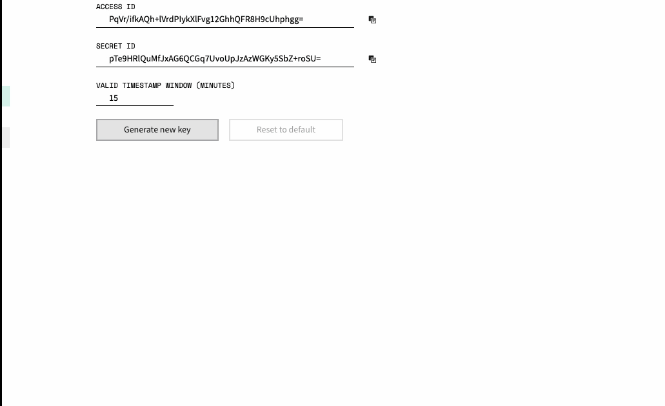
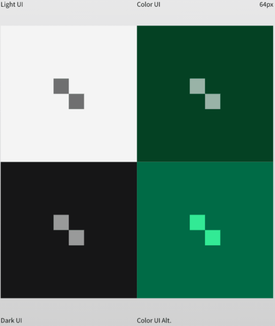

# Nimble Spinner

## Overview

Spinner component (`nimble-spinner`): Indeterminate progress indicator / loading indicator. Meant to be temporarily used in a region of a web page until that region's contents have loaded, or to represent an ongoing operation that doesn't have a known/ determinate duration.

### Background

[Nimble spinner: #346](https://github.com/ni/nimble/issues/346)  
[Nimble spinner design: #822](https://github.com/ni/nimble/issues/822)  
[Visual Design spec - Adobe XD](https://xd.adobe.com/view/33ffad4a-eb2c-4241-b8c5-ebfff1faf6f6-66ac/screen/dece308f-79e7-48ec-ab41-011f3376b49b/)

### Non-goals

Ability to show determinate progress:

-   The current visual design for the spinner is distinct/different from an indeterminate radial progress bar
-   We don't currently have visual designs for a linear or radial progress bar with determinate progress
-   If/when we want progress bar components in the future, at that point we'll probably create new Nimble components which extend the corresponding FAST components:
    -   `nimble-progress` or `nimble-linear-progress`, deriving from `fast-progress`, for a linear progress bar; and
    -   `nimble-progress-ring` or `nimble-radial-progress`, deriving from `fast-progress-ring`, for a radial progress bar

### Features

-   Show indeterminate progress with an animation
    -   Cannot be paused - assumption is that component will be added to/ removed from the page as needed
-   Supports 3 sizes: `small` (16x16), `medium` (32x32) (default), `large` (64x64)
-   For the color theme only, supports an alternate appearance/color scheme via `appearance-variant="alternate"`

### Risks and Challenges

None

### Prior Art/Examples

SystemLink Enterprise uses a spinner based on the Material `mat-spinner`:  

A variant of this spinner design is already implemented in the Web Config tool written in Blazor:  

## Design

The `nimble-spinner` is an animating indicator that can be placed in a particular region of a page to represent loading progress, or an ongoing operation, of an indeterminate / unknown duration.

### API

Component Name: `nimble-spinner`

Properties/Attributes:

-   `size`
    -   String attribute controlling size of the component
    -   Backed by an enum `SpinnerSize` with values `small` (16x16), `medium` (32x32), `large` (64x64)
    -   If omitted, the default is `medium` (32x32)
-   `appearance-variant`
    -   default (undefined): Standard appearance (light/dark/color themes)
    -   `alternate`: Alternate appearance/color, for the color theme only
    -   Backed by enum `SpinnerAppearanceVariant`

Methods, Events, CSS Classes, CSS Custom Properties: None

### Anatomy

Contains 2 `div` elements that are animated via CSS animations.

Slot Names, Host Classes, Slotted Content/ Slotted Classes, CSS Parts: None

### Angular integration

Directive `NimbleSpinnerDirective` targeting selector `nimble-spinner`, with bindings for `size` and `appearance-variant`.

### Blazor integration

Standard Blazor implementation (`NimbleSpinner` deriving from `ComponentBase`), with bindings for `size` and `appearance-variant`.

### Visual Appearance

[Visual Design spec - Adobe XD](https://xd.adobe.com/view/33ffad4a-eb2c-4241-b8c5-ebfff1faf6f6-66ac/screen/dece308f-79e7-48ec-ab41-011f3376b49b/)

Light / dark themes only have a single appearance variant.  
The color theme has 2 appearance variants - the "Color UI Alt." one from XD can be accessed with `appearance-variant="alternate"`.

## Implementation

Component implementation will derive from the FAST `FoundationElement`.

**Alternatives Considered:** We could derive from `fast-progress-ring` (radial progress indicator, which supports an indeterminate progress display), however then our component API would also pick up the `min`/`max`/`value` properties for determinate progress (and `paused` to pause the indicator), which we don't plan on supporting at this time. Additionally, the visual appearance of our spinner will be a little different from a radial progress bar, and we still may end up supporting a standard radial progress bar in the future.  
For reference, the FAST spec for `progress` / `progress-ring` is [here](https://github.com/microsoft/fast/blob/802443ffb2b19a078f9b48f62e6d1a35e3276fb5/packages/web-components/fast-foundation/src/progress/README.md).

### States

Only one component state: visible and animating. Pausing not supported; spinner is expected to be added/removed from the DOM as needed.

### Accessibility

No keyboard states / form integration.

ARIA: We plan to use the [`progressbar role`](https://developer.mozilla.org/en-US/docs/Web/Accessibility/ARIA/Roles/progressbar_role) without setting `aria-valuemin` / `aria-valuemax` / `aria-valuenow` (representing indeterminate).  
This matches the behavior of an indeterminate FAST progress ring (in which case min/max/value are unset) - see the [FAST template here](https://github.com/microsoft/fast/blob/802443ffb2b19a078f9b48f62e6d1a35e3276fb5/packages/web-components/fast-foundation/src/progress-ring/progress-ring.template.ts#L17).

### Globalization

N/A.

RTL: No special handling / no changes to the spinner animation. Linear indeterminate progress animations are sometimes reversed for RTL, but circular/clockwise ones are usually not (see [Material Design v2, Mirroring Elements](https://m2.material.io/design/usability/bidirectionality.html#mirroring-elements) > _When Not To Mirror_, for one example).

### Security

N/A

### Performance

N/A

### Dependencies

None

### Test Plan

Standard tests planned.  
[Chromatic is supposed to handle pausing CSS animations by default](https://www.chromatic.com/docs/animations), however we should verify that by ensuring the snapshots of the spinner show the same state across 2 Chromatic builds.

### Tooling

N/A

### Documentation

N/A - Standard updates of the component table in the README, and in Storybook.

## Open Issues

-   How should we represent the 'color theme / alt version'? (Assuming `appearance-variant`, what variant name?)
-   Finalize component name and ensure it makes sense in conjunction with potential future progress bar components
