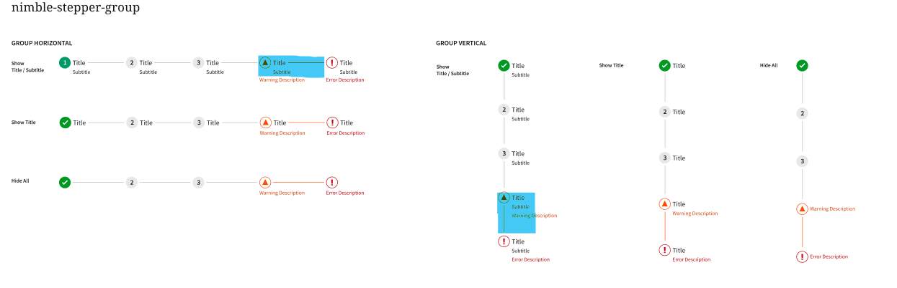

# Nimble Stepper

## Overview

The `nimble-stepper`, `nimble-step`, and `nimble-anchor-step` elements.

### Background

<!--
- *Relevant historical or background information*
- *Link to relevant work items, related existing issues, etc.*
-->

- Nimble issue: [#624](https://github.com/ni/nimble/issues/624)
- Interaction Design: None
- Visual Design:
  - [Nimble Components Stepper Figma](https://www.figma.com/design/PO9mFOu5BCl8aJvFchEeuN/Nimble_Components?node-id=11742-71097&p=f&t=U3UnPlU4awyN4ybh-0)
  - [Config App Figma](https://www.figma.com/design/eG9PhYykbokYf1OBd8KLkn/Valinor?node-id=0-1&p=f&t=oRGYidVydXMcgj3I-0)

### Containing Library

<!-- *State whether this component be part of Nimble or Spright and provide justification or considerations leading to that decision.*  -->

Nimble: Stepper is a generic component not designed for a specific application / domain.

### Non-goals

<!-- *A list of use cases, features, or functionality which are **not** goals for the component.* -->

- Handling long lists of steps (10+)
- Non-linear step progressions such as following steps in a branching flow chart or graph are not in the scope of the current HLD / designs.

### Features

- Similar to a collection of card buttons / breadcrumb conceptually but with more visual states.

### Risks and Challenges

<!-- *Notable risks or challenges associated with implementing the component. Would we need to make any breaking changes in order to achieve this component's goals?* -->

No known new unique risks or challenges

### Prior Art / Examples

- Relevant design systems:
  - [Carbon progress indicator](https://carbondesignsystem.com/components/progress-indicator/usage/)
  - [Angular Material stepper](https://material.angular.dev/components/stepper/overview)
  - [WAI Patterns step-by-step indicator](https://www.w3.org/WAI/tutorials/forms/multi-page/#using-step-by-step-indicator)
  - [USDS step indicator](https://designsystem.digital.gov/components/step-indicator/)

## Design

<!-- *Describe the design of the component, thinking through several perspectives:*

- *A customer using the component on a web page.*
- *A developer building an app with the component and interacting through HTML/CSS/JavaScript.*
- *A designer customizing the component.*

*Include code snippets showing basic component use and any interesting configurations.*

*For each section below, consider adding an "Alternatives" sub-section to describe any design alternatives and discuss why they were rejected.* -->

The `nimble-stepper` acts a a progress indicator for a wizard / step-by-step workflow. It behaves conceptually as either a collection of card buttons (i.e. collection of `nimble-step`) or as breadcrumbs (i.e. collection of `nimble-anchor-step`). Each item has a standard `severity` state associated with it and the ability to express that a state is the "current" `selected` step.

The `nimble-stepper` is just for layout, placing steps either horizontal or vertical orientation and communicating internal state to child steps as needed (ideally just via style but implementation TBD).

The `nimble-step` and `nimble-anchor-step` are elements representing individual steps with `nimble-step` behaving as a card button (i.e. a button with a concept of a `selected` visual appearance that does not change behavior) and a `nimble-anchor-step` looking visually identical but with link behaviors.

The `step` elements will primarily render a provided nimble icon (and new nimble icons for the visuals of digits 0 - 9 will be added). When a non-default severity is provided the provided icon will be replaced with an icon representing the severity.

### API

<!-- *The key elements of the component's public API surface:*

- *Component Name*
- *Props/Attrs: to match native element APIs, prefer primitive types rather than complex configuration objects and expose fields as both properties on the TypeScript class and attributes on the HTML element*
- *Methods*
- *Events*
- *CSS Classes and CSS Custom Properties that affect the component*
- *How native CSS Properties (height, width, etc.) affect the component*

*Consider high and low-level APIs. Attempt to design a powerful and extensible low-level API with a high-level API for developer/designer ergonomics and simplicity.* -->

- `nimble-stepper`
  - Attributes
    - orientation: vertical / horizontal (aligned with radio group and wafer)
  <!--
  - Properties (not attribute reflected)
  - Methods
  - Events
  - CSS custom properties
  -->
  - CSS native properties
    - Will respond to width / height sizing (on the axis corresponding to orientation) and show overflow scroll buttons following the pattern of breadcrumb
      - Vertical use of this pattern is new and not captured in interaction or visual design. If expensive may fallback to other requirements (control overflow hidden and app must sze correctly, etc).
  - Slots
    - default: unused
    - step: supports `nimble-step` and `nimble-anchor-step` children (aligned with tabs use of a tab slot)
  <!--
  - Parts
  - Localizable labels
  -->

- `nimble-step`
  - Attributes
    - disabled: boolean (standard, i.e. visually disabled and interactions prevented)
    - readonly: boolean (standard, i.e. visually not disabled, interactions other than tab focus prevented)
    - selected: boolean (visual change only, no behavior) (aligned with card button)
    - severity: default / error / warning / success / information (aligned with icon)
    - severity-text: string (if provided, only renders during warning, error, and information severity)
  <!--
  - Properties (not attribute reflected)
  - Methods
  -->
  - Events
    - click (aligned to button, not emitted on disable)
  <!--
  - CSS custom properties
  - CSS native properties
  -->
  - Slots
    - default: supports nimble icons, will render inside the circle and have color controlled via iconColor token
    - title: Title content (aligned with dialog)
    - subtitle: Subtitle content  (aligned with dialog)
  <!--
  - Parts
  - Localizable labels
  -->

- `nimble-anchor-step`
  - Attributes
    - All `nimble-step` attributes
    - `<a>` attributes (href, target, etc)
      - href: null / undefined should behave like disabled (seems inconsistent across controls)
  <!--
  - Properties (not attribute reflected)
  - Methods
  -->
  - Events
    - click (aligned to anchor-button, not emitted on disable)
  <!--
  - CSS custom properties
  - CSS native properties
  -->
  - Slots
    - All `nimble-step` slots
  <!--
  - Parts
  - Localizable labels
  -->

### Anatomy 
<!-- 
*Outline the component structure with a diagram of its visual tree (shadow DOM). Enumerate key areas of visual customization, such as:*

- *Slot Names*
- *Host Classes*
- *Slotted Content/Slotted Classes*
- *CSS Parts* -->

Slots, parts, etc. merged above in API section.

### Native form integration

<!-- *Describe the plan for custom element form integration or why it's not necessary.*

*Components that are intended to replace a native form element (input, textarea, select) should generally behave like their native counterpart. See ["More capable form controls" on web.dev](https://web.dev/articles/more-capable-form-controls) for an overview of requirements. Leverage patterns from [FAST Form Associated Custom Elements](https://github.com/microsoft/fast/blob/master/packages/web-components/fast-foundation/src/form-associated/form-associated-custom-element.spec.md).* -->

- Anchor related components will use native `<a>` tag and forward attributes.
- control has no intrinsic "value" state, so not a form control
- control used for navigation, does not seem like a good candidate for form submit button behavior

### Angular integration

<!-- *Describe the plan for Angular support, including directives for attribute binding and ControlValueAccessor for form integration. Depending on the contributor's needs, implementing Angular integration may be deferred but the initial spec should still document what work will be needed.* -->

- Angular `routerLink` integration for `nimble-anchor-step`.
- No Angular Form integration.

### Blazor integration

<!-- *Describe the plan for Blazor support, including form integration. See the [nimble-blazor CONTRIBUTING.md](/packages/blazor-workspace/NimbleBlazor/CONTRIBUTING.md) for details. Depending on the contributor's needs, implementing Blazor integration may be deferred but the initial spec should still document what work will be needed.* -->

- To align with Blazor conventions we could implement the same behavior as Blazor [`NavLink`](https://learn.microsoft.com/en-us/aspnet/core/blazor/fundamentals/navigation?view=aspnetcore-10.0#navlink-component) ([component src](https://github.com/dotnet/aspnetcore/blob/main/src/Components/Web/src/Routing/NavLink.cs)) (we have not done that for other anchor controls). Not sure how our current Blazor components behave with the router as they don't have any specific integration.
- Could be a good candidate for Blazor `EditForm` integration to visualize form error state as [`ValidationSummary`](https://learn.microsoft.com/en-us/aspnet/core/blazor/forms/validation?view=aspnetcore-10.0#validation-summary-and-validation-message-components) components.
- Current scope does not include specific considerations for Blazor Router / `NavLink` or `EditForm` / `ValidationSummary` support.

### Visual Appearance

<!-- *Work with Visual Design to create Figma files and other design assets. Be sure to account for the various component states, including hover, active, etc. as well as validity, and appearance variants.* -->

See figma linked in background section.

### Interactions

<!-- *Work with Interaction Design to create Figma files and other design assets. Be sure to account for the various interactions from mouse, keyboard, and touch * -->

Step button / link interaction area is the step control size boundaries which includes the icon, title, subtitle, and the line visual. The control size / interaction area does not include the severity text (similar to error text in other controls).

See the blue areas in the following image as an example:

## Implementation

<!-- *Important aspects of the planned implementation with careful consideration of web standards and integration.*

*Highlight any alternative implementations you considered in each section.*

*If you think a section doesn't apply or don't know what to write, please DO NOT delete it. Either mark it "N/A" or leave it blank and the Nimble team can help you fill it in.* -->

No particularly interesting implementation concerns. Follows existing patterns around buttons and anchors.

### States

<!-- *Key component states, valid state transitions, and how interactions trigger a state transition.* -->

Some specific usage notes:
- Only one step should be marked selected at a time
- Disabled steps represent a step that doesn't apply for the current workflow (previous step configuration disabled a future step which is now skipped)
- Readonly steps are steps that don't have associated views for them (it's a step that just indicates something like disk formatted or software installed)

### Accessibility

<!-- *Consider the accessibility of the component, including:*

- *Keyboard Navigation and Focus*
- *Form Input and Autofill*
- *Use with Assistive Technology. For example:*
  - *All components should define a role and support labels / being labelled so that assistive technology can identify them*
  - *The implications shadow dom might have on how roles and attributes are presented in the accessibility tree*
  - *Components which delegate focus require all global ARIA attributes to be enumerated*
  - *Components should either follow an existing [ARIA Pattern](https://www.w3.org/WAI/ARIA/apg/patterns/) or provide thorough research indicating why a new pattern is appropriate. Research should include sources like [Open UI Community Group](https://github.com/openui/open-ui) and other popular design systems.*
- *Behavior with browser configurations like "Prefers reduced motion"*
- *Support for standard link behaviors if the component is an anchor or contains an anchor. These behaviors are enumerated in the [anchor-patterns story](https://nimble.ni.dev/storybook/index.html?path=/docs/tests-anchor-patterns--docs). The story should be updated to include the new component.* -->

Will follow the [ARIA WAI Forms: step-by-step indicator pattern](https://www.w3.org/WAI/tutorials/forms/multi-page/#using-step-by-step-indicator) with key elements of:
- Items are in an ordered list
- Visibly hidden text is used convey step state

Otherwise standard keyboard accessibility and aria for buttons / links.

### Mobile

<!-- *Consider how the component will behave on mobile devices, including:*

- *Overflow behavior when screen space is constrained*
- *Interactions that are affected by touch rather than a pointer device (e.g. hover)*
- *Integration with common mobile experiences like native pickers, on-screen keyboards, and dictation* -->

No additional support beyond discussion in API section on CSS sizing.

### Globalization

<!-- *Consider whether the component has any special globalization needs such as:*

- *Special RTL handling*
- *Swapping of internal icons/visuals*
- *Localization* -->

Label providers for visibly hidden step states:
- Reuse `popupIconError`, `popupIconInformation`, `popupIconWarning`
- Add (for consistency but maybe unexpected naming): `popupIconComplete`, `popupIconCurrent` 

### Security

<!-- *Are there any security implications surrounding the component?* -->

No unique concerns.

### Performance

<!-- *Are there any performance pitfalls or challenges with implementing the component?* -->

No unique concerns.

### Dependencies

<!-- *Will implementing the component require taking on any dependencies?*

- *3rd party libraries*
- *Upcoming standards we need to polyfill*
- *Dependencies on other fast components or utilities*

*Do any of these dependencies bring along an associated timeline?* -->

N/A

### Test Plan

<!-- *What is the plan for testing the component, if different from the normal path? Note that the normal plan includes unit tests for basic state/behavior as well as end-to-end tests to validate the specific user stories described above.* -->

No unique concerns.

### Tooling

<!-- *Are there any special considerations for tooling? Will tooling changes need to be made? Is there a special way to light up this component in our tooling that would be compelling for developers/designers?* -->

N/A

### Documentation

<!-- *What additions or changes are needed for user documentation and demos? Are there any architectural/engineering docs we should create as well, perhaps due to some interesting technical challenge or design decisions related to this component?* -->

No unique concerns. Use common link docs.

## Open Issues

<!-- *Highlight any open questions for discussion during the spec PR. Before the spec is approved these should typically be resolved with the answers being incorporated in the spec document.* -->

None.
