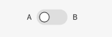
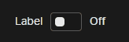

# Nimble Switch

## Overview

The `nimble-switch` is a boolean control which mimics a physical switch that can be turned on or off. The Nimble switch is based upon [FAST's switch component](https://github.com/microsoft/fast/tree/3c557446160ecdc358b46fd35d72d53555f02fe5/packages/web-components/fast-foundation/src/switch).

### Background

[Nimble issue #387: Toggle switch](https://github.com/ni/nimble/issues/387)

[Visual design spec](https://xd.adobe.com/view/33ffad4a-eb2c-4241-b8c5-ebfff1faf6f6-66ac/screen/3698340b-8162-4e5d-bf7a-20194612b3a7/)

---

## Design

### API

[FAST switch API](https://github.com/microsoft/fast/blob/3c557446160ecdc358b46fd35d72d53555f02fe5/packages/web-components/fast-foundation/src/switch/switch.spec.md)

-   _Component Name:_ `nimble-switch`
-   _Properties/Attributes:_ Unchanged
-   _Methods:_ Unchanged (none)
-   _Events:_ Unchanged
-   _CSS Classes and Custom Properties that affect the component:_ None
-   _Slots:_ Unchanged
-   _Template:_

The [FAST Components switch](https://explore.fast.design/components/fast-switch) has slightly different behavior than our visual design specifies with regards to labels. The FAST switch has slots for both `checked` and `unchecked` messages, but both messages appear on the right side of the control (and are styled to show or hide depending on the value of the control). On the other hand, the visual design for the Nimble switch specifies that the `checked` and `unchecked` messages should appear on the right and left hand sides of the switch control respectively, and should both be shown always.

Visual design:



FAST Components:



In order to implement the desired visual design, instead of using [FAST's template](https://github.com/microsoft/fast/blob/3c557446160ecdc358b46fd35d72d53555f02fe5/packages/web-components/fast-foundation/src/switch/switch.template.ts), the Nimble switch will specify a custom template:

```html
<template <!-- unchanged -->
    >
    <label <!-- unchanged --> </label>
    <span class="unchecked-message status-message" part="unchecked-message">
        <slot name="unchecked-message"></slot>
    </span>
    <div part="switch" class="switch">
        <slot name="switch">${definition.switch || ""}</slot>
    </div>
    <span class="checked-message status-message" part="checked-message">
        <slot name="checked-message"></slot>
    </span>
</template>
```

### Angular integration

The switch will have an Angular directive in `nimble-angular` which allows binding to the switch's properties and events. The switch will also have a control value accessor directive for use in forms, which should be extended from Angular's [CheckboxControlValueAccessor](https://github.com/angular/angular/blob/e914da145bf76e993206910590e7729abadc3242/packages/forms/src/directives/checkbox_value_accessor.ts#L18-L57).

### Additional requirements

None

-   _User interaction: Do the FAST component's behaviors match the visual design spec? When they differ, which approach is preferable and why?_
    -   The FAST component differs in how it uses checked/unchecked labels, as described above. I believe that the label behavior in the visual design is preferable. If a consumer of the switch prefers the FAST label approach, they should be able to achieve it with custom styling.
-   _Styling: Does FAST provide APIs to achieve the styling in the visual design spec?_
    -   I don't foresee any issues styling the FAST switch to match our visual design
-   _Testing: Is FAST's coverage sufficient? Should we write any tests beyond Chromatic visual tests?_
    -   Since we're using a custom template, we should copy FAST's tests to our repo to ensure that we don't break any behavior.
-   _Documentation: Any requirements besides standard Storybook docs and updating the Example Client App demo?_
    -   No additional requirements
-   _Tooling: Any new tools, updates to tools, code generation, etc?_
    -   No additional requirements
-   _Accessibility: keyboard navigation/focus, form input, use with assistive technology, etc._
    -   All accessibility needs should be covered by FAST's implementation. We should do some manual testing to verify that the custom template doesn't break any accessibility behavior.
-   _Globalization: special RTL handling, swapping of icons/visuals, localization, etc._
    -   No additional requirements
-   _Performance: does the FAST component meet Nimble's performance requirements?_
    -   No additional requirements
-   _Security: Any requirements for security?_
    -   No additional requirements

---

## Open Issues

None
