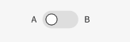
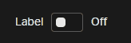

# Nimble Switch

## Overview

The `nimble-switch` is a boolean control which mimics a physical switch that can be turned on or off. The Nimble switch is based upon [FAST's switch component](https://github.com/microsoft/fast/tree/3c557446160ecdc358b46fd35d72d53555f02fe5/packages/web-components/fast-foundation/src/switch).

### Background

[Nimble issue #387: Toggle switch](https://github.com/ni/nimble/issues/387)

[Visual design spec](https://xd.adobe.com/view/8ce280ab-1559-4961-945c-182955c7780b-d9b1/screen/3698340b-8162-4e5d-bf7a-20194612b3a7/)

---

## Design

### API

[FAST switch API](https://github.com/microsoft/fast/blob/3c557446160ecdc358b46fd35d72d53555f02fe5/packages/web-components/fast-foundation/src/switch/switch.spec.md)

- *Component Name:* `nimble-switch`
- *Properties/Attributes:* Unchanged
- *Methods:* Unchanged (none)
- *Events:* Unchanged
- *CSS Classes and Custom Properties that affect the component:* None
- *Slots:* Unchanged
- *Template:*

The [FAST Components switch](https://explore.fast.design/components/fast-switch) has slightly different behavior than our visual design specifies with regards to labels. The FAST switch has slots for both `checked` and `unchecked` messages, but both messages appear on the right side of the control (and are styled to show or hide depending on the value of the control). On the other hand, the visual design for the Nimble switch specifies that the `checked` and `unchecked` messages should appear on the right and left hand sides of the switch control respectively, and should both be shown always.

Visual design:



FAST Components:



In order to implement the desired visual design, instead of using [FAST's template](https://github.com/microsoft/fast/blob/3c557446160ecdc358b46fd35d72d53555f02fe5/packages/web-components/fast-foundation/src/switch/switch.template.ts), the Nimble switch will specify a custom template:

 ```html
<template <!-- unchanged --> >
    <label
        <!-- unchanged -->
    </label>
    <span class="unchecked-message status-message" part="unchecked-message">
        <slot name="unchecked-message"></slot>
    </span>
    <div part="switch" class="switch">
        <slot name="switch">${definition.switch || ""}</slot>
    </div>
    <span class="checked-message status-message" part="checked-message">
        <slot name="checked-message"></slot>
    </span>
</template>
```

### Angular integration 

The switch will have an Angular directive in `nimble-angular` which allows binding to the switch's properties and events. The switch will also have a control value accessor directive for use in forms, which should be extended from Angular's [CheckboxControlValueAccessor](https://github.com/angular/angular/blob/e914da145bf76e993206910590e7729abadc3242/packages/forms/src/directives/checkbox_value_accessor.ts#L18-L57).

### Additional requirements

None

---

## Open Issues

None