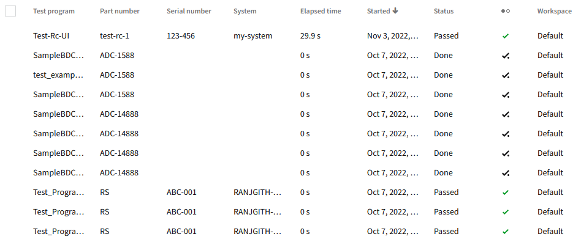

# Nimble Table

## Overview

The `nimble-table` is a component that offers a way to render tabular data in a variety of ways in each column.

### Background

[Nimble issue #283](https://github.com/ni/nimble/issues/283)

[Nimble Table Tech Stack Document](./tech-stack.md)

[Nimble Table Research Document](https://lucid.app/lucidspark/31f2314d-dd8e-46fd-8fc1-6e9f66700bb3/edit?viewport_loc=-1060%2C-25492%2C20822%2C12325%2CloaYwcZLRray4&invitationId=inv_38839ad5-72b2-4975-ab7a-6d8be33c960c)

[Table visual design](https://xd.adobe.com/view/5b476816-dad1-4671-b20a-efe796631c72-0e14/screen/d389dc1e-da4f-4a63-957b-f8b3cc9591b4/specs/)

### Non-goals

-   The `nimble-table` will not offer spreadsheet-like features such as infinite columns, or summary functions.

-   We do not intend for the `nimble-table` to handle data sets of 10K or more on the client-side. Visualizing such sizes of data sets are meant to be enabled through various "data virtualiazation" means, such as the server only sending over subsets of the data at a time, appropriately filtered down to a reasonable size.

-   Non-virtualized static tables.

### Features

In addition to simply rendering data, the `nimble-table` will provide APIs/interactions that will allow a user to do the following:

-   Interactively and programmatically size columns
-   Interactively and programmatically sort columns
-   Pin columns: columns remain fixed during horizontal scrolling
-   Provide column ordering (programmatically only at first possibly)
-   Group rows: display rows in a collapsible section when they share the same value for the grouped column
-   Multi-select rows (interactively only at first possibly)
-   Provide hierarchy via the data
-   Provide custom column rendering
-   Provide API for adding action menu
-   Allow expected accessibility keyboard interactions for navigating (tbd)

#### _Additional features out of scope of this spec_

The following are features are out of the scope of the initial table spec and require additional research or HLDs for future implementation:

-   Hierarchy and Grouping together (though this could happen in the initial release if simple enough to accomplish)
-   Custom expanded row content
    -   An example would be showing a sub-table when you expand a row
-   Editable cells
-   APIs around pagination/infinite scrolling
-   High-level configuration APIs
    -   Allow for easy getting/setting of total configurable state, which is useful for maintaining state of the table as a user navigates to other pages in an app.
-   Filter on any text match across all cells
-   Selection configuration: Ability to specify single vs. multi-select vs. no-selection
-   Custom header templates: Provide clients the means to change the content used in the header (analogous to [FAST `headerTemplate`](https://github.com/microsoft/fast/blob/802443ffb2b19a078f9b48f62e6d1a35e3276fb5/packages/web-components/fast-foundation/src/data-grid/data-grid.ts#L55), and [TanStack `header.getContext()`](https://tanstack.com/table/v8/docs/api/core/header#getcontext)).
-   Cell selection (_contingent on Accessibility decision_): Allow user to select a particular cell
    -   Copying cell values is accomplished by clicking on a cell (it showing itself as selected) and pressing `Ctl-c` as opposed to highlighting the value in the cell (and pressing `Ctl-c`).
-   Data exporting (e.g. export as CSV)
-   Handling globalization concerns (i.e. 'rtl' display)

### Prior Art/Examples

SLE Table



---

## Design

A user will be able to configure a `nimble-table` component fairly thoroughly through its markup. Including the columns to visualize, how to visualize a column, and in what order. A sketch of the markup should be similar to the following (in Angular):

```html
<nimble-table [data]="data">
    <nimble-text-field-column
        slot="columns"
        columnId="firstName"
    ></nimble-text-field-column>
    <nimble-text-field-column
        slot="columns"
        columnId="lastName"
    ></nimble-text-field-column>
    <nimble-text-field-column
        slot="columns"
        columnId="profession"
    ></nimble-text-field-column>
</nimble-table>
```

_Placeholder for other design details as they are created_

### API

_Component Name_

`nimble-table`

_Feature APIs_

The various APIs/features of the `nimble-table` will be split up amongst several different HLD documents. This section will serve to list them out and link to them as they become available:

-   [Data API](table-data-api.md)
-   [Column API](table-columns-hld.md)
    -   Define the interface we will provide for the column providers/components (i.e., width, sorting, allowSort, allowGrouping, etc...)
        -   [Column Widths](./table-column-width-hld.md)
    -   Define how we intend to support defining a column that uses information from multiple columns (e.g. a hyperlink column that uses data from one column for the URL and the data from another as the text to display)
        -   What column gets used for sorting?
    -   List the set of column providers that Nimble will provide and provide their respective APIs where unique (e.g., formatter for DateTime column)
        -   [TableColumnText](table-column-specs/table-column-text-field.md)
-   Headers
    -   Define the anatomy of headers in the table DOM
        -   What is the component to use for interaction? Outline Button? Ghost button?
        -   What and where are the interactive mechanisms/indicators? Sort arrow, etc..
-   [Row Selection](table-row-selection.md)
    -   Define the anatomy of row selection in the table DOM
        -   Indeterminate checkbox at the far left of each row?
        -   Selected row CSS/design
    -   Define events raised when row selection changes/occurs
    -   Define table-level row-selection API
-   Grouping
    -   Define interactive mechanism, if any, to provide grouping
    -   Define table-level API for setting grouping
    -   Define events raised when grouping changes
    -   Describe how data hierarchy should work with grouping
-   [Sorting](table-column-sort-hld.md)
    -   Define the table-level API for setting sorting
    -   Define events raised when sorting changes
    -   Describe how sorting should with with hierarchical and/or grouped data
-   Hierarchy
    -   Define how hierarchy will be represented in the data
        -   Attribute on table to represent parentId?
    -   Define event/property APIs needed for dealing with lazily-loaded hierarchical data (possibly out of scope of initial release)
    -   Describe the UI representation of hierarchical data (there should be a design doc to reference)
-   [Action Menu](action-menu-hld.md)

_Attributes_

-   `id-field-name` - An optional string attribute that specifies the field name within a row's record to use as a row's ID. If the attribute is not specified, a default ID will be generated. If the attribute is invalid, no rows in the table will be rendered, and the table will enter an invalid state according to the `validity` property and `checkValidity()` function. The attribute is invalid in the following conditions:
    -   Multiple records were found with the same ID
    -   A record was found that did not have a field with the name specified by `id-field-name`
    -   A record was found where `id-field-name` did not refer to a value of type `string`

_Properties_

-   `data` - An array of key/value pairs where each item in the array represents one row of data. For more information about the `data` property, refer to the [data API spec](table-data-api.md).
-   `validity` - Readonly object of boolean values that represents the validity states that the table's configuration can be in. The object's type is `TableValidityState`, analogous to the [`ValidityState`](https://developer.mozilla.org/en-US/docs/Web/API/ValidityState) property used for HTML 5 control validation.

_Functions_

-   `checkValidity(): boolean` - Function that returns `true` if the configuration of the table is valid and `false` if the configuration of the table is not valid.

_Events_

-   `action-menu-beforetoggle` - An event that is emitted immediately prior to the action menu opening or closing. This can be used to update the items in the menu so that they are in the correct state for the record(s) the menu is associated with. The event details include the following:
    -   `newState` - boolean - The value of `open` on the menu button that the element is transitioning in to.
    -   `oldState` - boolean - The value of `open` on the menu button that the element is transitioning out of.
    -   `recordIds` - string array - The IDs of the records that the menu is associated with.
    -   `columnId` - string | undefined - The column ID of the column that the menu is associated with.

### Anatomy

_Slots_

-   default - the column elements
-   _user specified_ - Slots dynamically created based on the values specified for `action-menu-slot` on the slotted column elements. A menu element should be provided in each slot that is associated with the action menu for any column that has `action-menu-slot` set. For more information about the action menu, refer to the [action menu HLD](action-menu-hld.md).

### Security

N/A

### Angular integration

Angular support should be accomplished through the typical directive patterns.

There could be room for there to be Angular-centric implementations such as using Angular components for things like the Action Menu, or possibly a custom column. This section should be updated as needed.

### Blazor integration

Blazor support should be accomplished through the typical integration patterns.

One aspect of note is that the Data property is not attribute based so the connection from the blazor component wrapper Data property to the web component will require additional JSInterop considerations.

### Visual Appearance

Placeholder

---

## Implementation

The `nimble-table` will require various sub-components to exist in order to properly/efficiently render the data. The web components and their respective responsibilities are as follows:

`<nimble-table>`

-   Creates the row elements that will be used to render each row of data
-   Provides any necessary elements for proper virtualization
-   Manages keyboard navigation between rows
-   Supports slotting of column elements
-   Supports slotting of menu

`<nimble-table-row>`

-   Creates the cell elements that will be used to render each value in the data
-   Manages keyboarding within the row

`<nimble-table-cell>`

-   Renders the data via a custom template
-   Manages the keyboard interactions to pass focus in/out of custom cells

### Hooking into TanStack Table

We will be using TanStack Table to manage all of the table state related to data, sorting, grouping, hierarchy, filtering, and selection. The TanStack APIs provide callback hooks for when certain aspects of the state are changed (e.g. `onSortingChange`), which allows us to update the UI as needed. A typical lifecycle of a user enacted table state change would be, for example:

-   User clicks header to change sort state
-   Nimble table callback updates sort state in TanStack Table
-   TanStack Table issues callback that sort state has changed
-   Nimble table handles callback and retrieves needed rows from TanStack Table model, and updates the UI

### Hooking into TanStack Virtual

TanStack Virtual provides various pieces of state to enable simple, efficient virtualization of table data. The Nimble Table will provide certain state/objects to the TanStack Virtual API for it to then provide the needed state that we can virtualize the table rows with. Namely:

-   The element that will serve as the scrollable element
-   An estimated height for each row
-   The total count of rows in the data

With this set of information, the Nimble Table will be able to register a callback to the TanStack Virtual `onChange` which will happen any time the scrollable element scrolls. In that handler the Nimble Table can retrieve the set of virtual items from TanStack Virtual (i.e. `getVirtualItems()`), which represent the total set of rows that should be displayed, and contain the state information that allows the Nimble Table to retrieve the appropriate data from the TanStack Table model to apply to each rendered row, as well as the position each row should be rendered.

Our implementation has some differences from the TanStack Virtual examples:

-   The scrollable element is the parent of 2 containers (the 1st has its `height` set to the height of all rows, and the 2nd is the row container)
-   Rather than doing a `translate` `transform` on each individual row in the row container, we have one `translate` `transform` on the row container itself, which is never larger than the height of a couple of rows.
-   The rows always render at the top of their container (which has `position: sticky` applied to it)

The changes above result in better rendering performance (notably in Firefox which sometimes had flickering otherwise).

### States

Placeholder

### Accessibility

The `nimble-table` should align either to the W3C [grid interaction model](https://w3c.github.io/aria-practices/#grid) or the [table interaction model](https://w3c.github.io/aria-practices/#table) (TBD).

### Globalization

The order of table columns is inverted in RTL layouts.

_**Note**:_ This is flagged as "out of scope" for the initial release.

### Performance

We intend for the `nimble-table` to handle both the rendering and interactive operations, such as sorting, in a near-instantaneous fashion on datasets of at least 10K rows. Between 10K and 100K rows of data on the client-side, however, we expect to see a notable drop in performance.

Thus, clients will be expected to limit the amount of data being sent to the table to, ideally, a maximum of 10K rows.

There are a couple of mechanisms we will leverage to ensure we achieve the necessary performance goals:

-   Usage of the FAST `repeat` directive (avoiding using `positioning: true`)
-   The [TanStack Virtual](https://github.com/TanStack/virtual) library gives us a simple means of providing the proper state to render the right rows in response to scroll events.

#### Testing

As the performance for a table is of critical importance, we should formulate a deliberate approach to verifying the performance meets our expectations. For now, I recommend a series of manual tests, but ultimately it would be good to automate this process which I think we should cover in a separate HLD.

### Dependencies

-   [TanStack Table](https://github.com/tanstack/table)
-   [TanStack Virtual](https://github.com/TanStack/virtual)

These dependencies are MIT licensed, and have no dependencies of their own, so security concerns should be at a minimum. When building a TS app that does not include the `nimble-table` the TanStack libraries are not included in the build output.

### Test Plan

Intend to test completely with unit tests and Chromatic visual tests.

We also should attempt to create unit tests to cover the TanStack capabilities we will be leveraging, ideally by submitting them to the TanStack repo. Note that TanStack has already implemented much of the needed tests, except that they are targeting a React environment. The work should largely be a porting effort.

### Tooling

N/A

### Documentation

Storybook stories will be added to document/showcase the various features and APIs.

### Open Issues

-   Should all invalid configurations get reflected to the client & end user the same way? Currently, invalid row ID configuration will cause no rows to be rendered in the table and the `validity` object to reflect why the table is invalid. Other options include: showing invalid text in the table or stopping updates to the table's state. Some things to keep in mind related to this:
    -   We should be mindful of UI flickers when the client passes temporarily through an invalid state.
    -   Stopping updates to the table's state could cause two tables with the same property values assigned to have different rendered outputs, which is not ideal.
-   Should we implement our own algorithm for creating a default row ID rather than relying on TanStack? This would allow us to ensure backwards compatibility and would also allows us to make guarantees about it, such that it is always the index of the record within the `data` property (which isn't true in TanStack when dealing with hierarchical data).
