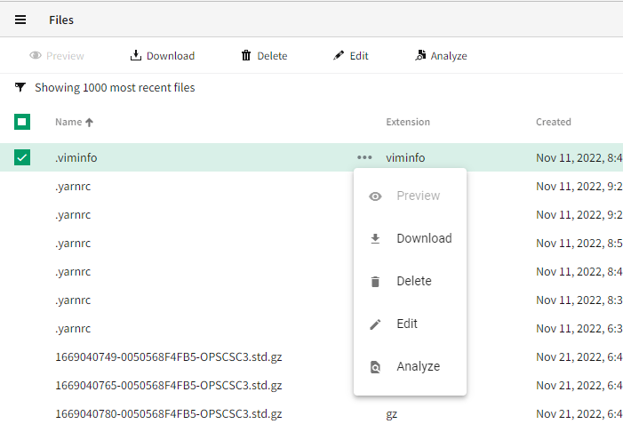

# Nimble Table Action Menu API

## Problem Statement

In some tables, such as many tables within SLE, there is a need to put a menu button within a row of the table. The `nimble-table` should provide a way for clients to accomplish this to avoid code duplication and promote consistency.

### Out of scope of this HLD

-   The interaction of the menu opening and closing in coordination with row selection is out of scope for this HLD. This interaction will be discussed when row selection is defined.

## Links To Relevant Work Items and Reference Material

[Table Spec](./README.md)

Example action menu in SLE


## Implementation / Design

### Client-facing API

There are three pieces of configuration that must be provided by a client in order to use the action menu:

1. Specifying which column, or columns, an action menu will be visible within
2. Specifying the menu and its items to show when a menu button is open
3. Specifying a label to associate with a menu button for accessibility purposes, localized as necessary based on an application's requirements

The nimble design system will be opinionated about many details of the menu button within a table. Therefore, a client will not be able to configure the exact details of the menu button itself, such as:

-   The appearance mode of the button
-   The icon shown within the button
-   When the button becomes visible (e.g. always visible, visible on hover/selection only, etc.)

If the need arises for a client to have more control of the menu button's configuration, the API can be extended at a later time.

A client can specify that a column has an action menu within it by adding the `action-menu-slot` attribute on that column definition. The value of the `action-menu-slot` attribute is the name of the slot containing the menu associated with the column. Columns with an action menu should also specify a `action-menu-label` that provides a string to use as the accessible label for the button. In the example below, a menu will be added to the _First name_ column only:

```HTML
<nimble-table>
    <nimble-table-column-text field-name="firstName" action-menu-slot="action-menu" action-menu-label="Configure user">First name</nimble-table-column-text>
    <nimble-table-column-text field-name="lastName">Last name</nimble-table-column-text>

    <nimble-menu slot="action-menu">
        <nimble-menu-item>My first action</nimble-menu-item>
        <nimble-menu-item>My second action</nimble-menu-item>
        <nimble-menu-item>My last action</nimble-menu-item>
    </nimble-menu>
</nimble-table>
```

Menus can be added to multiple columns:

```HTML
<nimble-table>
    <nimble-table-column-text field-name="firstName" action-menu-slot="action-menu-1" action-menu-label="Configure first name">First name</nimble-table-column-text>
    <nimble-table-column-text field-name="lastName" action-menu-slot="action-menu-2" action-menu-label="Configure last name">Last name</nimble-table-column-text>

    <nimble-menu slot="action-menu-1">
        <nimble-menu-item>My first action</nimble-menu-item>
        <nimble-menu-item>My second action</nimble-menu-item>
        <nimble-menu-item>My last action</nimble-menu-item>
    </nimble-menu>

    <nimble-menu slot="action-menu-2">
        <nimble-menu-item>Another first action</nimble-menu-item>
        <nimble-menu-item>Another second action</nimble-menu-item>
        <nimble-menu-item>Another last action</nimble-menu-item>
    </nimble-menu>
</nimble-table>
```

A menu can be shared between columns by specifying the same slot name for multiple columns:

```HTML
<nimble-table>
    <nimble-table-column-text field-name="firstName" action-menu-slot="action-menu" action-menu-label="Configure first name">First name</nimble-table-column-text>
    <nimble-table-column-text field-name="lastName" action-menu-slot="action-menu" action-menu-label="Configure last name">Last name</nimble-table-column-text>

    <nimble-menu slot="action-menu">
        <nimble-menu-item>My first action</nimble-menu-item>
        <nimble-menu-item>My second action</nimble-menu-item>
        <nimble-menu-item>My last action</nimble-menu-item>
    </nimble-menu>
</nimble-table>
```

If an application requires different menu items or different menu item states for different records in the table, the client is responsible for ensuring that the items in the menu are correct for the records(s) and column that the menu is associated with. This can be done by handling the `action-menu-beforetoggle` event on the table and updating the menu items as appropriate. The `action-menu-beforetoggle` event will include the following in its details:

-   `newState` - boolean - The value of `open` on the menu button that the element is transitioning in to.
-   `oldState` - boolean - The value of `open` on the menu button that the element is transitioning out of.
-   `recordIds` - string array - The IDs of the records that the menu is associated with.
-   `columnId` - string | undefined - The column ID of the column that the menu is associated with.

When an item in the menu is activated, the standard events associated with the menu and menu items will be emitted. The event details will not contain any information about the table, its records, or its columns. Therefore, clients should use the `action-menu-beforetoggle` event to cache any necessary context about which records and column the menu is associated with in order to handle menu events appropriately.

### Implementation

#### Slot Forwarding

In order for a menu slotted within the table to be slotted within a cell's `nimble-menu-button`, the menu needs to be "forwarded" from the table to a row and then to a cell. The table will first determine the set of slots that need to exist based on every column that is configured with an `action-menu-slot` attribute. Those slots will be created within the table, and the set of slots will be passed to the `nimble-table-row` so that it can also create appropriate slots. While there could be a number of slots within the table and a table's row, the slotted menus will be assigned to the correct row and cell based on events when the menu is opened. The templates will dyanamically rename their slots to ensure that the menus are slotted in the correct row and cell.

For example, the table's template will look something like this:

```HTML
<template>
    ...
    <nimble-table-row>
        ${repeat(() => table.actionMenuSlotNames, html<string, Table>`
            <slot
                name="${(x, c) => (table.openActionMenuRowId === row.id) ? x : 'nimble-table-empty-action-menu')}"
                slot="${x => `row-action-menu-${x}`}">
            </slot>
        `)}
    </nimble-table-row>
    ...
</template>
```

Note: The template above has been simplified and uses references to `table` and `row` to represent accessing information from the `Table` class and the `TableRowState` interface.

#### Updates to `nimble-menu-button`

To implement the design described above, a few changes need to be made to the existing `nimble-menu-button`:

-   Add a `beforetoggle` event that gets fired immediately before the menu is opened or closed. This new event will allow the table to slot the menu into the correct row and cell prior to the menu actually opening. This is important to ensure that the menu items can be focused correctly upon the menu opening.
-   Update the code that gets the slotted menu. Currently, the code only looks for the first element in the `menu` slot. With the design above, the menu element will be nested within a few `slot` elements, so the code will be updated to handle both DOM structures.

### Framework Integration

There is no framework-specific integration work necessary with this design. One large benefit of the approach to slot a menu within the table is that applications written using frameworks can use framework-specific mechanisms to build the menu/menu-items and handle events associated with the menu.

## Alternative Implementations / Designs

### Provide column IDs to the table to specify columns with menus

Rather than configuring a column to have a menu by adding an attribute to the column definition, a column could be configured to have a menu by adding a property to the table that is the array of column IDs that should have a menu. This is not ideal for a few different reasons:

-   It requires columns to have IDs when this may not otherwise be necessary.
-   It is more error prone because mistakes could be made keeping the configuration of column IDs in sync between the column definitions and table configuration.

## Open Issues

-   Can the action menu be opened for multiple rows at the same time? This doesn't become possible until the table supports row selection, but it can impact the API. To be the most future-proof, the API is designed such that the `action-menu-beforetoggle` event includes an array of row IDs rather than a single row ID string.
-   The details of the visual/interaction design still need to be finalized by the designers, but these details should have minimal impact on the implementation. Some items that need to be finalized are:
    -   What icon will be used for the menu? Will it still be the three dots in a horizontal line?
    -   What is the exact interaction with the menu being visible on hover?
    -   Is the space of the menu-button always reserved within a column, or does the space collapse when the button is hidden?
    -   How does the menu interact with row selection? This is a future-looking question because the table does not currently support selection.
