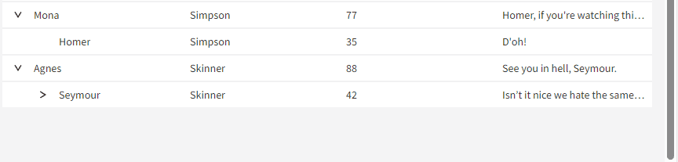

# Data Hierarchy

## Problem Statement

There are scenarios where clients want to provide collapsible hierarchy to the rows being presented in the table, where both parent and children rows provide values in typically at least a subset of the same columns.

For example, consider a table of geographic information that included location, population, flag, and possibly other location-related information. The location column could be either a continent, country, state, or any sub-regional construct. It would be reasonable to want to present this information in a way that allowed a user to collapse/expand any outer regional grouping, which itself would contain all rows whose locations existed inside it (e.g. 'United States' would be parent of all rows whose location was a U.S. state).

### Lazy Loading

In addition to just supporting data hierarchy with a fully provided set of data, we also need to support the scenario where a row is presented as a parent, but none of its children are currently represented in the data. Upon expanding the row, the client is then expected to load all of the data for that parent and provide it to the table (via the standard `setData` method).

## Links To Relevant Work Items and Reference Material

-   [#890: Design for hierarchical data support in tables](https://github.com/ni/nimble/issues/890)
-   [#861: Table hierarchical data support](https://github.com/ni/nimble/issues/861)
-   [Prototype using flat list that includes a parentId](https://github.com/ni/nimble/tree/data-hierarchy-flat-list-prototype) with [Storybook](https://60e89457a987cf003efc0a5b-qzwoshcidz.chromatic.com/?path=/story/incubating-table--table&args=data:LargeDataSet)
-   [Prototype with user data being hierarchical](https://github.com/ni/nimble/tree/data-hierarchy-prototype) with [Storybook](https://60e89457a987cf003efc0a5b-yncupvnoes.chromatic.com/?path=/story/incubating-table--table&args=data:LargeDataSet)

## Implementation / Design

Users will provide hierarchical data as a flat list (just as they do for non-hierarchical data), but will have to include a field in their data that is representative of the "parent Id" for that record of data.

### `Table` API

```ts
public Table() {
    ...
    // This attribute determines which field in the record specifies the id that is the
    // parent row. If it is not set, the data is presented without hierarchy as a flat list.
    @attr({ attribute: 'parent-id-field-name' })
    public parentIdFieldName?: string;

    // This field would be an option for how we allow a user to specify the field
    // name where they will provide a value indicating whether or not that row
    // should always contain an expand-collapse button.
    @attr({ attribute: 'force-expandable-field-name' })
    public forceExpandableFieldName?: string;

    // The set of rows the user would like to expand. Pass 'true' for `expandChildren` if all
    // children rows parented under any specified in rowIds should also be expanded.
    public async expandRows(rowIds: string[], expandChildren?: boolean): Promise<void> {
        ...
    }

    // The set of rows the user would like to collapse. Pass 'true' for `collapseChildren` if all
    // children rows parented under any specified in rowIds should also be collapsed.
    public async collapseRows(rowIds: string[], collapseChildren?: boolean) Promise<void> {
        ...
    }
}
```

### `TableRowExpandedEventDetail` API

The `Table` will also provide a `row-expand-toggle` event for when a row is expanded/collapsed that will provide details to the client including which row was expanded/collapsed, and what its new state is:

```ts
interface TableRowExpandedEventDetail {
    newState: boolean;
    oldState: boolean;
    recordId: string;
}
```

Note: This event will _not_ be emitted for group rows.

### Interactions

The following are various expected mouse and keyboard interactions related to parent rows:

1. The collapse-all button in the header will also collapse parent rows.
2. Clicking on a parent row (not on the expand/collapse button) will select the parent row. If the table `selectionMode` is set to `none`, then if a user clicks on a parent row (again _not_ on the expand/collapse button) nothing occurs.
3. Keyboard interactions are being defined as part of the [Table Keyboard Navigation HLD](https://github.com/ni/nimble/pull/1506).

### Validation

Tha table will be invalid if the user has set the `parentIdFieldName` attribute but not the `idFieldName`. Additionally, the table will be invalid if the user has set the `forceExpandCollapseFieldName` attribute but not the `parentIdFieldName`.

### Lazy Loading

The APIs noted above will enable the client to lazy load data into the `Table`. This will essentially be accomplished with the following steps:

1. Providing a field in a record of the table data that indicates whether that row of data is intended to be a parent row. Records that are intended to be parents must set the value of the field, whose name is specified by the `forceExpandCollapseFieldName` attribute, to `true`.
2. After providing the current data to the `Table` via the `setData` method, all rows that have a value of `true` in the field specified by the `forceExpandCollapseFieldName` attribute will display and expand/collapse button.
3. Clients must register a handler for the `row-expand-toggle` event on the `Table` instance, and will receive that event upon clicking the expand/collapse button.
4. The details of the handled event will include the id for the row that was expanded.
5. The client must then create a set of data with rows where they provide a field with the name specified by the `parendIdFieldName` attribute that has the value of the `recordId` value supplied in the event details.
6. The client then sets the data on the `Table` again with the `setData` method.

_Note: It is up to the client to manage whether or not the children of a row has already been loaded in order to avoid recreation of their data and calling `setData` on the `Table` unnecessarily._

### Translating flat list to Tanstack-understandable hierarchy

Tanstack provides APIs for us to implement that allow it to return the rows in a hierarchical fashion where child rows are provided as a property on a row called `subRows`. For this to work as expected it is required that a flat list of data (that contains implicit hierarchy) be transformed into a hierarchical data structure.

A third party library called [`performant-array-to-tree`](https://www.npmjs.com/package/performant-array-to-tree) offers an easy, and as the package says, performant means of doing this (in O(n) time). It comes with an MIT license, and is apparently fully tested, so it seems like it would be suitable to use for this purpose.

_Note: When creating the hierarchical data structure we should create a new field in the data structure that is not expected to conflict with any existing fields, such as with a prefix that we don't expect clients to be using (e.g. "nimble-hierarchical-data")._

### Group rows with data hierarchy

Tanstack allows limited support of data modeling where there is both grouping and parent-child row relationships. Essentially, when there is grouping present, only rows at the top-level of a hierarchical set of data will be grouped. Child rows will continue to be shown under their parent row rather than being grouped based on their own data.

I see no reason to explicitly disable this behavior. One behavior we will need to ensure, however, is that the count value we display in the group row, is _only_ the number of immediate children in the group row. It would be odd for the number to change just because a row was expanded (such as in the
lazy loading case).

#### Managing expanded state

Currently, the `Table` defaults to expanding all rows by setting its Tanstack expanded state to the singleton `true`. This means that all group rows will be expanded by default. The Nimble `Table` also provides an implementation of `getIsRowExpanded` which is consumed by `TanStack` that will ultimately result in the per-row state of whether the row is expanded. It is in this implementation, where even if the Tanstack state is set to `true`, we can mark all parent rows, by default, as collapsed, which is required for the lazy-loading scenario.

This is achievable because the Nimble `Table` currently tracks when particular rows are collapsed by their row id, which both group and parent rows have. When the Tanstack state has the singleton value of `true` we know we are in a default expand/collapsed state (meaning the user hasn't interactively changed anything), as otherwise it will be a set of id values matched with a boolean state. This will allow us to implement a behavior in `getIsRowExpanded` that will denote group rows as expanded, but parent rows as collapsed, specifically when the TanStack expanded state is set to `true`.

Once _any_ row has been expanded or collapsed, we must update the Nimble `Table` state where we track collapsed rows with _all_ rows that are currently collapsed. This will be a one-time cost. Prototyping suggests that the performance penalty isn't that noticeable.

### Showing a progress indicator for lazy loading

After a user clicks on a parent row to expand it, and that parent does not have children yet, there could be a noticeable delay between when the user clicked the expand button, and when the children show up in the table. This could happen for a variety of reasons, but commonly might occur due to a slow network request.

It would be helpful for the `Table` to visually represent the state that it is currently waiting on data to be loaded from the client. It can accomplish this fairly easily using existing state with no additional APIs or new components.

Prototype visual:



This ultimately will put the burden on the client to ensure that the `Table` is updated as needed to get rid of any displayed progress indicator, including in scenarios where the expansion of a parent row failed to load any children (possibly due to some client-side error). The `Table` will only guarantee that the progress indicator is shown when a parent row is expanded and it currently has no children, and that it will be removed once children are present.

Expected user workflow:

1. User loads data into table that specifies some rows as parents, but has no rows that indicate that row as a parent.
2. User clicks on a parent row
3. Row expands showing "row loading" indicator
4. User handles event that row was expanded
5. User sets data on table that has children for the row that was expanded
6. "Row loading" indicator is removed and child rows are now displayed

_Notes: When the new children are finally displayed, scroll position will be maintained in that the scroll index isn't adjusted. So a row that is currently displayed at the top of the table can be pushed down if new rows are added above it. Additionally, any previously expanded rows should remain expanded._

Error workflow:

1. Same as steps 1-4 above
2. Error occurs retrieving data for child rows
3. User calls `collapseRows(...)` on table instance passing parent row id that was previously expanded.
4. Row is collapsed and "row loading" indicator is no longer displayed.
5. Client should also provide appropriate error messaging within the application

### Sorting

Tanstack will sort children within each parent row by the same column that the parent is being sorted by. So, it will not be possible to sort children by a different column value than the one its parent is sorted by.

### Selection

Parent rows when selected, regardless of the selection mode that is set on the table, will _not_ select all of the children under that parent. That is, parent rows will behave in the exact same way as leaf rows with respect to selection. Thus, parents will _not_ show an indetermiate selection state if there are some children selected and some are not, as a parent's selection state is only determined by its own selection<sup>1</sup>.

<sup>1</sup>_The "leaf-only" mode mentioned in the 'Future work' section presents a caveat to this, in which parent rows are explicitly configured to not support certain actions, but we still may allow a user to perform selection through._

### ARIA

A parent row would have the same ARIA expectations of any child row, with the additional need to supply the `aria-expanded` attribute when it is expanded.

Things to consider:

-   Putting an appropriate label/title on the progress indicator for the lazy loaded row placeholder.
-   Expand/collapse button attributes for the parent row. Likely should just match what is done for the group row.

### Future work

#### Leaf-only mode

There are existing SLE grid variants (namely the Tags grid) that provide a type of hierarchical display that doesn't align exactly with either the proposed 'data hierarchy' outlined in this HLD, nor the grouping capability. Instead, while the parent rows may possibly be presented as a normal row (containing values in some subset of columns that the children have values for), they will not be able to be acted upon in the way child rows can, such as allowing an action menu to be defined on them, or being selected individually.

It is expected that this mode will involve creating a new API on the table in order to fully enable, but it should be able to use the other APIs defined in this HLD to support it, and leverage capabilities such as lazy-loading.

Here are a few of the considerations that were made with respect to this mode:

-   grouping should group on leaf items, not parents (could be cumbersome to accomplish with Tanstack)
-   action menu only on leafs
-   single selection mode can only select leafs
-   selection state (when set to `multiple`) of parents (if selected) should become indetermine when new rows loaded (e.g. via lazy loading)
-   selection counts should ignore parents
-   (maybe?) leaf-mode + multi-selection + lazy loading is considered an invalid confiuguration. This could mean that the Table API of `forceExpandCollapseFieldName` should be more semantically associated with lazy loading.
    -   (alternative?): Could we instead just hide the selection checkbox for parent rows that have no children?

#### Auto-expand-parent API

Currently, the proposed default behavior of parent rows is that they will display as collapsed initially (unlike groups). This is primarily done to support the lazy-loading case where we never want a row that has no children to default to being expanded. We could add an API that allows a user to determine what the default state of parents should be, which would ultimately not apply to rows that have no children (i.e. rows with children could be auto expanded, but any parent rows without children would remain collapsed).

## Alternative Implementations / Designs

### `TableRecord` hierarchical data structure

By making the `TableRecord` support hierarchy in its structure, it seemed possible that there would have been a performance benefit, as there would be no need to reformat the data internally for Tanstack to consume it properly. However, I believe we can discard this option for the following reasons:

-   There is no clear way to provide a strong type for `TableRecord` that would have a reserved field name of something like `subRows` that itself would be typed to an array of `TableRecord`.
-   The performance profile between the prototypes of a hierarchical data structure, and a flat list were pretty close with one another.

## Open Issues

-   Need visual design for "row loading" indicator.
