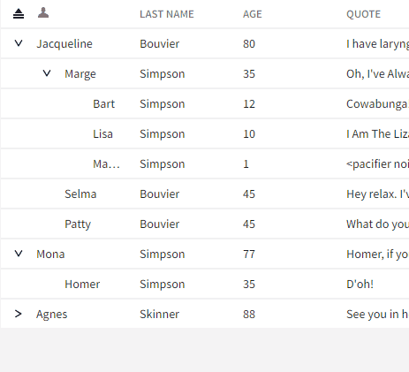

# Data Hierarchy

## Problem Statement

There are scenarios where clients want to provide collapsible hierarchy to the rows being presented in the table, where both parent and children rows provide values in a common set of columns.

For example, consider a table of geographic information that included location, population, flag, and possibly other location-related information. The location column could be either a continent, country, state, or any sub-regional construct. It would be reasonable to want to present this information in a way that allowed a user to collapse/expand any outer regional grouping, which itself would contain all rows whose locations existed inside it (e.g. 'United States' would be parent of all rows whose location was a U.S. state).

### Lazy Loading

In addition to just supporting data hierarchy with a fully provided set of data, we also need to support the scenario where a row is presented as a parent, but none of its children are currently represented in the data. Upon expanding the row, the client is then expected to load all of the data for that parent and provide it to the table (via the standard `setData` method).

## Links To Relevant Work Items and Reference Material

-   [#890: Design for hierarchical data support in tables](https://github.com/ni/nimble/issues/890)
-   [#861: Table hierarchical data support](https://github.com/ni/nimble/issues/861)
-   [Prototype using flat list that includes a parentId](https://github.com/ni/nimble/tree/data-hierarchy-flat-list-prototype) with [Storybook](https://60e89457a987cf003efc0a5b-qzwoshcidz.chromatic.com/?path=/story/incubating-table--table&args=data:LargeDataSet)
-   [Prototype with user data being hierarchical](https://github.com/ni/nimble/tree/data-hierarchy-prototype) with [Storybook](https://60e89457a987cf003efc0a5b-yncupvnoes.chromatic.com/?path=/story/incubating-table--table&args=data:LargeDataSet)

## Implementation / Design

Clients will provide hierarchical data as a flat list (just as they do for non-hierarchical data), but they will have to include a field in their data that is representative of the "parent Id" for that record of data.

### `Table` API for specifying hierarchical data

```ts
public Table() {
    ...
    // This attribute determines which field in the record specifies the id that is the
    // parent row. If it is not set, the data is presented without hierarchy as a flat list.
    @attr({ attribute: 'parent-id-field-name' })
    public parentIdFieldName?: string;

    // This attribute will determine the expand/collapse state of any parent row by default.
    // Note that for parent rows that have no children yet, they will always default to
    // collapsed, regardless of the state of this attribute.
    @attr({ attribute: 'auto-parent-expansion' })
    public autoParentExpansion?: boolean;
}
```

### `TableRowExpansionToggleEventDetail` API

The `Table` will also provide a `row-expansion-toggle` event for when a row is expanded/collapsed that will provide details to the client including which row was expanded/collapsed, and what its new state is:

```ts
interface TableRowExpansionToggleEventDetail {
    newState: boolean;
    oldState: boolean;
    recordId: string;
}
```

Note: This event will _not_ be emitted for group rows.

### `Table` API for specifying lazy loaded hierarchical data

In some cases, a client might know that a given row has children, but for performance reasons, that data hasn't been loaded from the backend and given to the table. To enable this use case, there will be an API on the table to specify that a given row should be expandable even if it has no children within the data and to specify that a row is loading its children. That API will look as follows:

```ts
interface TableRowOptions {
    // Specifies whether or not the row should show the expand-collapse button
    // even if it does not have any children in the data.
    forceExpandable: boolean;

    // Specifies whether or not the row should be in a state of loading its
    // children.
    loading: boolean;
}
    
public Table() {
    ...
    // Sets the options for the rows specified by the passed IDs.
    public async setRowOptions(rowOptions: { id: string, options: TableRowOptions }[]): Promise<void>;
}
```

The loading state of a row will look as follows:



Some notes about the `setRowOptions` API:
- previously set row options will be cleared when `setData` is called
- previously set row options will be cleared with the table's `idFieldName` changes
- an option associated with a row ID that does not match a record in the data will be ignored
- calling `setRowOptions` when row options have already been set on the table will have the following behavior:
    - existing options not passed in the new `rowOptions` array will be left unmodified
    - existing options passed in the new `rowOptions` array will be overwritten

The expected usage of the dynamically loaded hierarchy is as follows:

1. Call `setData` on the table with the records that are known
1. Call `setRowOptions` with an option of `{ forceExpandable: true, loading: false }` for IDs associated with records that are known to have children that have not been loaded.
1. Handle the `row-expansion-toggle` event on the table by doing the following for rows that need to dynamically load their data:
    1. Start loading the data in the background.
    1. Call `setRowOptions` on the table to update the state of the row whose data is being loaded to `{ forceExpandable: true, loading: true }`.
1. When the dynamically loaded data has finished loading, call `setData` on the table with the new data.
1. Call `setRowOptions` with the updated row state of each row that is either still loading or still has data that hasn't been loaded yet.

_The client is responsible for checking if the row’s children have already been loaded. This can prevent unnecessary data recreation and `setData` calls on the `Table`._

### Interactions

The following are various expected mouse and keyboard interactions related to parent rows:

1. The collapse-all button in the header will also collapse parent rows.
2. Clicking on a parent row (not on the expand/collapse button) will select the parent row. If the table `selectionMode` is set to `none`, then if a user clicks on a parent row (again _not_ on the expand/collapse button) nothing occurs.
3. Keyboard interactions are being defined as part of the [Table Keyboard Navigation HLD](https://github.com/ni/nimble/pull/1506).

### Validation

The table will be invalid if the user has set the `parentIdFieldName` attribute but not the `idFieldName`.

Additionally, we will mark the table as invalid if the hierarchical representation of the data has less elements than the array that was transformed. This can happen if the incoming data either has specified parents for children that do not exist, or if there are circular child-parent relationships defined.

### Translating flat list to Tanstack-understandable hierarchy

Tanstack provides the `getSubRows` API for us to implement that allows it to return the rows in a hierarchical fashion. To leverage this functionality, the flat list of data passed to the table via `setData()` will be transformed into a hierarchical data structure.

A third party library called [`performant-array-to-tree`](https://www.npmjs.com/package/performant-array-to-tree) offers an easy, and as the package says, performant means of doing this (in O(n) time). It comes with an MIT license, and is apparently fully tested, so it seems like it would be suitable to use for this purpose.

_Note: When creating the hierarchical data structure we should create a new field in the data structure that is not expected to conflict with any existing fields, such as with a prefix that we don't expect clients to be using (e.g. "nimble-hierarchical-data")._

### Group rows with data hierarchy

Tanstack allows limited support of data modeling where there is both grouping and parent-child row relationships. Essentially, when there is grouping present, only rows at the top-level of a hierarchical set of data will be grouped. Child rows will continue to be shown under their parent row rather than being grouped based on their own data.

I see no reason to explicitly disable this behavior. One behavior we will need to ensure, however, is that the count value we display in the group row, is _only_ the number of immediate children in the group row. It would be odd for the number to change just because a row was expanded (such as in the
lazy loading case).

#### Managing expanded state

Currently, the `Table` defaults to expanding all rows by setting its Tanstack expanded state to the singleton `true`. This means that all group rows will be expanded by default. The Nimble `Table` also provides an implementation of `getIsRowExpanded` which is consumed by `TanStack` that will ultimately result in the per-row state of whether the row is expanded. It is in this implementation, where even if the Tanstack state is set to `true`, we can mark all parent rows, by default, as collapsed, which is required for the lazy-loading scenario.

This is achievable because the Nimble `Table` currently tracks when particular rows are collapsed by their row id, which both group and parent rows have. When the Tanstack state has the singleton value of `true` we know we are in a default expand/collapsed state (meaning the user hasn't interactively changed anything), as otherwise it will be a set of id values matched with a boolean state. This will allow us to implement a behavior in `getIsRowExpanded` that will denote group rows as expanded, but parent rows as collapsed, specifically when the TanStack expanded state is set to `true`.

Once _any_ row has been expanded or collapsed, we must update the Nimble `Table` state where we track collapsed rows with _all_ rows that are currently collapsed. This will be a one-time cost. Prototyping suggests that the performance penalty isn't that noticeable.

### Sorting

Tanstack will sort children within each parent row by the same column that the parent is being sorted by. So, it will not be possible to sort children by a different column value than the one its parent is sorted by.

Additionally, sorting has a lower precedence than data hierarchy. Thus, there is no guarantee that a "largest" value for a column will be sorted such that that row will be either the first or last row, as all leaf-level rows will be sorted within the context of their parent.

### Selection

Parent rows when selected, regardless of the selection mode that is set on the table, will _not_ select all of the children under that parent. That is, parent rows will behave in the exact same way as leaf rows with respect to selection. Thus, parents will _not_ show an indetermiate selection state if there are some children selected and some are not, as a parent's selection state is only determined by its own selection<sup>1</sup>.

<sup>1</sup>_The "leaf-only" mode mentioned in the 'Future work' section presents a caveat to this, in which parent rows are explicitly configured to not support certain actions, but we still may allow a user to perform selection through._

### ARIA

A parent row would have the same ARIA expectations of any child row, with the additional need to supply the `aria-expanded` attribute when it is expanded.

Things to consider:

-   Putting an appropriate label/title on the progress indicator for the lazy loaded row placeholder.
-   Expand/collapse button attributes for the parent row. Likely should just match what is done for the group row.

### Future work

#### Leaf-only mode

There are existing SLE grid variants (namely the Tags grid) that provide a type of hierarchical display that doesn't align exactly with either the proposed 'data hierarchy' outlined in this HLD, nor the grouping capability. Instead, while the parent rows may possibly be presented as a normal row (containing values in some subset of columns that the children have values for), they will not be able to be acted upon in the way child rows can, such as allowing an action menu to be defined on them, or being selected individually.

It is expected that this mode will involve creating a new API on the table in order to fully enable, but it should be able to use the other APIs defined in this HLD to support it, and leverage capabilities such as lazy-loading.

Here are a few of the considerations that were made with respect to this mode:

-   grouping should group on leaf items, not parents (could be cumbersome to accomplish with Tanstack)
-   action menu only on leafs
-   single selection mode can only select leafs
-   selection state (when set to `multiple`) of parents (if selected) should become indetermine when new rows loaded (e.g. via lazy loading)
-   selection counts should ignore parents
-   (maybe?) leaf-mode + multi-selection + lazy loading is considered an invalid confiuguration. This could mean that the Table API of `forceExpandCollapseFieldName` should be more semantically associated with lazy loading.
    -   (alternative?): Could we instead just hide the selection checkbox for parent rows that have no children?

## Alternative Implementations / Designs

### `TableRecord` hierarchical data structure

By making the `TableRecord` support hierarchy in its structure, it seemed possible that there would have been a performance benefit, as there would be no need to reformat the data internally for Tanstack to consume it properly. However, I believe we can discard this option for the following reasons:

-   There is no clear way to provide a strong type for `TableRecord` that would have a reserved field name of something like `subRows` that itself would be typed to an array of `TableRecord`.
-   The performance profile between the prototypes of a hierarchical data structure, and a flat list were pretty close with one another.

## Open Issues

-   We should also consider interactive/visual designs for situations where the client failed to load data for a row that was supposed to lazy-load its data. Some questions we should try to answer are:
    -   Should the table represent the error state visually, and if so how?
    -   Should the table surface any UI to "refresh" a data retrieval attempt. If so, what should that look like?
-   The set of proposed APIs and behaviors described so far don't seem to cover the SLE Steps Grid use case. **Resolved: Ultimately, the Steps grid should likely be using a significantly different UX than what it currently has, and we are opting to not introduce features and capabilities into the Nimble table to support a sub-optimal UX.**
