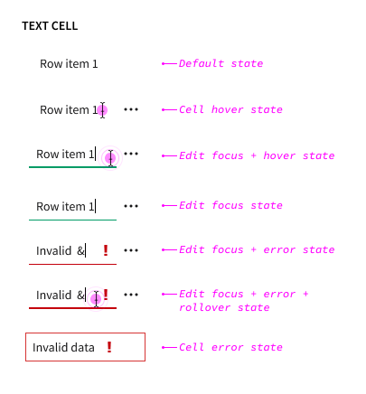
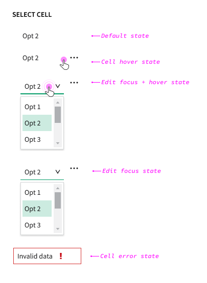
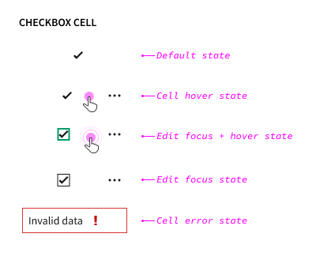

# Nimble Editable Table (IxD)

## Overview

Nimble table support for interactive cell editing.

### Background

- [Figma worksheet](https://www.figma.com/design/r2yGNQNVFdE7cBO9CyHmQx/Nimble---IxD?node-id=1221-36463)
- [Input table columns (select, text field, etc) #1190](https://github.com/ni/nimble/issues/1190)

## Usage

**When to use:**

- When the table is used to display and edit structured engineering data such as measurements, specifications, or configurations.
- When inline editing can improve the user experience by reducing the need for separate forms or dialogs.
- When data accuracy can be ensured through validation and error handling mechanisms.

**When not to use:**

- When the table is used for displaying static or read-only data.
- When the user requires guidance entering or modifying data and would be best served by a form or other UX pattern.
- When the application requires spreadsheet features like pasting or filling data into a range of cells

## Requirements

- Inline editing support for table cells
- Validation and error handling for input data
- Initiate cell editing via keyboard or mouse
- Support for strings and numbers (1st priority)
- Support for enumerated values (2nd priority)
- All cells within a particular column share the same edit view and configuration
- Compatibility with assistive technologies (e.g., screen readers)

### Out of scope

- Support for complex data types (e.g., dates, times, custom objects)
- Advanced spreadsheet functionalities (e.g., formulas, cell references)
- Real-time collaboration or multi-user editing
- Custom cell styling or formatting

## Anatomy

| Element               | Description                                                              |
| --------------------- | ------------------------------------------------------------------------ |
| Static cell value     | Non-editable display of cell value                                       |
| Action button         | Button to open cell context menu. Appears on row hover or keyboard focus |
| Editable cell control | Text or numeric control that supports entering or editing cell data      |

## Behavior

### States

#### Error State

### ARIA Considerations

- Maintain compatibility with existing keyboard navigation behavior
- Consider resolving [existing ARIA gaps](https://github.com/ni/nimble/issues/2285)
- Consider adding `aria-readonly` for non-editable cells

### Mouse Interactions

- Editable table cells show the same row hover state as non-editable cells on mouse hover.
    - I.e. When hovering over a row, the action menu button appears. Depending on the table's selection mode, the row may be highlighted.
- The cursor will change from an *arrow cursor* when hovering over editable cells
    - To a *text cursor* when hovering over cells with editable text or numeric controls
    - To a *hand cursor* when hovering over select or boolean controls
- Single clicking editable cell shows the *edit focus* state.
- Clicking away from a focused editable cell sets the value and removes *edit focus*.

### Keyboard Interactions

- When a cell has keyboard focus (*cell focus* state), pressing `TAB` or `ENTER` transforms the cell into an input control in the *edit focus* state.
- When a cell has *edit focus*, pressing `TAB` moves the focus to the action button, or to the next available focus target.

- When a cell has *edit focus*, pressing `ENTER` sets the value and transforms it into the *cell focus* state.

- When a cell has *edit focus*, pressing `ESCAPE` reverts any value change and transforms it into the *cell focus* state.

- User edits are validated on entry. If the entered data is invalid,
    - the error is shown in the *edit focus + error* state.
    - pressing `TAB`, `ENTER` or `ESC` resets the cell to the most recent valid value.
- Other invalid cell data is shown in the *cell error* state.

### Out of scope

The client application is responsible for defining and implementing workflows for adding, deleting, and moving rows, as well as saving data.

Example row editing UX:

Example save workflow:

#### Touch-Screen Devices

- The edit workflow should support touch screen devices.

## Open Issues

See content marked "**QUESTION**" or "**NOTE**".

## References

- [AG Grid](https://www.ag-grid.com/example/)
- [Patternfly](https://www.patternfly.org/components/table/react-deprecated/#editable-rows)
