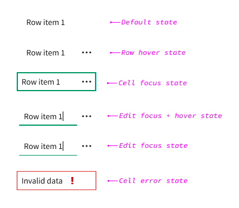
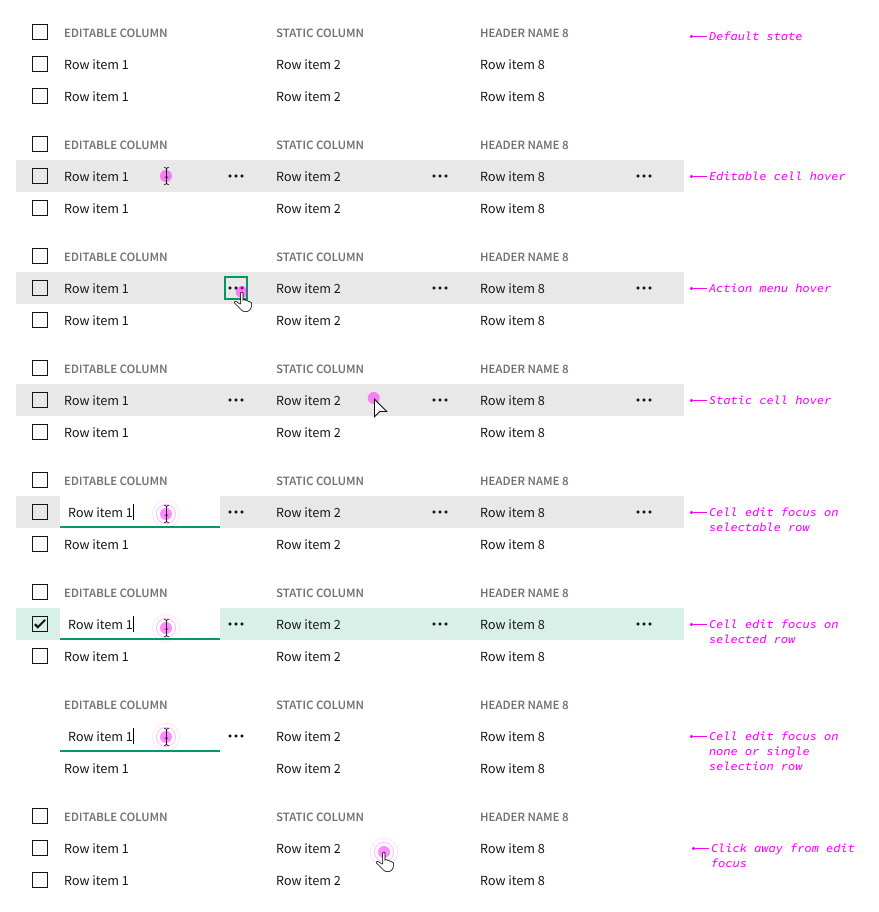
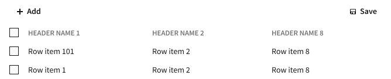

# Nimble Editable Table (IxD)

## Overview

Nimble table support for interactive cell editing.

### Background

-   [Figma worksheet](https://www.figma.com/design/r2yGNQNVFdE7cBO9CyHmQx/Nimble---IxD?node-id=1221-36463)
-   [Input table columns (select, text field, etc) #1190](https://github.com/ni/nimble/issues/1190)

## Usage

**When to use:**

-   When users need to quickly and efficiently update data directly within the table.
-   When inline editing can improve the user experience by reducing the need for separate forms or dialogs.
-   When the table is used in scenarios where data accuracy can be ensured through validation and error handling mechanisms.

**When not to use:**

-   When data integrity is critical and the table should not be modified by users.
-   When the table is used for displaying static or read-only data.
-   When the user interface requires a more complex data entry form.

## Anatomy

| Element               | Description                                                              |
| --------------------- | ------------------------------------------------------------------------ |
| Static cell value     | Non-editable display of cell value                                       |
| Action button         | Button to open cell context menu. Appears on row hover or keyboard focus |
| Editable cell control | Text or numeric control that supports entering or editing cell data      |

## Behavior

### States

#### Error State

### ARIA Considerations

-   Maintain compatibility with existing keyboard navigation behavior
-   Consider resolving [existing ARIA gaps](https://github.com/ni/nimble/issues/2285)

### Mouse Interactions

-   Editable table cells show the same row hover state as non-editable cells on mouse hover.
    -   I.e. When hovering over a row, the action menu button appears. Depending on the table's selection mode, the row may be highlighted.
-   Single clicking editable cell shows the cell focus state.
-   Double clicking the editable cell transforms the cell into an input control in the focus state.
-   Clicking away from a focused editable cell sets the value and transforms it into the Cell focus state.

### Non-Mouse Interactions

-   When a cell has keyboard focus (Cell focus state), pressing `TAB` or `ENTER` transforms the cell into an input control in the focus state (Edit focus state).
-   When a cell has Edit focus, pressing `TAB` moves the focus to the action button, or to the next available focus target.

-   When a cell has Edit focus, pressing `ENTER` sets the value and transforms it into the Cell focus state.

-   When a cell has Edit focus, pressing `ESCAPE` reverts any value change and transforms it into the Cell focus state.

-   When a cell has Edit focus, pressing `ENTER` validates the value, and if invalid, transforms the cell into the Cell error state.

### Out of scope

The client application is responsible for defining and implementing workflows for adding, deleting, and moving rows, as well as saving data.

Example row editing UX:

Example save workflow:

#### Touch-Screen Devices

-   The edit workflow should support touch screen devices.

## Open Issues

See content marked "**QUESTION**" or "**NOTE**".

## References

-   [AG Grid](https://www.ag-grid.com/example/)
-   [Patternfly](https://www.patternfly.org/components/table/react-deprecated/#editable-rows)
