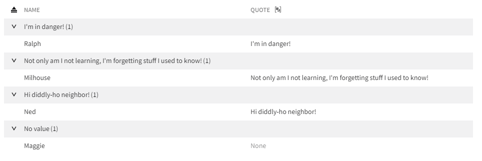

# Placeholders for table columns HLD

## Problem Statement

In some cases, an application may want to display a placeholder value in the table when a record does not have a value for a given field. The application should be able to customize that placeholder based on their needs.

## Links To Relevant Work Items and Reference Material

-   [Nimble issue 1538](https://github.com/ni/nimble/issues/1538)
-   [Nimble issue 1511](https://github.com/ni/nimble/issues/1511)

## Implementation / Design

### High-level behavior

There are two places where a value is displayed in the table that placeholders need to be considered: (1) in a cell and (2) in a group row. The cell placeholder will be configurable on each column that supports having a placeholder, and it will default to an empty string. The group row placeholder will come from the table's localization provider, and it will not be configurable through a column's API.

Placeholders within a cell will be rendered with nimble's placeholder font, which is currently 60% opacity of nimble's body font.

Placeholders within a group row will have no special visual treatment.

Below is an example of what placeholders will look like in the table. In this example, the table is grouped by the "Quote" column, which has been configured to have a placeholder value of "None".

### Column-specific decisions

The exact behavior of placeholders in each existing table column is described below.

#### Text column

| Special-cased field values | Cell display                                                 | Group row display |
| -------------------------- | ------------------------------------------------------------ | ----------------- |
| `undefined`                | column placeholder, or empty if no placeholder is configured | `"No value"`      |
| `null`                     | column placeholder, or empty if no placeholder is configured | `"No value"`      |
| `''`\*                     | \<empty cell>                                                | `"Empty"`         |

\*Only empty string (`''`) is treated as a special case for group row placeholders. Other whitespace values will be rendered as-is and should be pre-processed as appropriate by the application.

Column best practices:

-   Avoid mixing `undefined` and `null` as values for the same field. When grouping this will lead to two groups (one for `null` values and one for `undefined` values) that both have the text `"No value"`.
-   Avoid mixing empty string with `undefined`/`null`. The distinction when grouping between `"No value"` and `"Empty"` is not likely meaningful to a user.
-   Avoid displaying whitespace values that are not empty string (`''`) as these values will be rendered as-is in group rows.

#### Anchor column

| Special-cased field values                          | Cell display                                                       | Group row display |
| --------------------------------------------------- | ------------------------------------------------------------------ | ----------------- |
| Both label and href are `undefined` or `null`       | column placeholder, or empty if no placeholder is configured       | `"No value"`      |
| Label is `undefined` or `null` with defined href    | href value is used as the link's href and the link's display value | `"No value"`      |
| Label is defined with href of `undefined` or `null` | label as a plain string with no link                               | The label         |
| Label is `''` with any href\*                       | \<empty cell>                                                      | `"Empty"`         |

\*Only empty string (`''`) is treated as a special case for group row placeholders. Other whitespace values will be rendered as-is and should be pre-processed as appropriate by the application.

Column best practices:

-   Provide useful labels for well known urls. While an absent label will show the full URL for accessibility, it is useful to instead provide a clear and unique label to improve grouping.
    -   For example, a column of links to notebooks where a notebook may no longer exist, and thus a label is not available, could pre-process the notebook urls and create the label `Missing Notebook (UNIQUE_NOTEBOOK_ID)`. This allows multiple rows referencing the same missing notebook to be grouped together.
    -   Alternatively if the urls are not well-known structures, the application should explicitly provide the href as the label to keep unique labels and preserve grouping as opposed to using `null` / `undefined` labels.
-   Applications should avoid having duplicate labels to different hrefs as those are inaccessible to screen readers (and sighted users). See [high-level discussion](https://fae.disability.illinois.edu/rulesets/LINK_2/) of [aria SC 2.4.4](https://www.w3.org/TR/WCAG22/#link-purpose-in-context).
    -   For example, applications should avoid having `undefined` / `null` as the label as that causes multiple unrelated URLs to be grouped together under the group label "No value". Accessibility is okay as the full url will be shown but the value of grouping is limited.
    -   For example, if a label is missing, an application should avoid generating a non-unique label for multiple URLs (i.e. `Missing Notebook`) as that harms accessibility and limits the value of grouping.
-   Avoid using empty string or other whitespaces labels with defined hrefs. This will cause the rendered anchor to have no text associated with it, and it will be difficult for a user to see that the anchor exists.
-   Applications may leave the href as `null` / `undefined` to have the anchor column behave effectively like a string column
-   Avoid mixing `undefined` and `null` as values for the label field. When grouping this will lead to two groups (one for `null` values and one for `undefined` values) that both have the text `"No value"`.
    -   As explained above, it is not recommended to use `undefined` or `null` labels when the data has defined hrefs.
-   Avoid mixing empty string with `undefined`/`null` as values for the label field. The distinction when grouping between `"No value"` and `"Empty"` is not likely meaningful to a user.
    -   As explained above, it is not recommended to use empty string, `undefined`, or `null` labels when the data has defined hrefs.

#### Number column

| Special-cased field values | Cell display                                                 | Group row display |
| -------------------------- | ------------------------------------------------------------ | ----------------- |
| `undefined`                | column placeholder, or empty if no placeholder is configured | `"No value"`      |
| `null`                     | column placeholder, or empty if no placeholder is configured | `"No value"`      |

The alignment of the placeholder in the cell will match the alignment of the number in the column.

Column best practices:

-   Avoid mixing `undefined` and `null` as values for the same field. When grouping this will lead to two groups (one for `null` values and one for `undefined` values) that both have the text `"No value"`.
-   Avoid using IEEE 754 special cases of (`-Inf`, `+Inf`, and `NaN`).

#### Date column

| Special-cased field values          | Cell display                                                 | Group row display  |
| ----------------------------------- | ------------------------------------------------------------ | ------------------ |
| `undefined`                         | column placeholder, or empty if no placeholder is configured | `"No value"`       |
| `null`                              | column placeholder, or empty if no placeholder is configured | `"No value"`       |
| Invalid value (e.g. `Number.NaN`)\* | \<empty cell>                                                | \<empty group row> |

\*This is considered invalid data from the table's perspective and should be fixed within the client application.

Column best practices:

-   Avoid mixing `undefined` and `null` as values for the same field. When grouping this will lead to two groups (one for `null` values and one for `undefined` values) that both have the text `"No value"`.

#### Duration column

| Special-cased field values          | Cell display                                                 | Group row display  |
| ----------------------------------- | ------------------------------------------------------------ | ------------------ |
| `undefined`                         | column placeholder, or empty if no placeholder is configured | `"No value"`       |
| `null`                              | column placeholder, or empty if no placeholder is configured | `"No value"`       |
| Invalid value (e.g. `Number.NaN`)\* | \<empty cell>                                                | \<empty group row> |

\*This is considered invalid data from the table's perspective, and should be fixed within the client application.

Column best practices:

-   Avoid mixing `undefined` and `null` as values for the same field. When grouping this will lead to two groups (one for `null` values and one for `undefined` values) that both have the text `"No value"`.

#### Icon mapping column

The icon mapping column will not have a configuration for a placeholder.

| Special-cased field values | Cell display  | Group row display  |
| -------------------------- | ------------- | ------------------ |
| `undefined`                | \<empty cell> | `"No value"`       |
| `null`                     | \<empty cell> | `"No value"`       |
| Non-mapped value\*         | \<empty cell> | \<empty group row> |

\*This is considered invalid data from the table's perspective and should be fixed within the client application.

In the future we can add the ability to create a mapping to a blank icon. This will allow a column to specify that it doesn't want an icon to be displayed in a cell for certain record values, but the column can still display an application-specified label on group rows.

Column best practices:

-   Avoid mixing `undefined` and `null` as values for the same field. When grouping this will lead to two groups (one for `null` values and one for `undefined` values) that both have the text `"No value"`.
-   Avoid using values that do not correspond to a mapping for the column

#### Text mapping column

The text mapping column will not have a configuration for a placeholder.

| Special-cased field values | Cell display  | Group row display  |
| -------------------------- | ------------- | ------------------ |
| `undefined`                | \<empty cell> | `"No value"`       |
| `null`                     | \<empty cell> | `"No value"`       |
| Non-mapped value\*         | \<empty cell> | \<empty group row> |

\*This is considered invalid data from the table's perspective and should be fixed within the client application.

Column best practices:

-   Avoid mixing `undefined` and `null` as values for the same field. When grouping this will lead to two groups (one for `null` values and one for `undefined` values) that both have the text `"No value"`.
-   Avoid using values that do not correspond to a mapping for the column

### Implementation plan

A column's placeholder will be stored as part of that column's `columnConfig` object. There will be no changes to the `TableColumn`, `ColumnInternals`, or `ColumnInternalsOptions` classes. The placeholder from the `columnConfig` object will be used by the cell views when rendering the cell.

We will create a placeholder mixin that adds the following to columns that chose to use it:

-   `placeholder` string property
-   `placeholder` attribute
-   abstract `placeholderChanged` function that will force columns using the mixin to implement `placeholderChanged` to update their column configuration

The columns that will be updated to use this mixin are:

-   TableColumnText
-   TableColumnAnchor
-   TableColumnNumberText
-   TableColumnDateText
-   TableColumnDurationText

### Localization

All group row placeholder strings will be localized through the table's localization provider. Those strings are:

-   No value
-   Empty

If an application is localized, it can set a column's `placeholder` to a localized value.

## Alternative Implementations / Designs

### Configurable placeholders in group rows

In addition to extending column APIs to have a `placeholder` property, they could also be extended to have a `group-placeholder` property. However, this level of configuration is not required by any client applications today. This feature is also likely to introduce inconsistency throughout our applications.

If an application wants to modify the value of a group row placeholder without this feature, they can do so through the localization provider.

### Allow different placeholders to be configured for each cell

We could add the ability to have different placeholders configured for each cell, but this poses a few different problems:

1. This would likely need to be a drastically different API, such as having the placeholder specified in the record. That would lead to quite a bit of duplicate information being set on the table, particularly when there are no use cases for this right now.
1. This would lead to a confusing state for the user because the placholder would be different for various rows, but all those rows would be in a single group.

A use case for different information being presented to the user for each cell will likely be solved by [a different feature to show cell-specific state](https://github.com/ni/nimble/issues/1776).

## Future Work

In the future, we should extend the API for the icon column to support mapping a value to no icon. With this type of mapping, the cell would continue to show up as empty, but the label associated with that mapping would be used in the group row.

## Open Issues

_None_
