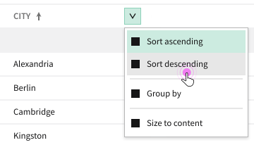

# Table Column Sorting HLD

## Problem Statement

There is a requirement to have table columns that can be sorted, both programmatically and interactively.

### Out of Scope of this HLD

-   Keyboard interactions for interactive sorting (see [#1137](https://github.com/ni/nimble/issues/1137))
-   Focusable element behavior for the column header (see [#1151](https://github.com/ni/nimble/issues/1151))

## Links To Relevant Work Items and Reference Material

-   [#874 Programmatically sort columns](https://github.com/ni/nimble/issues/874)
-   [#854 Interactively sort the columns in a table](https://github.com/ni/nimble/issues/854)
-   [Table README](./README.md)
-   [Table Design Doc](https://xd.adobe.com/view/5b476816-dad1-4671-b20a-efe796631c72-0e14/screen/d389dc1e-da4f-4a63-957b-f8b3cc9591b4/specs/)

## Implementation / Design

### API

The sorting state of the table will be declaritively defined within the `TableColumn` elements that are slotted within the table. A column will optionally be able to define its sort direction (i.e. `ascending` vs `descending`) and its sort index. The sort index enables a table to be sorted by multiple columns at the same time. For example, if a table should be sorted by a first name column and then a last name column, the first name column would have a sort index of 0, and the last name column would have a sort index of 1. This is a similar API to AG Grid, which provides [sort](https://www.ag-grid.com/javascript-data-grid/column-state/#reference-ColumnStateParams-sort) and [sortIndex](https://www.ag-grid.com/javascript-data-grid/column-state/#reference-ColumnStateParams-sortIndex) configurations.

In some cases, a client may want to configure their table to be sorted by a column that is not visible within the table. To enable this, a column within the table can be marked as hidden. A hidden column exists in the table to provide metadata that can be used for operations, such as sorting, but it is not rendered within the table.

A column within the table may not have a one-to-one mapping to a field within the table's data. For example, a hyperlink column might use two fields from the data: a string to use as the hyperlink's display and a string to use as the hyperlink's href. Because of this, a column must define which data field is used when sorting that column. That field is specified by a column definition by setting an `operandDataRecordFieldName` observable property that is set to the name of the field to use for sorting. For example, the text column would return the value of `fieldName` and the hyperlink column would return the field name associated with the display string.

The column definition will also be responsible for specifying the appropriate sort function to use based on the type of data it knows is associated with `operandDataRecordFieldName`. The sort function will be specified by a `sortOperation` observable property on the column, that returns a `TableColumnSortOperation` value. `TableColumnSortOperation` is a new enum that will be introduced that defines the set of sort functions that can be applied to a column. Initially, the enum will consist of the value `basic`, which will correspond to [TanStack's `basic` sort function](https://tanstack.com/table/v8/docs/api/features/sorting#sorting-functions), and the value `localeAwareCaseSensitive`, which will be backed by a function written within nimble. That function will leverage [localeCompare()](https://developer.mozilla.org/en-US/docs/Web/JavaScript/Reference/Global_Objects/String/localeCompare) to perform the sort.

For performance reasons, the table will not support custom sort functions on a column. Additionally, a column can only be sorted based on a single field within the table's data. These requirements guard against performance degradations from inefficient custom sort functions.

Interactive sorting will be enabled by default. Table consumers can disable sorting on individual columns via the `sorting-disabled` attribute (see the next section).

See the "Interactive Sorting UX" section below for the specific interactions for sorting.

#### Summary of new attributes on the base table column

These attributes are part of the public API for the column, and will be set by clients of the table.

| attribute name   | type                                                                                                         | default value                   | description                                                                                                                   |
| ---------------- | ------------------------------------------------------------------------------------------------------------ | ------------------------------- | ----------------------------------------------------------------------------------------------------------------------------- |
| sort-direction   | `TableColumnSortDirection`, defined as `{none: undefined, ascending: 'ascending', descending: 'descending'}` | `TableColumnSortDirection.none` | The direction the column is sorted ^                                                                                          |
| sort-index       | `number` or `null` \*                                                                                        | `null`                          | The index for sorting the column. When multiple columns are sorted, they will be sorted from lowest index to highest index. ^ |
| column-hidden    | `boolean`                                                                                                    | `false`                         | When set to true, do not render the column as part of the table                                                               |
| sorting-disabled | `boolean`                                                                                                    | `false`                         | When set to true, sorting is disabled for this column (both interactive and programmatic sorting)                             |

\* Note: The `sort-index` attribute is `number | null` because of the plan to use the `nullableNumberConverter` provided by FAST. That converter uses the value of `null` to represent non-number types rather than `undefined`, which is common within the nimble repo.

^ Note: If the sorting state has been modified by interactive sorting, `sort-direction` and `sort-index` will not reflect those updates, only the `currentSortDirection` and `currentSortIndex` properties will.

#### Summary of new properties on the base table column

These are internal properties on the column, and are not intended to be used by clients of the table.

These properties will be set by a concrete implementation of a column:

| property name              | type                                                                                                                        | description                                                                                            |
| -------------------------- | --------------------------------------------------------------------------------------------------------------------------- | ------------------------------------------------------------------------------------------------------ |
| operandDataRecordFieldName | `string` or `undefined`                                                                                                     | The name of the data field that will be used for operations on the table, such as sorting and grouping |
| sortOperation              | `TableColumnSortOperation`, initially defined as `{ basic: 'basic', localeAwareCaseSensitive: 'localeAwareCaseSensitive' }` | The operation to use for sorting                                                                       |
|                            |

These properties will be kept up-to-date by the table itself:

| property name        | type                       | description                                                                                  |
| -------------------- | -------------------------- | -------------------------------------------------------------------------------------------- |
| currentSortDirection | `TableColumnSortDirection` | The current sort direction (equals `sortDirection` until/unless interactive sorting is done) |
| currentSortIndex     | `number` or `null`         | The current sort index (equals `sortIndex` until/unless interactive sorting is done)         |

#### Events

After any interactive sort operation, a `column-sort-change` event will be fired, with event details of type `TableColumnSortEventDetail`:

```ts
interface TableColumnSortState {
    columnId: string;
    currentSortIndex: number;
    sortDirection: TableColumnSortDirection;
}

export interface TableColumnSortEventDetail {
    /** sorted by current sort index (ascending) */
    sortedColumns: TableColumnSortState[];
}
```

Since each change to interactive sorting can affect the sort state of multiple columns, the event details contain the new sort state of all columns still participating in sorting.

Programmatic changes to `sortIndex`/`sortDirection` of columns will not fire the `column-sort-change` event, only interactive changes by the user will.

The event is not cancelable.

### Validation

The table will be invalid if it contains two columns with the same `sort-index` that both specify a `sort-direction` other than `none`. If a duplicate `sort-index` is detected, the rows in the table will not render, and the table's validity object will have `duplicateColumnSortIndex` set to `true`.

### Visualizing the sort state

Each column that is sorted will have an appropriate icon displayed in the header as shown in the design spec. The design guidance is to display a sort arrow icon on every column that is part of the sort configuration.

### Accessibility

Each column that is sorted ascending will have `aria-sort="ascending"` set on the header, and each column that is sorted descending will have `aria-sort="descending"` set on the header.

### Interactive Sorting UX

The UX/ interactions for interactive sorting are captured in [#885: UX Design for basic column/row interactions](https://github.com/ni/nimble/issues/885).  
To summarize:

Single-clicking a column header will cycle the column from unsorted, to ascending sort, descending sort, then back to unsorted.

-   Any other columns that were also sorted become unsorted (i.e. `currentSortDirection` => none/ `undefined`, `currentSortIndex` => `undefined` for those columns)
-   The clicked column gets a `currentSortIndex` of `0` when sorted, and `undefined` if it's transitioning back to unsorted.

Shift-clicking a column header will cycle the column from unsorted, to ascending sort, descending sort, then back to unsorted.

-   Any other columns that were already sorted maintain their sorting
-   If the clicked column was already sorted, its sort index does not change
-   If the clicked column is transitioning to unsorted, its `currentSortIndex` will be set to `undefined`
-   If the clicked column is transitioning to being sorted, it will get a `currentSortIndex` of `0` if no other columns were already sorted, or `max(alreadySortedColumn1SortIndex, ..., alreadySortedColumnNSortIndex) + 1` if there were existing sorted columns

If interactive sorting is enabled, sorting menu items also appear in the column header menu:  
  
Updating sorting via the menu will always unsort any other columns that were already sorted, even when the current column is being unsorted too.

For columns with `sorting-disabled` set to true, clicking/Shift-clicking the column header will not affect the sort state, the sort menu options will not appear in the column header menu, and programmatic sorting is disabled (setting `sortIndex`/`sortDirection` will have no effect if `sorting-disabled` is also `true`).

## Testing Considerations

As part of the auto tests, we should test with edge cases for `sort-index` values. For example: `-Infinity`, `-2`, `-0`, `3.14`, `1e6`, `Infinity`, and `NaN`.

## Future Work

### Configurable locale for sorting

In the future, we should consider adding a locale configuration to the `nimble-theme-provider` element. The locale configured on the theme provider, could be used for locale-aware sorting. It could also be used in other elements, such as the `nimble-number-field`, which is why a locale configuration should not be on the `nimble-table` itself.

### Extend `TableColumnSortOperation` enum

As we create additional column types and identify additional sorting requirements, we can extend the `TableColumnSortOperation` enum to allow additional sort algorithms. A consideration to keep in mind is how to best align with backend sorting that may be done on a server. Currently, in SLE applications, backend sorting is not locale-aware, but it is case sensitive.

## Alternative Implementations / Designs

### Add additional restrictions for validation

The table could enforce additional restrictions on the sort settings of the columns, for example:

-   All sorted columns must have sequencial sort orders starting at 0
-   No column can have a `sort-index` specified if its `sort-direction` is `none`
-   No column can have its `sort-direction` specified as `ascending` or `descending` without a `sort-index` specified
-   No two columns can specify the same field name to use for sorting

The purpose of the table's validation is to ensure that a user/client does not get into an inconsistent or non-deterministic state. For example, having two records with the same ID causes indeterministic event behavior. However, all of the cases listed above have well defined behavior associated with them, so there is no reason to add additional overhead and restrictions to the table to disallow those cases.

### Provide a way for clients to override the sort field

The base table column could provide a way for a client to override the sort field for a column. For example, the base column class could expose an attribute that overrides the value returned by `operandDataRecordFieldName`. It isn't clear at this point in time whether or not this is required on all column types, or even any column types. As a result, the attribute will not be added at this time. In the future, when there is more insight into the requirements, the attribute can either be added to the base class or a mixin can be created to provide a consistent way to allow some column types to expose the configuration in a consistent way.

## Open Issues

None
