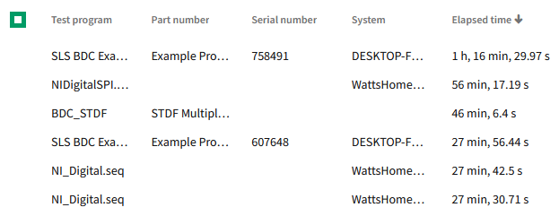

# Duration Table Column

## Overview

The duration text table column will provide a way to visualize numeric data that represents a timespan. A "timespan" is simply a numeric value representing a total number of milliseconds (i.e. a value of 5000 means '5 seconds').

### Background

[Work Item](https://github.com/ni/nimble/issues/1569)

### Non-goals

-   APIs to configure individual aspects of the display (i.e. fractional digits for seconds display)
-   APIs to format the duration in a variety of ways
    -   Show duration as digital display (00:01:20.323)
    -   Show duration with symbols indicating a quantitative value (i.e. "< 1 sec")

### Risks and Challenges

Formatting the duration units in the exact way that SLE presents them would require custom logic that differs from what the browser provides natively using APIs like `Intl.Numberformat.format()`. The preference here is to align with current browser behaviors for unit formatting, which includes localization.

### Prior Art/Examples



## Design

Below is an example of how the `nimble-table-column-duration-text` would be used within a `nimble-table`:

```HTML
<nimble-table>
    <nimble-table-column-duration-text field-name="duration">Duration</nimble-table-column-duration-text>
</nimble-table>
```

The displayed value for duration will always take the form of "\<days display>, \<hour display>, \<minute display>, \<second display>.\<fractional seconds>", where the commas are non-localized delimiters <sup>1</sup>.

<sup>1.</sup> When and if we are able to adopt the `Intl.DurationFormat` to format values, we will no longer be hard-coding the commas in the string result as that object will produce the entirety of the display text, which may not match what we produce in our implementation.

### API

#### `TableColumnDurationText`

The `TableColumnDurationText` implementation requires no additional API from what `TableColumnTextBase` provides:

```ts
// inherits field-name attribute
public class TableColumnDurationText : TableColumnTextBase { }

```

This API would result in a column whose value would only show up to the 'days' unit (i.e. it would show days, hours, minutes, and seconds). We will show up to three fractional digits as needed. Formatting will change slightly from what SLE offers now using "hr" instead of "h", and "sec" instead of "s".

Examples:

| English                | German                    | French             | Chinese                 |
| ---------------------- | ------------------------- | ------------------ | ----------------------- |
| "1 hr, 30 min, 2 sec"  | "1 Std., 30 Min., 2 Sek." | "1 h, 30 min, 2 s" | "1 小时, 30 分钟, 2 秒" |
| "2 hr, 3.55 sec"       | "2 Std., 3,55 Sek."       | "2 h, 3,55 s"      | "2 小时, 3.55 分"       |
| "3 days, 23 hr, 2 min" | "3 Tg., 23 Std., 2 Min."  | "3 j, 23 h, 2 min" | "3 天, 23 小时, 2 分钟" |
| "0 sec"                | "0 Sek."                  | "0 s"              | "0 秒"                  |

#### `DurationFormatter`

We will export the class that is responsible for formatting the duration values so that we can use it for formatting values outside of the `Table` (a requirement in SLE).

```ts
export class DurationFormatter {
    public constructor(private readonly lang: string) {}

    // formats a value in the seconds domain into a localized display value that can
    // consist of days, hours, minutes, and seconds.
    public format(value: number): string {}
}
```

### Angular integration

An Angular directive will be created for the component. The component will not have form association, so a `ControlValueAccessor` will not be created. The `DurationFormatter` will be re-exported from Angular from a new `formatters` entrypoint.

We will also export a `DurationPipe` that will use the `DurationFormatter` under the hood.

### Blazor integration

A Blazor wrapper will be created for the component. Blazor will not provide a means to access the formatting function of the `DurationFormatter` until there is a client requirement for it.

### Visual Appearance

Will use same text styling as the `nimble-table-column-text`.

## Implementation

In order to format a single value into multiple parts with localized text, we can provide a similar implementation to the current [`ElapsedTimePipe` `transform` method](https://dev.azure.com/ni/DevCentral/_git/Skyline?path=/Web/Workspaces/SystemLinkShared/projects/systemlink-lib-angular/src/pipes/elapsed-time.pipe.ts&version=GBmaster&line=18&lineEnd=19&lineStartColumn=1&lineEndColumn=1&lineStyle=plain&_a=contents) used in SLE, but instead of using the Angular `DecimalPipe` to format the value, we can just use the native `Intl.NumberFormat`, and pass in the locale we get from the `lang` setting on the `nimble-theme-provider`:

```ts
const result = [];
const hours = Math.floor(value / 3600);
if (hours) {
    const hoursFormatter = new Intl.NumberFormat(this.lang, { style: 'unit', unit: 'hour' });
    const formattedHours = hoursFormatter.format(hours);
    result.push(formattedHours);
}
... // do similar work for minutes and seconds
```

Other implementation details will conform to existing patterns all other table columns handle, such as `CellView` and `GroupHeaderView` implementations.

_Note: For number values that can't be translated into a representable time (e.g. `NaN`, `∞`, `-∞`, negative values), we will simply show a blank cell._

### Considered Corner Cases

#### Really large numbers

At some point numbers that can be formatted as a duration become too large to be practically represented in such a way. We will have a cutoff value (in days) where when the value exceeds that limit, we will revert to displaying the duration as a scientific representation of the value in the seconds unit.

#### Really small numbers

Ultimately, we will expect to be able to configure a duration column to show values down to the nanoseconds unit once we can leverage `Intl.DurationFormat`, and we expose the right formatting APIs on the column. Until then, we should behave as we do for really large numbers, and if the value is below a particular threshold we will format the value in scientific in the seconds unit.

#### Large fractional parts

Currently in SLE, there are corner cases that can result in a display of something like "25 min, 60 sec", which is non-ideal. This happens when the value being formatted has a large fractional part close to 1 (e.g. .999999997). The better behavior would be to either show a formatted value of "26 min", or even "25 min, 59.99 sec", though the former would be a more accurate representation if the value was 59.99999997.

#### Negative Zero

`-0` will simply render as "0 sec".

### Future Considerations

If there ever develops a need to respond to changes in the locale of a page that is currently displaying a duration utilizing our `DurationFormatter`, we may want to create an Observer class (similar to ResizeObserver, or IntersectionObserver) that can allow clients to create the appropriate `DurationFormatter` instance.

## Alternative Implementations / Designs

### Limited configuration

_*Props/Attrs*_

-   `field-name`: string
-   `style`: `"short" | "narrow" | "long"`

This would offer clients to display duration in other forms, but not to intermix formats between the various parts.

Examples:

-   "short": "1 hr, 30 min, 2 sec"
-   "narrow": "1h, 30m, 2s"
-   "long": "1 hour, 30 minutes, 20 seconds"

Pros:

-   Offers a little more configuration
-   Not much extra cost to provide more display flexibility
-   Aligns with the `Intl.DurationFormat` API that is in development

Cons:

-   No immediate need identified that would leverage the flexibility
-   Risk of introducing API that we ultimately would prefer not to use?

### Full configuration

This option would be more akin to the [`TableColumnDateText` API](https://github.com/ni/nimble/blob/990e415d40fa3abe36414c1736b2133f7cd0cd03/packages/nimble-components/src/table-column/date-text/index.ts#L57C2-L57C2), where we would mirror the API surface of the [`options` constructor parameter](https://developer.mozilla.org/en-US/docs/Web/JavaScript/Reference/Global_Objects/Intl/DurationFormat/DurationFormat#parameters) of the `Intl.DurationFormat` object.

Recommendation with this approach (if we decided to use this initially) would be to not support the `"digital"` `style` mode.

Pros:

-   Offers greatest set of flexibility for clients including the ability to display 'days' and 'years'.

Cons:

-   Increases implementation cost
-   Higher risk of API ultimately not aligning with what we eventually want (particularly if `Intl.DurationFormat` is never formally adopted).

Neither of the above options seem critical to implement initially, as we can always add features as needed.

### States

N/A

### Accessibility

### Mobile

N/A

### Globalization

For now we do not intend to alter behavior for `ltr` vs `rtl` settings.

#### Localization

Localization will be enabled through the `lang` setting provided by the `nimble-theme-provider` or root `<html>` element, which will then be passed as the `locale` to the JS native APIs (e.g. `Intl.NumberFormat`).

### Security

N/A

### Performance

N/A

### Dependencies

None

### Test Plan

Standard unit testing. Test cases of interest:

-   unusual number values (NaN, -∞, ∞, negative values)
-   verifying locale update results in expected display update
-   corner cases identified behave as described

### Tooling

N/A

### Documentation

This component will be documented via a new story in Storybook.

---

## Open Issues

None.
