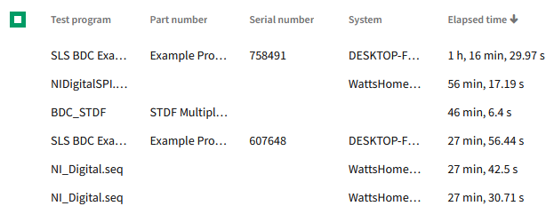

# Elapsed Time Table Column

## Overview

The elapsed time table column will provide a way to visualize numeric data that represents a timespan. A 'timespan' is simply a numeric value representing a total number of seconds (i.e. a value of 5 means '5 seconds').

### Background

[Work Item](https://github.com/ni/nimble/issues/1569)

### Non-goals

-   APIs to configure individual aspects of the display (i.e. fractional digits for seconds display)
-   APIs to format the elapsed time in a variety of ways
    -   Show elapsed time as digital display (00:01:20.323)
    -   Show elapsed time with symbols indicating a quantitative value (i.e. "< 1 sec")

### Risks and Challenges

Formatting the elapsed time units in the exact way that SLE presents them would require custom logic that differs from what the browser provides natively using APIs like `Intl.Numberformat.format()`. The preference here is to align with current browser behaviors for unit formatting, which includes localization.

### Prior Art/Examples



## Design

Below is an example of how the `nimble-table-column-elapsed-time` would be used within a `nimble-table`:

```HTML
<nimble-table>
    <nimble-table-column-elapsed-time field-name="elapsedTime">Elapsed Time</nimble-table-column-elapsed-time>
</nimble-table>
```

The displayed value for elapsed time will always take the form of "\<hour display>, \<minute display>, \<second display>.\<fractional seconds>", where the commas are non-localized delimiters <sup>1</sup>.

1. When and if we are able to adopt the `Intl.DurationFormat` to format values, we will no longer be hard-coding the commas in the string result as that object will produce the entirety of the display text, which may not match what we produce in our implementation.

### API

_*Props/Attrs*_

-   `field-name`: string

This API would result in a column whose value would only show up to the 'hours' unit (i.e. it would show hours, minutes, and seconds). We would show up to two fractional digits as needed. Formatting to change slightly from what SLE offers now using "hr" instead of "h", and "sec" instead of "s".

Examples:

-   "1 hr, 30 min, 2 sec"
-   "2 min, 3.55 sec"
-   "5,000 hr, 2 min, 1 sec"

### Anatomy

### Angular integration

An Angular directive will be created for the component. The component will not have form association, so a `ControlValueAccessor` will not be created.

### Blazor integration

A Blazor wrapper will be created for the component.

### Visual Appearance

Will use same text styling as the `nimble-table-column-text`.

## Implementation

In order to format a single value into multiple parts with localized text, we can provide a similar implementation to the current [`ElapsedTimePipe` `transform` method](https://dev.azure.com/ni/DevCentral/_git/Skyline?path=/Web/Workspaces/SystemLinkShared/projects/systemlink-lib-angular/src/pipes/elapsed-time.pipe.ts&version=GBmaster&line=18&lineEnd=19&lineStartColumn=1&lineEndColumn=1&lineStyle=plain&_a=contents) used in SLE, but instead of using the Angular `DecimalPipe` to format the value, we can just use the native `Intl.NumberFormat`, and pass in the locale we get from the `lang` setting on the `nimble-theme-provider`:

```ts
const result = [];
const hours = Math.floor(value / 3600);
if (hours) {
    const hoursFormatter = new Intl.NumberFormat(this.lang, { style: 'unit', unit: 'hour' });
    const formattedHours = hoursFormatter.format(hours);
    result.push(formattedHours);
}
... // do similar work for minutes and seconds
```

Other implementation details will conform to existing patterns all other table columns handle, such as `CellView` and `GroupHeaderView` implementations.

_Note: For number values that can't be translated into a representable time (e.g. `NaN`, `∞`, `-∞`), we will simply show a blank cell._

## Alternative Implementations / Designs

### Limited configuration

_*Props/Attrs*_

-   `field-name`: string
-   `style`: `"short" | "narrow" | "long"`

This would offer clients to display elapsed time in other forms, but not to intermix formats between the various parts.

Examples:

-   "short": "1 hr, 30 min, 2 sec"
-   "narrow": "1h, 30m, 2s"
-   "long": "1 hour, 30 minutes, 20 seconds"

Pros:

-   Offers a little more configuration
-   Not much extra cost to provide more display flexibility
-   Aligns with the `Intl.DurationFormat` API that is in development

Cons:

-   No immediate need identified that would leverage the flexibility
-   Risk of introducing API that we ultimately would prefer not to use?

### Full configuration

This option would be more akin to the [`TableColumnDateText` API](https://github.com/ni/nimble/blob/990e415d40fa3abe36414c1736b2133f7cd0cd03/packages/nimble-components/src/table-column/date-text/index.ts#L57C2-L57C2), where we would mirror the API surface of the [`options` constructor parameter](https://developer.mozilla.org/en-US/docs/Web/JavaScript/Reference/Global_Objects/Intl/DurationFormat/DurationFormat#parameters) of the `Intl.DurationFormat` object.

Recommendation with this approach (if we decided to use this initially) would be to not support the `"digital"` `style` mode.

Pros:

-   Offers greatest set of flexibility for clients including the ability to display 'days' and 'years'.

Cons:

-   Increases implementation cost
-   Higher risk of API ultimately not aligning with what we eventually want (particularly if `Intl.DurationFormat` is never formally adopted).

Neither of the above options seem critical to implement initially, as we can always add features as needed.

### States

N/A

### Accessibility

### Mobile

N/A

### Globalization

#### Localization

Localization will be enabled through the `lang` setting provided by the `nimble-theme-provider` or root `<html>` element, which will then be passed as the `locale` to the JS native APIs (e.g. `Intl.NumberFormat`).

### Security

N/A

### Performance

N/A

### Dependencies

None

### Test Plan

Standard unit testing. Test cases of interest:

-   unusual number values (NaN, -∞, ∞, negative values)
-   verifying locale update results in expected display update

### Tooling

N/A

### Documentation

This component will be documented via a new story in Storybook.

---

## Open Issues

-   Should we expand set of displayed time units to include days and/or years? Without introducing an accompanying API (i.e. would show days and years as needed by default), this might result in a different display than what SLE currently results in.
