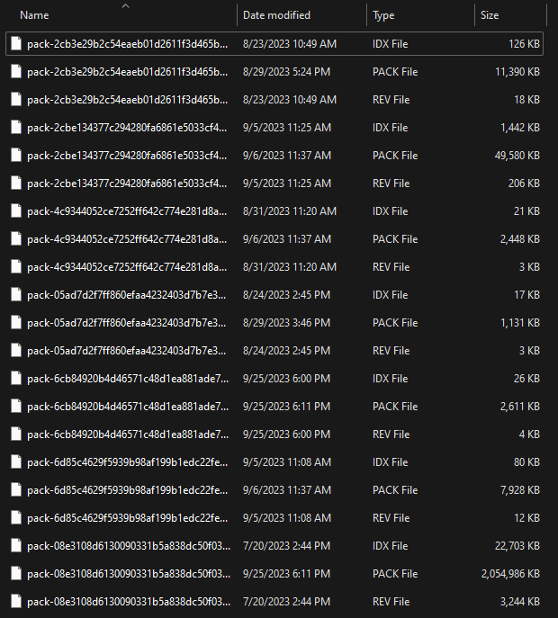

# File Size Table Column

## Overview

The file size table column will provide a way to visualize numeric data that represents a file size (or other binary data size). It will automatically convert the raw value to use an appropriate display unit.

### Background

[Work Item](https://ni.visualstudio.com/DevCentral/_workitems/edit/2526114)

### Non-goals

-   Configurable number of decimal places
-   Configurable units (e.g. display all values in KB)
-   Grouping by value ranges/buckets

### Features

-   Converts the byte value to largest unit (e.g. KB, MB, GB) that results in a value with magnitude >=1
-   Option to use 1024-based units (e.g. KiB) or 1000-based units (e.g. KB)
-   Displays up to one decimal place
-   Sorts/groups by numeric value (number of bytes) rather than display string
-   Localized number and unit strings

### Risks and Challenges

The byte formatting pipe currently used in SLE converts using a factor of 1024, but uses unit labels KB/MB/GB. In order to avoid showing different values or units for the same file outside of an `sl-table`, we should modify the SLE pipe to be consistent with our implementation. Other clients with the same problem would be encouraged to use consistent conversions across the app.

### Prior Art/Examples

Size column in [SLE Files grid](https://dev.lifecyclesolutions.ni.com/files/)


Windows explorer (details view)



Chrome Dev Tools Network tab


---

## Design

### API

`nimble-table-column-byte-text`

-   `field-name` - name of the record field containing the data. Data must be a `number` byte count.
-   `unit-type` - "binary" (KiB, MiB, GiB, TiB, PiB) or "decimal" (KB, MB, GB, TB, PB); defaults to "decimal"

The component will extend `TableColumnTextBase`, thereby including the APIs for a **groupable** and **fractional-width** column.

### Examples

Given a data value of 2856 (bytes):

```HTML
<nimble-table>
    <nimble-table-column-byte-text field-name="size" unit-type="decimal">Size</nimble-table-column-byte-text>
</nimble-table>
```


```HTML
<nimble-table>
    <nimble-table-column-byte-text field-name="size" unit-type="binary">Size</nimble-table-column-byte-text>
</nimble-table>
```


### Anatomy

### Angular integration

An Angular directive will be created for the component. The component will not have form association, so a `ControlValueAccessor` will not be created.

### Blazor integration

A Blazor wrapper will be created for the component.

### Visual Appearance

Will use same text styling as the `nimble-table-column-text`.

Values will be left-aligned. Right-alignment is useful when numeric values have aligned decimal points and are given in the same units. In that case, right-alignment allows for quick scanning to determine relative magnitude. But our column will not use a consistent number of decimal digits, nor a consistent unit. This leaves no clear motivation for right-aligning the values, while left-aligning provides better association with the column header. However, if we discover that there is value in right-aligning file sizes, we can easily make that change in a non-breaking way in the future.

## Implementation

Cell view will extend `TableColumnTextCellViewBase` and use its template.

```ts
class TableColumnByteTextCellView extends TableColumnTextCellViewBase<
    TableColumnByteTextCellRecord,
    TableColumnByteTextColumnConfig
> {
    ...

    private updateText(): void {
        if (this.columnConfig) {
            this.text = formatSize(
                this.columnConfig.formatter, // instance of Intl.NumberFormat
                this.unitStrings, // either ['byte', 'bytes', 'KB', ...] or ['byte', 'bytes', 'KiB', ...]
                this.columnConfig.unitType,
                this.cellRecord?.value
            );
        } else {
            this.text = '';
        }
    }
}

// Shared function also used by group header view
function formatSize(
    formatter: Intl.NumberFormat,
    unitStrings: string[],
    unitType: ByteUnitType,
    byteCount: number
): string {
    let currentSize = byteCount;
    let unitIndex = 0;
    if (currentSize !== 1) {
        const divisor = unitType === ByteUnitType.binary ? 1024 : 1000;
        while (currentSize >= divisor && unitIndex < unitStrings.length) {
            currentSize /= divisor;
            unitIndex += 1;
        }
    }

    return `${formatter.format(currentSize)} ${unitStrings[unitIndex]}`;
}
```

Group header view will extend `TableColumnTextGroupHeaderViewBase` and use its template.

### States

There are no invalid states. The only configuration option is `unit-type`, which will be strongly typed to disallow invalid values. For invalid data values like `Inf`, we just show an empty cell rather than putting the whole column (and table) in an invalid state. We support negative numbers in case a client wants to use this column to represent some kind of size delta.

### Accessibility

Accessibility of the cells rendered using the `nimble-table-column-byte-text` are handled via the [`nimble-table-cell`](https://github.com/ni/nimble/blob/f663c38741e731bef91aa58e8fb2d1cec653b679/packages/nimble-components/src/table/components/cell/template.ts#L6) which has a `role` of [`cell`](https://w3c.github.io/aria/#cell).

### Mobile

N/A

### Globalization

#### Localization of the number

For this we will use `Intl.NumberFormat`, passing in the value of the `lang` design token as the locale.

#### Localization of the unit label

This is more difficult, as there does not seem to be a great API for getting a file size unit string for a given locale. The only implemenation I've found is `Intl.NumberFormat`. This function can also do the numeric conversion, but we would not use it for that, because it only supports converting by using a factor of 1000, not 1024. We could instead do the number conversion ourselves and just ask `Intl.NumberFormat` to translate the unit string we need. However, it does not support translations for KiB/MiB/etc.

**Implementation note:** We must set `unitDisplay: "long"` when translating `unit: "byte"` in order to get proper pluralization and support for all languages.

Options:

1. Find translations of each of our unit labels ("byte", "bytes", "KB", "MB", "GB", "TB", "PB", "KiB", "MiB", "GiB", "TiB", "PiB") for a fixed set of languages we wish to support. Maintain a mapping of language codes (e.g. "fr", "de", "zh_CN") to arrays of those localized unit labels. Given a locale to use, look up its language subtag in our map. If not found, fall back to English.

    **Pros:** No work for clients.

    **Cons:** Only supports a fixed set of languages. Up to us to find accurate translations. In some cases, subtags other than the language (e.g. region) are relevant to the translation, e.g. `zh-CN` vs `zh-TW`.

2. Use Nimble label provider. Add label tokens for the units, and rely on clients to provide translations.

    **Pros:** Supports any language a client cares to provide translations for.

    **Cons:** Less convenient for clients. Does not honor the `lang` setting on the page or on `nimble-theme-provider`.

3. Use `Intl.NumberFormat` and drop support for units using a conversion factor of 1024.

    **Pros:** No translation work for the client or Nimble team. Honors `lang` value.

    **Cons:** No support for 1024-based units.

4. Use `Intl.NumberFormat` and support both 1024 or 1000 based conversions, but just always use KB/MB/GB/TB/PB as the units. There is precedent for this, so it may not be surprising to clients. This is what SLE's current implementation does.

    **Pros:** No translation work for the client or Nimble team. Honors `lang` value.

    **Cons:** Potentially misleading units label for 1024-based values.

5. Combination of options 1 and 3: use `Intl.NumberFormat` to translate the units it supports, and provide our own translations for KiB/MiB/GiB/TiB/PiB for a small number of languages.

    **Pros:** No translation work for the client. Honors `lang` value.

    **Cons:** For "binary" `unit-type`, only a small, fixed set of languages will have translations. Nimble team must provide translations. More disjoint/complex logic.

I suggest we go with option 5, because it results in the best unit labels, without translation burden on the client, and without giving up any functionality.

### Security

N/A

### Performance

N/A

### Dependencies

None

### Test Plan

Unit tests:

-   standard component tests
-   renders blank for invalid input values: `Inf`, `-Inf`, `NaN`, and non-number
-   for an interesting range of values, value conversion results in correct values and units (using English `lang`)
-   correct units used for both `unit-type`s
-   standard cell text/group header text ellipsizing tests
-   honors `lang` value and responds to changes to `lang` value
-   uses English labels when unsupported locale is given

### Tooling

N/A

### Documentation

This component will be documented via a new story in Storybook.

---

## Open Issues

-   What is our unit localization approach?
-   What is the default `unit-type`?
-   Are we okay with left-aligning?
-   Should we consider making this a more general "auto-unit-conversion" column, or even adding the functionality to the number column?
-   Are SLE POs okay with changing file size units to "MiB" or would they rather we switch to a 1000-based conversion factor?
-   Should we export a formatting function for clients to use elsewhere (for consistency). Should we allow them to provide their own?
