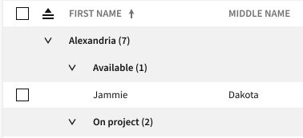

# Row Grouping HLD

## Problem Statement

There is a requirement that users be able to group together rows of data under collapsible sections based on unique values in a particular column. Users need to be able to group by values in more than one column which will result in a collapsible "header" row for each grouped value.

This document will focus on the programmatic grouping of data rows.

### Out of Scope of this HLD

1. The proposal in this HLD is focusing on the broad strategy for providing a means for columns to specify how to render the group header associated with that column's values. It will not focus on particular concerns that some columns may have for how to render their value, such as any localization requirements. Ultimately, this strategy should provide a means to those ends without getting into the details of each.
2. This proposal will not provide a means for rendering values from multiple columns for the group header. TanStack does not support this, and we will not block ourselves on this restriction.
3. Interactive grouping concerns.

## Links To Relevant Work Items and Reference Material

-   [#1003 Programmatic grouping of data rows](https://github.com/ni/nimble/issues/1003)
-   [IxD Document](https://xd.adobe.com/view/6f3be15d-8503-4f1f-54b9-5bc27955b3e4-190a/screen/13edcacf-4e95-46b2-a7a8-83141afb3f2d)
-   [Table README](./README.md)
-   [Table Design Doc](https://xd.adobe.com/view/5b476816-dad1-4671-b20a-efe796631c72-0e14/screen/d389dc1e-da4f-4a63-957b-f8b3cc9591b4/specs/)
-   [Prototype branch](https://github.com/ni/nimble/tree/table-row-grouping-prototype) ([Storybook](https://60e89457a987cf003efc0a5b-bwzrahvxqm.chromatic.com/?path=/story/table--table))

## Implementation / Design



### Row Grouping Column API

To support both the notion that a column type may want to allow grouping in some situations and not others (e.g. a numeric column displaying discrete values versus continuous values), as well as the possibility that certain columns should never be groupable, we will create a mixin to provide the necessary grouping APIs:

```
export function groupableColumn<
    TBase extends GroupableTableColumnConstructor
>(base: TBase) {
    abstract class GroupableColumn extends base {
        public disableGrouping?: boolean;

        public groupIndex?: number | null = null;

        public isDisableGroupingChanged(): void {
            this.internalIsGroupable = !this.disableGrouping;
        }

        public groupIndexChanged(): void {
            this.internalGroupIndex = this.groupIndex;
        }

        /**
         * The custom element tag to use for rendering group header values.
         * Should derive from TableGroupHeaderView.
         */
        public abstract groupHeaderViewTag: string;
    }
    attr({ attribute: 'disable-grouping', mode: 'boolean' })(GroupableColumn.prototype, 'disableGrouping');
    attr({ attribute: 'group-index', converter: nullableNumberConverter })(GroupableColumn.prototype, 'groupIndex');

    return GroupableColumn;
}
```

The `TableColumn` will add the `internalIsGroupable` and `internalGroupIndex` APIs to provide that state where it is needed in the rest of the `Table` implementation.

This mixin can then be chained to other mixins in the following fashion:

```
class TableColumnTextFractionalWidth extends fractionalWidthColumn(TableColumnTextBase) {}

export class TableColumnText extends groupableColumn(TableColumnTextFractionalWidth) {}
```

### Rendering group header values

Rendering group header values have similar concerns as rendering cell values, providing reason to adopt the pattern outlined in [this PR](https://github.com/ni/nimble/pull/1052) for columns to specify a custom element to use to render the value. As shown in the mixin snippet above, it will provide an abstract `groupHeaderViewTag` property, which will require groupable columns to specify the element to use to display the header value. This element will derive from an element of type `TableGroupRowHeaderView`:

```
export interface TableGroupRowHeaderValueState<TColumnConfig = unknown> {
    groupHeaderValue: TableFieldValue;
    columnConfig: TColumnConfig;
}

export abstract class TableGroupHeaderView<TColumnConfig> implements TableGroupRowHeaderValueState<TColumnConfig> {
    @observable
    groupHeaderValue: TableFieldValue;

    @observable
    columnConfig: TColumnConfig;
}
```

The value of the `groupHeaderValue` property will be sourced from the TanStack [`groupingValue` property](https://tanstack.com/table/v8/docs/api/features/grouping#groupingvalue) of a given TanStack `Row` instance. This will be the value associated with the grouped column's `operandDataRecordFieldName` and have no formatting applied to it. Any formatting of the value for display purposes is up to the concrete implementation of a particular `TableGroupRowHeaderView`. The `columnConfig` value comes from the `TableColumn` instance used for grouping values by.

A naive implementation for the custom element to use for rendering group header values for the `TableColumnText` might look like the following:

```
export class TableColumnTextGroupHeaderView extends TableGroupHeaderView<
TableColumnTextColumnConfig
> {
    @observable
    public override columnConfig!: TableColumnTextColumnConfig;

    @volatile
    public get content(): string {
        return typeof this.groupHeaderValue === 'string'
            ? this.groupHeaderValue
            : this.columnConfig.placeholder;
    }
}

const tableColumnTextGroupHeaderView = TableColumnTextGroupHeaderView.compose({
    baseName: 'table-column-text-group-header',
    template: html<TableColumnTextGroupHeaderView>`
        <nimble-text-field readonly="true" value="${x => x.groupHeaderValue}" placeholder="${x => x.columnConfig.placeholder}">
        </nimble-text-field>`,
    styles: /* styling */
});
DesignSystem.getOrCreate().withPrefix('nimble').register(tableColumnTextGroupHeaderView());
```

### Rendering the row group

Rendering a row group has concerns beyond just rendering the grouping value. It also has a button for controlling the expand/collapse state of a row group (indented for sub-groups) as well as potentially rendering auxiliary information such as the total number of items within a group. We can provide a new `TableGroupRow` element to manage all of these:

```
export interface TableGroupRowState {
    rowGroupValue: unknown;
    level: number;
    leafItemCount: number;
    columnConfig: unknown;
    isExpanded: boolean;
    rowGroupHeaderViewTag: string;
}

export class TableGroupRow extends FoundationElement {
    @observable
    public rowGroupState: TableGroupRowState;

    public onExpandRowToggle(): void {
        const detail: TableGroupRowExpandToggleEventDetail = {
        };
        this.$emit('on-row-group-expand-toggle', detail);
    }

    ...
}

const tableGroupRowElement = TableGroupRow.compose({
    baseName: 'table-group-row',
    template: html<TableColumnTextGroupHeaderView>`
    <template
        role="rowgroup"
        style="--ni-private-row-group-indent-level: ${x => x.rowGroupState.level};"
    >
        <nimble-button
            appearance="ghost"
            content-hidden
            @click=${x => x.onExpandRowToggle()}>
            ${when(x => x.rowGroupState.isExpanded, html`
                <nimble-icon-arrow-expander-down slot="start"></nimble-icon-arrow-expander-down>
            `)}
            ${when(x => !x.rowGroupState.isExpanded, html`
                <nimble-icon-arrow-expander-right slot="start"></nimble-icon-arrow-expander-right>
            `)}
            Expand/Collapse
        </nimble-button>
        <${x => x.rowGroupState.rowGroupHeaderViewTag}
            :rowGroupValue="${x => x.rowGroupState.rowGroupValue}"
            :columnConfig="${x => x.rowGroupState.columnConfig}"
            >
        </{x => x.rowGroupState.rowGroupHeaderViewTag}> (${x => x.rowGroupState.leafItemCount})
    </template>
    styles: /* styling */
});
DesignSystem.getOrCreate().withPrefix('nimble').register(tableGroupRowElement());
```

Grouped rows are provided alongside ungrouped rows through the TanStack function `getRowModel().rows`, which is already used for retrieving the rows to render. So to render the `TableGroupRows`, the template can make a simple change similar to this:

Table template.ts

```
    ...
    ${repeat(x => x.virtualizer.visibleItems, html<VirtualItem, Table>`
        ${when((x, c) => (c.parent as Table).getIsGroupRow(x.index), html<VirtualItem, Table>`
            <${DesignSystem.tagFor(TableGroupRow)}
                :rowGroupState="${(x, c) => c.parent.getGroupRowState(x.index)}"
                @on-row-group-expand-toggle="${(x, c) => c.parent.toggleRowExpanded(x.index)}"
                >
            </${DesignSystem.tagFor(TableGroupRow)}>
        `)}
        ${when((x, c) => !(c.parent as Table).getIsGroupRow(x.index), html<VirtualItem, Table>`
            <${DesignSystem.tagFor(TableRow)}
    ...
```

The one change necessary to support this properly is to change the virtualizer to use the current length of `getRowModel.rows()` for the `count` instead of the [current length of the table's data](https://github.com/ni/nimble/blob/f60dedf600147b16916f876b749a4e019c2a6308/packages/nimble-components/src/table/models/virtualizer.ts#L82) (see [prototype](https://github.com/ni/nimble/blob/5cd05ab733b00ebb33e44d53c7be30c980fa3398/packages/nimble-components/src/table/models/virtualizer.ts#L87)).

### Column header grouping visual

Ultimately, when a column has set itself to be grouped, the design calls for that to be represented with a visual in the header for that column. This will be handled in a similar fashion to how we represent sort direction, by providing a new `is-grouped` attribute on `TableHeader` to determine whether to show the appropriate icon.

### Interfacing with TanStack

As shown in the above example, the `TableGroupRow` will provide a button to control expand/collapse behavior. TanStack handles the modeling for which rows are expanded or collapsed (in addition to which rows are groups), and thus must be notified of an expand/collapse action. This will be accomplished through raising an event (`on-row-group-expand-toggle` in the example above). The `Table` will handle the event, and call `stopPropogation` on it, as there is not an immediate need to leak this into the public event API of the `Table`.

Setting TanStack up to handle both row grouping and expanded state is similar to what is in place for sorting. One notable difference is that we will need to register a handler for TanStack's `onExpandedChange` handler, as we will be working through TanStack to update this state, and the `Table` will need a notification in order to re-render the rows. It would look similar to the following:

Table index.ts

```
public constructor() {
    super();
    this.options = {
        data: [],
        onStateChange: (_: TanStackUpdater<TanStackTableState>) => {},
        onExpandedChange: this.handleExpandedChange,
        ...

```

## Alternative Implementations / Designs

Consider upstreaming a change to TanStack to allow row grouping by more than one column value. While this may not affect the overall architectural design proposed here, it would likely alter it to support providing multiple values to render in the `TableGroupHeaderView`.

## Open Issues

1. Should we mark the table validity state as invalid if more than one column specify the same `group-index`?
2. Do we always render the number of items in a row group as part of the header, or should this be configurable?
3. Should the `TableGroupRow` be given an ARIA role of `rowgroup`? The docs state that "a `rowgroup` contains one or more rows...", which the `TableGroupRow` technically does not. The virtualization implementation requires a pretty opinionated representation of the elements in the DOM, making it difficult to parent `TableRow` elements within a `TableGroupRow`.
