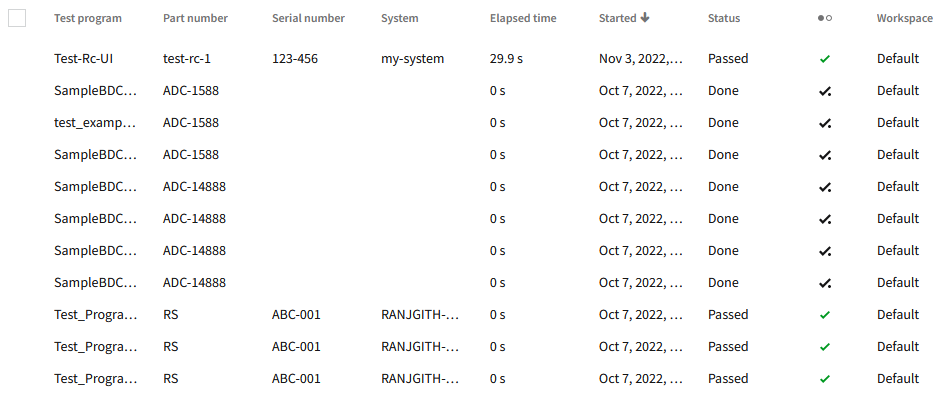

# Nimble Table

## Overview

The `nimble-table` is a component that offers a way to render tabular data in a variety of ways in each column.

### Background

[Nimble issue #283](https://github.com/ni/nimble/issues/283)

[Nimble Table Research Document](https://lucid.app/lucidspark/31f2314d-dd8e-46fd-8fc1-6e9f66700bb3/edit?viewport_loc=-1060%2C-25492%2C20822%2C12325%2CloaYwcZLRray4&invitationId=inv_38839ad5-72b2-4975-ab7a-6d8be33c960c)

[Table visual design](https://xd.adobe.com/view/33ffad4a-eb2c-4241-b8c5-ebfff1faf6f6-66ac/screen/b9cee5e2-49a4-425a-9ed4-38b23ba2e313/)

### Non-goals

-   The `nimble-table` will not offer spreadsheet-like features such as infinite columns, or summary functions.

-   We do not intend for the `nimble-table` to handle data sets of 50K or more on the client-side. Visualizing such sizes of data sets are meant to be enabled through various "data virtualiazation" means, such as the server only sending over subsets of the data at a time, appropriately filtered down to a reasonable size.

-   Non-virtualized static tables.

### Features

In addition to simply rendering data, the `nimble-table` will provide APIs/interactions that will allow a user to do the following:

-   Interactively and programmatically size columns
-   Interactively and programmatically sort columns
-   Pin columns
-   Provide column ordering (programmatically only at first possibly)
-   Group rows
-   Multi-select rows (interactively only at first possibly)
-   Provide hierarchy via the data
-   Provide custom column rendering
-   Provide API for adding action menu

#### _Performance_

We intend for the `nimble-table` to handle both the rendering and interactive operations, such as sorting, in a near-instantaneous fashion on datasets of at least 10K rows. Between 10K and 100K rows of data on the client-side, however, we expect to see a notable drop in performance.

Clients, at least initially, will be expected to create mechanisms to restrict the amount of data coming to the client-side.

#### _Out of Scope of Initial Release_

The following are features that we intend to prioritize eventually after the initial release:

-   Hierarchy and Grouping together
-   Custom expanded row content
    -   An example would be showing a sub-tree when you expand a row
-   Editable cells
-   APIs around pagination/infinite scrolling
-   High-level configuration APIs
    -   Allow for easy getting/setting of total configurable state, which is useful for maintaining state of the table as a user navigates to other pages in an app.
-   Filter on any text match across all cells
-   Selection configuration.
-   Custom header templates
-   Custom row templates

### Accessibility

The table will provide the necessary means for keyboard interactions and navigation through the cells, as well as expected ARIA labels/roles for the various elements.

### Risks and Challenges

We will be leveraging a couple of third-party libraries, namely [TanStack Table](https://tanstack.com/table/v8) and [TanStack Virtual](https://tanstack.com/virtual/v3), to manage much of the complexity surrounding the table implementation. This presents risk in the form of being able to quickly address any issues that arise. However, these libraries are active and eagerly support outside contribution, so we should be able to contribute as needed.

The other primary risk is simply scope. This is a large, complex component, which can easily grow beyond our initial expectations, due to a variety of unforseen elements, such as missed important features, or misunderstood complexities.

### Prior Art/Examples

SLE Table



---

## Design

A user will be able to configure a `nimble-table` component fairly thoroughly through its markup. Including the columns to visualize, how to visualize a column, and in what order. A sketch of the markup should be similar to the following (in Angular):

```html
<nimble-table [data]="data">
    <nimble-text-field-column
        slot="columns"
        columnId="firstName"
    ></nimble-text-field-column>
    <nimble-text-field-column
        slot="columns"
        columnId="lastName"
    ></nimble-text-field-column>
    <nimble-text-field-column
        slot="columns"
        columnId="profession"
    ></nimble-text-field-column>
</nimble-table>
```

_Placeholder for other design details as they are created_

### API

_Component Name_

`nimble-table`

_Feature APIs_

The various APIs/features of the `nimble-table` will be split up amongst several different HLD documents. This section will serve to list them out and link to them as they become available:

-   Data API :
    -   Define what the interface is for setting/getting data on the table, taking into account any framework-specific binding concerns
    -   Illustrate how the data is hooked up to the TanStack API
    -   How is data hierarchy provided and represented in the DOM
-   Column Definitions
    -   Define the interface we will provide for the column providers/components (i.e., width, sorting, allowSort, allowGrouping, etc...)
    -   Define the base implementation for the column providers that other column providers can extend.
    -   List the set of column providers that Nimble will provide and provide their respective APIs where unique (e.g., formatter for DateTime column)
    -   Define the table-level APIs for setting the columns
        -   Slot API on table?
        -   Alternative/accompanying programmatic API?
-   Headers
    -   Define the anatomy of headers in the table DOM
        -   Require specific component type?
        -   What is the component to use for interaction? Outline Button? Ghost button?
        -   What and where are the interactive mechanisms/indicators? Sort arrow, etc..
-   Row Selection
    -   Define the anatomy of row selection in the table DOM
        -   Indeterminate checkbox at the far left of each row?
        -   Selected row CSS
    -   Define events raised when row selection changes/occurs
    -   Define table-level row-selection API
-   Grouping
    -   Define interactive mechanism, if any, to provide grouping
    -   Define table-level API for setting grouping
    -   Define events raised when grouping changes
-   Sorting
    -   Define the table-level API for setting sorting
    -   Define events raised when sorting changes
-   Action Menu
    -   Define how the action menu gets associated with a particular column
    -   Define the table-level(column-level?) API(s) for applying an action menu to the table (slot, properties, etc...)

_Properties_

Placeholder

_Events_

Placeholder

### Anatomy

_Slots_

-   `slottedColumns` (Placeholder for column slots)
-   `actionMenu` (Placeholder for action menu)

### Angular integration

Angular support should be accomplished through the typical directive patterns.

### Blazor integration

Blazor support should be accomplished through the typical integration patterns. It should be noted that if the Nimble `Table` component is generic, then the Blazor component will mirror that generic API.

---

## Implementation

The `nimble-table` will require various sub-components to exist in order to properly/efficiently render the data. The web components and their respective responsibilities are as follows:

`<nimble-table>`

-   Creates the row elements that will be used to render each row of data
-   Provides any necessary elements for proper virtualization
-   Manages keyboard navigation between rows
-   Supports slotting of column elements

`<nimble-table-row>`

-   Creates the cell elements that will be used to render each value in the data
-   Manages keyboarding within the row

`<nimble-table-cell>`

-   Renders the data via a custom template
-   Manages the keyboard interactions to pass focus in/out of custom cells

### Hooking into TanStack Table

We will be using TanStack Table to manage all of the table state related to data, sorting, grouping, hierarchy, filtering, and selection. The TanStack APIs provide callback hooks for when certain aspects of the state are changed (e.g. `onSortingChange`), which allows us to update the UI as needed. A typical lifecycle of a user enacted table state change would be, for example:

-   User clicks header to change sort state
-   Nimble table callback updates sort state in TanStack Table
-   TanStack Table issues callback that sort state has changed
-   Nimble table handles callback and retrieves needed rows from TanStack Table model, and updates the UI

### Hooking into TanStack Virtual

TanStack Virtual provides various pieces of state to enable simple, efficient virtualization of table data. The Nimble Table will provide certain state/objects to the TanStack Virtual API for it to then provide the needed state that we can virtualize the table rows with. Namely:

-   The element that will serve as the scollable element
-   An estimated height for each row
-   The total count of rows in the data

With this set of information, the Nimble Table will be able to register a callback to the TanStack Virtual `onChange` which will happen any time the scrollable element scrolls. In that handler the Nimble Table can retrieve the set of virtual items from TanStack Virtual (i.e. `getVirtualItems()`), which represent the total set of rows that should be displayed, and contain the state information that allows the Nimble Table to retrieve the appropriate data from the TanStack Table model to apply to each rendered row, as well as the position each row should be rendered.

_Placeholder for other implementation details_

### Accessibility

The `nimble-table` should align to the grid interaction model provided by the [W3C](https://w3c.github.io/aria-practices/#grid).

### Globalization

The order of table columns is inverted in RTL layouts.

### Performance

We intend for the `nimble-table` to handle both the rendering and interactive operations, such as sorting, in a near-instantaneous fashion on datasets of at least 10K rows. Between 10K and 100K rows of data on the client-side, however, we expect to see a notable drop in performance.

Clients, at least initially, will be expected to create mechanisms to restrict the amount of data coming to the client-side.

There are a couple of mechanisms we will leverage to ensure we achieve the necessary performance goals:

-   Usage of the FAST `repeat` directive (avoiding using `positioning: true`)
-   The [TanStack Virtual](https://github.com/TanStack/virtual) library gives us a simple means of providing the proper state to render the right rows in response to scroll events.

### Dependencies

-   [TanStack Table](https://github.com/tanstack/table)
-   [TanStack Virtual](https://github.com/TanStack/virtual)

### Test Plan

Intend to test completely with unit tests.

### Documentation

Storybooks will be added to document/showcase the various features and APIs.

---
