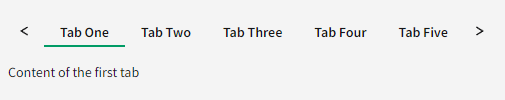

# Scrollable tabs

## Problem Statement

There are some use-cases that call for many tabs, and in cases where the width of all of the tabs exceed the screen space, they will bleed off screen (and potentially make the page scrollable to see the other tabs). To prevent this, we will introduce "scrollable" tabs, which will enforce the tabs to be constrained to the given space of the `Tabs` component and offering buttons to allow a user to navigate through the whole set of tabs.

### Out of scope of this HLD

Any decision/API around limiting the width of a particular tab. This is ultimately an orthogonal concern to the UX this HLD is presenting.

## Links To Relevant Work Items and Reference Material

-   [Issue 1509: Scrollable Tabs](https://github.com/ni/nimble/issues/1509)
-   [Figma design](https://www.figma.com/design/PO9mFOu5BCl8aJvFchEeuN/Nimble_Components?node-id=11133-57220&node-type=instance&t=DlnrdRo7KWYlheFz-0)

## Implementation / Design

The following decisions were agreed to in the comments section in the linked issue above:

-   No scrollbar will be shown
-   Keyboard navigation will work as it does today, but when a tab that isn't fully in view gets focus it should be scrolled into view
-   When a scroll button is pressed we will scroll either a full "page width" or the remainder of the available space, and tab focus is not changed.

Additionally, devices like mouse wheels and trackpads as well as pan gestures on mobile devices should allow scrolling through the tabs. This should be handled natively by the browser by simply applying CSS of `overflow: scroll;` to the div containing the tabs. _Note: Today, native scrolling behaviors in browsers require mouse users to hold `<Shift>` while using the scroll wheel in order to scroll the tabs. This is consistent with other horizontally scrollable content._

To accomplish this we will fork FAST's template in order to add the scroll buttons. A `ResizeObserver` will be used to track when the scrollable area exceeds the viewable area in order to show/hide the scroll buttons.

There will be no new API to enable this behavior, and will simply be on by default.

#### TabsToolbar

Only the tabs themselves will be scrollable. The scroll buttons will only surround the tabs. If there is content being displayed in a `TabsToolbar` that has been slotted, and the tabs content is wide enough to merit showing the scroll buttons, the right scroll button will sit to the left of the `TabsToolbar` (example below).

#### Minimum scroll area width

As the tab list view width is now resizable, we must consider the scenario where the view is shrunk considerably. Preventing the scrollable area from disappearing completely seems desirable, and so we will set the CSS `min-width` property on the container of the tabs to be `4 * ${controlHeight}` (wide enough for both scroll buttons and extra space to see a good portion of at least one tab).

## Alternative Implementations / Designs

Another way to display tabs that would otherwise exceed the horizontal visible area is to provide multiple rows of tabs. If we ever wanted to provide this ability to a user, we could always provide an API that allows them to switch between a `scrollable` and a `stacked` mode.

Additionally, we _could_ begin with an API that enables/disables this new behavior via an enum configuration that defaults to `none` (or the new behavior). However, we could always add it if there are clients that ask for the previous behavior in addition to the scrollable tabs.

#### `PageUp/PageDown` scrolling

With the introduction of a means to scroll through the tabs with the mouse, it seemed reasonable to add a similar ability for keyboard users. However, there is enough difference in how it would work (with there being even some fuzziness on exactly _how_ it should work), coupled with there already being a decent means of navigating through all of the tabs with the keyboard via arrow keys and `Home/End`, that there doesn't seem to be a need to add this.

#### Focusable scroll buttons

Making the scroll buttons focusable was decided against, as interacting them with the keyboard provides no utility to a keyboard-only user.

## Open Issues

None.
