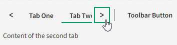

# Scrollable tabs

## Problem Statement

There are some use-cases that call for many tabs, and in cases where the width of all of the tabs exceed the screen space, they will bleed off screen (and potentially make the page scrollable to see the other tabs). To prevent this, we will introduce "scrollable" tabs, which will enforce the tabs to be constrained to the given space of the `Tabs` component and offering buttons to allow a user to navigate through the whole set of tabs.

### Out of scope of this HLD

Any decision/API around limiting the width of a particular tab. This is ultimately an orthogonal concern to the UX this HLD is presenting.

## Links To Relevant Work Items and Reference Material

-   [Issue 1509: Scrollable Tabs](https://github.com/ni/nimble/issues/1509)
-   [Figma design](https://www.figma.com/design/PO9mFOu5BCl8aJvFchEeuN/Nimble_Components?node-id=11133-57220&node-type=instance&t=DlnrdRo7KWYlheFz-0)

## Implementation / Design

The following decisions were agreed to in the comments section in the linked issue above:

-   No scrollbar will be shown
-   Keyboard navigation will work as it does today, but when a tab that isn't fully in view gets focus it should be scrolled into view
-   When a scroll button is pressed we will scroll either a full "page width" or the remainder of the available space, and tab focus is not changed.

To accomplish this we will fork FAST's template in order to add the scroll buttons. A `ResizeObserver` will be used to track when the scrollable area exceeds the viewable area in order to show/hide the scroll buttons.

There will be no new API to enable this behavior, and will simply be on by default.

#### TabsToolbar

Only the tabs themselves will be scrollable. The scroll buttons will only surround the tabs. If there is content being displayed in a `TabsToolbar` that has been slotted, and the tabs content is wide enough to merit showing the scroll buttons, the right scroll button will sit to the left of the `TabsToolbar` (example below).

### Keyboard interaction

#### `PageUp/PageDown`

Now that the tabs will be able to be scrolled, it makes sense to add a keyboard interaction that will perform this scroll without the need of using the buttons. When a tab in the tab list has focus, pressing `PageUp/PageDown` will perform the same scroll behavior as pressing the scroll buttons _and additionally_ jump the tab focus by the same page amount (or to the first/last tab). This is needed to make the scrolling of the tabs useful for a keyboard-only user.

#### Scroll buttons

While there are no explicit ARIA guidelines for how dynamic buttons in something like a tablist should respond to the keyboard, the [interaction pattern for the carousel](https://www.w3.org/WAI/ARIA/apg/patterns/carousel/#keyboardinteraction) is fairly similar to this use-case, which suggests that the scroll buttons could be valid tab stops.

However, as described in the ['Fundamental Keyboard Navigation Conventions'](https://www.w3.org/WAI/ARIA/apg/practices/keyboard-interface/#fundamentalkeyboardnavigationconventions) section, it states:

_"A primary keyboard navigation convention common across all platforms is that the tab and shift + tab keys move focus from one UI component to another while other keys, primarily the arrow keys, move focus inside of components that include multiple focusable elements"_.

The above statement would suggest that we might implement a roving tab index for the focusable elements within the `Tabs` component, whereby a user would use the arrow keys (once some element within the `Tabs` component has focus via the `Tab` key) to move between the interactive elements including the scroll buttons.

**Carousel strategy**:

Pros:

-   Easiest to implement (i.e. it's free as it behaves this way out of the box)
-   Not too cumbersome as one shouldn't expect a particular page to have a multitude of `Tabs` components, and additionally, the extra tabs are only if the buttons are even visible.

Cons:

-   After interacting with a scroll button via the keyboard a user would be required to use the mouse to select a tab that is currently in view (if a completely new set of tabs was scrolled into view).
-   Possibly goes against conventions for composite components
-   Possibly not in-line with other Nimble conventions such as not having the inc/dec buttons on a numeric behave as tab stops.

Related:

-   The [Shoelace design system](https://shoelace.style/components/tab-group#scrolling-tabs) has an example of this approach

**Roving tab strategy**:

Pros:

-   Seems like it might be more in-line with ARIA conventions
-   Scrolling behavior can still be achievable through other keyboard interactions like `PageUp/PageDown`, which ARIA doesn't provide any explicit guidance for or against.
-   Tabbing through the page may seem nice without the two extra stops that may be present with the scroll buttons.

Cons:

-   More expensive to implement
-   Getting to the scroll buttons could now be overly cumbersome when tab focus is on a tab.

**Scroll buttons are unreachable via keyboard**:

Pros:

-   Keyboard-only users won't run into issues with interactions with scroll buttons leading them down an unexpected path (i.e. pressing arrow keys would undo their scrolling).
-   Similar to other Nimble UXs like the inc/dec buttons for the `NumberField`
-   Trivial to implement

Cons:

-   Seems counter to ARIA guidance that all interactive elements be reachable via the keyboard.

## Alternative Implementations / Designs

Another way to display tabs that would otherwise exceed the horizontal visible area is to provide multiple rows of tabs. If we ever wanted to provide this ability to a user, we could always provide an API that allows them to switch between a `scrollable` and a `stacked` mode.

Additionally, we _could_ begin with an API that enables/disables this new behavior via an enum configuration that defaults to `none` (or the new behavior). However, we could always add it if there are clients that ask for the previous behavior in addition to the scrollable tabs.

#### Scroll buttons match `PageUp/PageDown` behavior

We could have made the decision to make the behavior of pressing a scroll button match what happens when pressing `PageUp/PageDown` (i.e. moving tab focus), however this likely isn't desirable from the user's point of view, as pressing a button is really meant to simply scroll through a set of options and not make a selection. While one could argue that `PageUp/PageDown` has the same user intent, we've already established that pressing `Home/End` changes the tab focus (as ARIA guidelines direct), and `PageUp/PageDown` are semantically similar with those actions.

## Open Issues

-   A decision on how we want the scroll buttons to react to the keyboard (i.e. accessible from tab stops, only via arrow keys, or not at all).
