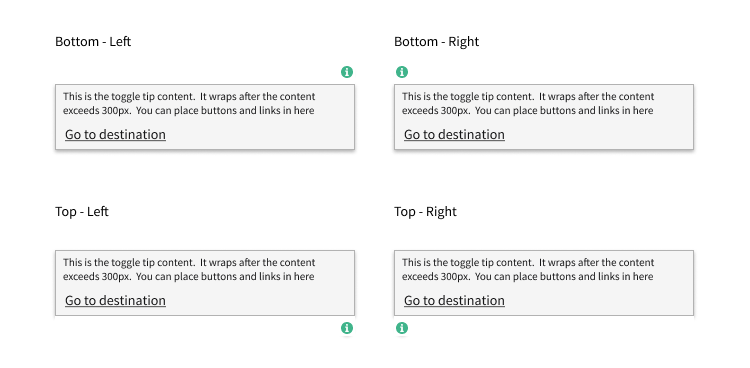
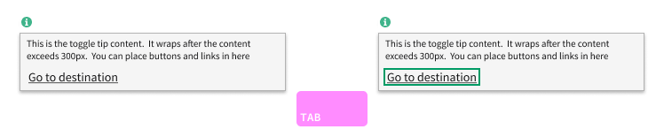

# Nimble Toggletip (IxD)

## Overview

A toggletip is a web component that provides a tooltip-like functionality with the ability to toggle its visibility. It is typically used to display additional information or context for a specific element.

The toggletip consists of a trigger button and a content panel that is hidden by default. When the trigger button is clicked, the content panel is revealed, providing the user with additional information or options. Clicking outside the toggletip or pressing escape will hide the content panel again.

Toggletips are commonly used in user interfaces to provide contextual help, explanations, or additional actions without cluttering the main interface.

### Background

-   [ViD spec](https://www.figma.com/file/PO9mFOu5BCl8aJvFchEeuN/Nimble_Components?type=design&node-id=5308-156796&mode=dev)
-   [Component Issue](https://github.com/ni/nimble/issues/1876)

## Usage

**When to use:**

-   In a _form_ or _editor_ view to display additional information or context for a specific element.
-   When the additional information or context provided by the toggletip is not valuable for most users of the control.
-   Content is "static" reference documentation.

**When not to use:**

-   When the additional information or context is valuable for most users of the control. This context should be visible by default.
-   Content is "dynamic" or updated in response to actions like error messages or server responses.

## Anatomy

| Element        | Description                                                                                        |
| -------------- | -------------------------------------------------------------------------------------------------- |
| Trigger button | Info icon button for showing and hiding an associated popover                                      |
| Popover        | Overlay container for text and interactive components                                              |
| Content area   | Area consisting of slots for a title, 1-3 lines of text, and a button or link. See the Banner API. |

## Sizing

### Width

The width of the toggletip popover should be determined based on the length of the content it contains. However, if the content is greater than a single line of text, the width should be set to 300px.

### Height

When the popover height exceeds that of the viewport, the popover should not become scrollable to try and fit in the viewport (not pictured). The popover should always be tall enough to show all its content. The surrounding content, for example the page itself, should scroll instead.

Popovers with text should be limited to approximately three lines of text under normal display size at the intended location.

## Alignment
The following are recommended guidelines to try and follow but need to be re-evaluated based on technical feasibility: 
The toggletip popover should avoid obscuring other content where possible. [^1] In particular it should avoid obscuring the content which it annotates.

[^1]: [Pearson Toggletip requirements](https://accessibility.pearson.com/resources/developers-corner/reference-library/tooltips-and-toggletips/index.php)

The toggletip popover should be aligned with the "Top - Right" of trigger button by default. If there isn't enough room in the viewport for the entire popover to be visible, the popover should align with the trigger button in the following order:

1. Top - Right
2. Top - Left
3. Bottom - Right
4. Bottom - Left

## Behavior

### States

#### Error State

The toggle-tip does not support an error state. Further, the toggle-tip should not be used to display error information.

### ARIA Considerations

> NOTE: From Pearson's [Toggletip](https://accessibility.pearson.com/resources/developers-corner/reference-library/tooltips-and-toggletips/index.php) reference document. We should follow the intent of this reference document, but Nimble best practices may differ from any requirements listed here. Any differences should be called out in the HLD.

#### Triggering

-   The triggering element **MUST** be defined using `<button>` element.
-   A descriptive and programmatic label **MUST** be provided for the triggering control using `aria-label` attribute or hidden off-screen text.
-   If an image is used to identify the triggering control, then a textual description **MUST** be defined for the image triggering control.
    -   If the image is defined using `` element, use an alt attribute with descriptive value.
    -   If the image is defined using `<svg>` element, use `role="img"` and `aria-label` attribute to provide a role and an accessible name for the element.
    -   Note: Providing ARIA based role and attribute on SVG image ensures robust support across different environments.
-   The button **MUST** be defined with aria-pressed attribute to convey the state.
    -   In pressed state – the value of aria-pressed attribute **MUST** be set to “true”.
    -   When not in pressed state – the value of aria-pressed attribute **MUST** be set to “false”.

#### Popover

-   The container, in which the toggletip content is defined, **SHOULD** be specified with ARIA Live region using `role="status"`. Alternatively, `aria-live="polite"` along with `aria-atomic="true"` **CAN** be specified to the container.
-   When the toggletip content appears, the container **MUST NOT** prevent the user from accessing content surrounding the toggletip.
-   Toggletip **SHOULD** show/hide information on pressing the space or enter key.
-   A `tabindex="0"` **CAN** be specified for the container that contains the toggletip content to ensure screen reader focus is received and the information can be acquired.
-   Toggletip content **SHOULD** remain persistent unless dismissed.

### Mouse Interactions

-   The toggle-tip popover **MUST** appear when a user clicks the trigger button, and disappear when the user clicks anything other than the popover.
-   The toggle-tip popover **MUST NOT** appear when a user _hovers_ the trigger button.
-   Scrolling or zooming the view **SHOULD NOT** close the popover.

### Non-Mouse Interactions

| Key                | Description                                                    |
| ------------------ | -------------------------------------------------------------- |
| `TAB`              | Moves focus to next focusable element                          |
| `SPACE` or `ENTER` | Opens/closes toggle-tip popover when trigger button is focused |

`TAB` to the toggle-tip trigger button moves focus to the trigger button with a focus ring (i.e. the key focus state).

`ENTER` or `SPACE` on a focused trigger button opens the popover. Key focus remains on the trigger button, but the trigger button changes to the select state.

Pressing `ENTER` or `SPACE` a second time (or `ESC`) closes the popover.

Pressing `TAB` while the popover is open moves focus to the first focusable element in the content area. If nothing is focusable in the content area, the focus moves to the next focusable element on the main page. Moving the focus to the next focusable element on the main page **SHOULD** close the popover.

Pressing `TAB` while focused on the last focusable element in the content area will move focus to the next focusable element on the main page. Moving the focus to the next focusable element on the main page **SHOULD** close the popover.

#### Touch-Screen Devices

-   The trigger button should have the CSS property `touch-action: manipulation;` set so double-tapping on the trigger button doesn't zoom the page, and so there isn't a 300ms delay before opening the popover.
-   The toggle-tip popover should appear when a user taps the trigger button, and disappear when the user taps anything other than the popover.
-   Scrolling or zooming (pinch or double-tap) the view should not close the popover.

## Open Issues

See content marked "**QUESTION**" or "**NOTE**".

## References

-   [Pearson Toggletip requirements](https://accessibility.pearson.com/resources/developers-corner/reference-library/tooltips-and-toggletips/index.php)
-   [Grafana - Saga Toggletip](https://grafana.com/developers/saga/Components/toggletip)
-   [IBM - Carbon Toggletip](https://carbondesignsystem.com/components/toggletip/usage/)
