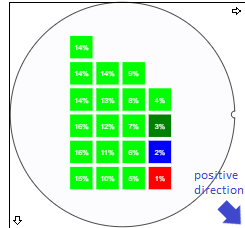
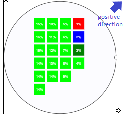

# Nimble Wafer Map

## Overview

The `nimble-wafer-map` component is a visualization widget which allows to represent
the location of defectives integrated circuits on a silicon wafer and provides important special information.

This component is not something that will be created from scratch, but more of a refactor of an existing Angular component which can be found here:
[wafermap](https://dev.azure.com/ni/DevCentral/_git/op-web-portal?path=/libraries/wafermap&version=GBfeature/microServicesSplit)

### Background

In the current version, the existing wafer-map widget is limited in features, has a hard to maintain codebase and is not up to the latest standards for security and performance.
The wafer map library contains functionality which is not used by the existing plugin and bloats it (e.g., the limited tooltip or the axes).
Moreover, the d3 libraries versions used are outdated, and support for more data to be stored at die level is needed to implement features offered by the MicroStrategy BI Tool framework.

In addition, the current component contains numerous flaky, hard to track functionalities that is offered by the MicroStrategy plugin wrapper, and until these exists in the core component, it will cause inconsistencies and faulty behavior.

**Visual Design Spec**

Design changes of the existing wafer-map component are out of scope for the current release. We came to this decision, as implementing solutions for all the existing corner cases would be very time-consuming, and we can't afford that.
The users are allowed to change the color of the dies within the wafer map, so having a non-default color scheme for the base canvas, rim and background of the wafer map could lead to incorrect behavior.
A conversation with the design team will be started regarding this topic, but for the current release we will go with the default, existing design.
[Wafer Map plugin for MicroStrategy Feature](https://dev.azure.com/ni/DevCentral/_workitems/edit/2001490)

### Non-goals

These are the features that would make sense to provide for a visualization widget component such as the wafer map, but will not be part of the current implementation:

-   Color legend
-   Die tooltips

Currently our main goal is to bring in the existing wafer map component into the nimble library, but not to add features.

### Features

We consider now that the most important features of the current component would be:

-   Allowing to set the orientation of the wafer
-   Allowing an option to select specific color schemes for the wafer
-   Allowing to zoom in/out on the wafer-map widget
-   Allowing panning whilst the wafer is zoomed
-   Dynamic size adaptability
-   Scalable for very large number of data points

### Risks and Challenges

The biggest risk and challenge are regarding the rendering of the component when large numbers of data points are present.
This widget can and will be used to represent the results of a single wafer and a summary of multiple wafers (data which represents also known as a LOT) in order to recognize patterns in failing sections.
A LOT contains data about multiple wafers, and one of the functionalities of our main feature is to split up a LOT (and display it) into individual wafers.
This means that we might be displaying several `nimble-wafer-map` components on a single page each containing several hundred or thousands of data points, each having the individual functionality mentioned in the "Features" section of this spec document.
We are planning to perform initial benchmarking on this aspect, but not planning to optimize it in the first release.

### Prior Art/Examples

Please see below a few screenshots regarding the current `wafer-map` component:


## Design

From a user’s perspective one of the most important actions which this component should be able to achieve is to zoom in and out on the datapoints. This functionality should occur when the mouse pointer hovers the `nimble-wafer-map` component and a mouse wheel action is performed.
While zooming in on the component, the user should also be able to pan (drag) the wafer map by holding the left mouse button and moving the cursor on the XY axis.

From a developer perspective, it's very important that the `nimble-wafer-map` component can be integrated with the MicroStrategy Custom plugin framework as this framework provides functionalities as follows:

-   Tooltip when hovering any of the datapoints within the wafer map
-   Wafer map legend
-   MicroStrategy specific context menus on right-click action

Information regarding the basic MicroStrategy **Custom Plugin Workflow** can be found [here](https://www2.microstrategy.com/producthelp/Current/VisSDK/Content/topics/HTML5/Understanding_the_workflow.htm)
Also, the visualisation widget has no active controls, so there is no way to alter the visual aspect or data post rendering. Every input parameter must be provided through the constructor of the wafer map component.

### API

_The key elements of the component's public API surface:_

-   Component Name: `nimble-wafer-map`
-   Props/Attrs:
    -   `die[]` - this represents the input data, which fills the wafer map with content.\
        The **die** object contains the following attributes:
    -   x: integer
    -   y: integer
    -   value: float
    -   `quadrant` - represents the orientation of the dies on the wafer map (the layout of the values on the dies). It can be represented by an Enum with the following values:
    -   TopLeft - 
    -   BottomLeft - 
    -   TopRight - 
    -   BottomRight - 
    -   `orientation` - represent the orientation of the notch on the wafer map outline (only visual). As only four static orientations are possible, it can be represented by an Enum with the following values: top, bottom, left, right.
    -   `colorScale` - represents the color spectrum which shows the status of the dies on the wafer.\
        The object we use for the colorScale is [d3.scaleOrdinal](https://observablehq.com/@d3/d3-scaleordinal). Basically, what this does is it associates a specific string (or in our case a value with a specific color.). The values which are not equal with the values specified in the array, will become a darker/lighter shade of the colors.
        In the following example the colorScale object is defined as `WafermapColorsScale(['red', 'blue', 'green'], ['1', '2', '8']);`\
        The generated wafer using this color scale is: 
    -   `dieCharacterCount` - represents the number of characters allowed to be displayed within a single die. As the die values are represented by Floating point numbers, we must have the liberty of limiting how many characters we are willing to display within a single die.

Please note that all these attributes are only accessible through the constructor of the component. Once set, the only way to modify them is to re-render the component.

Methods: (none)

Events: The events mentioned below will all be handled internally by the nimble component and they will not be part of the public API. In the initial implementation the following events should be handled:

-   Zoom in while hovering - this action gets executed whenever the mouse pointer hovers the `nimble-wafer-map` component and a wheel event (scroll up) gets triggered
-   Zoom out while hovering - this action gets executed whenever the mouse pointer hovers the `nimble-wafer-map` component and a wheel event (scroll down) gets triggered
-   Drag while zoomed - this event gets triggered whenever the `nimble-wafer-map` component is zoomed in (larger than 100%) and whilst the left mouse button is held the pointer moves to any direction within the wafer-map canvas
-   Mouse hover - this event gets triggered whenever the mouse pointer is hovering any of the die elements within the wafer map. We only must detect this in the nimble component, proper handling will be done in the MicroStrategy wrapper. (Tooltip triggering)

### Anatomy

Shadow DOM:

```html
<template id="WaferMapTemplate">
    <div class="WaferMapContainer">
        <svg>
            <g class="zoomContainer">
                <g>
                    <circle></circle>
                    <circle></circle>
                    <rect></rect>
                </g>
            </g>
        </svg>
        <div class="WaferMapArea">
            <canvas />
            <svg>
                <rect></rect>
            </svg>
        </div>
    </div>
</template>
```

The first SVG element with the "zoomContainer" class attribute contains two circles and a rectangle.

-   The first circle represents the outline of the wafer map component.
-   The second circle, together with the rectangle is part of a solution which creates the illusion that there is a notch present on the wafer map frame.

The second SVG element with the "WaferMapArea" class attribute represents the area where the dies get rendered.
The rectangle present here is used as the "highlight" which allows us to identify individual dies in the canvas.

-   Slot Names: (none)
-   Host Classes: (none)
-   Slotted Content/Slotted Classes: (none)
-   CSS Parts: (none)

### Angular integration

The `nimble-wafer-map` component does not take user input directly from the webpage where it's embedded. All the inputs must be provided through the constructor of the component so in the current case there is no point using ControlValueAccessors.

### Blazor integration

Blazor support is out of scope for the current implementation.

### Visual Appearance

For the initial component, we are going with the original wafer map appearance.


## Implementation

As mentioned above, this is not a component that we start from scratch, but a visualization that already exists which is outdated and not futureproof.
As a first step, we are working on the "bloat removal" which is basically the removal of unwanted but exiting features (legend, tooltip etc.) and dependencies.

Original component: [wafermap](https://dev.azure.com/ni/DevCentral/_git/op-web-portal?path=/libraries/wafermap&version=GBfeature/microServicesSplit)\
Once the "bloat removal" is finished, the next step is to adapt the current

### Code submission strategy

In order to make the process of submitting the re-written wafer map component easier for us and for the code reviewers as well, we propose the following bottom-up approach:

-   As an initial step, we submit a skeleton of the `nimble-wafer-map` component into the main branch. This will serve as a starting point on which the complete functionality will be built on.
-   Once the skeleton is in place, we start to work on and submit individual pieces of the functionality so it's not very overwhelming to review the code.

### States

We are not planning to allow the user to generate an “empty" wafer map, so we must ensure that data is provided when instantiating a new `nimble-wafer-map` component.
The only action which we could consider as a "state transition" is the zoom functionality which was specified in the sections above.
We expect that the end user be able to zoom in on the dies within the wafer map and be able to zoom out by using the mouse wheel.
Also, the user must be allowed to pan the zoomed in wafer map into any direction of its XY axis by holding the left mouse button and moving the mouse cursor around.

Another interaction, which must be part of the component is the ability to identify the location of the mouse pointer on the wafer map die area.

Furthermore `disabled` and `focused` state will also be supported by the component.

### Accessibility

Important: this is out of scope for the current implementation.\
Since the `nimble-wafer-map` component was designed to display tens of thousands of data points, it's challenging to provide Accessibility functionality which can read out loud the values displayed in a meaningful manner.
Based on the WAI documentation on [Complex Images](https://www.w3.org/WAI/tutorials/images/complex/), in the future we could provide a paragraph containing information about the name of the wafer that is displayed, the LOT where the wafer comes from and a general overview (e.g. % of the faulty dies on the wafer) of the status. This might give a pretty good description about what the displayed nimble component shows to the user.
Please note that in the initial implementation we do not plan to gather and summarize any of this information so this will be part of future updates to this component.
Currently the only way to navigate and interact with the wafer map is only by using the mouse. Future updates might include functionality which allows the user to tab into the wafer map area and move around in the die area using the keyboard arrows.

### Globalization

Currently there will be no string data presented by this component. Might change in the future, but for now it will contain only numerical data. Similar to the `nimble-number-field`, initially we don't plan to support locale-specific numeric formatting.

### Security

N/A

### Performance

As mentioned in the "Risks" section, the biggest challenge from the performance standpoint is the representation of large number of datapoints and interacting with these datapoints in the browser.
Currently the only thing we would like to achieve is to measure (benchmark) the time it takes a `nimble-wafer-map` component to be loaded with various number of datapoints. Initially this could be a manual benchmark on a demo site hosted within the repository. Longer term we may automate and trend this by including benchmarking on the PR build.

### Dependencies

The only 3rd party dependency on which the current wafer map component depends on is the [D3(Data-Driven Documents)](https://d3js.org/) library.
We use parts of this library in our zooming and rendering functionality.
As we don't want to bloat the component with unused packages, only the following will be included in the package.json:
* d3-zoom
* d3-scale
* d3-selection

### Test Plan

The current test plan is that moving forward with the development, we write unit tests which validate the core functionality.
All tests written for this component should follow the standards of the nimble repository: unit tests for component logic and Chromatic tests to exercise all the visual states of the component.

### Documentation

We will write Storybook documentation on the `nimble-wafer-map` component, focusing on general usage and API.

## Open Issues

(none)
