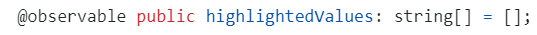
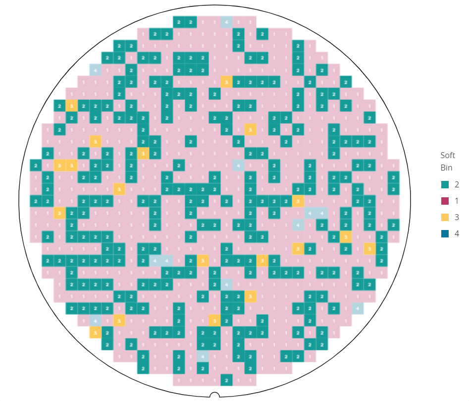
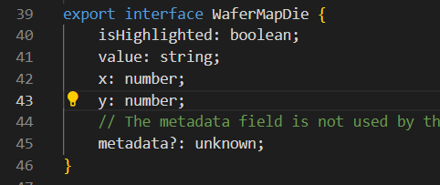
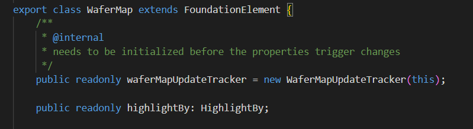

# Nimble Wafer Map Die Highlighting

## Problem Statement

The wafer map receives an array of strings as the values that will be highlighted. 

In the following case the highlighted values are 2 and 3. 

The current approach is limited. We can either highlight all the dies having 2s and 3s or neither of them. The customer needs exceeds this approach. The customer may see an anomaly on the dies having DieX: 15 and Soft Bin: 2 and wishes to highlight all these values, but the current code is not capable of this.

## Links To Relevant Work Items and Reference Material

N\A

## Implementation / Design

The current highlight logic has the benefit of being simple and easy to use. We wish to build on top of how highlight is made.

1. Add a boolean field on each die called "isHighlighted" this will be used when parsing the wafer to chose the color of the die.

2. Add a field on the wafer map "HighlightBy", which will be used to decide if the highlight should be done by "Value" (current approach) or by "Coordinates" our proposal.

index.ts

types.ts

This approach will let us to highlight any die we want, without any restrictions. The logic that decides which dies should be highlight can be moved completely out of the wafer map component, leaving the component the duty of only highlighting the given dies using the "isHighlighted" field.

## Alternative Implementation / Design

1. Add a boolean field on each die called "isHighlighted" this will be used when parsing the wafer to choose the color of the die.
2. Delete the current way of highlight.